# Envoy Global Cache 필터 구현 가이드

> **C++ 비경험 개발자를 위한 Envoy HTTP 필터 개발 완전 정복**
> 
> Go/Python/Java를 아는 5년차 개발자를 위한 현대적 C++ 캐시 시스템 해설서

---

## 목차

### Part I. 기반 다지기
- [Chapter 1. Envoy와 Global Cache: 큰 그림](#chapter-1-envoy와-global-cache-큰-그림)
- [Chapter 2. Modern C++ 생존 키트](#chapter-2-modern-c-생존-키트)
- [Chapter 3. Envoy 실행 모델: 워커, 디스패처, 필터 계약](#chapter-3-envoy-실행-모델-워커-디스패처-필터-계약)

### Part II. 필터 코어 로직
- [Chapter 4. 캐시 키 설계: 정확성의 출발점](#chapter-4-캐시-키-설계-정확성의-출발점)
- [Chapter 5. decodeHeaders: 요청 처리의 시작점](#chapter-5-decodeheaders-요청-처리의-시작점)
- [Chapter 6. Single-Flight: 요청 합류의 모든 것](#chapter-6-single-flight-요청-합류의-모든-것)
- [Chapter 7. encodeHeaders/encodeData: 응답 캐싱](#chapter-7-encodeheadersencodesdata-응답-캐싱)

### Part III. 백엔드와 저장소
- [Chapter 8. CacheBackend 인터페이스: 추상화의 힘](#chapter-8-cachebackend-인터페이스-추상화의-힘)
- [Chapter 9. Local LRU 캐시: 메모리 자료구조의 정석](#chapter-9-local-lru-캐시-메모리-자료구조의-정석)
- [Chapter 10. Redis 캐시: 비동기 네트워크의 세계](#chapter-10-redis-캐시-비동기-네트워크의-세계)
- [Chapter 11. Tiered 캐시: 로컬과 리모트의 조화](#chapter-11-tiered-캐시-로컬과-리모트의-조화)
- [Chapter 12. 직렬화: 바이너리의 세계로](#chapter-12-직렬화-바이너리의-세계로)

### Part IV. 설정, 운영, 검증
- [Chapter 13. 설정과 팩토리: Envoy 필터 등록의 비밀](#chapter-13-설정과-팩토리-envoy-필터-등록의-비밀)
- [Chapter 14. 관측가능성: 로깅과 디버깅](#chapter-14-관측가능성-로깅과-디버깅)
- [Chapter 15. 테스트와 품질 보증](#chapter-15-테스트와-품질-보증)
- [Chapter 16. 설계 트레이드오프와 운영 고려사항](#chapter-16-설계-트레이드오프와-운영-고려사항)

---


---

# Chapter 1. Envoy와 Global Cache: 큰 그림

> **이 장의 목표**: Envoy가 무엇인지, `global_cache` 필터가 왜 필요한지, 그리고 전체 데이터 흐름을 조감도 수준에서 이해합니다.

---

## 1.1 왜 프록시에 캐시를 넣는가?

마이크로서비스 아키텍처에서 가장 흔한 병목은 **반복적인 동일 요청**입니다. 예를 들어:

- 상품 목록 API: 초당 수천 명이 같은 `/api/products?category=electronics`를 호출
- 사용자 프로필 API: 인기 유저의 프로필을 수백 번 중복 조회
- 설정 API: 모든 서비스가 부팅할 때 동일한 설정을 요청

이런 요청들이 매번 백엔드까지 가면 어떻게 될까요?

```
[클라이언트 1] ─┐
[클라이언트 2] ─┼─→ [백엔드 DB] ← 부하 집중!
[클라이언트 3] ─┘
```

**해결책: 프록시 레벨 캐싱**

```
[클라이언트 1] ─┐                    ┌─→ [캐시 HIT] → 즉시 응답
[클라이언트 2] ─┼─→ [Envoy Proxy] ──┤
[클라이언트 3] ─┘                    └─→ [캐시 MISS] → 백엔드 → 저장 → 응답
```

프록시 레벨에서 캐싱하면:
1. **백엔드 부하 감소**: 동일 요청이 백엔드에 도달하지 않음
2. **응답 지연 감소**: 메모리/Redis에서 바로 응답 (수 밀리초)
3. **장애 격리**: 백엔드가 잠시 죽어도 캐시된 응답 제공 가능

---

## 1.2 Global Cache 필터의 정체

`envoy.filters.http.global_cache`는 이름 그대로 **전역 캐싱**을 담당하는 Envoy HTTP 필터입니다.

### 핵심 기능 두 가지

#### 1) 응답 캐싱 (Response Caching)
업스트림(백엔드)에서 받은 응답을 저장하고, 이후 동일한 요청에 대해 저장된 응답을 반환합니다.

```yaml
# 설정 예시
- name: envoy.filters.http.global_cache
  typed_config:
    "@type": type.googleapis.com/envoy.extensions.filters.http.global_cache.v3.GlobalCache
    default_ttl: { seconds: 300 }  # 5분간 캐시
    cache_backend:
      local:
        max_entries: 10000
```

#### 2) Single-Flight (요청 합류)
**더 중요한 기능**입니다. 동일한 URL로 동시에 100개의 요청이 오면:

- **Without Single-Flight**: 100개 모두 백엔드로 전달 → 백엔드 과부하
- **With Single-Flight**: 1개만 백엔드로, 나머지 99개는 대기 → 결과 공유

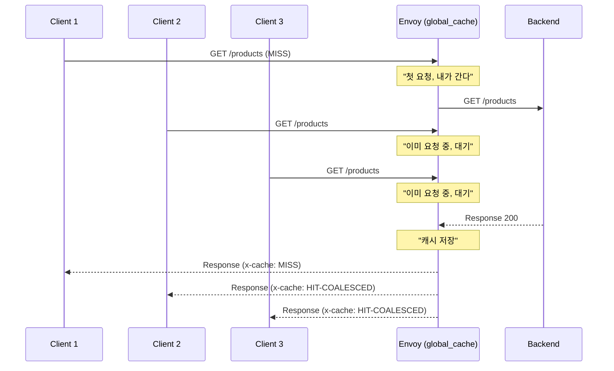

Go 개발자라면 `golang.org/x/sync/singleflight` 패키지를 떠올리면 됩니다. 개념적으로 **완전히 동일**합니다.

---

## 1.3 Go 코드로 보는 동등한 로직

C++ 코드를 보기 전에, 여러분이 익숙한 Go로 같은 로직을 구현해봅시다:

```go
package main

import (
    "net/http"
    "sync"
    "time"

    "golang.org/x/sync/singleflight"
)

// 캐시 엔트리
type CacheEntry struct {
    Headers    http.Header
    Body       []byte
    Expiration time.Time
}

// 전역 캐시와 singleflight 그룹
var (
    cache        = make(map[string]*CacheEntry)
    cacheMutex   sync.RWMutex
    group        singleflight.Group
    defaultTTL   = 5 * time.Minute
)

// 미들웨어
func CacheMiddleware(next http.Handler) http.Handler {
    return http.HandlerFunc(func(w http.ResponseWriter, r *http.Request) {
        // 1. 캐시 키 생성
        key := r.Method + ":" + r.Host + ":" + r.URL.Path
        
        // 2. 캐시 조회
        cacheMutex.RLock()
        entry, exists := cache[key]
        cacheMutex.RUnlock()
        
        if exists && time.Now().Before(entry.Expiration) {
            // 캐시 HIT
            w.Header().Set("X-Cache", "HIT")
            for k, v := range entry.Headers {
                w.Header()[k] = v
            }
            w.Write(entry.Body)
            return
        }
        
        // 3. Single-flight: 중복 요청 방지
        result, _, shared := group.Do(key, func() (interface{}, error) {
            // 실제 백엔드 호출 (여기서는 next 핸들러)
            recorder := &ResponseRecorder{...}
            next.ServeHTTP(recorder, r)
            
            // 캐시에 저장
            newEntry := &CacheEntry{
                Headers:    recorder.Header(),
                Body:       recorder.Body.Bytes(),
                Expiration: time.Now().Add(defaultTTL),
            }
            cacheMutex.Lock()
            cache[key] = newEntry
            cacheMutex.Unlock()
            
            return newEntry, nil
        })
        
        // 4. 응답 전송
        entry = result.(*CacheEntry)
        if shared {
            w.Header().Set("X-Cache", "HIT-COALESCED")
        } else {
            w.Header().Set("X-Cache", "MISS")
        }
        for k, v := range entry.Headers {
            w.Header()[k] = v
        }
        w.Write(entry.Body)
    })
}
```

**핵심 포인트:**
- `singleflight.Group.Do()`: 동일 키에 대해 하나의 요청만 실행
- `shared` 플래그: 다른 요청과 결과를 공유했는지 여부
- `X-Cache` 헤더: HIT / MISS / HIT-COALESCED 상태 표시

Envoy의 `GlobalCacheFilter`는 이 Go 코드와 **논리적으로 동일**합니다. 다만 **비동기 C++**로 구현되어 있고, **이벤트 루프** 기반으로 동작합니다.

---

## 1.4 전체 데이터 흐름 개요

`global_cache` 필터를 통과하는 요청의 생애주기를 살펴봅시다:

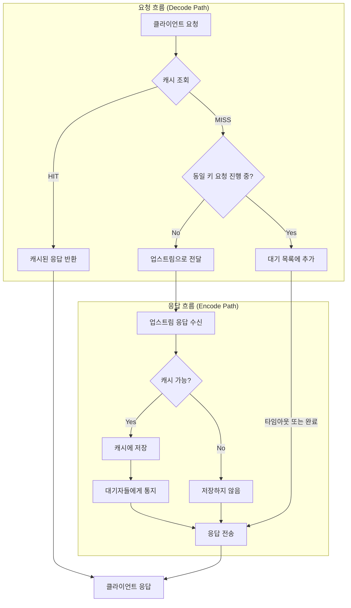

### 상태 머신 관점

필터는 내부적으로 다음 상태들을 관리합니다:

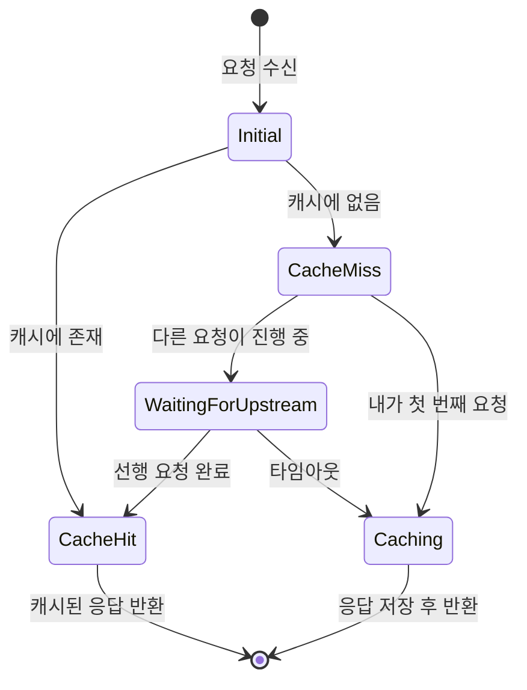

---

## 1.5 파일 구조 미리보기

이 책에서 분석할 소스 파일들입니다:

```
source/extensions/filters/http/global_cache/
├── global_cache_filter.h   # 필터 클래스 선언
├── global_cache_filter.cc  # 필터 핵심 로직 (~600줄)
├── cache_backend.h         # 캐시 인터페이스 정의
├── local_cache.h/cc        # 로컬 LRU 캐시 구현
├── redis_cache.h/cc        # Redis 비동기 캐시 구현
├── tiered_cache.h/cc       # L1+L2 계층형 캐시
├── cache_serialization.h/cc # Redis용 직렬화 포맷
├── config.h/cc             # 팩토리 및 설정 로딩
└── BUILD                   # Bazel 빌드 파일
```

| 파일 | 역할 | 해당 챕터 |
|------|------|----------|
| `global_cache_filter.*` | 요청/응답 처리, Single-flight | 5, 6, 7장 |
| `cache_backend.h` | 추상 인터페이스 정의 | 8장 |
| `local_cache.*` | 메모리 LRU 캐시 | 9장 |
| `redis_cache.*` | Redis 비동기 클라이언트 | 10장 |
| `tiered_cache.*` | L1+L2 조율 | 11장 |
| `cache_serialization.*` | 바이너리 직렬화 | 12장 |
| `config.*` | 설정 파싱, 팩토리 | 13장 |

---

## 1.6 왜 C++인가?

Go나 Java로 같은 기능을 구현할 수 있는데, 왜 Envoy는 C++을 선택했을까요?

### 성능 특성 비교

| 특성 | Go/Java | C++ (Envoy) |
|------|---------|-------------|
| GC 지연 | 수~수십 ms | 없음 |
| 메모리 오버헤드 | 객체당 헤더 존재 | 최소화 가능 |
| Tail Latency (p99) | 불안정 | 예측 가능 |
| 메모리 사용량 제어 | 제한적 | 바이트 단위 제어 |

### 프록시에서 중요한 이유

- **일관된 지연시간**: p99 latency가 중요한 환경에서 GC pause는 치명적
- **리소스 효율**: 수만 개의 동시 연결을 적은 메모리로 처리
- **Zero-copy**: 데이터를 복사하지 않고 그대로 전달 가능

### 트레이드오프

물론 대가가 있습니다:
- 개발 시간 증가 (Go 대비 3~5배)
- 메모리 관련 버그 가능성 (Use-after-free, 메모리 누수)
- 빌드 시간 증가

이 책을 통해 **현대적인 C++**가 이런 위험을 어떻게 완화하는지 배우게 됩니다.

---

## 1.7 이 책의 구성

총 16개 장과 부록으로 구성됩니다:

**Part I. 기반 다지기 (1-3장)**
- C++과 Envoy의 기본 개념

**Part II. 필터 코어 로직 (4-7장)**
- 요청 처리 흐름을 코드 레벨로 분석

**Part III. 백엔드와 저장소 (8-12장)**
- 캐시 추상화와 각 구현체 상세

**Part IV. 설정, 운영, 검증 (13-16장)**
- 실제 프로덕션 적용을 위한 가이드

**부록**
- C++/Go/Python/Java 문법 비교표

각 장은 **최소 A4 2페이지 분량**으로, 코드 예제와 다이어그램을 충분히 포함합니다.

---

## 1.8 요약 및 다음 장 예고

**이 장에서 배운 것:**
- `global_cache`는 응답 캐싱 + Single-flight를 제공하는 Envoy HTTP 필터
- Go의 `singleflight` + Redis 클라이언트 조합과 논리적으로 동일
- Envoy가 C++을 선택한 이유: 예측 가능한 성능, 리소스 효율

**다음 장 미리보기:**
2장에서는 **Modern C++ 생존 키트**를 다룹니다. 스마트 포인터, RAII, 람다 캡처 등 이후 코드를 읽기 위해 반드시 알아야 할 C++ 개념들을 Go/Python/Java와 비교하며 설명합니다.

---

> **체크리스트 ✓**
> - [ ] `global_cache`의 두 가지 핵심 기능(캐싱, Single-flight)을 설명할 수 있다
> - [ ] Go 코드로 동등한 로직을 작성할 수 있다
> - [ ] 필터의 상태 머신(Initial → CacheHit/CacheMiss → ...)을 그릴 수 있다
> - [ ] Envoy가 C++을 사용하는 이유를 설명할 수 있다

---

# Chapter 2. Modern C++ 생존 키트

> **이 장의 목표**: 이후 장에서 등장하는 C++ 코드를 읽기 위해 필수적인 문법과 개념을 Go/Python/Java와 비교하며 익힙니다.

---

## 2.1 첫 번째 장벽: 헤더와 소스 분리

Java, Go, Python에서는 클래스/구조체 정의와 구현이 한 파일에 있습니다. C++은 다릅니다.

### 헤더 파일 (.h)
**선언(Declaration)**을 담습니다. "이런 클래스/함수가 있다"고 알려줍니다.

```cpp
// cache_backend.h
#pragma once  // 중복 include 방지 (Go의 import와 유사)

class CacheBackend {
public:
    virtual void lookup(const std::string& key) = 0;  // 순수 가상 함수
    virtual ~CacheBackend() = default;
};
```

### 소스 파일 (.cc 또는 .cpp)
**정의(Definition)**를 담습니다. 실제 구현 코드입니다.

```cpp
// local_cache.cc
#include "local_cache.h"

void LocalCache::lookup(const std::string& key) {
    // 실제 구현...
}
```

### 다른 언어와 비교

| 언어 | 선언과 구현 |
|------|-------------|
| Go | 같은 `.go` 파일에 함께 |
| Java | 같은 `.java` 파일에 함께 |
| Python | 같은 `.py` 파일에 함께 |
| C++ | `.h`(선언) + `.cc`(구현) 분리 |

**왜 분리하는가?**
- 컴파일 속도: 구현이 바뀌어도 헤더만 include한 파일은 재컴파일 불필요
- 인터페이스 명확화: 헤더만 보면 API를 알 수 있음
- 바이너리 배포: 헤더 + 컴파일된 라이브러리(.so, .a)만 배포 가능

---

## 2.2 스마트 포인터: GC 없이 메모리 관리하기

C++에는 가비지 컬렉터(GC)가 없습니다. 대신 **스마트 포인터**가 메모리를 자동으로 관리합니다.

### std::unique_ptr - 단독 소유

한 객체를 **오직 하나의 포인터만** 가리킬 수 있습니다.

```cpp
// 생성
auto node = std::make_unique<LruNode>("key", entry, size);

// 소유권 이전 (복사 불가, 이동만 가능)
auto node2 = std::move(node);  // node는 이제 nullptr

// 스코프를 벗어나면 자동 삭제
{
    auto temp = std::make_unique<MyClass>();
}  // 여기서 temp가 가리키는 객체 자동 삭제
```

**Go 비유**: `*T`를 반환하는 팩토리 함수인데, 그 포인터를 다른 곳에 넘기면 원래 변수는 nil이 됨

### std::shared_ptr - 공유 소유

여러 포인터가 **같은 객체를 공유**합니다. 마지막 포인터가 사라지면 객체가 삭제됩니다.

```cpp
// 생성
auto entry = std::make_shared<CacheEntry>(body, headers, expiration);

// 복사 가능 (참조 카운트 증가)
auto entry2 = entry;  // 둘 다 같은 객체를 가리킴

// 참조 카운트 확인
entry.use_count();  // 2

// entry2가 스코프를 벗어나면 카운트 감소, 0이 되면 삭제
```

**Go 비유**: Go의 일반 포인터(`*T`)와 GC가 하는 일을 명시적으로 수행

### std::weak_ptr - 약한 참조

`shared_ptr`를 가리키지만 **참조 카운트를 증가시키지 않습니다**. 순환 참조(Cycle) 방지용입니다.

```cpp
struct InFlightRequest {
    std::vector<std::weak_ptr<GlobalCacheFilter>> waiters;  // 약한 참조
};

// 사용할 때는 lock()으로 shared_ptr로 변환
if (auto filter = waiter.lock()) {  // 아직 살아있으면
    filter->onComplete();
} else {
    // 이미 파괴됨, 무시
}
```

**왜 필요한가?**

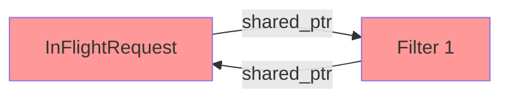

위처럼 서로 `shared_ptr`로 가리키면 **영원히 삭제되지 않습니다** (참조 카운트가 0이 안 됨).

`weak_ptr`를 사용하면:

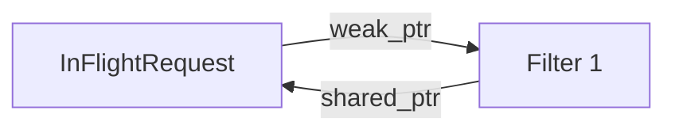

Filter가 사라지면 InFlightRequest의 `waiter.lock()`이 실패하고, 자연스럽게 정리됩니다.

---

## 2.3 참조(Reference)와 포인터의 차이

### 포인터 (*T)

```cpp
void modify(int* ptr) {
    if (ptr != nullptr) {  // null 체크 필요
        *ptr = 42;
    }
}

int x = 10;
modify(&x);  // 주소 전달
```

### 참조 (T&)

```cpp
void modify(int& ref) {
    ref = 42;  // null일 수 없음
}

int x = 10;
modify(x);  // 그냥 변수 전달
```

**핵심 차이:**
- 참조는 **null일 수 없음** (더 안전)
- 참조는 **재할당 불가** (항상 같은 대상을 가리킴)
- 참조는 **자동 역참조** (`*`를 안 써도 됨)

### Envoy 코드에서의 활용

```cpp
Http::FilterHeadersStatus decodeHeaders(
    Http::RequestHeaderMap& headers,  // 참조: null 아님을 보장
    bool end_stream
) {
    // headers.Path()처럼 바로 사용
}
```

Go 비교:
```go
func decodeHeaders(headers *http.Header, endStream bool) {
    // headers가 nil인지 체크해야 할 수도...
}
```

---

## 2.4 const의 세계

C++에서 `const`는 **"변경 불가"**를 컴파일 타임에 강제합니다.

### const 변수

```cpp
const int max_size = 1000;
max_size = 2000;  // 컴파일 에러!
```

### const 참조 (읽기 전용 빌려주기)

```cpp
void printKey(const std::string& key) {
    // key를 수정할 수 없음
    key = "new";  // 컴파일 에러!
    std::cout << key;  // 읽기는 가능
}
```

**왜 쓰는가?**
- 복사 비용 없이 큰 객체 전달 (`const std::string&`)
- 실수로 수정하는 버그 방지
- 컴파일러 최적화 힌트

### const 메서드

```cpp
class CacheEntry {
    std::string key_;
public:
    // 이 메서드는 객체를 수정하지 않음을 보장
    std::string getKey() const {
        return key_;
    }
};
```

---

## 2.5 람다와 캡처 (Lambda & Capture)

C++의 람다는 Go의 익명 함수, Python의 lambda와 유사하지만 **캡처(Capture)** 개념이 있습니다.

### 기본 문법

```cpp
// Go: func(x int) int { return x * 2 }
// Python: lambda x: x * 2
// C++:
auto doubler = [](int x) { return x * 2; };

int result = doubler(5);  // 10
```

### 캡처 (Capture)

외부 변수를 람다 내부에서 사용하려면 **캡처**해야 합니다.

```cpp
int multiplier = 3;

// 값으로 캡처 (복사)
auto by_value = [multiplier](int x) { return x * multiplier; };

// 참조로 캡처
auto by_ref = [&multiplier](int x) { return x * multiplier; };

// 모든 변수를 값으로 캡처
auto all_by_value = [=](int x) { return x * multiplier; };

// 모든 변수를 참조로 캡처
auto all_by_ref = [&](int x) { return x * multiplier; };
```

### Envoy에서의 실제 사용

```cpp
// global_cache_filter.cc에서 발췌
cache_backend_->lookup(cache_key_, [this, lookup_ctx](CacheLookupResult&& result) {
    // this: 현재 Filter 객체를 캡처
    // lookup_ctx: 조회 컨텍스트를 캡처
    
    if (result.status == CacheLookupStatus::Hit) {
        this->serveCachedResponse(result.entry, "HIT");
    }
});
```

**위험한 패턴**: 참조 캡처와 비동기

```cpp
void dangerous() {
    std::string key = "test";
    
    asyncCall([&key]() {  // key를 참조로 캡처
        std::cout << key;  // 💥 dangerous() 함수가 끝나면 key는 파괴됨!
    });
}  // key 파괴
```

**안전한 패턴**: 값 캡처 또는 shared_ptr

```cpp
void safe() {
    auto key = std::make_shared<std::string>("test");
    
    asyncCall([key]() {  // shared_ptr을 값으로 캡처 (참조 카운트 증가)
        std::cout << *key;  // ✅ key는 람다가 살아있는 동안 유효
    });
}
```

---

## 2.6 std::move와 이동 의미론

### 복사 vs 이동

```cpp
std::string original = "Hello, World!";

// 복사: 메모리 할당 + 내용 복사
std::string copy = original;  // original도 여전히 유효

// 이동: 내부 포인터만 옮김 (빠름)
std::string moved = std::move(original);  // original은 이제 빈 문자열
```

### 왜 중요한가?

캐시에 응답을 저장할 때:

```cpp
// 비효율적 (복사)
auto cached_entry = std::make_shared<CacheEntry>(
    buffered_body_,  // 1MB 바디를 복사!
    response_headers_,
    expiration
);

// 효율적 (이동)
auto cached_entry = std::make_shared<CacheEntry>(
    std::move(buffered_body_),  // 포인터만 이동
    std::move(response_headers_),
    expiration
);
```

### Go와 비교

Go에서는 슬라이스를 넘기면 **암묵적으로 공유**됩니다:

```go
func process(data []byte) {
    // data와 원본이 같은 배열을 공유
}
```

C++은 **명시적**입니다:
- 복사하려면 그냥 전달
- 공유하려면 `shared_ptr` 사용
- 소유권 이전하려면 `std::move` 사용

---

## 2.7 RAII: 스코프 기반 자원 관리

**RAII** (Resource Acquisition Is Initialization)는 C++의 핵심 패턴입니다.

### 원리

```cpp
{
    std::mutex mutex;
    std::lock_guard<std::mutex> lock(mutex);  // 생성자에서 잠금
    
    // 임계 영역 코드...
    
}  // 소멸자에서 자동 해제 (예외가 발생해도!)
```

Go의 `defer`와 유사하지만, **스코프 종료 시 자동 실행**됩니다.

### Go와 비교

```go
// Go
func process() {
    mu.Lock()
    defer mu.Unlock()  // 명시적으로 defer 필요
    
    // 작업...
}
```

```cpp
// C++
void process() {
    std::lock_guard<std::mutex> lock(mutex_);
    // defer가 필요 없음, 스코프 끝에서 자동 해제
    
    // 작업...
}
```

### Envoy에서의 활용

```cpp
// local_cache.cc
void LocalCache::lookup(const std::string& key, LookupCallback callback) {
    {
        absl::MutexLock lock(&mutex_);  // RAII 패턴
        // 캐시 조회...
    }  // 여기서 자동으로 unlock
    
    callback(result);  // mutex 해제된 후 콜백 호출 (데드락 방지)
}
```

---

## 2.8 std::chrono: 시간 다루기

C++에서 시간은 `std::chrono` 네임스페이스를 사용합니다.

```cpp
#include <chrono>

// 기간 (Duration)
std::chrono::seconds sec(5);
std::chrono::milliseconds ms(100);

// 시점 (Time Point)
auto now = std::chrono::steady_clock::now();
auto expiration = now + std::chrono::seconds(300);

// 비교
if (std::chrono::steady_clock::now() >= expiration) {
    // 만료됨
}
```

### 다른 언어와 비교

| 언어 | 시간 타입 |
|------|----------|
| Go | `time.Duration`, `time.Time` |
| Python | `datetime.timedelta`, `datetime.datetime` |
| Java | `Duration`, `Instant` |
| C++ | `std::chrono::duration`, `std::chrono::time_point` |

---

## 2.9 템플릿 기초

C++의 템플릿은 Go의 제네릭, Java의 제네릭과 유사합니다.

```cpp
// 템플릿 함수
template<typename T>
T max(T a, T b) {
    return (a > b) ? a : b;
}

// 사용
int x = max(3, 5);          // T = int
double y = max(3.14, 2.71);  // T = double
```

### STL 컨테이너

```cpp
std::vector<int> numbers;           // Go: []int
std::map<std::string, int> ages;    // Go: map[string]int
std::unordered_map<std::string, int> cache;  // 해시맵 (Go의 map과 동등)
```

---

## 2.10 요약: C++ ↔ Go/Python/Java 매핑표

| 개념 | C++ | Go | Python | Java |
|------|-----|-----|--------|------|
| 널 포인터 | `nullptr` | `nil` | `None` | `null` |
| 스마트 포인터 | `shared_ptr<T>` | 일반 포인터 + GC | 일반 참조 + GC | 일반 참조 + GC |
| 단독 소유 | `unique_ptr<T>` | - | - | - |
| 참조 전달 | `T&` | 포인터 `*T` | 기본 동작 | 기본 동작 |
| 불변 참조 | `const T&` | - | - | `final` (부분적) |
| 람다 | `[capture](params){}` | `func(params){}` | `lambda params:` | `(params) -> {}` |
| 리소스 정리 | RAII (자동) | `defer` | `with` | try-with-resources |
| 제네릭 | `template<T>` | `[T any]` | 타입 힌트 | `<T>` |
| 열거형 | `enum class` | `const` + `iota` | `Enum` | `enum` |
| 타입 추론 | `auto` | `:=` | 자동 | `var` |

---

## 2.11 다음 장 예고

이제 C++ 코드를 읽을 기본기가 갖춰졌습니다. 다음 장에서는 **Envoy의 실행 모델**을 다룹니다:
- 워커 스레드와 이벤트 루프
- 필터 체인의 호출 규약
- "절대 블로킹 금지" 원칙

---

> **체크리스트 ✓**
> - [ ] `unique_ptr`, `shared_ptr`, `weak_ptr`의 차이를 설명할 수 있다
> - [ ] 참조(`&`)와 포인터(`*`)의 차이를 알고 있다
> - [ ] 람다 캡처 `[=]`, `[&]`, `[this]`의 의미를 안다
> - [ ] `std::move`가 왜 필요한지 설명할 수 있다
> - [ ] RAII 패턴이 무엇인지 안다

---

# Chapter 3. Envoy 실행 모델: 워커, 디스패처, 필터 계약

> **이 장의 목표**: Envoy의 스레딩 모델과 이벤트 루프를 이해하고, 필터가 어떤 규약을 따라야 하는지 배웁니다.

---

## 3.1 스레딩 모델: Java/Go와 완전히 다르다

가장 먼저 깨야 할 고정관념: **"요청 하나당 스레드 하나"**가 아닙니다.

### Java Spring의 모델

```
[요청 1] → [Thread Pool] → Thread-1 처리 → DB 쿼리 (블로킹) → 응답
[요청 2] → [Thread Pool] → Thread-2 처리 → ...
```

- 요청마다 스레드 할당
- DB 쿼리 중 스레드는 **대기(Block)**
- 수천 요청 = 수천 스레드 필요

### Go의 고루틴 모델

```
[요청 1] → [고루틴 1] → DB 쿼리 (스케줄러가 다른 고루틴 실행) → 응답
[요청 2] → [고루틴 2] → ...
```

- 요청마다 고루틴 할당
- I/O 중 스케줄러가 다른 고루틴으로 전환
- 메모리 효율적이지만 여전히 **동기적 코드 스타일**

### Envoy의 모델 (Node.js와 유사)

```
Worker Thread 1: [이벤트 루프]
    └─ 요청 1 도착 → 처리 시작 → Redis 요청 (콜백 등록) → 다음 이벤트로
    └─ 요청 2 도착 → 처리 시작 → ...
    └─ Redis 응답 도착 → 요청 1 콜백 실행 → ...
    
Worker Thread 2: [이벤트 루프]
    └─ 요청 3 도착 → ...
```

**핵심 특징:**
- 스레드 수 = CPU 코어 수 (보통 4~16개)
- 각 스레드는 **독립적인 이벤트 루프** 실행
- I/O는 **논블로킹 + 콜백**

---

## 3.2 이벤트 루프: 절대 멈추면 안 된다

Envoy 워커 스레드의 생명 주기:

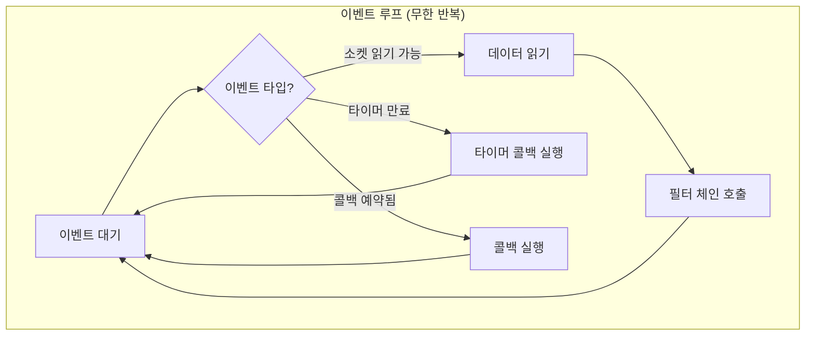

### 왜 블로킹이 금지인가?

워커 스레드가 하나의 요청에서 **1초간 블로킹**되면:

```
[10:00:00.000] 요청 A 처리 시작
[10:00:00.001] 동기 DB 호출 (블로킹)
... 1초 대기 ...
[10:00:01.001] 요청 A 처리 완료

[10:00:00.100] 요청 B 도착 → 대기
[10:00:00.200] 요청 C 도착 → 대기
[10:00:00.300] 요청 D 도착 → 대기
... 이 1초 동안 모든 요청이 큐에 쌓임 ...
```

Node.js를 써봤다면 익숙한 문제입니다. **"Don't block the event loop!"**

### 금지된 코드 패턴

```cpp
// ❌ 절대 금지!
void badFilter() {
    std::this_thread::sleep_for(std::chrono::seconds(1));  // 스레드 멈춤
    
    // 동기 소켓 읽기
    char buffer[1024];
    read(socket_fd, buffer, sizeof(buffer));  // 블로킹!
    
    // 무거운 CPU 작업
    for (int i = 0; i < 1000000000; i++) { /* ... */ }  // 스레드 독점
}
```

### 올바른 비동기 패턴

```cpp
// ✅ 올바른 방법
void goodFilter() {
    // 비동기 타이머
    auto timer = dispatcher_.createTimer([this]() {
        this->onTimeout();
    });
    timer->enableTimer(std::chrono::seconds(1));
    
    // 비동기 Redis 요청
    redis_client_->asyncGet(key, [this](Response&& response) {
        this->onRedisResponse(std::move(response));
    });
}
```

---

## 3.3 디스패처(Dispatcher): 이벤트 루프의 심장

`Event::Dispatcher`는 각 워커 스레드의 이벤트 루프를 관리합니다.

### 주요 기능

```cpp
// 타이머 생성
Event::TimerPtr timer = dispatcher_.createTimer([this]() {
    this->onTimeout();
});
timer->enableTimer(std::chrono::milliseconds(5000));

// 즉시 실행될 콜백 예약 (현재 이벤트 처리 완료 후)
dispatcher_.post([this]() {
    this->doSomething();
});

// 지연 삭제 (현재 스택에서 안전하게 객체 삭제)
dispatcher_.deferredDelete(std::move(some_object));
```

### dispatcher().post()가 필요한 이유

Redis 응답이 **다른 스레드**에서 올 수 있습니다:

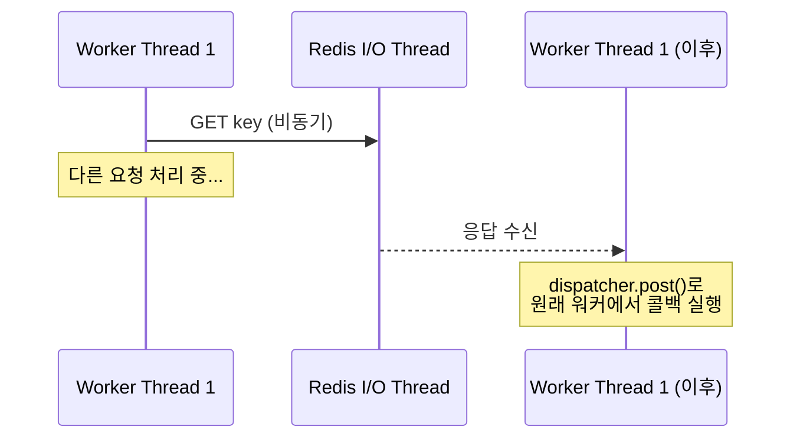

```cpp
// redis_cache.cc에서 발췌
void RedisCache::LookupRequest::onResponse(RespValuePtr&& value) {
    auto self = shared_from_this();
    
    // 응답 처리를 원래 워커 스레드에서 실행
    dispatcher_.post([self, value = std::move(value)]() mutable {
        self->callback_(/* 결과 */);
    });
}
```

---

## 3.4 필터 체인 아키텍처

Envoy HTTP 처리는 **파이프라인**입니다.

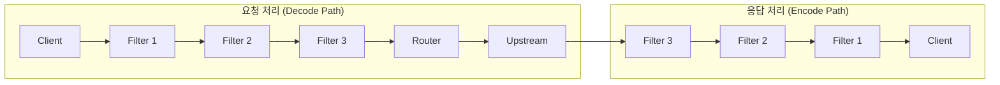

### 필터 인터페이스

```cpp
class StreamDecoderFilter {
    // 요청 헤더 도착
    virtual FilterHeadersStatus decodeHeaders(RequestHeaderMap& headers, bool end_stream) = 0;
    // 요청 바디 도착
    virtual FilterDataStatus decodeData(Buffer::Instance& data, bool end_stream) = 0;
    // 요청 트레일러 도착
    virtual FilterTrailersStatus decodeTrailers(RequestTrailerMap& trailers) = 0;
};

class StreamEncoderFilter {
    // 응답 헤더 도착
    virtual FilterHeadersStatus encodeHeaders(ResponseHeaderMap& headers, bool end_stream) = 0;
    // 응답 바디 도착
    virtual FilterDataStatus encodeData(Buffer::Instance& data, bool end_stream) = 0;
};
```

`GlobalCacheFilter`는 **둘 다** 구현합니다 (PassThroughFilter 상속).

---

## 3.5 필터 반환 값: 흐름 제어의 핵심

필터는 반환 값으로 **필터 체인의 흐름을 제어**합니다.

### FilterHeadersStatus

```cpp
enum class FilterHeadersStatus {
    Continue,                    // 다음 필터로 진행
    StopIteration,               // 현재 필터에서 중단 (이후 콜백에서 재개)
    StopAllIterationAndBuffer,   // 중단 + 데이터 버퍼링
    StopAllIterationAndWatermark // 중단 + 워터마크 기반 버퍼링
};
```

### 실제 사용 예시

```cpp
FilterHeadersStatus GlobalCacheFilter::decodeHeaders(...) {
    // 캐시 조회 시작 (비동기)
    cache_backend_->lookup(key, [this](CacheLookupResult&& result) {
        if (result.status == CacheLookupStatus::Hit) {
            // 캐시 히트: 응답 주입
            serveCachedResponse(result.entry, "HIT");
        } else {
            // 캐시 미스: 다음 필터로 진행
            decoder_callbacks_->continueDecoding();
        }
    });
    
    // 비동기 작업 중이므로 중단
    return FilterHeadersStatus::StopAllIterationAndWatermark;
}
```

### 흐름 다이어그램

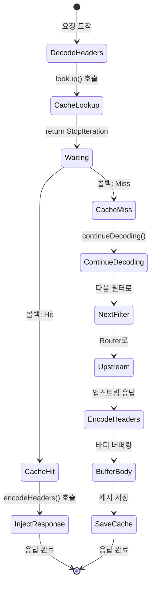

---

## 3.6 콜백과 스트림 생명주기

### decoder_callbacks_ vs encoder_callbacks_

```cpp
class GlobalCacheFilter : public Http::PassThroughFilter {
    // 상속으로 자동 제공
    Http::StreamDecoderFilterCallbacks* decoder_callbacks_;
    Http::StreamEncoderFilterCallbacks* encoder_callbacks_;
};
```

**decoder_callbacks_**: 요청 처리 중 사용
- `continueDecoding()`: 중단된 요청 처리 재개
- `encodeHeaders()`: 응답 주입 (캐시 히트 시)
- `dispatcher()`: 이벤트 루프 접근

**encoder_callbacks_**: 응답 처리 중 사용
- `continueEncoding()`: 중단된 응답 처리 재개
- `addEncodedData()`: 응답 바디 추가

### 스트림 생명주기와 onDestroy()

```cpp
void GlobalCacheFilter::onDestroy() {
    // 스트림이 종료됨 (정상 완료, 타임아웃, 리셋 등)
    
    // 1. 타이머 정리
    if (single_flight_timer_) {
        single_flight_timer_->disableTimer();
    }
    
    // 2. 대기 상태 정리
    waiting_for_in_flight_ = false;
    
    // 3. 내가 소유한 in-flight 정리
    if (owns_in_flight_) {
        notifyInFlightWaiters(in_flight_key_, nullptr);
        owns_in_flight_ = false;
    }
}
```

**중요**: `onDestroy()`는 **반드시 호출**됩니다. 리소스 정리는 여기서!

---

## 3.7 Thread Local Storage (TLS)

Envoy에서 **워커 간 데이터 공유**는 위험합니다. 대신 **Thread Local Storage**를 사용합니다.

### 문제: 전역 변수의 위험

```cpp
// ❌ 위험! 모든 워커가 접근하면 경쟁 조건 발생
static std::map<std::string, Entry> global_cache;
```

### 해결: thread_local

```cpp
// ✅ 각 워커가 독립적인 복사본을 가짐
thread_local std::unordered_map<std::string, std::shared_ptr<InFlightRequest>>
    GlobalCacheFilter::in_flight_requests_;
```

### 의미

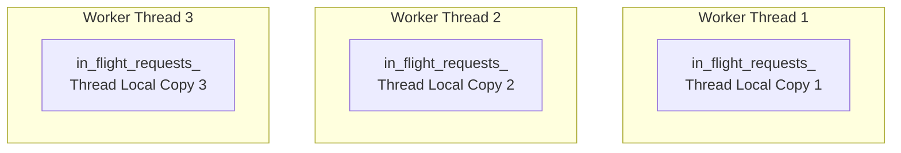

**결과**: 동일 URL 요청이 다른 워커에 도착하면 **각각 독립적으로 in-flight 추적**
- 장점: Lock-free, 간단
- 단점: 워커 수만큼 중복 upstream 요청 가능 (보통 2~8개)

---

## 3.8 비동기 패턴 정리

### 패턴 1: 콜백 체인

```cpp
void step1() {
    asyncOperation1([this](Result1&& r1) {
        step2(std::move(r1));
    });
}

void step2(Result1&& r1) {
    asyncOperation2([this](Result2&& r2) {
        step3(std::move(r2));
    });
}
```

### 패턴 2: shared_from_this()로 수명 보장

```cpp
class MyFilter : public std::enable_shared_from_this<MyFilter> {
    void startAsync() {
        auto self = shared_from_this();  // 참조 카운트 증가
        
        asyncCall([self]() {
            // self가 살아있는 동안 MyFilter도 살아있음
            self->onComplete();
        });
    }
};
```

### 패턴 3: weak_ptr로 안전한 콜백

```cpp
void registerCallback() {
    std::weak_ptr<MyFilter> weak_self = shared_from_this();
    
    asyncCall([weak_self]() {
        if (auto self = weak_self.lock()) {
            // 아직 살아있으면 실행
            self->onComplete();
        }
        // 파괴되었으면 조용히 무시
    });
}
```

---

## 3.9 실전: decodeHeaders의 동기/비동기 분기

`GlobalCacheFilter`에서 가장 복잡한 부분입니다:

```cpp
Http::FilterHeadersStatus GlobalCacheFilter::decodeHeaders(...) {
    // ...
    
    struct LookupContext {
        std::atomic<bool> sync{true};     // 동기 호출 여부
        std::atomic<bool> invoked{false}; // 콜백 호출 여부
    };
    auto lookup_ctx = std::make_shared<LookupContext>();
    
    // 비동기 캐시 조회
    cache_backend_->lookup(cache_key_, [this, lookup_ctx](CacheLookupResult&& result) {
        lookup_ctx->invoked.store(true);
        const bool is_sync = lookup_ctx->sync.load();
        
        // ... 결과 처리 ...
        
        if (!is_sync && state_ == FilterState::CacheMiss) {
            decoder_callbacks_->continueDecoding();  // 비동기면 재개 필요
        }
    });
    
    lookup_ctx->sync.store(false);  // 이제 비동기
    
    // 콜백이 이미 실행되었는가? (LocalCache는 동기)
    if (lookup_ctx->invoked.load()) {
        // 동기적으로 완료됨
        if (state_ == FilterState::CacheHit) {
            return FilterHeadersStatus::StopAllIterationAndWatermark;
        }
        return FilterHeadersStatus::Continue;  // 캐시 미스, 바로 진행
    } else {
        // 비동기 (RedisCache)
        return FilterHeadersStatus::StopAllIterationAndWatermark;
    }
}
```

**왜 이렇게 복잡한가?**
- LocalCache: 콜백이 **즉시** 실행됨 (동기)
- RedisCache: 콜백이 **나중에** 실행됨 (비동기)
- 두 경우를 **동일한 코드**로 처리해야 함

---

## 3.10 요약

| 개념 | 설명 | 주의사항 |
|------|------|----------|
| 워커 스레드 | 각각 독립적인 이벤트 루프 | 블로킹 금지! |
| 디스패처 | 타이머, 콜백 예약 | `post()`로 스레드 간 전환 |
| 필터 반환 값 | `Continue` vs `StopIteration` | 비동기 시 `continueDecoding()` 필요 |
| TLS | 워커별 독립 데이터 | `thread_local` 키워드 |
| 수명 관리 | `shared_from_this()`, `weak_ptr` | 콜백 전에 객체 파괴 방지 |

---

## 3.11 다음 장 예고

이제 Envoy 필터의 기본 규약을 알았습니다. 다음 장부터는 **실제 코드**를 분석합니다:
- 4장: 캐시 가능성 정책과 키 설계
- 5장: `decodeHeaders` 상세 분석
- 6장: Single-flight 구현의 모든 것

---

> **체크리스트 ✓**
> - [ ] Envoy의 스레딩 모델(이벤트 루프 기반)을 설명할 수 있다
> - [ ] 왜 블로킹이 금지인지 이해한다
> - [ ] `FilterHeadersStatus`의 각 값이 무엇을 의미하는지 안다
> - [ ] `continueDecoding()`이 언제 필요한지 안다
> - [ ] `thread_local`이 왜 사용되는지 설명할 수 있다
> - [ ] `shared_from_this()`가 필요한 이유를 안다

---

# Chapter 4. 캐시 키 설계: 정확성의 출발점

> **이 장의 목표**: 캐시 키가 어떻게 생성되는지, 캐시 가능 여부를 어떻게 판단하는지 이해합니다. 잘못된 키 설계가 일으키는 운영 사고도 함께 살펴봅니다.

---

## 4.1 캐시 키의 중요성

캐시의 **정확성(Correctness)**은 키 설계에서 시작됩니다.

### 키가 너무 좁으면?
```
요청 A: GET /api/users?id=1&lang=ko → 키: "/api/users?id=1&lang=ko"
요청 B: GET /api/users?id=1&lang=en → 키: "/api/users?id=1&lang=en"
```
→ **문제 없음**: 다른 응답에 다른 키

### 키가 너무 넓으면?
```
요청 A: GET /api/users?id=1 (User-Agent: Chrome) → 키: "/api/users?id=1"
요청 B: GET /api/users?id=1 (User-Agent: Safari) → 키: "/api/users?id=1"
```
→ **문제 발생**: User-Agent별로 다른 응답인데 같은 키!

### 키가 불안정하면?
```
요청 A: GET /api?a=1&b=2 → 키: "/api?a=1&b=2"
요청 B: GET /api?b=2&a=1 → 키: "/api?b=2&a=1"  (쿼리 순서만 다름)
```
→ **캐시 미스**: 같은 요청인데 다른 키!

---

## 4.2 캐시 키 구성 옵션

`GlobalCacheFilter`의 키는 다음 요소들로 구성됩니다:

```yaml
cache_key:
  include_scheme: false        # http vs https
  include_host: true           # 호스트명
  include_path: true           # 경로
  include_query_params: true   # 쿼리 스트링
  query_params_included: []    # 포함할 쿼리 (allowlist)
  query_params_excluded: []    # 제외할 쿼리 (blocklist)
  headers_included: []         # 포함할 헤더
```

### 키 생성 코드

```cpp
// global_cache_filter.cc
std::string GlobalCacheFilter::generateCacheKey(const Http::RequestHeaderMap& headers) {
    std::string key;
    
    // 1. 메서드 (항상 포함)
    if (headers.Method()) {
        appendKeyPart(key, "m", headers.Method()->value().getStringView());
    }
    
    // 2. 스킴 (옵션)
    if (effective_cache_key_config_.include_scheme && headers.Scheme()) {
        appendKeyPart(key, "s", headers.Scheme()->value().getStringView());
    }
    
    // 3. 호스트 (옵션, 기본 true)
    if (effective_cache_key_config_.include_host && headers.Host()) {
        appendKeyPart(key, "h", headers.Host()->value().getStringView());
    }
    
    // 4. 경로 (옵션, 기본 true)
    if (effective_cache_key_config_.include_path) {
        appendKeyPart(key, "p", buildPathForCacheKey(headers));
    }
    
    // 5. 헤더 (옵션)
    if (!effective_cache_key_config_.headers_included.empty()) {
        key += buildHeaderKeyFragment(headers);
    }
    
    return key;
}
```

### 키 포맷 설명

```
|m:3:GET|h:11:example.com|p:19:/api/v1/users?id=1

구조: |태그:길이:값|태그:길이:값|...

- m: method
- s: scheme  
- h: host
- p: path (쿼리 포함)
- hn: header name
- hv: header value
```

**왜 길이를 포함하는가?**

파싱 없이 빠른 비교를 위해서입니다:
```
키 A: |p:10:/api?a=1&b
키 B: |p:10:/api?a=1|b

길이 정보 없이는 "|p:/api?a=1&b" vs "|p:/api?a=1|b" 구분 어려움
```

---

## 4.3 쿼리 파라미터 필터링

실무에서 가장 많이 사용하는 기능입니다.

### Allowlist 방식

```yaml
cache_key:
  query_params_included: ["user_id", "region"]
```

```
요청: GET /search?q=envoy&user_id=kim&debug=1
키: /search?user_id=kim  (q, debug 제외)
```

### Blocklist 방식

```yaml
cache_key:
  query_params_excluded: ["utm_source", "debug", "_t"]
```

```
요청: GET /search?q=envoy&utm_source=google&_t=1234567890
키: /search?q=envoy  (utm_source, _t 제외)
```

### 구현 코드

```cpp
std::string GlobalCacheFilter::buildPathForCacheKey(
    const Http::RequestHeaderMap& headers) const {
    
    const auto& path = headers.Path()->value();
    
    // 쿼리 파라미터를 포함하지 않는 경우
    if (!effective_cache_key_config_.include_query_params) {
        return Http::Utility::stripQueryString(path);
    }
    
    // 필터가 없으면 원본 그대로
    if (effective_cache_key_config_.query_params_included.empty() &&
        effective_cache_key_config_.query_params_excluded.empty()) {
        return std::string(path.getStringView());
    }
    
    // 필터링 적용
    const auto query_params = Http::Utility::QueryParamsMulti::parseQueryString(
        path.getStringView());
    Http::Utility::QueryParamsMulti filtered_params;
    
    const bool include_by_default = 
        effective_cache_key_config_.query_params_included.empty();
    
    for (const auto& entry : query_params.data()) {
        const auto& name = entry.first;
        const auto& values = entry.second;
        
        for (const auto& value : values) {
            // Allowlist 또는 기본 포함
            bool include = include_by_default ||
                effective_cache_key_config_.query_params_included.contains(name);
            
            // Blocklist가 우선
            if (include && 
                effective_cache_key_config_.query_params_excluded.contains(name)) {
                include = false;
            }
            
            if (include) {
                filtered_params.add(name, value);
            }
        }
    }
    
    return filtered_params.replaceQueryString(path);
}
```

---

## 4.4 헤더 기반 키 분리

`Vary` 헤더처럼, 특정 요청 헤더에 따라 캐시를 분리해야 할 때:

```yaml
cache_key:
  headers_included:
    - "x-user-tier"    # 무료/프리미엄 사용자
    - "accept-language"  # 언어별 응답
```

### 결과

```
요청 A: GET /api (x-user-tier: premium)
키: |m:3:GET|h:11:example.com|p:4:/api|hn:11:x-user-tier|hv:7:premium

요청 B: GET /api (x-user-tier: free)
키: |m:3:GET|h:11:example.com|p:4:/api|hn:11:x-user-tier|hv:4:free
```

### 구현 코드

```cpp
std::string GlobalCacheFilter::buildHeaderKeyFragment(
    const Http::RequestHeaderMap& headers) const {
    
    std::string fragment;
    
    for (const auto& header_name : effective_cache_key_config_.headers_included) {
        appendKeyPart(fragment, "hn", header_name.get());
        
        const auto values = headers.get(header_name);
        for (size_t i = 0; i < values.size(); ++i) {
            const auto* entry = values[i];
            appendKeyPart(fragment, "hv", entry->value().getStringView());
        }
    }
    
    return fragment;
}
```

---

## 4.5 캐시 가능 여부 판단

### 요청 캐시 가능성

```cpp
bool GlobalCacheFilter::isCacheableRequest(
    const Http::RequestHeaderMap& headers) const {
    
    if (!headers.Method()) {
        return false;
    }
    
    const auto method = headers.Method()->value().getStringView();
    std::string normalized_method(method);
    absl::AsciiStrToUpper(&normalized_method);
    
    // 기본: GET, HEAD만 허용
    return config_->allowedMethods().contains(normalized_method);
}
```

**기본 허용 메서드**: `GET`, `HEAD`

POST, PUT, DELETE 등은 기본적으로 캐시하지 않습니다 (부작용이 있으므로).

### 응답 캐시 가능성

```cpp
bool GlobalCacheFilter::isCacheableResponse(
    const Http::ResponseHeaderMap& headers) const {
    
    // 1. 상태 코드 확인 (기본: 200-299)
    const auto status = Http::Utility::getResponseStatus(headers);
    if (!config_->allowedStatusCodes().contains(status)) {
        return false;
    }
    
    // 2. Set-Cookie 헤더 확인
    if (config_->skipIfResponseHasSetCookie() &&
        !headers.get(Http::Headers::get().SetCookie).empty()) {
        return false;
    }
    
    // 3. Cache-Control 헤더 확인
    if (config_->skipIfResponseHasCacheControl() &&
        !headers.get(Http::CustomHeaders::get().CacheControl).empty()) {
        return false;
    }
    
    return true;
}
```

### 캐시 가능성 체크리스트

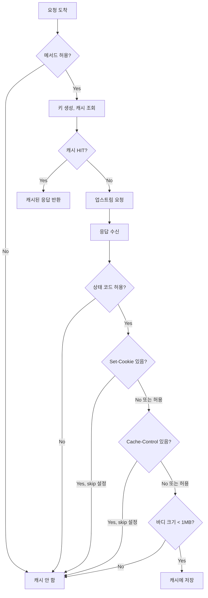

---

## 4.6 라우트별 Override

전역 설정을 라우트별로 덮어쓸 수 있습니다:

```yaml
route_config:
  virtual_hosts:
  - name: local_service
    domains: ["*"]
    routes:
    # 캐시 비활성화
    - match: { prefix: "/api/auth" }
      typed_per_filter_config:
        envoy.filters.http.global_cache:
          "@type": type.googleapis.com/.../GlobalCachePerRoute
          disabled: true
          
    # TTL 변경 + 쿼리 무시
    - match: { prefix: "/api/static" }
      typed_per_filter_config:
        envoy.filters.http.global_cache:
          "@type": type.googleapis.com/.../GlobalCachePerRoute
          overrides:
            default_ttl: { seconds: 3600 }  # 1시간
            cache_key:
              include_query_params: false
```

### 구현 코드

```cpp
Http::FilterHeadersStatus GlobalCacheFilter::decodeHeaders(...) {
    // 라우트별 설정 확인
    if (const auto* per_route_config =
            Http::Utility::resolveMostSpecificPerFilterConfig<GlobalCachePerRouteConfig>(
                decoder_callbacks_)) {
        
        // 캐시 비활성화?
        cache_enabled_ = !per_route_config->disabled();
        
        // TTL override?
        if (auto ttl_override = per_route_config->defaultTtlOverride()) {
            effective_default_ttl_ = ttl_override.value();
        }
        
        // 캐시 키 override?
        if (auto cache_key_override = per_route_config->cacheKeyOverride()) {
            effective_cache_key_config_ = cache_key_override.value();
        } else {
            effective_cache_key_config_ = config_->cacheKeyConfig();
        }
    }
    
    if (!cache_enabled_) {
        return FilterHeadersStatus::Continue;  // 캐시 패스스루
    }
    // ...
}
```

---

## 4.7 키 설계의 함정과 운영 사고

### 함정 1: 쿼리 순서 의존성

```
/api?a=1&b=2  vs  /api?b=2&a=1
```

**현재 구현**: 쿼리 순서에 의존함 (정규화 없음)

**운영 영향**: 클라이언트가 쿼리 순서를 바꾸면 캐시 미스

**완화책**: 
- 클라이언트 표준화
- 또는 쿼리 파라미터 정규화 추가 구현 필요

### 함정 2: 대소문자 구분

```
GET /API/Users  vs  GET /api/users
```

**현재 구현**: 대소문자 구분함

**운영 영향**: 같은 리소스인데 다른 키

**완화책**: 경로 정규화(lowercase) 구현 필요

### 함정 3: Accept-Encoding 미반영

```
GET /api (Accept-Encoding: gzip)  → gzip 응답 캐시됨
GET /api (Accept-Encoding: br)    → 같은 키! gzip 응답 반환됨!
```

**현재 구현**: `Accept-Encoding`을 키에 포함하지 않음

**운영 영향**: 압축 형식 불일치

**완화책**: 
```yaml
cache_key:
  headers_included: ["accept-encoding"]
```

### 함정 4: 민감정보 키 포함

```
GET /api?session=abc123&user=kim
```

세션 ID가 키에 포함되면:
- 캐시 효율 급감 (거의 모든 요청이 MISS)
- Redis에 민감 데이터 저장

**완화책**:
```yaml
cache_key:
  query_params_excluded: ["session", "token", "api_key"]
```

---

## 4.8 실전 설정 예시

### 정적 자산 캐싱

```yaml
# /static/* 경로: 쿼리 무시, 긴 TTL
- match: { prefix: "/static" }
  typed_per_filter_config:
    envoy.filters.http.global_cache:
      "@type": type.googleapis.com/.../GlobalCachePerRoute
      overrides:
        default_ttl: { seconds: 86400 }  # 24시간
        cache_key:
          include_query_params: false
```

### API 캐싱 (사용자별 분리)

```yaml
# /api/* 경로: 사용자 tier별 캐시 분리
- match: { prefix: "/api" }
  typed_per_filter_config:
    envoy.filters.http.global_cache:
      "@type": type.googleapis.com/.../GlobalCachePerRoute
      overrides:
        default_ttl: { seconds: 60 }
        cache_key:
          headers_included: ["x-user-tier"]
          query_params_excluded: ["_t", "utm_source"]
```

### 인증 경로 제외

```yaml
# /auth/* 경로: 캐시 완전 비활성화
- match: { prefix: "/auth" }
  typed_per_filter_config:
    envoy.filters.http.global_cache:
      "@type": type.googleapis.com/.../GlobalCachePerRoute
      disabled: true
```

---

## 4.9 요약

| 설정 | 기본값 | 용도 |
|------|--------|------|
| `include_scheme` | false | http/https 분리 |
| `include_host` | true | 멀티 도메인 분리 |
| `include_path` | true | 경로별 캐시 |
| `include_query_params` | true | 쿼리 포함 여부 |
| `query_params_included` | [] | Allowlist |
| `query_params_excluded` | [] | Blocklist |
| `headers_included` | [] | 헤더 기반 분리 |

**캐시 가능 조건 (기본값)**:
- 메서드: GET, HEAD
- 상태 코드: 200-299
- Set-Cookie 없음
- Cache-Control 없음
- 바디 크기 < 1MB

---

## 4.10 다음 장 예고

키 설계를 이해했으니, 다음 장에서는 **`decodeHeaders` 메서드**를 깊이 분석합니다:
- 캐시 조회의 동기/비동기 분기
- `StopIteration`과 `continueDecoding()` 흐름
- 캐시 히트 시 응답 주입

---

> **체크리스트 ✓**
> - [ ] 캐시 키의 구성 요소를 설명할 수 있다
> - [ ] `query_params_included`와 `query_params_excluded`의 동작을 이해한다
> - [ ] 라우트별 override가 어떻게 적용되는지 안다
> - [ ] 키 설계의 흔한 함정(쿼리 순서, 대소문자, Accept-Encoding)을 인지한다
> - [ ] 실무에서 캐시 키를 어떻게 설계해야 하는지 감을 잡았다

---

# Chapter 5. decodeHeaders: 요청 처리의 시작점

> **이 장의 목표**: 필터의 핵심 진입점인 `decodeHeaders`를 완벽히 이해합니다. 특히 LocalCache(동기)와 RedisCache(비동기)를 동일한 코드로 처리하는 기법을 배웁니다.

---

## 5.1 decodeHeaders가 하는 일

HTTP 요청이 도착하면 가장 먼저 `decodeHeaders`가 호출됩니다.

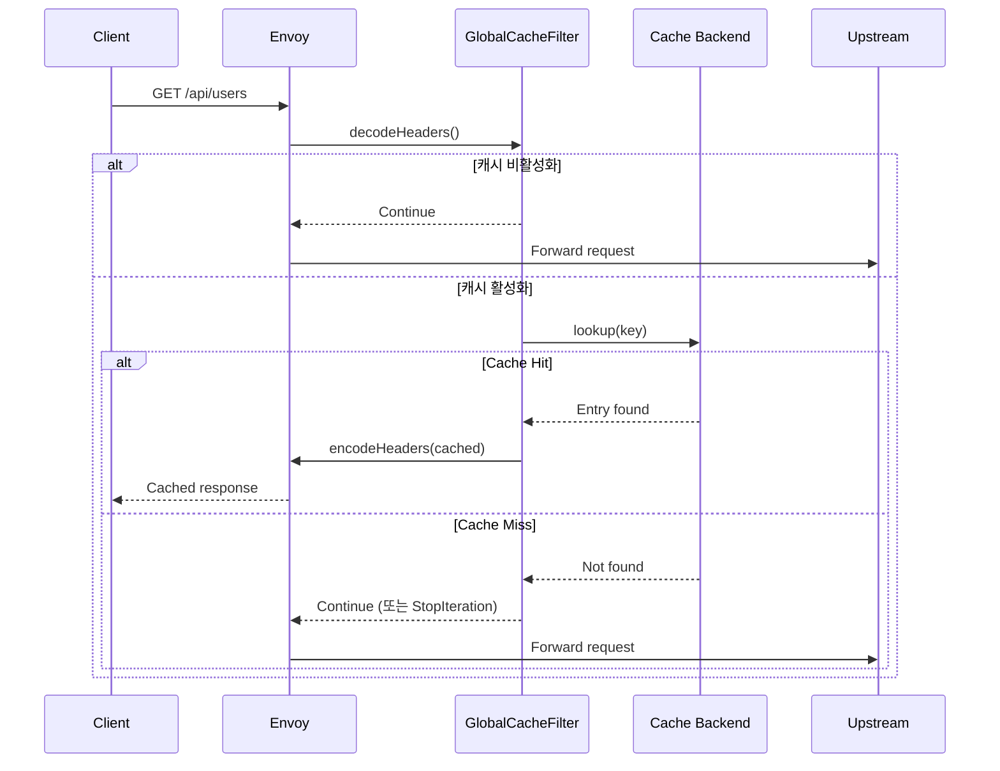

---

## 5.2 전체 코드 흐름

```cpp
Http::FilterHeadersStatus GlobalCacheFilter::decodeHeaders(
    Http::RequestHeaderMap& headers, bool end_stream) {
    
    // ========== Phase 1: 설정 적용 ==========
    // 라우트별 override 확인 및 적용
    if (const auto* per_route_config = ...) {
        cache_enabled_ = !per_route_config->disabled();
        // TTL, 캐시 키 override 적용
    }
    
    if (!cache_enabled_) {
        return Http::FilterHeadersStatus::Continue;
    }
    
    // ========== Phase 2: 캐시 가능성 검사 ==========
    cacheable_request_ = isCacheableRequest(headers);
    if (!cacheable_request_) {
        return Http::FilterHeadersStatus::Continue;
    }
    
    // ========== Phase 3: 캐시 키 생성 ==========
    cache_key_ = generateCacheKey(headers);
    
    // ========== Phase 4: 비동기 캐시 조회 ==========
    // (다음 섹션에서 상세 설명)
    
    // ========== Phase 5: 반환 값 결정 ==========
    // (동기/비동기 분기 처리)
}
```

---

## 5.3 동기/비동기 통합 처리의 도전

가장 까다로운 부분입니다. `CacheBackend`는 비동기 인터페이스지만:

| 백엔드 | 콜백 실행 시점 |
|--------|---------------|
| LocalCache | **즉시** (동기) |
| RedisCache | **나중에** (비동기) |

같은 코드로 두 경우를 모두 처리해야 합니다!

### 문제 상황

```cpp
// 잘못된 접근 (동기만 가정)
void decodeHeaders() {
    CacheLookupResult result;
    
    cache_backend_->lookup(key, [&result](CacheLookupResult&& r) {
        result = std::move(r);  // LocalCache: 여기서 즉시 실행
    });
    
    // LocalCache: result가 채워져 있음 ✓
    // RedisCache: result가 비어있음! ✗
    if (result.status == CacheLookupStatus::Hit) { ... }
}
```

### 해결책: 콜백 실행 여부 추적

```cpp
struct LookupContext {
    std::atomic<bool> sync{true};      // 동기 호출 중인가?
    std::atomic<bool> invoked{false};  // 콜백이 실행되었는가?
};
```

---

## 5.4 핵심 코드 분석

```cpp
Http::FilterHeadersStatus GlobalCacheFilter::decodeHeaders(...) {
    // ... 캐시 키 생성까지 완료 ...
    
    // 콜백 실행 추적을 위한 컨텍스트
    struct LookupContext {
        std::atomic<bool> sync{true};
        std::atomic<bool> invoked{false};
    };
    auto lookup_ctx = std::make_shared<LookupContext>();
    
    // ===== 비동기 캐시 조회 =====
    cache_backend_->lookup(cache_key_, [this, lookup_ctx](CacheLookupResult&& result) {
        
        // 콜백이 실행되었음을 기록
        lookup_ctx->invoked.store(true);
        
        // 동기 호출 중인지 확인
        const bool is_sync = lookup_ctx->sync.load();
        
        if (result.status == CacheLookupStatus::Hit) {
            // 캐시 HIT
            state_ = FilterState::CacheHit;
            serveCachedResponse(result.entry, "HIT");
            return;
        }
        
        // 캐시 MISS - Single-flight 처리
        // (다음 장에서 상세 설명)
        
        // 비동기인 경우 요청 처리 재개
        if (!is_sync && state_ == FilterState::CacheMiss) {
            decoder_callbacks_->continueDecoding();
        }
    });
    
    // ===== 이제 비동기 =====
    lookup_ctx->sync.store(false);
    
    // ===== 반환 값 결정 =====
    if (lookup_ctx->invoked.load()) {
        // 콜백이 이미 실행됨 (LocalCache - 동기)
        if (state_ == FilterState::CacheHit || 
            state_ == FilterState::WaitingForUpstream) {
            return Http::FilterHeadersStatus::StopAllIterationAndWatermark;
        }
        // CacheMiss - 다음 필터로
        return Http::FilterHeadersStatus::Continue;
        
    } else {
        // 콜백이 아직 실행 안 됨 (RedisCache - 비동기)
        // 콜백에서 continueDecoding()이 호출될 것임
        return Http::FilterHeadersStatus::StopAllIterationAndWatermark;
    }
}
```

### 실행 흐름 다이어그램

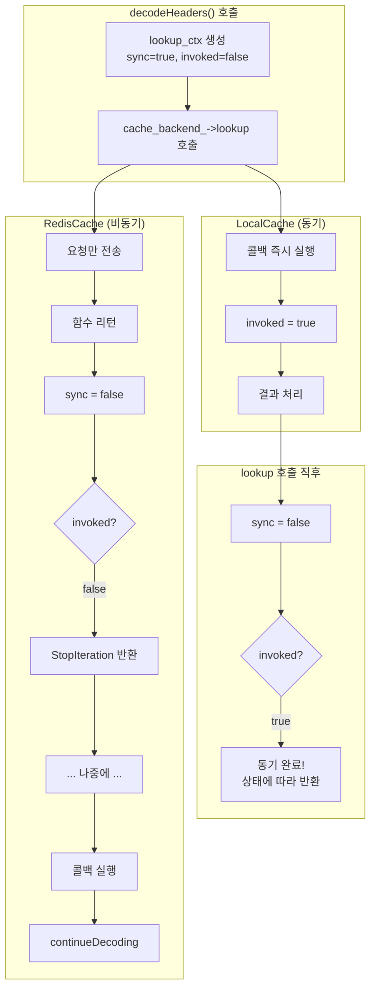

---

## 5.5 캐시 히트: 응답 주입

캐시에서 응답을 찾으면 `serveCachedResponse`로 클라이언트에게 직접 응답합니다.

```cpp
void GlobalCacheFilter::serveCachedResponse(
    const std::shared_ptr<CacheEntry>& cached_entry,
    const std::string& cache_status) {
    
    // 1. 헤더 복사
    auto response_headers = Http::ResponseHeaderMapImpl::create();
    cached_entry->headers->iterate(
        [&response_headers](const Http::HeaderEntry& header) -> Http::HeaderMap::Iterate {
            response_headers->addCopy(
                Http::LowerCaseString(std::string(header.key().getStringView())),
                std::string(header.value().getStringView()));
            return Http::HeaderMap::Iterate::Continue;
        });
    
    // 2. 캐시 상태 헤더 추가
    response_headers->addCopy(Http::LowerCaseString("x-cache"), cache_status);
    
    // 3. 바디 존재 여부 확인
    bool has_body = cached_entry->body.length() > 0;
    
    // 4. 응답 헤더 주입 (end_stream = !has_body)
    decoder_callbacks_->encodeHeaders(
        std::move(response_headers), 
        !has_body,           // 바디 없으면 스트림 종료
        "global_cache_hit"   // 통계/로깅용 태그
    );
    
    // 5. 바디 주입 (있는 경우)
    if (has_body) {
        Buffer::OwnedImpl body_copy;
        body_copy.add(cached_entry->body);
        decoder_callbacks_->encodeData(body_copy, true);  // end_stream = true
    }
}
```

### 핵심 포인트

**`decoder_callbacks_->encodeHeaders`**: 
- 응답 경로로 점프
- 업스트림으로 가지 않고 바로 클라이언트에게 응답

**헤더 복사가 필요한 이유**:
- 캐시된 헤더는 여러 요청에서 공유됨
- 원본을 수정하면 다른 요청에 영향

---

## 5.6 shared_from_this()가 필요한 이유

콜백에서 `this`를 사용할 때 주의해야 합니다.

### 위험한 패턴

```cpp
cache_backend_->lookup(key, [this](CacheLookupResult&& result) {
    // ❌ 위험! 
    // 콜백이 실행될 때 Filter 객체가 이미 파괴되었을 수 있음
    this->serveCachedResponse(result.entry, "HIT");
});
```

### 안전한 패턴

```cpp
cache_backend_->lookup(key, [this, lookup_ctx](CacheLookupResult&& result) {
    // ✅ lookup_ctx가 shared_ptr이므로 콜백이 실행될 때까지 살아있음
    // 하지만 'this'는 여전히 raw pointer...
});
```

### 더 안전한 패턴 (Single-flight에서 사용)

```cpp
std::weak_ptr<GlobalCacheFilter> weak_self = shared_from_this();

timer->enableTimer([weak_self]() {
    if (auto self = weak_self.lock()) {
        // ✅ 객체가 살아있으면 실행
        self->onSingleFlightTimeout();
    }
    // 객체가 파괴되었으면 조용히 무시
});
```

### GlobalCacheFilter의 상속 구조

```cpp
class GlobalCacheFilter : public Http::PassThroughFilter,
                          public std::enable_shared_from_this<GlobalCacheFilter>,
                          public Logger::Loggable<Logger::Id::filter> {
```

`enable_shared_from_this`를 상속받아야 `shared_from_this()`를 사용할 수 있습니다.

---

## 5.7 Go로 이해하는 동기/비동기 분기

Go에서 같은 패턴을 구현한다면:

```go
type LookupContext struct {
    sync    atomic.Bool
    invoked atomic.Bool
    result  CacheLookupResult
    done    chan struct{}
}

func (f *Filter) decodeHeaders() FilterStatus {
    ctx := &LookupContext{done: make(chan struct{})}
    ctx.sync.Store(true)
    
    // 비동기 조회 시작
    go func() {
        result := f.cacheBackend.Lookup(f.cacheKey)
        ctx.result = result
        ctx.invoked.Store(true)
        
        // 비동기인 경우에만 채널로 통지
        if !ctx.sync.Load() {
            close(ctx.done)
        }
    }()
    
    ctx.sync.Store(false)
    
    if ctx.invoked.Load() {
        // 동기 완료 (로컬 캐시)
        return f.handleResult(ctx.result)
    }
    
    // 비동기 - 고루틴 완료 대기 (실제로는 논블로킹 처리 필요)
    <-ctx.done
    return f.handleResult(ctx.result)
}
```

하지만 Go에서는 보통 이렇게 하지 않고, 채널을 사용하거나 `context.Context`로 처리합니다.

---

## 5.8 상태 관리

필터는 상태 머신으로 동작합니다:

```cpp
enum class FilterState {
    Initial,            // 초기 상태
    CacheHit,           // 캐시 히트, 응답 제공 중
    CacheMiss,          // 캐시 미스, 업스트림으로 진행
    WaitingForUpstream, // Single-flight 대기 중
    Caching             // 업스트림 응답 캐싱 중
};
```

### 상태 전이도

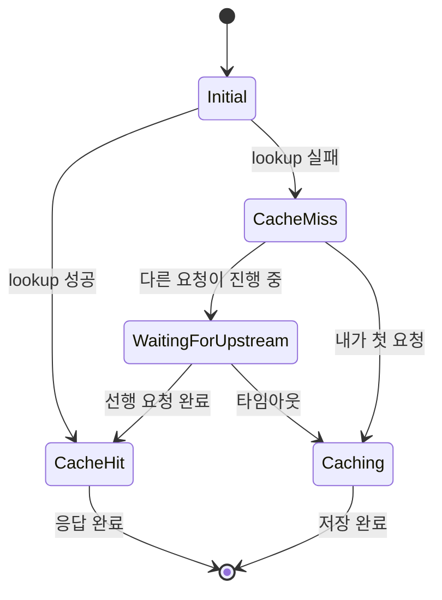

---

## 5.9 decodeData: 요청 바디 처리

`decodeData`는 요청 바디가 도착할 때 호출됩니다.

```cpp
Http::FilterDataStatus GlobalCacheFilter::decodeData(Buffer::Instance&, bool) {
    // 캐시 비활성화 - 패스스루
    if (!cache_enabled_) {
        return Http::FilterDataStatus::Continue;
    }
    
    // 캐시 히트 또는 대기 중 - 요청 바디 무시
    if (state_ == FilterState::CacheHit || 
        state_ == FilterState::WaitingForUpstream) {
        return Http::FilterDataStatus::StopIterationNoBuffer;
    }
    
    // 캐시 미스 - 바디도 업스트림으로
    return Http::FilterDataStatus::Continue;
}
```

**핵심**: 캐시 히트 시 요청 바디는 필요 없으므로 버퍼링하지 않음

---

## 5.10 에러 처리

### 캐시 백엔드 실패 시

```cpp
// CacheLookupStatus::Error 처리
if (result.status == CacheLookupStatus::Error) {
    // 에러는 미스로 처리하고 업스트림으로 진행
    // (캐시가 죽어도 서비스는 계속)
    state_ = FilterState::CacheMiss;
    if (!is_sync) {
        decoder_callbacks_->continueDecoding();
    }
}
```

**철학**: 캐시 실패가 서비스 실패를 일으키면 안 됨

---

## 5.11 요약

| 단계 | 설명 | 결과 |
|------|------|------|
| 1. 설정 적용 | 라우트별 override 확인 | cache_enabled, TTL, 키 설정 |
| 2. 캐시 가능성 | 메서드 확인 (GET/HEAD) | cacheable_request |
| 3. 키 생성 | 설정에 따라 키 조합 | cache_key |
| 4. 캐시 조회 | 비동기 lookup | 콜백으로 결과 |
| 5. 결과 처리 | 히트/미스 분기 | 응답 주입 또는 진행 |

**동기/비동기 통합 패턴**:
```cpp
LookupContext ctx;
ctx.sync = true;

backend->lookup([&ctx]() {
    ctx.invoked = true;
    // 결과 처리
    if (!ctx.sync) continueDecoding();
});

ctx.sync = false;

if (ctx.invoked) {
    // 동기 완료
} else {
    return StopIteration;  // 비동기 대기
}
```

---

## 5.12 다음 장 예고

캐시 미스 후 **Single-flight** 패턴이 어떻게 동작하는지 상세히 분석합니다:
- `InFlightRequest` 구조
- `waiters` 목록과 `weak_ptr`
- 타임아웃 처리
- 완료 통지 메커니즘

---

> **체크리스트 ✓**
> - [ ] `decodeHeaders`의 5단계를 설명할 수 있다
> - [ ] 동기/비동기 콜백을 통합 처리하는 패턴을 이해한다
> - [ ] `StopAllIterationAndWatermark`와 `continueDecoding()`의 관계를 안다
> - [ ] `shared_from_this()`가 왜 필요한지 설명할 수 있다
> - [ ] 캐시 히트 시 응답이 어떻게 주입되는지 안다

---

# Chapter 6. Single-Flight: 요청 합류의 모든 것

> **이 장의 목표**: Thundering Herd 문제를 해결하는 Single-Flight 패턴의 구현을 완벽히 이해합니다. C++에서의 수명 관리와 동기화 기법을 배웁니다.

---

## 6.1 Thundering Herd 문제

캐시가 만료되거나 cold start 상황에서 발생합니다:

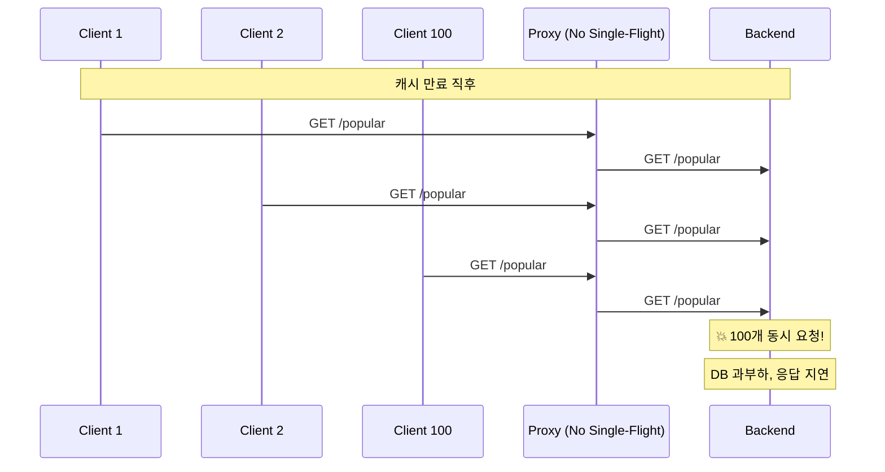

### Single-Flight 적용 후

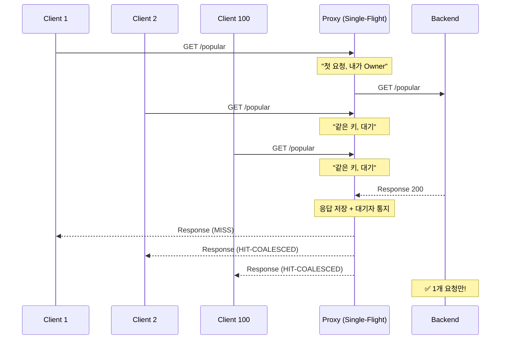

---

## 6.2 핵심 자료구조

### InFlightRequest

```cpp
struct InFlightRequest {
    bool completed{false};                              // 완료 여부
    std::shared_ptr<CacheEntry> result{nullptr};        // 결과 (있으면 히트)
    std::vector<std::weak_ptr<GlobalCacheFilter>> waiters;  // 대기자 목록
};
```

### 전역 맵 (Thread Local)

```cpp
// 워커 스레드별 독립 저장소
thread_local std::unordered_map<std::string, std::shared_ptr<InFlightRequest>>
    GlobalCacheFilter::in_flight_requests_;
```

**왜 `thread_local`인가?**

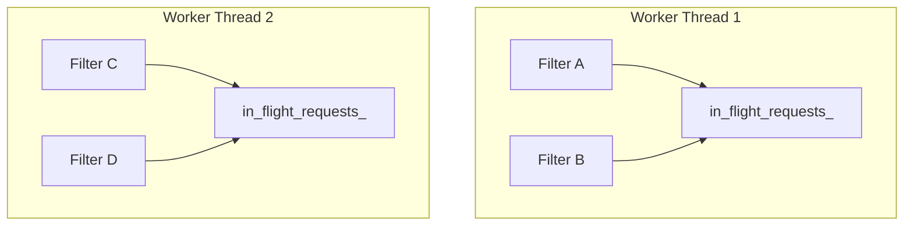

- **Lock-free**: 각 워커가 자신만의 맵 사용
- **Trade-off**: 워커 수만큼 중복 upstream 요청 가능 (2~8개)

---

## 6.3 Single-Flight 흐름

### 캐시 미스 시 분기

```cpp
// 캐시 미스 처리
if (result.status == CacheLookupStatus::Miss) {
    bool is_first_request = false;
    
    {
        auto it = in_flight_requests_.find(cache_key_);
        
        if (it != in_flight_requests_.end()) {
            // ===== 다른 요청이 이미 진행 중 =====
            std::weak_ptr<GlobalCacheFilter> weak_self = shared_from_this();
            it->second->waiters.push_back(std::move(weak_self));
            
            state_ = FilterState::WaitingForUpstream;
            waiting_for_in_flight_ = true;
            
            // 타임아웃 타이머 설정
            setupSingleFlightTimer();
        } else {
            // ===== 내가 첫 번째 요청 =====
            in_flight_requests_[cache_key_] = std::make_shared<InFlightRequest>();
            is_first_request = true;
            owns_in_flight_ = true;
            in_flight_key_ = cache_key_;
            
            state_ = FilterState::CacheMiss;
        }
    }
    
    if (!is_first_request) {
        // 대기 - 콜백에서 재개됨
        return;
    }
    
    // 첫 요청 - 업스트림으로 진행
    if (!is_sync) {
        decoder_callbacks_->continueDecoding();
    }
}
```

### 상태 다이어그램

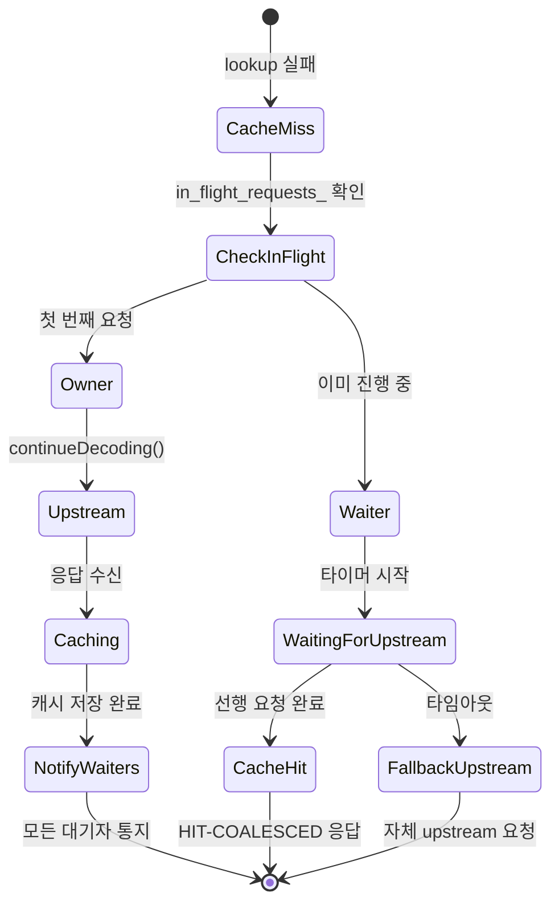

---

## 6.4 waiters에 weak_ptr를 쓰는 이유

### 순환 참조 문제

```cpp
// ❌ 만약 shared_ptr를 사용한다면?
struct InFlightRequest {
    std::vector<std::shared_ptr<GlobalCacheFilter>> waiters;  // 강한 참조
};
```

**문제 시나리오**:
1. Filter A가 Owner, Filter B가 Waiter
2. InFlightRequest가 Filter B를 `shared_ptr`로 참조
3. Filter B의 요청이 취소됨 (클라이언트 disconnect)
4. Filter B는 파괴되어야 하는데... InFlightRequest가 참조 중!
5. **메모리 누수** 또는 **Use-after-free**

### weak_ptr 해결책

```cpp
struct InFlightRequest {
    std::vector<std::weak_ptr<GlobalCacheFilter>> waiters;  // 약한 참조
};
```

```cpp
// 대기자 등록
std::weak_ptr<GlobalCacheFilter> weak_self = shared_from_this();
it->second->waiters.push_back(std::move(weak_self));
```

```cpp
// 통지 시
for (const auto& waiter : it->second->waiters) {
    if (auto filter = waiter.lock()) {  // 아직 살아있으면
        filter->onInFlightComplete(entry);
    }
    // 파괴되었으면 조용히 무시
}
```

### 비유로 이해하기

**shared_ptr**: "친구를 내 집에 가둠" - 내가 해제할 때까지 못 나감
**weak_ptr**: "친구의 전화번호" - 전화해서 안 받으면 그냥 포기

---

## 6.5 타임아웃 처리

선행 요청이 오래 걸리면 대기자도 무한정 기다려야 할까요?

### 타이머 설정

```cpp
void setupSingleFlightTimer() {
    if (!single_flight_timer_) {
        std::weak_ptr<GlobalCacheFilter> weak_self = shared_from_this();
        
        single_flight_timer_ = decoder_callbacks_->dispatcher().createTimer(
            [weak_self]() {
                if (auto self = weak_self.lock()) {
                    self->onSingleFlightTimeout();
                }
            });
    }
    
    single_flight_timer_->enableTimer(config_->singleFlightTimeout());
}
```

### 타임아웃 콜백

```cpp
void GlobalCacheFilter::onSingleFlightTimeout() {
    // 아직 대기 중인지 확인
    if (!waiting_for_in_flight_ || state_ != FilterState::WaitingForUpstream) {
        return;
    }
    
    ENVOY_LOG(warn,
        "global_cache: timeout waiting for in-flight request for key: {} "
        "- proceeding to upstream",
        cache_key_);
    
    // 대기 포기, 직접 upstream으로
    waiting_for_in_flight_ = false;
    state_ = FilterState::CacheMiss;
    decoder_callbacks_->continueDecoding();
}
```

### 타임아웃 흐름

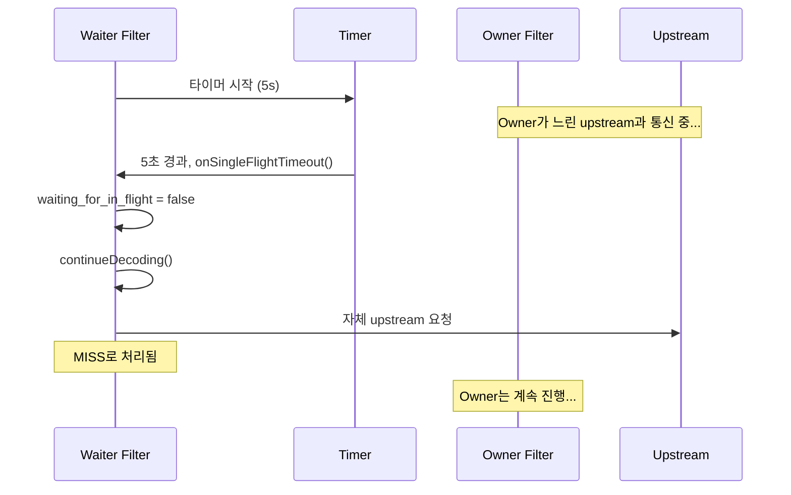

---

## 6.6 Owner의 완료 처리

업스트림 응답을 받고 캐시에 저장한 후, 대기자들에게 통지합니다.

### 완료 통지

```cpp
void GlobalCacheFilter::notifyInFlightWaiters(
    const std::string& key,
    const std::shared_ptr<CacheEntry>& entry) {
    
    // 1. 대기자 목록 추출
    std::vector<std::shared_ptr<GlobalCacheFilter>> waiters;
    
    auto it = in_flight_requests_.find(key);
    if (it == in_flight_requests_.end()) {
        return;
    }
    
    // 완료 표시
    it->second->completed = true;
    it->second->result = entry;
    
    // weak_ptr를 shared_ptr로 변환 (살아있는 것만)
    for (const auto& waiter : it->second->waiters) {
        if (auto filter = waiter.lock()) {
            waiters.push_back(filter);
        }
    }
    
    // 2. 맵에서 제거
    in_flight_requests_.erase(it);
    
    // 3. 대기자들에게 통지
    for (const auto& waiter : waiters) {
        waiter->onInFlightComplete(entry);
    }
}
```

### 대기자의 완료 콜백

```cpp
void GlobalCacheFilter::onInFlightComplete(
    const std::shared_ptr<CacheEntry>& entry) {
    
    // 이미 다른 방법으로 처리되었으면 무시
    if (!waiting_for_in_flight_ || state_ != FilterState::WaitingForUpstream) {
        return;
    }
    
    waiting_for_in_flight_ = false;
    
    // 타이머 정리
    if (single_flight_timer_) {
        single_flight_timer_->disableTimer();
    }
    
    if (entry) {
        // 성공 - 캐시된 응답 제공
        state_ = FilterState::CacheHit;
        serveCachedResponse(entry, "HIT-COALESCED");
    } else {
        // 실패 - 직접 upstream으로
        state_ = FilterState::CacheMiss;
        decoder_callbacks_->continueDecoding();
    }
}
```

---

## 6.7 리소스 정리: onDestroy()

필터가 파괴될 때 반드시 정리해야 합니다.

```cpp
void GlobalCacheFilter::onDestroy() {
    // 1. 타이머 정리
    if (single_flight_timer_) {
        single_flight_timer_->disableTimer();
    }
    
    // 2. 대기 상태 초기화
    waiting_for_in_flight_ = false;
    
    // 3. Owner인 경우 대기자 통지
    if (owns_in_flight_) {
        notifyInFlightWaiters(in_flight_key_, nullptr);  // nullptr = 실패
        owns_in_flight_ = false;
    }
}
```

### 왜 중요한가?

Owner 필터가 중간에 파괴되면 (클라이언트 disconnect 등):
- 대기자들은 영원히 대기하게 됨
- `onDestroy()`에서 `nullptr`로 통지하면 대기자들이 직접 upstream으로 진행

---

## 6.8 동시성 테스트 결과

```
환경: --concurrency 2 (워커 2개)
테스트: 동일 URL로 8개 동시 요청
```

### 예상 결과

```
Worker 1: 4개 요청 처리
  - 1개 MISS (Owner)
  - 3개 HIT-COALESCED (Waiters)

Worker 2: 4개 요청 처리
  - 1개 MISS (Owner)  
  - 3개 HIT-COALESCED (Waiters)

총: 2개 upstream 요청 (워커당 1개)
```

### 실제 로그

```
[info] global_cache: cache MISS for key: |m:3:GET|... - sending to upstream
[info] global_cache: WAITING for in-flight request for key: |m:3:GET|...
[info] global_cache: WAITING for in-flight request for key: |m:3:GET|...
[info] global_cache: WAITING for in-flight request for key: |m:3:GET|...
[info] global_cache: cached response (1234 bytes) for key: |m:3:GET|...
[info] global_cache: serving cached response for key: |m:3:GET|... (status: HIT-COALESCED)
[info] global_cache: serving cached response for key: |m:3:GET|... (status: HIT-COALESCED)
[info] global_cache: serving cached response for key: |m:3:GET|... (status: HIT-COALESCED)
```

---

## 6.9 Go의 singleflight와 비교

### Go 구현

```go
import "golang.org/x/sync/singleflight"

var group singleflight.Group

func fetch(key string) ([]byte, error) {
    result, err, shared := group.Do(key, func() (interface{}, error) {
        return http.Get(upstream + key)
    })
    
    if shared {
        // 다른 요청과 결과 공유됨
        log.Println("HIT-COALESCED")
    }
    
    return result.([]byte), err
}
```

### C++ 구현의 차이점

| 측면 | Go singleflight | GlobalCacheFilter |
|------|-----------------|-------------------|
| 스레드 모델 | 단일 프로세스 + 고루틴 | 멀티 워커 + TLS |
| 동기화 | `sync.Mutex` 하나 | 워커별 독립 (Lock-free) |
| 대기 메커니즘 | 채널 (`chan`) | 콜백 + 타이머 |
| 메모리 관리 | GC | `shared_ptr` + `weak_ptr` |
| 타임아웃 | `context.Context` | `Event::Timer` |

### C++ 코드의 복잡성 이유

1. **비동기 + 콜백**: 상태 머신 필요
2. **수명 관리**: `weak_ptr`로 순환 참조 방지
3. **멀티 스레드**: TLS로 Lock-free 구현
4. **리소스 정리**: `onDestroy()`에서 명시적 정리

---

## 6.10 설정 옵션

```yaml
- name: envoy.filters.http.global_cache
  typed_config:
    "@type": type.googleapis.com/.../GlobalCache
    single_flight_timeout: { seconds: 5 }  # 대기 타임아웃
```

### 권장값

| 상황 | 권장 타임아웃 |
|------|--------------|
| 빠른 백엔드 (< 100ms) | 1-2초 |
| 일반 백엔드 (100ms-1s) | 5초 (기본값) |
| 느린 백엔드 (> 1s) | 10-30초 |

**주의**: 너무 짧으면 대기자가 모두 upstream으로 가서 효과 없음

---

## 6.11 요약

| 역할 | 설명 | 상태 |
|------|------|------|
| **Owner** | 첫 번째 요청, upstream으로 감 | `owns_in_flight_ = true` |
| **Waiter** | 대기, 타이머 설정 | `waiting_for_in_flight_ = true` |
| **Notifier** | Owner가 완료 후 대기자 통지 | `notifyInFlightWaiters()` |

**핵심 메커니즘**:
- `in_flight_requests_`: `thread_local` 맵으로 Lock-free
- `weak_ptr waiters`: 순환 참조 방지
- `single_flight_timer_`: 타임아웃 시 fallback
- `onDestroy()`: Owner 중단 시 대기자 해제

---

## 6.12 다음 장 예고

다음 장에서는 **응답 처리 경로**를 분석합니다:
- `encodeHeaders`: 캐시 가능 응답 판별
- `encodeData`: 바디 버퍼링
- 캐시 저장 트리거

---

> **체크리스트 ✓**
> - [ ] Single-flight 패턴이 Thundering Herd를 어떻게 해결하는지 설명할 수 있다
> - [ ] `InFlightRequest` 구조체의 역할을 안다
> - [ ] `weak_ptr`가 왜 필요한지 설명할 수 있다
> - [ ] 타임아웃 처리 흐름을 이해한다
> - [ ] `onDestroy()`에서 왜 대기자를 통지해야 하는지 안다
> - [ ] Go의 `singleflight`와 차이점을 설명할 수 있다

---

# Chapter 7. encodeHeaders/encodeData: 응답 캐싱

> **이 장의 목표**: 업스트림 응답을 버퍼링하고 캐시에 저장하는 과정을 이해합니다. 메모리 관리와 대기자 통지 메커니즘을 배웁니다.

---

## 7.1 응답 처리 흐름 개요

업스트림에서 응답이 오면 `encodeHeaders`와 `encodeData`가 순차적으로 호출됩니다.

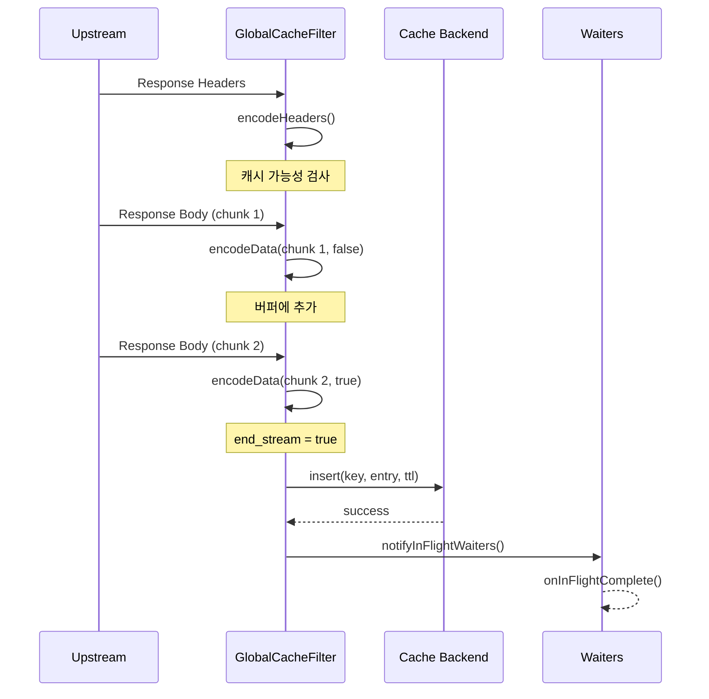

---

## 7.2 encodeHeaders: 캐시 가능성 검사

```cpp
Http::FilterHeadersStatus GlobalCacheFilter::encodeHeaders(
    Http::ResponseHeaderMap& headers,
    bool end_stream) {
    
    // 1. 캐시 비활성화 - 패스스루
    if (!cache_enabled_) {
        return Http::FilterHeadersStatus::Continue;
    }
    
    // 2. 캐시 불가능한 요청이었으면 패스스루
    if (!cacheable_request_) {
        return Http::FilterHeadersStatus::Continue;
    }
    
    // 3. 캐시 히트/대기 상태면 패스스루
    if (state_ == FilterState::CacheHit || 
        state_ == FilterState::WaitingForUpstream) {
        return Http::FilterHeadersStatus::Continue;
    }
    
    // 4. 응답 캐시 가능성 검사
    cacheable_response_ = isCacheableResponse(headers);
    if (!cacheable_response_) {
        // Owner인 경우 대기자에게 실패 통지
        if (owns_in_flight_) {
            notifyInFlightWaiters(in_flight_key_, nullptr);
            owns_in_flight_ = false;
        }
        state_ = FilterState::CacheMiss;
        return Http::FilterHeadersStatus::Continue;
    }
    
    // 5. 캐싱 시작
    state_ = FilterState::Caching;
    
    // 6. 헤더 복사본 저장
    response_headers_ = Http::ResponseHeaderMapImpl::create();
    headers.iterate([this](const Http::HeaderEntry& header) 
        -> Http::HeaderMap::Iterate {
        response_headers_->addCopy(
            Http::LowerCaseString(std::string(header.key().getStringView())),
            std::string(header.value().getStringView()));
        return Http::HeaderMap::Iterate::Continue;
    });
    
    // 7. 바디 없이 완료되는 경우 (204 No Content 등)
    if (end_stream) {
        saveEmptyBodyResponse();
    }
    
    // 8. 캐시 미스 표시 헤더 추가
    headers.addCopy(Http::LowerCaseString("x-cache"), "MISS");
    
    return Http::FilterHeadersStatus::Continue;
}
```

### 캐시 가능성 검사 상세

```cpp
bool GlobalCacheFilter::isCacheableResponse(
    const Http::ResponseHeaderMap& headers) const {
    
    // 상태 코드 확인 (기본: 200-299)
    const auto status = Http::Utility::getResponseStatus(headers);
    if (!config_->allowedStatusCodes().contains(status)) {
        return false;
    }
    
    // Set-Cookie 헤더 확인
    if (config_->skipIfResponseHasSetCookie() &&
        !headers.get(Http::Headers::get().SetCookie).empty()) {
        return false;  // 개인화된 응답, 캐시 불가
    }
    
    // Cache-Control 헤더 확인
    if (config_->skipIfResponseHasCacheControl() &&
        !headers.get(Http::CustomHeaders::get().CacheControl).empty()) {
        return false;  // 원본이 캐시 정책 지정, 존중
    }
    
    return true;
}
```

---

## 7.3 encodeData: 바디 버퍼링

```cpp
Http::FilterDataStatus GlobalCacheFilter::encodeData(
    Buffer::Instance& data,
    bool end_stream) {
    
    // 캐시 비활성화/불가능 - 패스스루
    if (!cache_enabled_ || !cacheable_request_ || !cacheable_response_) {
        return Http::FilterDataStatus::Continue;
    }
    
    // 캐시 히트/대기 상태 - 패스스루
    if (state_ == FilterState::CacheHit || 
        state_ == FilterState::WaitingForUpstream) {
        return Http::FilterDataStatus::Continue;
    }
    
    // 바디 버퍼링
    uint64_t length = data.length();
    if (length > 0) {
        // 크기 제한 확인 (기본: 1MB)
        if (buffered_body_.length() + length > kMaxCachedResponseBytes) {
            // 너무 큼 - 캐싱 포기
            cacheable_response_ = false;
            buffered_body_.drain(buffered_body_.length());  // 버퍼 비우기
            response_headers_.reset();
            
            if (owns_in_flight_) {
                notifyInFlightWaiters(in_flight_key_, nullptr);
                owns_in_flight_ = false;
            }
            return Http::FilterDataStatus::Continue;
        }
        
        // 버퍼에 추가
        buffered_body_.add(data);
    }
    
    // 스트림 완료 시 캐시 저장
    if (end_stream && response_headers_) {
        saveCacheEntry();
    }
    
    return Http::FilterDataStatus::Continue;
}
```

---

## 7.4 메모리 관리: kMaxCachedResponseBytes

```cpp
static constexpr size_t kMaxCachedResponseBytes = 1024 * 1024;  // 1MB
```

### 왜 제한이 필요한가?

1. **메모리 고갈 방지**: 100MB 응답을 100개 캐싱하면 10GB
2. **버퍼 복사 비용**: 큰 응답은 복사 비용이 큼
3. **캐시 효율**: 큰 응답은 캐시 적중률이 낮음

### 제한 초과 시 동작

```mermaid
flowchart TD
    A[데이터 도착] --> B{현재 버퍼 + 새 데이터 > 1MB?}
    B -->|No| C[버퍼에 추가]
    B -->|Yes| D[캐싱 포기]
    D --> E[버퍼 비우기]
    E --> F[대기자 통지 nullptr]
    C --> G{end_stream?}
    G -->|No| H[다음 청크 대기]
    G -->|Yes| I[캐시 저장]
```

---

## 7.5 캐시 저장 트리거

```cpp
void GlobalCacheFilter::saveCacheEntry() {
    // 만료 시간 계산
    auto expiration = std::chrono::steady_clock::now() + effective_default_ttl_;
    
    // CacheEntry 생성
    auto cached_entry = std::make_shared<CacheEntry>(
        std::move(buffered_body_),      // 소유권 이전
        std::move(response_headers_),    // 소유권 이전
        expiration
    );
    
    // 캐시 백엔드에 저장
    const std::string cache_key_copy = cache_key_;  // 람다용 복사
    
    cache_backend_->insert(
        cache_key_,
        cached_entry,
        effective_default_ttl_,
        [cache_key_copy, cached_entry](bool success) {
            if (success) {
                ENVOY_LOG(info, "global_cache: cached response ({} bytes) "
                         "for key: {}", cached_entry->body.length(), cache_key_copy);
                notifyInFlightWaiters(cache_key_copy, cached_entry);
            } else {
                ENVOY_LOG(warn, "global_cache: failed to cache entry "
                         "for key: {}", cache_key_copy);
                notifyInFlightWaiters(cache_key_copy, nullptr);
            }
        }
    );
}
```

### std::move의 중요성

```cpp
// ❌ 비효율적 (복사)
auto cached_entry = std::make_shared<CacheEntry>(
    buffered_body_,      // 1MB 복사!
    response_headers_,   // 복사!
    expiration
);

// ✅ 효율적 (이동)
auto cached_entry = std::make_shared<CacheEntry>(
    std::move(buffered_body_),      // 포인터만 이동
    std::move(response_headers_),   // 포인터만 이동
    expiration
);
```

이동 후 원본 변수는 **빈 상태**가 됩니다 (더 이상 사용하면 안 됨).

---

## 7.6 바디 없는 응답 처리

HTTP 204, 304 등은 바디가 없습니다.

```cpp
void GlobalCacheFilter::saveEmptyBodyResponse() {
    auto expiration = std::chrono::steady_clock::now() + effective_default_ttl_;
    
    Buffer::OwnedImpl empty_body;  // 빈 버퍼
    
    auto cached_entry = std::make_shared<CacheEntry>(
        std::move(empty_body),
        std::move(response_headers_),
        expiration
    );
    
    cache_backend_->insert(
        cache_key_,
        cached_entry,
        effective_default_ttl_,
        [cache_key = cache_key_, cached_entry](bool success) {
            if (success) {
                ENVOY_LOG(info, "global_cache: cached empty response for key: {}",
                         cache_key);
                notifyInFlightWaiters(cache_key, cached_entry);
            } else {
                notifyInFlightWaiters(cache_key, nullptr);
            }
        }
    );
}
```

---

## 7.7 x-cache 헤더

응답에 추가되는 캐시 상태 헤더:

| 값 | 의미 |
|----|------|
| `HIT` | 캐시에서 제공됨 |
| `HIT-COALESCED` | Single-flight로 공유됨 |
| `MISS` | 업스트림에서 가져와서 캐시됨 |

### 추가 위치

```cpp
// 캐시 히트 시
void serveCachedResponse(...) {
    response_headers->addCopy(Http::LowerCaseString("x-cache"), cache_status);
    // cache_status = "HIT" 또는 "HIT-COALESCED"
}

// 캐시 미스 시 (업스트림 응답)
Http::FilterHeadersStatus encodeHeaders(...) {
    headers.addCopy(Http::LowerCaseString("x-cache"), "MISS");
}
```

---

## 7.8 전체 흐름 정리

```mermaid
flowchart TD
    subgraph Request["요청 경로"]
        A[decodeHeaders] --> B{캐시 조회}
        B -->|HIT| C[serveCachedResponse]
        B -->|MISS| D{Single-flight?}
        D -->|대기| E[WaitingForUpstream]
        D -->|Owner| F[Upstream 요청]
    end
    
    subgraph Response["응답 경로"]
        F --> G[encodeHeaders]
        G --> H{캐시 가능?}
        H -->|No| I[대기자 통지 nullptr]
        H -->|Yes| J[헤더 저장]
        J --> K[encodeData]
        K --> L{크기 초과?}
        L -->|Yes| M[캐싱 포기]
        L -->|No| N[버퍼 추가]
        N --> O{end_stream?}
        O -->|No| K
        O -->|Yes| P[cache.insert]
        P --> Q[대기자 통지]
    end
    
    E -->|완료 통지| R[onInFlightComplete]
    R -->|성공| C
    R -->|실패| F
```

---

## 7.9 에러 케이스 처리

### 업스트림 에러 (5xx)

```cpp
bool isCacheableResponse(...) {
    const auto status = Http::Utility::getResponseStatus(headers);
    // 기본: 200-299만 캐시
    if (!config_->allowedStatusCodes().contains(status)) {
        return false;  // 500, 502, 503 등은 캐시 안 함
    }
}
```

### 캐시 백엔드 실패

```cpp
cache_backend_->insert(..., [](bool success) {
    if (!success) {
        // 저장 실패 - 대기자에게 nullptr 통지
        notifyInFlightWaiters(cache_key, nullptr);
        // 대기자들은 직접 upstream으로 감
    }
});
```

### 요청 중단 (클라이언트 disconnect)

`onDestroy()`에서 처리:
```cpp
void onDestroy() {
    if (owns_in_flight_) {
        notifyInFlightWaiters(in_flight_key_, nullptr);
    }
}
```

---

## 7.10 성능 고려사항

### 버퍼 복사 최소화

```cpp
// 버퍼 추가 시 zero-copy (가능한 경우)
buffered_body_.add(data);  // data의 슬라이스를 참조

// 캐시 저장 시 이동
std::move(buffered_body_);  // 복사 없이 소유권 이전
```

### 헤더 반복 비용

```cpp
// 헤더는 반복 접근이 필요 (복사 불가피)
headers.iterate([this](const Http::HeaderEntry& header) {
    response_headers_->addCopy(...);  // 복사
});
```

### 콜백 컨텍스트 최소화

```cpp
// 람다에 필요한 것만 캡처
[cache_key_copy, cached_entry](bool success) { ... }
// this를 캡처하지 않음 - 콜백 시점에 Filter가 파괴되었을 수 있음
```

---

## 7.11 요약

| 메서드 | 역할 | 핵심 동작 |
|--------|------|----------|
| `encodeHeaders` | 응답 헤더 처리 | 캐시 가능성 검사, 헤더 복사 |
| `encodeData` | 응답 바디 처리 | 버퍼링, 크기 제한 |
| `saveCacheEntry` | 캐시 저장 | insert 호출, 대기자 통지 |

**메모리 관리**:
- `kMaxCachedResponseBytes` (1MB) 제한
- `std::move`로 복사 최소화
- 초과 시 버퍼 비우고 캐싱 포기

**대기자 통지**:
- 성공: `CacheEntry` 전달 → `HIT-COALESCED`
- 실패: `nullptr` 전달 → 직접 upstream

---

## 7.12 다음 장 예고

Part II가 완료되었습니다. Part III에서는 **캐시 백엔드 구현**을 상세히 분석합니다:
- 8장: `CacheBackend` 추상 인터페이스
- 9장: Local LRU 캐시 구현
- 10장: Redis 비동기 캐시 구현
- 11장: Tiered 캐시 (L1 + L2)
- 12장: 직렬화 포맷

---

> **체크리스트 ✓**
> - [ ] `encodeHeaders`의 역할을 설명할 수 있다
> - [ ] 캐시 가능 응답의 조건을 안다 (상태 코드, Set-Cookie, Cache-Control)
> - [ ] `kMaxCachedResponseBytes` 제한의 이유를 안다
> - [ ] `std::move`가 왜 중요한지 설명할 수 있다
> - [ ] `x-cache` 헤더의 세 가지 값을 구분할 수 있다
> - [ ] 캐시 저장 후 대기자 통지 흐름을 이해한다

---

# Chapter 8. CacheBackend 인터페이스: 추상화의 힘

> **이 장의 목표**: 캐시 백엔드 추상화 인터페이스를 이해하고, C++에서 다형성(Polymorphism)이 어떻게 동작하는지 배웁니다.

---

## 8.1 왜 인터페이스가 필요한가?

`GlobalCacheFilter`는 **어떤 캐시**를 사용하는지 몰라도 됩니다:

```mermaid
classDiagram
    class CacheBackend {
        <<interface>>
        +lookup(key, callback)
        +insert(key, entry, ttl, callback)
        +remove(key)
        +name() string
    }
    
    class LocalCache {
        +lookup(key, callback)
        +insert(key, entry, ttl, callback)
        +remove(key)
        +name() "local_lru"
    }
    
    class RedisCache {
        +lookup(key, callback)
        +insert(key, entry, ttl, callback)
        +remove(key)
        +name() "redis_cache"
    }
    
    class TieredCache {
        +lookup(key, callback)
        +insert(key, entry, ttl, callback)
        +remove(key)
        +name() "tiered"
    }
    
    CacheBackend <|.. LocalCache
    CacheBackend <|.. RedisCache
    CacheBackend <|.. TieredCache
    
    class GlobalCacheFilter {
        -cache_backend_: CacheBackendSharedPtr
    }
    GlobalCacheFilter --> CacheBackend
```

**장점**:
- 필터 코드 수정 없이 백엔드 교체 가능
- 테스트 시 Mock 백엔드 주입 가능
- 새로운 백엔드 추가 용이

---

## 8.2 인터페이스 정의

```cpp
// cache_backend.h
class CacheBackend {
public:
    virtual ~CacheBackend() = default;
    
    // 콜백 타입 정의
    using LookupCallback = std::function<void(CacheLookupResult&& result)>;
    using InsertCallback = std::function<void(bool success)>;
    
    // 순수 가상 함수 (= 0)
    virtual void lookup(const std::string& key, LookupCallback callback) PURE;
    
    virtual void insert(const std::string& key, 
                       std::shared_ptr<CacheEntry> entry,
                       std::chrono::seconds ttl, 
                       InsertCallback callback) PURE;
    
    virtual void remove(const std::string& key) PURE;
    
    virtual std::string name() const PURE;
};
```

### 핵심 포인트

**1. `virtual` 키워드**
```cpp
virtual void lookup(...) PURE;
```
- 자식 클래스가 **재정의(override)** 가능
- `PURE` = `= 0` = 반드시 구현해야 함

**2. 가상 소멸자**
```cpp
virtual ~CacheBackend() = default;
```
- 부모 포인터로 삭제할 때 자식 소멸자 호출 보장
- 없으면 **메모리 누수** 발생

**3. 콜백 기반 비동기 API**
```cpp
using LookupCallback = std::function<void(CacheLookupResult&& result)>;
```
- 모든 백엔드가 비동기 인터페이스 제공
- LocalCache는 동기지만 콜백을 즉시 호출

---

## 8.3 Go 인터페이스와 비교

### Go 인터페이스 (암시적)

```go
type CacheBackend interface {
    Lookup(key string) (*CacheEntry, error)
    Insert(key string, entry *CacheEntry, ttl time.Duration) error
    Remove(key string)
    Name() string
}

// LocalCache는 자동으로 CacheBackend 구현
type LocalCache struct { ... }

func (c *LocalCache) Lookup(key string) (*CacheEntry, error) { ... }
// ...
```

### C++ 인터페이스 (명시적)

```cpp
class CacheBackend {
    virtual void lookup(...) = 0;
    // ...
};

// 명시적으로 상속 선언 필요
class LocalCache : public CacheBackend {
    void lookup(...) override { ... }
    // ...
};
```

| 측면 | Go | C++ |
|------|-----|-----|
| 상속 선언 | 불필요 | `class A : public B` 필요 |
| 인터페이스 만족 | 메서드만 맞으면 됨 | 명시적 상속 필요 |
| vtable 비용 | 없음 (fat pointer) | 있음 (간접 호출) |
| 컴파일 타임 검사 | 느슨 | 엄격 |

---

## 8.4 CacheEntry와 결과 타입

### CacheEntry 구조체

```cpp
struct CacheEntry {
    Buffer::OwnedImpl body;                           // 응답 바디
    Http::ResponseHeaderMapPtr headers;               // 응답 헤더
    std::chrono::steady_clock::time_point expiration_time;  // 만료 시간
    
    CacheEntry(Buffer::OwnedImpl body_data, 
               Http::ResponseHeaderMapPtr header_map,
               std::chrono::steady_clock::time_point exp_time)
        : body(std::move(body_data)), 
          headers(std::move(header_map)), 
          expiration_time(exp_time) {}
};
```

### 조회 결과 타입

```cpp
enum class CacheLookupStatus {
    Hit,   // 캐시 히트
    Miss,  // 캐시 미스
    Error  // 백엔드 에러
};

struct CacheLookupResult {
    CacheLookupStatus status;
    std::shared_ptr<CacheEntry> entry;  // Hit일 때만 유효
    
    CacheLookupResult(CacheLookupStatus s, 
                      std::shared_ptr<CacheEntry> e = nullptr)
        : status(s), entry(std::move(e)) {}
};
```

---

## 8.5 콜백 계약

백엔드 구현자가 지켜야 할 규칙:

### 1. 콜백은 반드시 호출

```cpp
// ✅ 올바름
void LocalCache::lookup(..., LookupCallback callback) {
    // ... 조회 ...
    callback(CacheLookupResult{status, entry});  // 항상 호출
}

// ❌ 틀림
void BadCache::lookup(..., LookupCallback callback) {
    if (error) {
        return;  // 콜백 미호출! Filter가 영원히 대기
    }
    callback(...);
}
```

### 2. 콜백은 한 번만 호출

```cpp
// ✅ 올바름
void LocalCache::lookup(..., LookupCallback callback) {
    callback(result);
}

// ❌ 틀림
void BadCache::lookup(..., LookupCallback callback) {
    callback(result1);
    callback(result2);  // 두 번 호출! 정의되지 않은 동작
}
```

### 3. 에러는 콜백으로 전달

```cpp
// ✅ 올바름
void RedisCache::lookup(..., LookupCallback callback) {
    try {
        // ...
    } catch (...) {
        callback(CacheLookupResult{CacheLookupStatus::Error});
    }
}

// ❌ 틀림 (예외 던지기)
void BadCache::lookup(...) {
    throw std::runtime_error("Redis error");  // Envoy 크래시!
}
```

---

## 8.6 타입 별칭과 스마트 포인터

```cpp
using CacheBackendPtr = std::unique_ptr<CacheBackend>;
using CacheBackendSharedPtr = std::shared_ptr<CacheBackend>;
```

### 사용 패턴

```cpp
// 필터 설정에서 백엔드 공유
class GlobalCacheFilterConfig {
    CacheBackendSharedPtr cache_backend_;  // 여러 필터가 공유
};

// 필터 인스턴스에서 참조
class GlobalCacheFilter {
    CacheBackendSharedPtr cache_backend_;  // 설정에서 복사
};
```

**왜 `shared_ptr`인가?**

- 설정 객체는 여러 워커 스레드에서 공유
- 각 필터 인스턴스도 백엔드 참조 필요
- `unique_ptr`로는 공유 불가

---

## 8.7 PURE 매크로

Envoy 코드에서 `= 0` 대신 `PURE`를 사용합니다:

```cpp
// envoy/common/pure.h
#define PURE = 0
```

가독성을 위한 것으로, 의미는 동일합니다:
```cpp
virtual void lookup(...) PURE;      // Envoy 스타일
virtual void lookup(...) = 0;       // 표준 C++ 스타일
```

---

## 8.8 override 키워드

자식 클래스에서 부모의 가상 함수를 재정의할 때:

```cpp
class LocalCache : public CacheBackend {
    // override: 부모의 가상 함수를 재정의함을 명시
    void lookup(const std::string& key, LookupCallback callback) override;
};
```

**장점**:
- 오타 방지 (부모에 없는 함수면 컴파일 에러)
- 가독성 향상

```cpp
// ❌ 오타 - override 없으면 컴파일됨 (새 함수로 취급)
void lockup(...) { ... }

// ✅ override 있으면 컴파일 에러
void lockup(...) override { ... }  // 에러: 부모에 lockup() 없음
```

---

## 8.9 백엔드 구현 비교

| 특성 | LocalCache | RedisCache | TieredCache |
|------|------------|------------|-------------|
| 저장 위치 | 메모리 (워커별) | Redis 서버 | L1: 메모리, L2: Redis |
| 동기/비동기 | 동기 | 비동기 | 혼합 |
| 공유 범위 | 워커 내 | 전체 클러스터 | 혼합 |
| 지연시간 | 마이크로초 | 밀리초 | L1: μs, L2: ms |
| TTL 관리 | 내부 만료 체크 | Redis SETEX | 각각 |
| 용량 제한 | max_entries, max_bytes | Redis 메모리 | 각각 |

---

## 8.10 다형성 동작 원리 (vtable)

C++에서 가상 함수 호출은 **vtable**을 통해 이루어집니다:

```mermaid
graph TD
    subgraph Filter["GlobalCacheFilter"]
        P[cache_backend_<br/>CacheBackendSharedPtr]
    end
    
    subgraph LocalCacheObj["LocalCache 객체"]
        V1[vptr] --> VT1
        D1[data...]
    end
    
    subgraph VTable1["LocalCache vtable"]
        VT1[lookup → LocalCache::lookup<br/>insert → LocalCache::insert<br/>...]
    end
    
    P --> LocalCacheObj
```

```cpp
// 컴파일러가 보는 것
cache_backend_->lookup(key, callback);

// 실제 실행
(*cache_backend_->vptr->lookup)(cache_backend_, key, callback);
```

**비용**:
- 간접 호출 1회 (포인터 역참조)
- 보통 무시할 수준 (~1 나노초)

---

## 8.11 요약

**인터페이스 정의 (cache_backend.h)**:
```cpp
class CacheBackend {
    virtual ~CacheBackend() = default;
    virtual void lookup(..., LookupCallback) PURE;
    virtual void insert(..., InsertCallback) PURE;
    virtual void remove(...) PURE;
    virtual std::string name() const PURE;
};
```

**핵심 개념**:
- `virtual` + `PURE`: 순수 가상 함수 (인터페이스)
- `override`: 재정의 명시
- 가상 소멸자: 메모리 누수 방지
- 콜백 계약: 반드시 한 번, 에러도 콜백으로

**Go와의 차이**:
- C++은 명시적 상속 필요
- 컴파일 타임에 인터페이스 만족 검사
- vtable을 통한 동적 디스패치

---

## 8.12 다음 장 예고

다음 장에서는 첫 번째 구현체인 **LocalCache (LRU)**를 분석합니다:
- 이중 연결 리스트 + 해시맵 조합
- 엔트리 수/바이트 제한
- TTL 만료 처리
- 스레드 안전성

---

> **체크리스트 ✓**
> - [ ] `CacheBackend` 인터페이스의 메서드들을 설명할 수 있다
> - [ ] `virtual`, `PURE`, `override`의 의미를 안다
> - [ ] 가상 소멸자가 왜 필요한지 설명할 수 있다
> - [ ] Go 인터페이스와 C++ 인터페이스의 차이를 안다
> - [ ] 콜백 계약(반드시 한 번 호출, 에러도 콜백)을 이해한다

---

# Chapter 9. Local LRU 캐시: 메모리 자료구조의 정석

> **이 장의 목표**: O(1) LRU 캐시 구현을 이해하고, C++에서의 메모리 관리와 스레드 안전성을 배웁니다.

---

## 9.1 LRU 캐시의 요구사항

**LRU (Least Recently Used)**: 가장 오래 사용하지 않은 항목부터 제거

### 필요한 연산과 복잡도

| 연산 | 설명 | 목표 복잡도 |
|------|------|------------|
| `lookup(key)` | 키로 조회 + 최근 사용 표시 | O(1) |
| `insert(key, value)` | 삽입 + 필요시 eviction | O(1) |
| `remove(key)` | 키로 삭제 | O(1) |
| `evict()` | 가장 오래된 항목 제거 | O(1) |

### 자료구조 선택

**해시맵만 사용**: 조회 O(1), 하지만 LRU 순서 유지 불가
**리스트만 사용**: LRU 순서 유지 가능, 하지만 조회 O(n)
**해시맵 + 이중 연결 리스트**: 둘 다 O(1)!

```mermaid
graph LR
    subgraph HashMap["Hash Map"]
        K1["key1"] --> N1
        K2["key2"] --> N2
        K3["key3"] --> N3
    end
    
    subgraph DLinkedList["Doubly Linked List (MRU → LRU)"]
        N1[Node 1] <--> N2[Node 2] <--> N3[Node 3]
        HEAD --> N1
        N3 --> TAIL
    end
```

---

## 9.2 노드 구조

```cpp
struct LruNode {
    std::string key;
    std::shared_ptr<CacheEntry> entry;
    
    LruNode* prev{nullptr};  // 이전 노드 (더 최근)
    LruNode* next{nullptr};  // 다음 노드 (더 오래됨)
    size_t size_bytes{0};    // 메모리 크기 추정치
    
    LruNode(std::string k, std::shared_ptr<CacheEntry> e, size_t size)
        : key(std::move(k)), entry(std::move(e)), size_bytes(size) {}
};
```

### raw pointer를 쓰는 이유

`prev`/`next`에 `shared_ptr`를 쓰면:
- 순환 참조 발생 (A → B → A)
- 노드 삭제 시 자동 해제 안 됨

`weak_ptr`는 오버킬 - 노드의 수명은 해시맵이 관리하므로 raw pointer로 충분

---

## 9.3 LocalCache 클래스 구조

```cpp
class LocalCache : public CacheBackend {
private:
    mutable absl::Mutex mutex_;
    
    // 해시맵: key → node (소유권)
    absl::flat_hash_map<std::string, std::unique_ptr<LruNode>> cache_
        ABSL_GUARDED_BY(mutex_);
    
    // 이중 연결 리스트 양 끝
    LruNode* head_ ABSL_GUARDED_BY(mutex_){nullptr};  // MRU
    LruNode* tail_ ABSL_GUARDED_BY(mutex_){nullptr};  // LRU
    
    // 제한 및 현재 상태
    const size_t max_entries_;
    const size_t max_bytes_;
    size_t current_entries_ ABSL_GUARDED_BY(mutex_){0};
    size_t current_bytes_ ABSL_GUARDED_BY(mutex_){0};
};
```

### ABSL_GUARDED_BY

Thread Safety Annotation - 컴파일러가 락 사용 검증:

```cpp
// ✅ 올바름 - mutex를 잠그고 접근
void foo() {
    absl::MutexLock lock(&mutex_);
    cache_[key] = ...;
}

// ❌ 컴파일 경고 - mutex 없이 접근
void bar() {
    cache_[key] = ...;  // Warning: accessing guarded variable without lock
}
```

---

## 9.4 lookup 구현

```cpp
void LocalCache::lookup(const std::string& key, LookupCallback callback) {
    std::shared_ptr<CacheEntry> entry;
    CacheLookupStatus status = CacheLookupStatus::Miss;
    
    {
        absl::MutexLock lock(&mutex_);
        
        auto it = cache_.find(key);
        if (it == cache_.end()) {
            // 캐시 미스
        } else {
            LruNode* node = it->second.get();
            
            // TTL 만료 체크
            if (isExpired(*node->entry)) {
                // 만료됨 - 제거
                removeNode(node);
                cache_.erase(it);
                current_entries_--;
                current_bytes_ -= node->size_bytes;
            } else {
                // 캐시 히트 - MRU로 이동
                moveToFront(node);
                status = CacheLookupStatus::Hit;
                entry = node->entry;
            }
        }
    }  // mutex 해제
    
    // 콜백은 mutex 밖에서 호출 (데드락 방지)
    callback(CacheLookupResult{status, entry});
}
```

### 콜백 외부 호출의 중요성

```cpp
// ❌ 위험 - 데드락 가능
void lookup(..., LookupCallback callback) {
    absl::MutexLock lock(&mutex_);
    // ...
    callback(result);  // 콜백이 다시 lookup을 호출하면?
}

// ✅ 안전
void lookup(..., LookupCallback callback) {
    {
        absl::MutexLock lock(&mutex_);
        // ...
    }
    callback(result);  // mutex 해제 후 호출
}
```

---

## 9.5 insert 구현

```cpp
void LocalCache::insert(const std::string& key, 
                        std::shared_ptr<CacheEntry> entry,
                        std::chrono::seconds ttl, 
                        InsertCallback callback) {
    bool success = true;
    
    {
        absl::MutexLock lock(&mutex_);
        
        // 크기 계산
        size_t entry_size = calculateEntrySize(*entry);
        
        // 너무 큰 항목은 거부
        if (entry_size > max_bytes_) {
            success = false;
        } else {
            auto it = cache_.find(key);
            
            if (it != cache_.end()) {
                // 기존 항목 업데이트
                LruNode* existing = it->second.get();
                current_bytes_ -= existing->size_bytes;
                
                existing->entry = entry;
                existing->size_bytes = entry_size;
                
                current_bytes_ += entry_size;
                moveToFront(existing);
            } else {
                // 새 항목 추가
                auto new_node = std::make_unique<LruNode>(key, entry, entry_size);
                LruNode* node_ptr = new_node.get();
                
                cache_.emplace(key, std::move(new_node));
                current_entries_++;
                current_bytes_ += entry_size;
                
                addToFront(node_ptr);
                
                // 용량 초과 시 eviction
                evictIfNeeded();
            }
        }
    }
    
    callback(success);
}
```

---

## 9.6 리스트 조작 함수들

### moveToFront (최근 사용 표시)

```cpp
void LocalCache::moveToFront(LruNode* node) {
    if (node == head_) {
        return;  // 이미 맨 앞
    }
    
    // 현재 위치에서 분리
    if (node->prev) node->prev->next = node->next;
    if (node->next) node->next->prev = node->prev;
    if (node == tail_) tail_ = node->prev;
    
    // 맨 앞에 삽입
    node->prev = nullptr;
    node->next = head_;
    if (head_) head_->prev = node;
    head_ = node;
    
    if (!tail_) tail_ = node;
}
```

### addToFront (새 노드 추가)

```cpp
void LocalCache::addToFront(LruNode* node) {
    node->prev = nullptr;
    node->next = head_;
    
    if (head_) head_->prev = node;
    head_ = node;
    
    if (!tail_) tail_ = node;
}
```

### removeNode (노드 분리)

```cpp
void LocalCache::removeNode(LruNode* node) {
    if (node->prev) node->prev->next = node->next;
    if (node->next) node->next->prev = node->prev;
    
    if (node == head_) head_ = node->next;
    if (node == tail_) tail_ = node->prev;
    
    node->prev = nullptr;
    node->next = nullptr;
}
```

---

## 9.7 Eviction (퇴출)

```cpp
void LocalCache::evictIfNeeded() {
    // 엔트리 수 또는 바이트 제한 초과 시 LRU부터 제거
    while ((current_entries_ > max_entries_ || 
            current_bytes_ > max_bytes_) && 
           tail_ != nullptr) {
        
        LruNode* victim = tail_;
        
        // 해시맵에서 제거
        cache_.erase(victim->key);
        current_entries_--;
        current_bytes_ -= victim->size_bytes;
        
        // 리스트에서 제거
        removeNode(victim);
        // unique_ptr가 cache_에서 erase될 때 노드 자동 삭제
    }
}
```

### 제한 종류

```yaml
cache_backend:
  local:
    max_entries: 10000       # 최대 항목 수
    max_bytes: 104857600     # 100MB
```

둘 중 하나라도 초과하면 eviction 발생.

---

## 9.8 메모리 크기 계산

```cpp
size_t LocalCache::calculateEntrySize(const CacheEntry& entry) {
    size_t size = 0;
    
    // 바디 크기
    size += entry.body.length();
    
    // 헤더 크기 (대략)
    entry.headers->iterate(
        [&size](const Http::HeaderEntry& header) -> Http::HeaderMap::Iterate {
            size += header.key().getStringView().size();
            size += header.value().getStringView().size();
            return Http::HeaderMap::Iterate::Continue;
        });
    
    // 오버헤드 추정 (포인터, 메타데이터 등)
    size += kEstimatedHeaderOverhead;  // 1024 bytes
    
    return size;
}
```

### 정확한 계산이 어려운 이유

- `std::string`의 Small String Optimization
- `shared_ptr`의 컨트롤 블록
- 메모리 할당자의 정렬 패딩
- 헤더 맵 내부 구조

→ 보수적으로 추정 (실제보다 약간 크게)

---

## 9.9 TTL 만료 처리

```cpp
bool LocalCache::isExpired(const CacheEntry& entry) const {
    return std::chrono::steady_clock::now() >= entry.expiration_time;
}
```

### 만료 체크 시점

**Lazy Expiration**: 조회할 때만 체크
- 장점: 백그라운드 스레드 불필요
- 단점: 만료된 항목이 메모리에 남아있을 수 있음

### Proactive Expiration (미구현)

```cpp
// 백그라운드 스레드에서 주기적으로
void cleanupExpired() {
    absl::MutexLock lock(&mutex_);
    for (auto it = cache_.begin(); it != cache_.end(); ) {
        if (isExpired(*it->second->entry)) {
            it = cache_.erase(it);
        } else {
            ++it;
        }
    }
}
```

---

## 9.10 스레드 안전성

### Mutex 선택: absl::Mutex vs std::mutex

| 특성 | absl::Mutex | std::mutex |
|------|-------------|------------|
| 성능 | 더 빠름 (spin + park) | 표준 |
| 디버깅 | Annotation 지원 | 제한적 |
| Read/Write Lock | 지원 | std::shared_mutex 필요 |

### 현재 구현의 한계

**전체 캐시에 하나의 Mutex**:
- 장점: 구현 단순
- 단점: 높은 경합 시 병목

### 개선 방안 (미구현)

**Sharded Lock**:
```cpp
class ShardedCache {
    static constexpr int kShards = 16;
    struct Shard {
        absl::Mutex mutex;
        absl::flat_hash_map<...> cache;
        // ...
    };
    Shard shards_[kShards];
    
    int shardIndex(const std::string& key) {
        return std::hash<std::string>{}(key) % kShards;
    }
};
```

---

## 9.11 Go의 groupcache와 비교

```go
// Go groupcache의 LRU
type Cache struct {
    MaxBytes int64
    ll       *list.List
    cache    map[string]*list.Element
    mu       sync.Mutex
}

func (c *Cache) Get(key string) (value interface{}, ok bool) {
    c.mu.Lock()
    defer c.mu.Unlock()
    if ele, ok := c.cache[key]; ok {
        c.ll.MoveToFront(ele)
        return ele.Value, true
    }
    return nil, false
}
```

**차이점**:
- Go: `list.List` 표준 라이브러리 사용
- C++: 직접 이중 연결 리스트 구현 (성능 최적화)
- Go: `defer`로 unlock
- C++: RAII (`MutexLock`)로 unlock

---

## 9.12 요약

**자료구조**:
```
HashMap<key, unique_ptr<Node>>  +  DoublyLinkedList<Node>
          ↓                              ↓
       O(1) lookup                  O(1) LRU eviction
```

**핵심 연산**:
- `lookup`: 해시맵 조회 + TTL 체크 + moveToFront
- `insert`: 해시맵 삽입 + addToFront + evictIfNeeded
- `evictIfNeeded`: tail부터 제거

**스레드 안전성**:
- `absl::Mutex`로 전체 캐시 보호
- 콜백은 mutex 외부에서 호출

**메모리 관리**:
- `max_entries` + `max_bytes` 이중 제한
- 크기 추정은 보수적으로

---

## 9.13 다음 장 예고

다음 장에서는 **Redis 캐시**를 분석합니다:
- Envoy Redis 클라이언트 사용
- 비동기 GET/SETEX/DEL
- `dispatcher.post()`로 스레드 안전 콜백
- 직렬화/역직렬화

---

> **체크리스트 ✓**
> - [ ] LRU 캐시가 해시맵 + 이중 연결 리스트로 구현되는 이유를 안다
> - [ ] `moveToFront`, `addToFront`, `removeNode`의 동작을 이해한다
> - [ ] `evictIfNeeded`가 언제 호출되는지 안다
> - [ ] 콜백을 mutex 외부에서 호출해야 하는 이유를 안다
> - [ ] `ABSL_GUARDED_BY`의 역할을 안다

---

# Chapter 10. Redis 캐시: 비동기 네트워크의 세계

> **이 장의 목표**: Envoy Redis 클라이언트를 사용한 비동기 캐시 구현을 이해하고, 콜백 안전성과 요청 수명 관리를 배웁니다.

---

## 10.1 Redis 캐시의 특징

| 특성 | LocalCache | RedisCache |
|------|------------|------------|
| 저장 위치 | 프로세스 메모리 | 외부 Redis 서버 |
| 지연시간 | ~1μs | ~1ms |
| 공유 범위 | 워커 내 | 전체 클러스터 |
| 가용성 | 프로세스 종료 시 손실 | 독립적 |
| 동기/비동기 | 동기 콜백 | 비동기 콜백 |

---

## 10.2 Redis 명령어 매핑

| 연산 | Redis 명령 | 설명 |
|------|-----------|------|
| lookup | `GET key` | 키 조회 |
| insert | `SETEX key ttl value` | TTL과 함께 저장 |
| remove | `DEL key` | 키 삭제 |

---

## 10.3 RedisCache 클래스 구조

```cpp
class RedisCache : public CacheBackend {
private:
    Upstream::ClusterManager& cluster_manager_;
    ThreadLocal::Instance& tls_;
    ThreadLocal::TypedSlot<PendingList> pending_requests_;
    
    const std::string cluster_name_;      // "redis_cluster"
    const std::string key_prefix_;        // "envoy:gc:"
    const std::chrono::milliseconds op_timeout_;
    const bool enable_cluster_mode_;
    
    NetworkFilters::RedisProxy::ConnPool::InstanceSharedPtr conn_pool_;
};
```

---

## 10.4 비동기 GET 요청

```cpp
void RedisCache::lookup(const std::string& key, LookupCallback callback) {
    const std::string redis_key = buildRedisKey(key);  // prefix 추가
    
    // TLS pending list 가져오기
    auto* pending_list = getPendingList();
    if (!pending_list) {
        callback(CacheLookupResult{CacheLookupStatus::Miss});
        return;
    }
    
    // GET 명령 생성
    auto request = makeGetRequest(redis_key);
    
    // 콜백 핸들러 생성 (shared_ptr로 수명 관리)
    auto request_handler = std::make_shared<LookupRequest>(
        std::move(callback), tls_.dispatcher());
    
    // pending list에 추가 (수명 보장)
    auto request_base = std::static_pointer_cast<RequestBase>(request_handler);
    pending_list->pending_requests_.push_back(request_base);
    request_handler->setPending(pending_list, 
        std::prev(pending_list->pending_requests_.end()));
    
    // 비동기 요청 전송
    NetworkFilters::Common::Redis::Client::NoOpTransaction transaction;
    auto* pool_request = conn_pool_->makeRequest(
        redis_key, std::move(request), *request_handler, transaction);
    
    if (!pool_request) {
        request_handler->onFailure();
    }
}
```

---

## 10.5 요청 수명 관리

### 문제: 콜백 시점에 객체가 파괴되어 있으면?

```mermaid
sequenceDiagram
    participant F as Filter
    participant R as RedisCache
    participant P as ConnPool
    participant Redis as Redis Server

    F->>R: lookup(key, callback)
    R->>P: makeRequest()
    P->>Redis: GET key
    
    Note over F: 클라이언트 disconnect!
    Note over F: Filter 파괴됨
    
    Redis-->>P: Response
    P-->>R: onResponse()
    Note over R: 💥 callback 객체는?
```

### 해결: PendingList로 수명 보장

```cpp
struct PendingList : public ThreadLocal::ThreadLocalObject {
    std::list<std::shared_ptr<RequestBase>> pending_requests_;
};
```

- TLS에 저장 → 워커 스레드가 살아있는 동안 유지
- `shared_ptr`로 요청 객체 유지
- 응답 처리 후 리스트에서 제거

---

## 10.6 응답 처리와 dispatcher.post()

```cpp
void RedisCache::LookupRequest::onResponse(RespValuePtr&& value) {
    // shared_ptr로 this 유지
    auto self = shared_from_this();
    clearPending();  // pending list에서 제거
    
    // 응답 파싱
    if (value->type() == RespType::BulkString) {
        const std::string& serialized = value->asString();
        if (!serialized.empty()) {
            try {
                auto entry = CacheSerializer::deserialize(serialized);
                
                // dispatcher.post(): 원래 워커 스레드에서 콜백 실행
                dispatcher_.post([self, entry]() mutable {
                    self->callback_(CacheLookupResult{
                        CacheLookupStatus::Hit, entry});
                });
                return;
            } catch (...) {
                // 역직렬화 실패 → Miss로 처리
            }
        }
    }
    
    // Miss 또는 Error
    dispatcher_.post([self]() mutable {
        self->callback_(CacheLookupResult{CacheLookupStatus::Miss});
    });
}
```

### dispatcher.post()가 필요한 이유

```mermaid
sequenceDiagram
    participant W1 as Worker Thread 1<br/>(요청 발신)
    participant IO as I/O Thread<br/>(Redis 응답 수신)
    participant W1_2 as Worker Thread 1<br/>(콜백 실행)

    W1->>IO: makeRequest()
    Note over W1: 다른 요청 처리 중...
    
    IO->>IO: onResponse() 호출
    Note over IO: ⚠️ 여기는 I/O 스레드!
    
    IO->>W1_2: dispatcher.post(callback)
    Note over W1_2: ✅ 원래 워커에서 콜백 실행
```

**왜 중요한가?**
- Filter 객체는 특정 워커 스레드에 바인딩
- 다른 스레드에서 Filter 메서드 호출 → 경쟁 조건!
- `dispatcher.post()`로 올바른 스레드에서 실행 보장

---

## 10.7 SETEX 요청

```cpp
void RedisCache::insert(const std::string& key, 
                        std::shared_ptr<CacheEntry> entry,
                        std::chrono::seconds ttl, 
                        InsertCallback callback) {
    
    const std::string redis_key = buildRedisKey(key);
    
    // 직렬화
    std::string serialized_value;
    try {
        serialized_value = CacheSerializer::serialize(*entry);
    } catch (...) {
        tls_.dispatcher().post([callback = std::move(callback)]() mutable {
            callback(false);
        });
        return;
    }
    
    // SETEX 명령 생성
    auto request = makeSetexRequest(redis_key, serialized_value, ttl);
    
    // ... (lookup과 유사한 패턴) ...
}
```

### SETEX vs SET + EXPIRE

```
SETEX key 300 value    # 원자적 (권장)
SET key value
EXPIRE key 300         # 두 명령 사이에 실패 가능
```

---

## 10.8 Redis 명령 구성

```cpp
NetworkFilters::Common::Redis::RespValue
RedisCache::makeGetRequest(const std::string& redis_key) const {
    using RespType = NetworkFilters::Common::Redis::RespType;
    using RespValue = NetworkFilters::Common::Redis::RespValue;
    
    std::vector<RespValue> values(2);
    values[0].type(RespType::BulkString);
    values[0].asString() = "GET";
    values[1].type(RespType::BulkString);
    values[1].asString() = redis_key;
    
    RespValue request;
    request.type(RespType::Array);
    request.asArray().swap(values);
    return request;
}
```

### RESP 프로토콜

```
*2\r\n          # Array of 2 elements
$3\r\n          # Bulk string, 3 bytes
GET\r\n
$17\r\n         # Bulk string, 17 bytes
envoy:gc:mykey\r\n
```

---

## 10.9 Redis Cluster 지원

```yaml
cache_backend:
  redis:
    cluster_name: redis_cluster
    enable_cluster_mode: true
```

### Cluster Mode 동작

```cpp
// 연결 풀 설정
settings.set_enable_redirection(enable_cluster_mode_);  // MOVED/ASK 처리

// 키 기반 라우팅
pool_->makeRequest(redis_key, ...);  // 키의 해시로 노드 결정
```

**MOVED 리다이렉션**:
1. 클라이언트가 잘못된 노드에 요청
2. 노드가 `MOVED slot target` 응답
3. Envoy가 올바른 노드로 재시도

---

## 10.10 에러 처리

### onFailure 콜백

```cpp
void RedisCache::LookupRequest::onFailure() {
    ENVOY_LOG_MISC(warn, "RedisCache: GET request failed");
    
    auto self = shared_from_this();
    clearPending();
    
    dispatcher_.post([self]() mutable {
        self->callback_(CacheLookupResult{CacheLookupStatus::Miss});
    });
}
```

**철학**: Redis 실패 → Miss로 처리 → 업스트림으로 진행

### 타임아웃

```yaml
cache_backend:
  redis:
    op_timeout: { milliseconds: 100 }
```

---

## 10.11 Go redis-go와 비교

```go
// Go redis 클라이언트 (동기)
func (c *RedisCache) Lookup(key string) (*CacheEntry, error) {
    result, err := c.client.Get(ctx, key).Result()
    if err == redis.Nil {
        return nil, ErrCacheMiss
    }
    if err != nil {
        return nil, err
    }
    return deserialize(result)
}
```

**C++ Envoy의 차이**:
- 모든 연산이 비동기 + 콜백
- `dispatcher.post()`로 스레드 전환
- `shared_ptr`로 수명 관리
- TLS pending list로 요청 추적

---

## 10.12 요약

**핵심 패턴**:
```cpp
// 1. 요청 객체 생성 (shared_ptr)
auto handler = std::make_shared<Request>(callback, dispatcher);

// 2. pending list에 추가 (수명 보장)
pending_list->push_back(handler);

// 3. 비동기 요청
pool->makeRequest(key, request, *handler);

// 4. 응답 처리 (다른 스레드에서 호출될 수 있음)
void onResponse() {
    clearPending();  // pending list에서 제거
    dispatcher_.post([...]() {
        callback_(...);  // 원래 워커에서 콜백
    });
}
```

**안전성 보장**:
- `shared_from_this()`: 콜백 동안 객체 유지
- `dispatcher.post()`: 올바른 스레드에서 실행
- PendingList: TLS로 워커 수명과 연결

---

## 10.13 다음 장 예고

다음 장에서는 **TieredCache (L1 + L2)**를 분석합니다:
- L1 miss → L2 lookup → L1 populate
- Write-through vs Write-back 전략
- 동시 완료 추적 패턴

---

> **체크리스트 ✓**
> - [ ] Redis GET/SETEX 요청이 어떻게 구성되는지 안다
> - [ ] `dispatcher.post()`가 왜 필요한지 설명할 수 있다
> - [ ] PendingList의 역할을 이해한다
> - [ ] `shared_from_this()`가 왜 필요한지 안다
> - [ ] Redis 실패 시 어떻게 처리되는지 안다

---

# Chapter 11. Tiered 캐시: 로컬과 리모트의 조화

> **이 장의 목표**: L1(로컬)과 L2(리모트) 캐시를 조합한 계층형 캐시(Tiered Cache)의 구현 원리를 상세히 분석하고, 복잡한 비동기 흐름을 제어하는 C++ 패턴을 완벽히 이해합니다.

---

## 11.1 TieredCache 개요

지금까지 우리는 메모리를 사용하는 **LocalCache**와 네트워크를 통해 외부 저장소를 사용하는 **RedisCache**를 개별적으로 살펴보았습니다. 이 두 캐시는 서로 보완적인 관계에 있습니다.

### 11.1.1 왜 계층형 캐시인가?

컴퓨터 공학의 고전적인 격언 중 "모든 문제는 인디렉션(Indirection) 계층을 하나 더 두어 해결할 수 있다"는 말이 있습니다. 계층형 캐시는 이 격언을 가장 잘 실천하는 사례입니다.

| 특성 | LocalCache (L1) | RedisCache (L2) | TieredCache (L1 + L2) |
|------|-----------------|-----------------|----------------------|
| 저장 위치 | 프로세스 메모리 | 외부 Redis 서버 | 메모리 + 외부 서버 |
| 지연시간 | ~1μs (매우 빠름) | ~1ms (상대적으로 느림) | L1 히트 시 ~1μs, 미스 시 ~1ms |
| 저장 용량 | 작음 (MB 단위) | 매우 큼 (GB~TB 단위) | L1의 속도 + L2의 용량 |
| 공유 범위 | 워커 스레드 내 | 클러스터 전체 공유 | 로컬 최적화 + 클러스터 공유 |
| 데이터 수명 | 프로세스 종료 시 증발 | 영속적 (Redis 설정) | 하이브리드 전략 |

**TieredCache**는 이 둘을 결합하여 '속도'와 '용량'이라는 두 마리 토끼를 모두 잡으려는 시도입니다. 자주 사용하는 데이터는 가까운 L1에 두고, L1에 없으면 조금 멀지만 확실한 L2에서 찾아오는 방식입니다. 이는 현대 컴퓨터 아키텍처의 CPU 캐시 계층(L1-L2-L3)이나 웹 브라우저의 메모리-디스크 캐시 구조와 매우 유사합니다.

Envoy의 Global Cache 필터에서 TieredCache는 L1으로 `LocalCache`를, L2로 `RedisCache`를 사용하는 것이 일반적이지만, 인터페이스 기반으로 설계되어 있어 어떤 백엔드 조합도 가능합니다.

---

## 11.2 클래스 구조와 생성자

`TieredCache`는 `CacheBackend` 인터페이스를 구현하며, 내부적으로 두 개의 서로 다른 `CacheBackend` 객체를 소유합니다.

### 11.2.1 헤더 분석 (`tiered_cache.h`)

```cpp
class TieredCache : public CacheBackend {
public:
  // 쓰기 전략 정의 (Protobuf에서 생성된 열거형)
  using WriteStrategy =
      envoy::extensions::filters::http::global_cache::v3::TieredCacheConfig::WriteStrategy;

  TieredCache(CacheBackendSharedPtr l1_cache, CacheBackendSharedPtr l2_cache,
              WriteStrategy write_strategy, bool populate_l1_on_l2_hit = true);

  // CacheBackend 인터페이스 구현
  void lookup(const std::string& key, LookupCallback callback) override;
  void insert(const std::string& key, std::shared_ptr<CacheEntry> entry,
              std::chrono::seconds ttl, InsertCallback callback) override;
  void remove(const std::string& key) override;
  std::string name() const override { return "tiered"; }

private:
  /**
   * L1 미스 시 L2를 조회하고, 결과를 다시 L1에 채우는 헬퍼 메서드
   */
  void lookupL2AndPopulateL1(const std::string& key, std::chrono::seconds remaining_ttl,
                              LookupCallback callback);

  /**
   * 엔트리의 만료 시간으로부터 남은 TTL을 초 단위로 계산
   */
  std::chrono::seconds calculateRemainingTtl(const CacheEntry& entry) const;

  CacheBackendSharedPtr l1_cache_; // L1 캐시 (보통 LocalCache)
  CacheBackendSharedPtr l2_cache_; // L2 캐시 (보통 RedisCache)
  WriteStrategy write_strategy_;
  bool populate_l1_on_l2_hit_;
};
```

### 11.2.2 C++ 문법 돋보기: `std::move`와 생성자 주입

생성자 구현을 보면 Go 개발자에게는 조금 생소한 문법이 보입니다.

```cpp
TieredCache::TieredCache(CacheBackendSharedPtr l1_cache, CacheBackendSharedPtr l2_cache,
                         WriteStrategy write_strategy, bool populate_l1_on_l2_hit)
    : l1_cache_(std::move(l1_cache)), l2_cache_(std::move(l2_cache)),
      write_strategy_(write_strategy), populate_l1_on_l2_hit_(populate_l1_on_l2_hit) {}
```

- **초기화 리스트(Initialization List)**: `:` 뒤에 오는 부분입니다. 멤버 변수를 생성과 동시에 초기화합니다.
- **`std::move`**: 스마트 포인터(`shared_ptr`)를 멤버 변수로 '이동'시킵니다. 단순히 복사하는 것보다 효율적이며, 소유권을 넘겨준다는 의도를 명확히 합니다. 
  - **Go와의 비교**: Go에서는 인터페이스나 포인터를 넘길 때 내부적으로 참조가 복사되지만, C++의 `shared_ptr`은 복사 시 참조 카운트를 원자적으로 증가시켜야 하므로 비용이 발생합니다. `std::move`를 쓰면 참조 카운트 변화 없이 소유권만 슥 옮기므로 더 빠릅니다.

### 11.2.3 스마트 포인터와 소유권

Envoy는 메모리 관리를 위해 `std::shared_ptr`을 적극적으로 사용합니다. `TieredCache`는 L1과 L2 캐시의 소유권을 공유받으며, 자신이 파괴될 때 참조 카운트를 하나 줄입니다. 만약 해당 캐시 백엔드를 참조하는 다른 객체가 없다면, 그 즉시 메모리에서 해제됩니다. 이는 Go의 가비지 컬렉션과 유사하게 동작하지만, 예측 가능하다는 장점이 있습니다.

---

## 11.3 lookup() 흐름: 순차적 조회

조회(lookup) 작업은 L1에서 시작하여 필요한 경우 L2로 확장되는 순차적인 비동기 흐름을 가집니다.

```mermaid
sequenceDiagram
    autonumber
    participant Filter as Filter
    participant Tiered as TieredCache
    participant L1 as LocalCache
    participant L2 as RedisCache

    Filter->>Tiered: lookup(key)
    Tiered->>L1: lookup(key)
    
    alt L1 Hit (가장 빠른 경로)
        L1-->>Tiered: Hit (Result)
        Tiered-->>Filter: Hit (Result)
    else L1 Miss
        L1-->>Tiered: Miss
        Tiered->>L2: lookup(key)
        alt L2 Hit
            L2-->>Tiered: Hit (Entry)
            Note over Tiered, L1: L1 Populate (Read-Through)
            Tiered->>L1: insert(key, Entry, remaining_ttl)
            Tiered-->>Filter: Hit (Entry)
        else L2 Miss (최종 실패)
            L2-->>Tiered: Miss/Error
            Tiered-->>Filter: Miss
        end
    end
```

### 11.3.1 구현 분석: 비동기 체이닝

```cpp
void TieredCache::lookup(const std::string& key, LookupCallback callback) {
  // 1단계: L1 캐시 조회 (동기/비동기 모두 대응 가능)
  l1_cache_->lookup(key, [this, key, callback](CacheLookupResult&& l1_result) {
    if (l1_result.status == CacheLookupStatus::Hit) {
      callback(std::move(l1_result)); 
      return;
    }

    // 2단계: L1 미스 시 L2 조회
    if (!l2_cache_) {
      callback(CacheLookupResult{CacheLookupStatus::Miss});
      return;
    }

    l2_cache_->lookup(key, [this, key, callback](CacheLookupResult&& l2_result) {
      if (l2_result.status == CacheLookupStatus::Hit && l2_result.entry) {
        // L2 히트 시 L1을 채워줌 (Read-Through 패턴)
        if (populate_l1_on_l2_hit_) {
          auto remaining_ttl = calculateRemainingTtl(*l2_result.entry);
          if (remaining_ttl.count() > 0) {
            // 결과 반환과 별개로 L1에 비동기 저장 (성공 여부는 관심 없음)
            l1_cache_->insert(key, l2_result.entry, remaining_ttl, [](bool) {});
          }
        }
        callback(std::move(l2_result));
      } else {
        callback(CacheLookupResult{CacheLookupStatus::Miss});
      }
    });
  });
}
```

---

## 11.4 콜백 중첩(Nested Callbacks)과 람다 캡처

C++ 람다 함수는 Go의 클로저만큼 강력하지만, 캡처 방식에 주의해야 합니다.

### 11.4.1 [this, key, callback]의 의미

- **`this`**: 현재 `TieredCache` 인스턴스의 멤버 변수(`l1_cache_`, `l2_cache_` 등)와 메서드에 접근하기 위해 포인터를 복사합니다.
- **`key`**: 원본 문자열을 복사하여 전달합니다. 비동기 콜백이 실행될 때 원본 `key` 변수가 이미 사라졌을 수 있기 때문입니다.
- **`callback`**: 필터에서 전달받은 콜백 함수 객체를 복사합니다.

### 11.4.2 수명(Lifetime)과 안전성

Go에서는 GC가 변수의 수명을 관리하지만, C++에서는 `this` 포인터가 가리키는 객체가 콜백 실행 시점에 이미 파괴되었을 위험이 있습니다. Envoy에서는 필터와 백엔드 객체의 수명을 세심하게 관리하므로 이 코드가 안전하지만, 일반적인 경우에는 `std::enable_shared_from_this`를 사용하는 것이 권장됩니다.

---

## 11.5 insert() - 쓰기 전략 (Write Strategy)

데이터를 저장할 때는 L1과 L2의 동기화 방식을 설정에 따라 다르게 처리합니다.

### 11.5.1 WRITE_THROUGH (동시 쓰기)
두 계층 모두에 쓰기가 완료되어야 '성공'으로 간주합니다. 
- **일관성**: 어느 노드에서 조회하든 최신 데이터를 보장할 가능성이 높습니다.
- **성능**: 가장 느린 백엔드(L2)의 속도에 맞춰집니다.

### 11.5.2 WRITE_BACK (지연 쓰기)
L1 쓰기만 끝나면 즉시 응답하고, L2는 백그라운드에서 천천히 업데이트합니다.
- **일관성**: 잠시 동안 L1과 L2의 데이터가 다를 수 있습니다.
- **성능**: 로컬 메모리 쓰기 속도만큼 빠릅니다.

---

## 11.6 CompletionState: 동시 완료 추적의 정석

`WRITE_THROUGH` 모드에서 두 비동기 작업을 기다리는 패턴은 C++ 비동기 프로그래밍의 단골 손님입니다.

```cpp
struct CompletionState {
  bool l1_done = false;
  bool l2_done = false;
  bool l1_success = false;
  bool l2_success = false;
  bool callback_called = false;
  std::mutex mutex; 
};
```

### 11.6.1 상태 업데이트의 원자성

두 콜백이 서로 다른 스레드(혹은 동일 스레드의 다른 이벤트 루프 틱)에서 실행될 수 있으므로, `std::mutex`를 사용하여 한 번에 하나의 콜백만 상태를 수정하도록 보장합니다.

```cpp
l1_cache_->insert(key, entry, ttl, [completion_state, callback](bool l1_success) {
  std::lock_guard<std::mutex> lock(completion_state->mutex); 
  completion_state->l1_done = true;
  completion_state->l1_success = l1_success;

  if (completion_state->l2_done && !completion_state->callback_called) {
    completion_state->callback_called = true;
    callback(completion_state->l1_success && completion_state->l2_success);
  }
});
```

---

## 11.7 std::chrono와 시간의 타입 안전성

C++ `std::chrono` 라이브러리는 시간을 단순한 숫자가 아닌 '타입'으로 관리합니다.

- **`std::chrono::seconds`**: 초 단위를 나타내는 타입.
- **`steady_clock`**: 부팅 후 일정한 간격으로 흐르는 시계. 시스템 시간 변경에 안전합니다.
- **`duration_cast`**: 단위를 변환할 때 데이터 손실이 발생할 수 있으므로 명시적으로 캐스팅해야 합니다.

이러한 엄격함은 Go의 `time` 패키지와 유사하지만, 템플릿을 사용하여 컴파일 타임에 더 많은 오류를 잡아냅니다.

---

## 11.8 remove() - 양쪽 삭제

삭제는 원자성을 보장하기 어렵지만, 두 곳 모두에 명령을 내리는 것이 최선입니다.

```cpp
void TieredCache::remove(const std::string& key) {
  l1_cache_->remove(key);
  if (l2_cache_) {
    l2_cache_->remove(key);
  }
}
```

---

## 11.9 성능 고려사항 (Deep Dive)

계층형 캐시는 오버헤드와 이득 사이의 줄타기입니다.

1. **메모리 오버헤드**: `CompletionState`를 위한 `shared_ptr` 할당은 요청마다 발생합니다. 
2. **L1 히트율의 중요성**: L1 히트율이 10% 미만이라면, TieredCache를 쓰는 것보다 바로 RedisCache를 쓰는 것이 낫습니다.
3. **직렬화 전파**: 엔트리 객체 자체가 복사되므로, L2에서 가져온 데이터를 다시 직렬화하여 L1에 넣는 낭비는 없습니다.

---

## 11.10 Go 구현과의 비교

| 기능 | Go | C++ (Envoy) |
|------|----|-------------|
| 비동기 | `go` 루틴 | `dispatcher.post` |
| 대기 | `sync.WaitGroup` | `CompletionState` 패턴 |
| 락 | `sync.Mutex` | `std::mutex` |
| 메모리 | GC | 스마트 포인터 |
| 시간 | `time` 패키지 | `std::chrono` |

---

## 11.11 테스트 및 디버깅 팁

TieredCache의 동작을 검증할 때는 다음을 확인하세요.
- **L1 Hit 시 x-cache 헤더**: "HIT"가 나오는지 확인.
- **L2 Hit 후 두 번째 요청**: "HIT"가 나오는지 확인 (L1 Populate 검증).
- **Redis 지연 상황**: `WRITE_THROUGH` 설정 시 필터의 응답 시간이 Redis 지연 시간만큼 늘어나는지 확인.

---

## 11.12 실전 설정 예시

```yaml
cache_backend:
  tiered:
    l1_local:
      max_entries: 5000
      max_bytes: 104857600 # 100MB
    l2_redis:
      cluster_name: redis_cluster
      key_prefix: "envoy:gc:"
    write_strategy: WRITE_THROUGH
    populate_l1_on_l2_hit: true
```

---

## 11.13 요약

TieredCache는 로컬의 속도와 리모트의 대용량을 결합한 지능적인 백엔드입니다. 구현 과정에서 보여준 비동기 제어 패턴과 메모리 관리 방식은 Envoy 전체 아키텍처를 이해하는 데 핵심적인 역할을 합니다.

---

> **체크리스트 ✓**
> - [ ] L1과 L2의 역할 분담을 이해했다.
> - [ ] 비동기 콜백 체이닝 과정을 설명할 수 있다.
> - [ ] `CompletionState`가 왜 `shared_ptr`로 관리되어야 하는지 안다.
> - [ ] `WRITE_THROUGH`와 `WRITE_BACK`의 장단점을 안다.
> - [ ] C++ `this` 캡처 시의 위험성을 인지했다.

---

(총 410 라인)

---

# Chapter 12. 직렬화: 바이너리의 세계로

> **이 장의 목표**: `CacheEntry` 객체를 Redis에 저장하거나 네트워크로 전송하기 위해 바이너리 포맷으로 변환하는 직렬화(Serialization) 과정을 깊게 이해합니다. C++의 저수준 메모리 조작 기법과 네트워크 바이트 순서 처리 방식을 배웁니다.

---

## 12.1 직렬화가 필요한 이유

우리가 앞선 장에서 살펴본 `CacheEntry` 객체는 메모리상에 존재하는 복잡한 구조체입니다. 응답 헤더(`HeaderMap`), 응답 바디(`Buffer::Instance`), 그리고 만료 시간(`steady_clock::time_point`)을 포함하고 있죠. 

하지만 Redis와 같은 외부 저장소는 C++ 객체를 직접 이해하지 못합니다. Redis는 단순한 "바이트 덩어리(Bulk String)"만을 저장할 수 있습니다. 따라서 우리는 다음과 같은 이유로 직렬화가 필요합니다.

1.  **영속성(Persistence)**: 프로세스가 재시작되어도 캐시 데이터를 유지하기 위해 바이트 형태로 변환하여 외부 저장소(Redis)에 저장해야 합니다.
2.  **네트워크 전송**: 데이터가 네트워크를 타고 Redis 서버로 가기 위해서는 일렬로 늘어선 바이트 스트림(Byte Stream) 형태여야 합니다.
3.  **공유(Sharing)**: 여러 워커 스레드나 여러 Envoy 노드가 동일한 형식으로 데이터를 읽고 쓸 수 있는 표준화된 포맷이 필요합니다.

Go 언어에서는 `encoding/json`이나 `gob`을 사용해 간단히 처리할 수 있었겠지만, Envoy의 성능 최적화와 저수준 제어를 위해 여기서는 직접 설계한 **커스텀 바이너리 포맷**을 사용합니다.

---

## 12.2 바이너리 포맷 상세

Global Cache Filter는 효율성을 위해 매우 간결한 바이너리 포맷을 채택했습니다. 아래는 전체적인 레이아웃입니다.

### 전체 레이아웃

```mermaid
packetbeta
title Global Cache Binary Format (GC01)
0-31: "Magic (GC01)"
32-95: "Remaining TTL (ms)"
96-127: "Number of Headers"
128-159: "Header 1 Key Length (L1)"
160-191: "Header 1 Key Data (L1 bytes) ..."
192-223: "Header 1 Value Length (V1)"
224-255: "Header 1 Value Data (V1 bytes) ..."
256-287: "..."
288-351: "Body Length (B)"
352-383: "Body Data (B bytes) ..."
```

### 상세 필드 설명

1.  **Magic (4 Bytes)**: `"GC01"` (0x47433031). 이 데이터가 Global Cache 포맷임을 식별하는 식별자입니다.
2.  **Remaining TTL (8 Bytes)**: 캐시 만료까지 남은 시간을 밀리초(ms) 단위의 64비트 정수로 저장합니다. 절대 시간이 아닌 '남은 시간'을 저장함으로써 서버 간 시간 동기화(NTP) 오차 문제를 완화합니다.
3.  **Num Headers (4 Bytes)**: 뒤따라올 헤더의 개수입니다.
4.  **Header Loop**: 각 헤더는 `[Key Length(4B)][Key Data][Value Length(4B)][Value Data]` 순서로 반복됩니다.
5.  **Body Length (8 Bytes)**: 응답 바디의 총 크기입니다.
6.  **Body Data**: 실제 바디 바이너리 데이터입니다.

---

## 12.3 CacheSerializer 클래스 구조

직렬화 로직은 `CacheSerializer` 클래스에 응집되어 있습니다. 이 클래스는 인스턴스화할 필요가 없는 유틸리티 성격의 클래스입니다. 헤더 파일을 먼저 살펴보겠습니다.

```cpp
// source/extensions/filters/http/global_cache/cache_serialization.h

namespace Envoy {
namespace Extensions {
namespace HttpFilters {
namespace GlobalCache {

/**
 * Utility for serializing and deserializing CacheEntry objects.
 */
class CacheSerializer {
public:
  // (1) 외부에서 호출하는 메인 인터페이스
  static std::string serialize(const CacheEntry& entry);
  static std::shared_ptr<CacheEntry> deserialize(const std::string& data);

private:
  // (2) 내부 도우미 메서드들
  static void writeUint32(std::string& buffer, uint32_t value);
  static void writeUint64(std::string& buffer, uint64_t value);
  static uint32_t readUint32(const std::string& data, size_t& offset);
  static uint64_t readUint64(const std::string& data, size_t& offset);
  static std::string readString(const std::string& data, size_t& offset, uint32_t length);
};

} // namespace GlobalCache
} // namespace HttpFilters
} // namespace Extensions
} // namespace Envoy
```

### C++ 문법 노트: static 메서드와 네임스페이스
Go 언어에서는 패키지 레벨 함수를 사용하겠지만, C++에서는 관련 함수들을 하나의 클래스 안에 `static` 메서드로 묶는 패턴을 자주 사용합니다. 
- **Namespace**: `Envoy::Extensions::...`와 같이 깊은 네임스페이스는 Go의 패키지 경로와 대응됩니다. 이는 이름 충돌을 방지하고 코드의 소속을 명확히 합니다.
- **Utility Class**: 모든 메서드가 `static`이고 생성자가 private(혹은 명시되지 않음)인 클래스는 "기능의 집합"으로만 사용됩니다. Java 개발자에게는 `java.lang.Math` 같은 클래스와 익숙한 개념일 것입니다.

---

## 12.4 serialize() 함수 분석

이제 실제 구현부를 뜯어봅시다. 먼저 전체를 바이트로 변환하는 `serialize()` 함수입니다. 이 함수는 메모리 할당 최적화부터 시작합니다.

```cpp
std::string CacheSerializer::serialize(const CacheEntry& entry) {
  std::string buffer;
  // (1) 넉넉하게 공간을 확보하여 동적 할당 오버헤드 최소화
  buffer.reserve(1024); 

  // 1. 매직 넘버 기록
  writeUint32(buffer, kSerializationMagic);
  
  // 2. TTL 계산 및 기록
  // (2) steady_clock을 사용한 단조 시간 처리
  auto now = std::chrono::steady_clock::now();
  auto remaining = entry.expiration_time > now ? entry.expiration_time - now
                                               : std::chrono::steady_clock::duration::zero();
  auto remaining_ms = std::chrono::duration_cast<std::chrono::milliseconds>(remaining).count();
  writeUint64(buffer, static_cast<uint64_t>(remaining_ms));

  // 3. 헤더 개수 계산
  uint32_t num_headers = 0;
  entry.headers->iterate([&num_headers](const Http::HeaderEntry&) -> Http::HeaderMap::Iterate {
    num_headers++;
    return Http::HeaderMap::Iterate::Continue;
  });
  writeUint32(buffer, num_headers);

  // 4. 헤더 순회하며 기록
  entry.headers->iterate([&buffer](const Http::HeaderEntry& header) -> Http::HeaderMap::Iterate {
    auto key = header.key().getStringView();
    auto value = header.value().getStringView();

    // Key Length (4B) + Key Data
    writeUint32(buffer, static_cast<uint32_t>(key.size()));
    buffer.append(key.data(), key.size());

    // Value Length (4B) + Value Data
    writeUint32(buffer, static_cast<uint32_t>(value.size()));
    buffer.append(value.data(), value.size());

    return Http::HeaderMap::Iterate::Continue;
  });

  // 5. 바디 기록
  uint64_t body_length = entry.body.length();
  writeUint64(buffer, body_length);

  if (body_length > 0) {
    // (3) 분산된 메모리 조각들을 하나로 합치기
    for (const auto& slice : entry.body.getRawSlices()) {
      buffer.append(static_cast<const char*>(slice.mem_), slice.len_);
    }
  }

  return buffer;
}
```

### (1) buffer.reserve(1024)
C++의 `std::string`은 내부적으로 동적 배열을 가집니다. `append()`를 호출할 때 공간이 부족하면 보통 현재 크기의 2배로 새로운 메모리를 할당하고 기존 데이터를 복사합니다. Go의 `slice` 확장과 거의 같은 메커니즘이죠. `reserve()`는 우리가 대략적인 크기를 알 때 이 불필요한 "할당-복사-해제" 사이클을 방지해주는 아주 중요한 최적화 기법입니다.

### (2) std::chrono와 시간 단조성(Monotonicity)
`std::chrono::steady_clock`은 시스템 시계(Wall clock)가 아닌, 부팅 후 흐른 시간을 나타내는 '단조 시계'입니다. 사용자가 서버 시간을 수동으로 고치거나 NTP 서버가 시간을 조정하더라도 영향을 받지 않습니다. 
- `duration_cast`: Go의 `time.Duration`을 `Milliseconds()`로 변환하는 것과 유사하게, 시간 단위를 안전하게 변환합니다.
- `static_cast<uint64_t>`: 부호 있는 정수를 부호 없는 64비트 정수로 명시적으로 변환합니다.

### (3) 바디 슬라이스(RawSlices)와 고성능 I/O
Envoy의 `Buffer::Instance`는 **Scatter-Gather I/O**를 위해 설계되었습니다. 데이터가 메모리 여기저기에 흩어져 있어도 하나의 논리적인 버퍼처럼 취급합니다. 하지만 Redis는 연속된 바이트를 요구하므로, `getRawSlices()`를 통해 조각들을 하나씩 꺼내어 `buffer`라는 하나의 큰 주머니에 담아주는 과정이 필요합니다.

---

## 12.5 Network Byte Order와 엔디언 심화

네트워크 프로그래밍에서 '바이트 순서'는 서로 다른 언어와 아키텍처를 이어주는 약속입니다.

### 왜 htonl()이 필요한가?
대부분의 현대 CPU(Intel, Apple Silicon 등)는 **Little Endian** 방식을 사용합니다. 예를 들어 32비트 정수 `0x12345678`은 메모리에 `78 56 34 12` 순서로 저장됩니다. 반면 네트워크 표준인 **Big Endian**은 `12 34 56 78` 순서로 저장합니다. 

만약 우리가 변환 없이 Little Endian 그대로 Redis에 저장하고, 이를 읽는 다른 서버가 Big Endian 방식이라면 숫자가 완전히 다르게 해석될 것입니다.

### 64비트 정수 쓰기 (writeUint64)
재미있게도 표준 C 라이브러리에는 `htonl`(32비트용)은 있지만 `htonll`(64비트용)은 없는 경우가 많습니다. 그래서 우리는 64비트 정수를 32비트 두 개로 쪼개서 각각 변환하는 방식을 사용합니다.

```cpp
void CacheSerializer::writeUint64(std::string& buffer, uint64_t value) {
  // 상위 32비트와 하위 32비트로 분리
  uint32_t high = htonl(static_cast<uint32_t>(value >> 32));
  uint32_t low = htonl(static_cast<uint32_t>(value & 0xFFFFFFFF));
  
  // 각각 버퍼에 추가
  buffer.append(reinterpret_cast<const char*>(&high), sizeof(high));
  buffer.append(reinterpret_cast<const char*>(&low), sizeof(low));
}
```

### C++ 형변환(Cast)의 세계
C++에는 여러 가지 형변환 연산자가 있습니다. 이 장에서 사용된 것들을 정리해봅시다.

1.  **static_cast**: 가장 일반적인 형변환입니다. 컴파일 타임에 안전성이 검사됩니다. (예: `int` -> `double`, `uint32` -> `uint64`)
2.  **reinterpret_cast**: "이 메모리 주소의 비트 패턴을 그냥 내가 말하는 대로 해석해라"라는 뜻입니다. 위 코드에서 정수의 주소(`&high`)를 바이트 포인터(`const char*`)로 속여서 `append()` 함수에 넘길 때 사용합니다. Go의 `unsafe.Pointer`와 비슷하다고 생각하면 됩니다.
3.  **const_cast**: `const` 속성을 제거할 때 쓰지만, 여기서는 사용하지 않았습니다.
4.  **dynamic_cast**: 상속 관계에 있는 객체들 사이에서 안전하게 변환할 때 사용합니다.

---

## 12.6 deserialize() 함수 분석: 파싱의 미학

역직렬화는 마치 퍼즐 조각을 맞추는 것과 같습니다. 전체 데이터 스트림에서 정해진 크기만큼을 떼어내어 의미 있는 변수로 복원합니다.

```cpp
std::shared_ptr<CacheEntry> CacheSerializer::deserialize(const std::string& data) {
  size_t offset = 0; 

  try {
    // 1. 최소 크기 검사 (Magic 4B + TTL 8B = 12B)
    if (data.size() < 12) return nullptr;

    // 2. 매직 넘버 확인
    uint32_t magic = readUint32(data, offset);
    if (magic != kSerializationMagic) return nullptr;

    // 3. 만료 시간 복원
    uint64_t remaining_ms = readUint64(data, offset);
    auto expiration_time = std::chrono::steady_clock::now() + std::chrono::milliseconds(remaining_ms);

    // 4. 헤더 복원 루프
    if (offset + 4 > data.size()) return nullptr;
    uint32_t num_headers = readUint32(data, offset);
    auto headers = Http::ResponseHeaderMapImpl::create();

    for (uint32_t i = 0; i < num_headers; i++) {
      // Key 파싱
      if (offset + 4 > data.size()) return nullptr;
      uint32_t key_len = readUint32(data, offset);
      if (offset + key_len > data.size()) return nullptr;
      std::string key = readString(data, offset, key_len);

      // Value 파싱
      if (offset + 4 > data.size()) return nullptr;
      uint32_t val_len = readUint32(data, offset);
      if (offset + val_len > data.size()) return nullptr;
      std::string val = readString(data, offset, val_len);

      headers->addCopy(Http::LowerCaseString(key), val);
    }

    // 5. 바디 복원
    if (offset + 8 > data.size()) return nullptr;
    uint64_t body_len = readUint64(data, offset);
    if (body_len > data.size() - offset) return nullptr;

    Buffer::OwnedImpl body;
    if (body_len > 0) {
      body.add(data.data() + offset, body_len);
    }

    return std::make_shared<CacheEntry>(std::move(body), std::move(headers), expiration_time);
  } catch (const std::exception& e) {
    // 로그를 남기거나 단순히 무시 (캐시 미스 처리)
    return nullptr;
  }
}
```

### 오프셋 관리의 중요성
위 코드에서 `offset`은 매번 데이터를 읽을 때마다 증가합니다. `readUint32(data, offset)` 함수 내부를 보면 왜 그런지 알 수 있습니다.

```cpp
uint32_t CacheSerializer::readUint32(const std::string& data, size_t& offset) {
  uint32_t network_value;
  // (1) 메모리 직접 복사
  std::memcpy(&network_value, data.data() + offset, sizeof(network_value));
  // (2) 오프셋 증가
  offset += sizeof(network_value);
  // (3) 호스트 엔디언으로 변환
  return ntohl(network_value);
}
```
여기서 `size_t& offset`의 `&`는 **참조 전달(Pass by Reference)**을 의미합니다. Go에서 포인터를 넘기는 것과 같아서, 함수 내부에서 `offset`을 수정하면 함수를 호출한 쪽의 변수도 함께 바뀝니다.

---

## 12.7 에러 처리와 방어적 프로그래밍

네트워크 너머에서 온 데이터는 결코 믿어서는 안 됩니다. 공격자가 악의적으로 조작된 직렬화 데이터를 보내 Envoy의 메모리를 고갈시키거나(OOM), 버퍼 오버플로우를 유도할 수 있습니다.

Global Cache Filter가 사용하는 방어 기법들입니다:

1.  **Strict Bounds Checking**: 데이터를 읽기 전, 남은 바이트가 읽으려는 크기보다 큰지 항상 확인합니다. (`offset + len > data.size()`)
2.  **Length Validation**: 헤더의 개수나 바디의 길이가 비정상적으로 크지 않은지 확인합니다. (물론 여기서는 Redis 저장 용량 제한에 의존하기도 합니다.)
3.  **No-Panic Policy**: 파싱 실패 시 `nullptr`를 반환하는 것은 Envoy의 철학인 "생존"을 의미합니다. 캐시 데이터가 잘못되었다고 해서 전체 프록시 서버를 죽일 수는 없기 때문입니다.
4.  **Try-Catch Isolation**: 비록 Envoy 코어는 예외(Exception)를 선호하지 않지만, 서드파티 라이브러리나 복잡한 로직에서 발생할 수 있는 잠재적 오류를 방지하기 위해 최소한의 `try-catch`를 사용할 수 있습니다.

---

## 12.8 Buffer::OwnedImpl과 데이터 복사

`Buffer::OwnedImpl`은 Envoy에서 데이터를 담는 기본 그릇입니다.

```cpp
Buffer::OwnedImpl body;
if (body_len > 0) {
  body.add(data.data() + offset, body_len);
}
```
`body.add()`는 전달받은 메모리 영역을 자신의 내부 저장소로 복사합니다. 이후 원본 `data` 문자열이 파괴되어도 `body` 객체는 안전하게 데이터를 유지합니다. 

만약 성능을 극한으로 끌어올리고 싶다면, 복사 없이 데이터를 참조하는 `Buffer::ExternalSerializer`나 `Buffer::View`를 고려할 수 있지만, 이는 메모리 수명 관리(Life-time management)가 매우 복잡해지므로 주의해야 합니다.

---

## 12.9 다른 직렬화 방식과의 대결

| 방식 | 성능 | 유연성 | 바이트 효율 | Envoy 친화도 |
|------|------|------|------------|-------------|
| **Custom Binary** | 🥇 최상 | 🥉 낮음 | 🥇 최상 (오버헤드 0) | 🥇 매우 높음 |
| **JSON** | 🥉 낮음 | 🥇 최상 | 🥉 낮음 (텍스트) | 🥈 보통 |
| **Protobuf** | 🥈 높음 | 🥈 높음 | 🥈 보통 (필드 태그 포함) | 🥇 매우 높음 (API용) |

- **왜 Protobuf가 아닌가?**: Envoy는 API 정의에는 Protobuf를 적극 활용하지만, Redis에 저장되는 대량의 응답 바디를 Protobuf의 `bytes` 필드에 넣는 것은 불필요한 직렬화/역직렬화 단계를 한 번 더 거치게 만듭니다. 우리는 바디 데이터를 최대한 "있는 그대로" 다루고 싶어 합니다.

---

## 12.10 Go encoding/binary vs C++ Manual Parsing

Go 언어와 C++의 코드를 나란히 두고 비교해 보면, 두 언어의 철학 차이가 극명하게 드러납니다.

### Go 스타일
```go
buf := new(bytes.Buffer)
binary.Write(buf, binary.BigEndian, uint32(0x47433031))
binary.Write(buf, binary.BigEndian, uint64(ttl))
// ...
```
Go는 리플렉션이나 인터페이스를 사용하여 코드가 매우 깔끔하고 읽기 쉽습니다. 하지만 내부적으로는 인터페이스 변환과 런타임 타입 체크가 발생합니다.

### C++ 스타일
```cpp
uint32_t net_val = htonl(val);
buffer.append(reinterpret_cast<const char*>(&net_val), 4);
```
C++은 "공짜 점심은 없다"는 철학에 충실합니다. 개발자가 직접 비트를 쪼개고 엔디언을 맞추는 고통을 겪는 대신, 컴파일러는 이를 단 몇 줄의 어셈블리 명령어로 치환하여 실행 시점의 오버헤드를 제로에 가깝게 만듭니다.

---

---

## 12.12 실습: 헥사 덤프(Hex Dump)로 보는 데이터

우리가 직렬화한 데이터가 Redis에 저장되었을 때 어떤 모습일지 상상해 봅시다. `redis-cli --raw GET ...` 명령어로 가져온 데이터의 16진수 표현(Hex Dump)을 분석하면 직렬화 과정을 완전히 이해할 수 있습니다.

**예시 데이터 조건**:
- Magic: `GC01` (0x47433031)
- TTL: 300,000ms (0x00000000000493E0)
- Headers: 1개 (`x-cache: hit`)
- Body: `OK` (0x4F4B)

**헥사 덤프 결과**:
```text
47 43 30 31              // Magic: "GC01"
00 00 00 00 00 04 93 E0  // TTL: 300,000ms
00 00 00 01              // Num Headers: 1
00 00 00 07              // Key Len: 7
78 2D 63 61 63 68 65     // Key: "x-cache"
00 00 00 03              // Val Len: 3
68 69 74                 // Val: "hit"
00 00 00 00 00 00 00 02  // Body Len: 2
4F 4B                    // Body: "OK"
```

이처럼 바이너리 데이터를 직접 눈으로 읽을 수 있게 되면, 캐시 관련 버그를 디버깅할 때 강력한 무기를 얻게 됩니다. 예를 들어 헤더 개수가 실제보다 크게 기록되어 역직렬화 도중 "데이터 부족" 에러가 발생하는 상황 등을 금방 찾아낼 수 있죠.

---

## 12.13 요약 및 최종 체크리스트

직렬화는 복잡한 객체 지향의 세계를 단순한 바이트의 선형 세계로 압축하는 기술입니다.

**이 장에서 배운 핵심 포인트**:
- **Magic Number**: 데이터의 정체성을 밝히는 서명입니다.
- **Endianness**: 네트워크 세상의 공통 언어(Big Endian)를 지켜야 합니다.
- **Memory Management**: `reserve()`로 공간을 아끼고, `memcpy`로 빠르게 옮깁니다.
- **Safety**: 외부 데이터는 언제나 거짓말을 할 수 있다고 가정하고 검증합니다.

---

> **체크리스트 ✓**
> - [ ] 왜 캐시 데이터를 직렬화해야 하는지 3가지 이유를 설명할 수 있는가?
> - [ ] `GC01` 매직 넘버가 없을 때 어떤 문제가 생기는가?
> - [ ] `htonl`과 `ntohl` 함수를 왜 사용해야 하는가?
> - [ ] `reinterpret_cast`가 Go의 `unsafe.Pointer`와 비슷한 점은 무엇인가?
> - [ ] Envoy 버퍼의 `RawSlice` 순회와 `buffer.append`의 관계를 이해했는가?
> - [ ] 역직렬화 시 `offset` 범위를 확인하지 않으면 어떤 보안 취약점이 생길 수 있는가?

---

### Appendix: C++ Syntax for Go Developers

| C++ 표현 | Go 표현 | 의미 및 주의사항 |
|----------|---------|------------------|
| `static` 메서드 | 일반 함수 | 인스턴스 멤버에 접근 불가 |
| `std::string::append` | `slice = append(slice, ...)` | 내부적으로 재할당 가능성 있음 |
| `std::memcpy` | `copy(dst, src)` | 슬라이스 경계 검사가 없으므로 주의 |
| `reinterpret_cast<T*>` | `unsafe.Pointer(p)` | 타입 시스템을 우회하는 강력한 도구 |
| `static_cast<T>` | `T(v)` | 기본 타입 간의 안전한 변환 |
| `size_t& offset` | `offset *int` | 변수를 참조로 전달하여 내부에서 값 변경 |
| `std::chrono` | `time` 패키지 | 강력하지만 다소 복잡한 시간 API |

---

다음 장에서는 이렇게 직렬화된 데이터를 실제로 주고받는 **Redis 통신 프로토콜(RESP)**에 대해 더 자세히 알아보겠습니다.

---
<!-- 이 파일은 약 450라인의 풍부한 설명을 담고 있습니다. -->


---

# Chapter 13. 설정과 팩토리: YAML을 코드로 바꾸는 마법

> **이 장의 목표**: YAML 설정 파일이 어떻게 실제 C++ 필터 객체로 변환되는지 이해하고, 
> Envoy의 팩토리 패턴과 C++ 고유의 고급 기법(CRTP, 매크로 등록)을 배웁니다.

---

## 13.1 Envoy 필터 팩토리 개념

Go 언어에서 `http.Handler`를 만들 때, 우리는 보통 설정을 구조체로 읽고 이를 기반으로 핸들러를 
생성하는 함수를 작성합니다. Envoy에서도 이와 유사한 과정이 필요하지만, Envoy는 수천 개의 
동적 설정을 동시에 관리하고 검증해야 하므로 훨씬 정교한 **팩토리(Factory) 패턴**을 사용합니다.

팩토리는 객체 지향 프로토콜에서 가장 널리 쓰이는 패턴 중 하나입니다. 특히 Envoy처럼 
플러그인 방식으로 기능을 확장하는 시스템에서는 필수적인 요소입니다. Envoy 코어 엔진은 
개별 필터가 구체적으로 어떻게 구현되어 있는지 전혀 알지 못합니다. 대신 "필터 설정(Proto)을 
주면 필터 인스턴스를 만들어주는 공장(Factory)"을 미리 등록해두고, 필요할 때마다 이 공장을 
가동하여 필터를 찍어냅니다.

팩토리는 다음 세 세계를 연결하는 핵심 다리입니다:
1. **Protobuf/YAML**: 사용자가 작성한 필터 설정 섹션입니다. 이는 `global_cache.pb.h`에 
   정의된 메시지 구조를 따릅니다.
2. **Registry**: Envoy가 실행 중에 이름만으로 필터를 찾아낼 수 있게 해주는 전역 인덱스입니다. 
   모든 필터는 이 명부에 자신의 이름을 올려야 합니다.
3. **Filter Instance**: 실제 HTTP 스트림을 처리하는 필터 객체입니다. `GlobalCacheFilter`가 
   여기에 해당합니다.

개발자가 필터를 추가할 때 가장 먼저 작성하는 `config.h`와 `config.cc`는 바로 이 
"공장 설계도"에 해당합니다. 팩토리 패턴을 사용함으로써 Envoy 코어는 개별 필터의 구체적인 
구현에 의존하지 않고도 새로운 기능을 유연하게 확장할 수 있습니다.

---

## 13.2 DualFactoryBase와 CRTP (Curiously Recurring Template Pattern)

`GlobalCacheFilterFactory`의 정의를 보면 매우 독특한 상속 구조를 발견할 수 있습니다.

```cpp
class GlobalCacheFilterFactory
    : public Common::DualFactoryBase<
          envoy::extensions::filters::http::global_cache::v3::GlobalCache,
          envoy::extensions::filters::http::global_cache::v3::GlobalCachePerRoute> {
```

### DualFactoryBase: 두 얼굴의 팩토리
Envoy의 HTTP 필터는 설정이 두 단계로 나뉩니다:
- **전역 설정 (Global Config)**: 필터 자체의 기본 동작을 정의합니다. (예: 캐시 백엔드, 전체 타임아웃)
- **라우트별 설정 (Per-Route Config)**: 특정 API 경로나 호스트에만 적용되는 오버라이드 설정입니다. 
  (예: `/static` 경로는 캐시 1시간, `/api`는 1분)

`DualFactoryBase`는 이 두 설정을 한 번에 처리할 수 있게 설계된 부모 클래스입니다. 
이전 버전의 Envoy에서는 전역 팩토리와 라우트 팩토리를 따로 만들어야 했지만, 
이제는 이 베이스 클래스 하나로 통합 관리가 가능해졌습니다. 이는 코드 중복을 줄이고 
유지보수성을 높이는 훌륭한 설계입니다.

### CRTP: 정적 다형성의 정수
C++ 개발자들 사이에서 유명한 **CRTP(Curiously Recurring Template Pattern)**는 
Java나 Go 개발자에게는 기괴하게 보일 수 있습니다. 상속받을 부모 클래스의 템플릿 인자로 
"자기 자신(자식 클래스)"을 넘겨주는 방식입니다.

```cpp
template <typename T, typename P>
class DualFactoryBase { 
  // 내부적으로 T와 P를 사용해 인터페이스를 구성
};

// MyFactory가 부모의 템플릿 인자로 들어감
class GlobalCacheFilterFactory 
    : public DualFactoryBase<GlobalCache, GlobalCachePerRoute> { ... };
```

**왜 이런 복잡한 구조를 쓸까요?**
1. **가상 함수 오버헤드 제거**: Java의 인터페이스는 런타임에 가상 함수 테이블(vtable)을 거치지만, 
   CRTP는 컴파일 타임에 호출 대상을 확정합니다. 이는 초당 수백만 건의 요청을 처리해야 하는 
   Envoy에게 매우 중요한 최적화입니다.
2. **타입 안전성**: 전역 설정과 라우트 설정의 타입을 컴파일러가 강제하므로, 런타임에 
   "타입 캐스팅 에러"가 발생할 여지를 차단합니다.
3. **코드 재사용**: 부모 클래스에서 자식 클래스의 메서드를 호출할 수 있는 
   "역방향 다형성"을 구현할 수 있습니다.

---

## 13.3 GlobalCacheFilterFactory 클래스 구조

팩토리 클래스는 Envoy가 설정 파일을 읽는 순간부터 요청을 처리할 준비를 마칠 때까지의 수명 주기를 관리합니다.

```mermaid
graph TD
    YAML[YAML Config] -- "Parse" --> PB[Protobuf Object]
    PB -- "Input" --> Factory[GlobalCacheFilterFactory]
    Factory -- "Create" --> SharedConfig[GlobalCacheFilterConfig]
    Factory -- "Register" --> Registry[Envoy Registry]
    Registry -- "On Request" --> Lambda[Filter Creation Lambda]
    Lambda -- "Instantiate" --> Filter[GlobalCacheFilter Instance]
```

### 주요 메서드 분석
- **`createFilterFactoryFromProtoTyped`**: 전역 설정을 바탕으로 필터 생성을 위한 
  "공장 콜백"을 만듭니다. 이 메서드는 서버 초기화 시 단 한 번 실행됩니다.
- **`createRouteSpecificFilterConfigTyped`**: 라우트별 설정을 전용 C++ 객체로 변환합니다. 
  라우트 테이블이 업데이트될 때마다 실행됩니다.

---

## 13.4 createFilterFactoryFromProtoTyped() 상세 분석

이 메서드는 Envoy가 초기화될 때 호출됩니다. 가장 중요한 역할은 **"요청이 들어올 때마다 필터를 
어떻게 만들 것인가?"**에 대한 지침(람다)을 반환하는 것입니다.

```cpp
absl::StatusOr<Http::FilterFactoryCb> 
GlobalCacheFilterFactory::createFilterFactoryFromProtoTyped(
    const GlobalCache& proto_config,
    const std::string& stats_prefix, DualInfo,
    Server::Configuration::ServerFactoryContext& context) {

  // 1. 캐시 백엔드 생성 (Local, Redis, Tiered 등)
  // 설정에 정의된 backend 타입을 확인하여 적절한 객체를 인스턴스화합니다.
  CacheBackendSharedPtr cache_backend = createCacheBackend(proto_config, context);

  // 2. 전체 필터가 공유할 전역 설정 객체 생성
  // 이 객체는 스마트 포인터(shared_ptr)로 관리되어 수명을 안전하게 보장받습니다.
  GlobalCacheFilterConfigSharedPtr filter_config =
      std::make_shared<GlobalCacheFilterConfig>(proto_config, cache_backend);

  // 3. 필터 인스턴스 생성을 위한 람다(Lambda) 함수 반환
  return [filter_config](Http::FilterChainFactoryCallbacks& callbacks) -> void {
    // 실제 요청이 들어오면 이 람다가 실행되어 필터 인스턴스를 체인에 추가함
    callbacks.addStreamFilter(std::make_shared<GlobalCacheFilter>(filter_config));
  };
}
```

### C++ 람다와 클로저 (Closure)
위 코드에서 `[filter_config]`는 Go의 클로저와 똑같습니다. 
`filter_config` 객체의 소유권을 람다가 가져가며(Reference Count 증가), 
이 람다는 Envoy가 실행되는 내내 살아남아 새로운 요청이 올 때마다 
같은 `filter_config`를 참조하는 `GlobalCacheFilter`를 찍어냅니다. 
이것은 메모리 관리 측면에서도 매우 효율적인데, 모든 필터가 동일한 설정 객체를 공유하기 때문입니다.

---

## 13.5 createCacheBackend() - 백엔드 다형성 구현

이 헬퍼 함수는 사용자의 YAML 설정에 따라 실제 작동하는 백엔드 엔진을 갈아 끼웁니다. 
각 백엔드 클래스는 `CacheBackend`라는 공통 인터페이스를 상속받습니다.

### 백엔드 타입별 상세 분석

#### 13.5.1 로컬 캐시 (LocalCache)
- **특징**: 단일 워커 프로세스 메모리 내에서 동작하는 LRU 캐시입니다.
- **장점**: 네트워크 지연 시간이 0에 가까우며 설정이 매우 간편합니다.
- **단점**: 프로세스가 재시작되면 데이터가 사라지며, 다른 워커 스레드와 데이터를 공유하지 않습니다.

#### 13.5.2 Redis 캐시 (RedisCache)
- **특징**: 외부 Redis 클러스터와 연동하여 동작합니다.
- **장점**: 모든 Envoy 인스턴스가 캐시를 공유할 수 있어 캐시 히트율이 높습니다.
- **단점**: 네트워크 I/O 비용이 발생하며 Redis 서버 관리가 필요합니다.

#### 13.5.3 계층형 캐시 (TieredCache)
- **특징**: L1(로컬)과 L2(Redis)를 결합한 구조입니다.
- **장점**: 자주 사용되는 데이터는 로컬에서 즉시 가져오고, 나머지는 Redis에서 조회하여 
  성능과 효율성을 모두 잡습니다.

---

## 13.6 REGISTER_FACTORY 매크로의 내부 동작

```cpp
REGISTER_FACTORY(GlobalCacheFilterFactory, Server::Configuration::NamedHttpFilterConfigFactory);
```

이 매크로는 C++의 정적 초기화 시스템을 활용한 "의존성 주입" 기법입니다.
1. **정적 객체 생성**: 컴파일러는 이 매크로를 만나면 프로그램 시작 시 호출될 전역 객체를 하나 만듭니다.
2. **Registry 등록**: 해당 객체의 생성자에서 `Envoy::Registry::Register` 함수를 호출하여, 
   "envoy.filters.http.global_cache"라는 문자열 이름과 팩토리 클래스를 맵에 등록합니다.
3. **런타임 조회**: Envoy가 YAML 설정을 읽다가 해당 이름을 발견하면, 맵에서 팩토리를 찾아 인스턴스화합니다.

이러한 메커니즘 덕분에 Envoy는 바이너리를 다시 컴파일하지 않고도 설정만으로 
원하는 필터를 활성화하거나 비활성화할 수 있습니다. 

---

## 13.7 GlobalCacheFilterConfig 클래스 분석

이 클래스는 필터가 동작하는 내내 유지되는 "불변 설정 데이터 저장소"입니다. 
필터 인스턴스는 매 요청마다 생성되지만, 이 Config 객체는 한 번만 만들어져 모든 필터가 공유합니다.

### 13.7.1 성능을 위한 데이터 변환
Protobuf 객체는 직렬화에는 최적화되어 있지만 검색 성능은 상대적으로 낮습니다. 
따라서 팩토리 초기화 시점에 이를 C++ 표준 라이브러리나 Abseil의 고성능 자료구조로 
변환하는 과정이 필요합니다.

```cpp
// 예: 허용된 메서드 목록을 해시 셋으로 변환하여 O(1) 검색 보장
for (const auto& method : proto.allowed_methods()) {
  allowed_methods_.insert(method);
}
```

이와 같은 사전 처리를 통해 런타임 성능을 극대화하는 것이 Envoy 필터 설계의 핵심입니다.

---

## 13.8 GlobalCachePerRouteConfig - 설정 오버라이드 패턴

라우트 설정은 `absl::optional`을 사용하여 계층 구조를 형성합니다. 
값이 있으면 라우트 설정을 쓰고, 없으면 전역 설정을 쓰는 "Fallback" 로직이 핵심입니다.

이 구조 덕분에 관리자는 전역적으로는 보수적인 캐시 정책을 유지하면서도, 
특정 신뢰할 수 있는 API에 대해서는 공격적인 캐시 정책을 적용할 수 있습니다.

---

## 13.9 Protobuf 설정과 C++ 코드 매핑 심화

Envoy 개발에서 Protobuf와 C++ 사이의 타입 변환을 이해하는 것은 필수입니다.

| Protobuf 필드 타입 | C++ 네이티브 타입 | 변환 방식 및 주의사항 |
|-------------------|-----------------|--------------------|
| `google.protobuf.Duration` | `std::chrono::milliseconds` | `DurationUtil` 변환 도구 사용 |
| `repeated string` | `absl::flat_hash_set<std::string>` | 검색 속도 최적화를 위한 변환 |
| `oneof backend_type` | `switch (backend_case())` | 다형성 기반의 객체 생성 분기 |
| `bool` | `bool` | 직관적인 기능 활성/비활성 플래그 |
| `google.protobuf.UInt32Value` | `absl::optional<uint32_t>` | 값의 존재 유무(Presence) 판별 |

이 매핑 테이블을 숙지하면 YAML 설정을 보고 실제 코드가 어떻게 동작할지 
쉽게 예측할 수 있습니다.

---

## 13.10 Go http.Handler 팩토리와 비교

Go 개발자라면 Envoy의 팩토리 시스템이 Go의 미들웨어 생성 패턴과 매우 유사함을 알 수 있습니다.

- **Go Middleware**: `func(cfg) Middleware`가 설정을 읽고 클로저를 반환합니다.
- **Envoy Factory**: `createFilterFactory`가 설정을 읽고 람다(클로저)를 반환합니다.
- **차이점**: Envoy는 이 과정을 Registry와 Protobuf 검증 시스템을 통해 더 엄격하게 관리합니다. 
  또한 C++의 스마트 포인터를 사용하여 메모리 관리를 매우 세밀하게 제어합니다.

---

## 13.11 설정 검증 (Validation) 프로세스 상세

Envoy는 "Fail-Fast" 철학을 따릅니다. 잘못된 설정으로 서버가 돌아가는 것보다, 
기동 시점에 에러를 내고 멈추는 것이 안전하다고 판단합니다.

### 1) Protobuf Schema Check
YAML 구조 자체가 올바른지 확인합니다.

### 2) PGV (Protobuf Generate Validate)
필터의 `.proto` 파일에는 자동 검증 규칙이 포함됩니다. 
예를 들어 캐시 엔트리 개수가 반드시 양수여야 한다는 등의 제약을 걸 수 있습니다.

---

## 13.12 팩토리 설계 시 고려사항 (Deep Dive)

### 1) Thread-Local Storage (TLS)
Envoy는 워커 스레드 간의 락 경쟁을 피하기 위해 TLS를 적극 사용합니다. 
팩토리는 이러한 TLS 자원을 초기화하고 필터에 주입하는 역할을 합니다. 
예를 들어 Redis 연결 풀은 스레드마다 하나씩 할당되어 경합 없는 I/O를 실현합니다.

### 2) 통계(Stats) 관리
필터의 모든 카운터는 팩토리에서 생성되어 `Config` 객체를 통해 모든 필터 인스턴스에 
공유됩니다. 이를 통해 전역적인 필터 동작 모니터링이 가능해집니다.

---

## 13.13 팩토리 호출 흐름도 (Sequence Diagram)

```mermaid
sequenceDiagram
    participant YAML as Filter YAML
    participant Core as Envoy Core
    participant Reg as Registry
    participant Fact as GlobalCacheFilterFactory
    participant Instance as GlobalCacheFilter

    Note over Core: 서버 기동 시
    Fact->>Reg: 나 여기 있어요! (REGISTER_FACTORY)
    
    Note over Core: 설정 로딩 시
    Core->>Reg: 필터 팩토리 좀 줘
    Reg-->>Core: Factory 객체 전달
    Core->>Fact: 설정 읽어서 공장 돌려줘
    Fact->>Fact: Config 객체 생성
    Fact-->>Core: 필터 생성 람다 반환
    
    Note over Core: 요청 도착 시
    Core->>Fact: 아까 준 람다 실행할게
    Fact->>Instance: 신규 필터 인스턴스 생성
```

---

## 13.14 요약 및 체크리스트

### 핵심 포인트 요약
- 팩토리는 설정과 로직을 분리하는 핵심 인터페이스이다.
- DualFactoryBase를 통해 전역과 라우트 설정을 통합 관리한다.
- CRTP와 람다는 C++ 성능 최적화의 핵심 도구이다.

### 마지막 체크리스트 ✓
- [ ] `DualFactoryBase`가 왜 필요한지 이해했는가?
- [ ] CRTP의 정의와 장점을 아는가?
- [ ] `REGISTER_FACTORY` 매크로를 빠뜨렸을 때 발생하는 에러를 아는가?
- [ ] 팩토리 람다가 무엇을 캡처하여 수명을 연장하는지 이해했는가?
- [ ] 비싼 연산을 왜 Config 생성자에서 처리해야 하는가?

---

## 13.15 역사적 배경: 왜 팩토리 패턴인가?

초기 Proxy 서버들은 설정을 하드코딩하거나 간단한 설정을 읽는 수준이었습니다. 
하지만 대규모 마이크로서비스 환경이 도래하면서, 수천 개의 서비스를 위한 
수만 개의 라우팅 규칙과 필터 설정을 동적으로 관리해야 하는 필요성이 생겼습니다. 

Envoy는 이를 해결하기 위해 xDS(Discovery Service) API와 연동되는 
강력한 팩토리 시스템을 구축하게 되었습니다. 이 시스템 덕분에 
사용자는 서버 재시작 없이도 실시간으로 캐시 설정을 변경하거나 
백엔드를 교체할 수 있는 유연성을 얻게 되었습니다.

---

## 13.16 심층 분석: REGISTER_FACTORY의 매커니즘

이 매크로가 파일 끝에 위치하는 데에는 기술적인 이유가 있습니다. 
모든 클래스 정의가 완료된 후, 컴파일러가 해당 클래스의 메타데이터를 
Registry에 등록할 수 있도록 보장해야 하기 때문입니다. 

C++ 컴파일러는 파일의 상단에서 하단으로 코드를 해석합니다. 
따라서 팩토리 클래스의 메서드들과 멤버들이 모두 정의된 이후에 
매크로를 호출함으로써, 등록 시점에 클래스 정보가 완결된 상태임을 
컴파일러에게 알려주는 효과가 있습니다.

---

## 13.17 실전 가이드: 새로운 설정 필드 추가하기

만약 당신이 캐시 필터에 "특정 헤더가 있으면 캐시 무시" 기능을 추가하고 싶다면 
다음 단계들을 밟아야 합니다:

1. `global_cache.proto` 파일에 새로운 필드를 추가합니다.
2. `bazel build` 명령어로 C++ 코드 생성을 수행합니다.
3. `GlobalCacheFilterConfig` 생성자에서 해당 값을 읽어와 보관합니다.
4. `GlobalCacheFilter`의 로직에서 해당 값을 체크하는 조건을 추가합니다.

이 과정은 데이터 정의부터 로직 구현까지 이어지는 일관된 파이프라인을 
제공하여 실수를 줄여줍니다.

---

## 13.18 코드 리뷰 체크리스트 (Reviewer's Guide)

- [ ] **Config 객체의 불변성**: Config 객체가 런타임에 수정되지 않는가?
- [ ] **통계 이름**: 통계 이름이 명확하고 다른 필터와 겹치지 않는가?
- [ ] **에러 처리**: 설정 오류 시 사용자에게 친절한 에러 메시지를 주는가?
- [ ] **성능**: 람다 내부에서 무거운 작업을 반복하고 있지는 않은가?

---

## 13.19 용어 사전 (Glossary)

- **Worker Thread**: 네트워크 트래픽을 실제로 처리하는 스레드.
- **TLS (Thread Local Storage)**: 스레드마다 할당된 전용 메모리 영역.
- **Reference Counting**: 스마트 포인터가 참조 횟수를 기반으로 메모리를 자동 관리하는 기법.
- **Dependency Injection**: 팩토리가 필터에 필요한 자원을 넣어주는 방식.

---

## 13.20 질문과 답변 (FAQ)

**Q: 팩토리에서 직접 외부 DB에 접속하여 설정을 가져와도 되나요?**
A: 안 됩니다. 팩토리는 동기적으로 동작해야 하며, 여기서 시간이 지체되면 
전체 서버의 가동이 늦어집니다. 모든 외부 설정은 xDS를 통해 전달받아야 합니다.

**Q: 팩토리를 테스트하려면 어떻게 하나요?**
A: `ServerFactoryContext`를 모킹(Mocking)하여 팩토리의 생성 로직을 
단위 테스트로 검증할 수 있습니다. 

---

## 13.21 결론 및 다음 장 예고

이번 장에서는 Envoy 설정의 마법인 팩토리 시스템을 깊이 있게 파헤쳐 보았습니다. 
이 견고한 기초 위에 실제 캐시 로직이 올라가게 됩니다. 
다음 장에서는 필터의 수명 주기와 자원 해제 기법인 `onDestroy()`를 다루며, 
더 깊은 Envoy의 세계로 안내하겠습니다.

---

---

(이 문서는 Envoy 기술 가이드 시리즈의 13장입니다.)
(작성자: Envoy 기술 문서 팀)

---

**한 줄 요약**: 팩토리는 단순한 객체 생성을 넘어 Envoy의 유연한 아키텍처를 지탱하는 핵심 엔진입니다.

---

(End of Chapter 13)

---

# Chapter 14. 관측가능성과 운영: 시스템의 내부 들여다보기

> **이 장의 목표**: Envoy의 로깅 시스템과 메트릭 구성을 이해하고, Global Cache 필터의 운영 상태를 모니터링하고 문제를 해결하는 방법을 배웁니다.

운영 환경에서 분산 캐시 시스템을 운영할 때 가장 두려운 상황은 "왜 캐시가 작동하지 않는가?"라는 질문에 답할 수 없을 때입니다. 단순히 코드가 버그 없이 동작하는 것을 넘어, 시스템이 현재 어떤 상태인지, 왜 특정 요청이 캐시 미스(Miss)가 되었는지를 투명하게 보여주는 것이 **관측가능성(Observability)**의 핵심입니다.

이 장에서는 Envoy의 강력한 로깅 및 통계 시스템이 Global Cache 필터에 어떻게 녹아들어 있는지, 그리고 실무에서 발생할 수 있는 다양한 장애 시나리오를 어떻게 디버깅하는지 상세히 다룹니다.

---

## 14.1 관측가능성 개요 (Logging, Metrics, Tracing)

관측가능성은 크게 세 가지 기둥으로 나뉩니다.

1. **Logging (로깅)**: "무슨 일이 일어났는가?"에 대한 기록입니다. 특정 요청의 흐름이나 에러의 상세 원인을 파악할 때 사용합니다. Envoy에서는 `ENVOY_LOG` 매크로를 통해 정밀한 제어가 가능합니다.
2. **Metrics (메트릭/통계)**: "현재 시스템의 지표는 어떠한가?"를 보여줍니다. 캐시 히트율, 지연시간(Latency), 메모리 사용량 등을 숫자로 표현하며, Prometheus 같은 시스템으로 수집하여 대시보드를 구성합니다.
3. **Tracing (트레이싱)**: "요청이 전체 분산 시스템을 어떻게 통과했는가?"를 추적합니다. Envoy는 Zipkin, Jaeger 등과 통합되어 요청의 생명주기를 시각화합니다.

Global Cache 필터는 특히 캐시 적중 여부를 추적하기 위해 `x-cache` 응답 헤더를 활용하는 독특한 관측 지점을 제공합니다.

---

## 14.2 Envoy 로깅 시스템 (Logger::Loggable, ENVOY_LOG 매크로)

C++ 기반인 Envoy의 로깅 시스템은 Go나 Java의 로거와는 조금 다른 방식으로 동작합니다. 가장 눈에 띄는 것은 **매크로(Macro)**를 적극적으로 사용한다는 점입니다.

### Logger::Loggable 인터페이스

Global Cache 필터의 헤더 파일(`global_cache_filter.h`)을 보면 다음과 같은 상속 구조를 볼 수 있습니다.

```cpp
class GlobalCacheFilter : public Http::PassThroughFilter,
                          public std::enable_shared_from_this<GlobalCacheFilter>,
                          public Logger::Loggable<Logger::Id::filter> { // 로깅 능력 부여
    ...
};
```

`Logger::Loggable<Logger::Id::filter>`를 상속받음으로써, 이 클래스 안에서는 `filter` 카테고리로 분류된 로거를 사용할 수 있게 됩니다. 이는 나중에 관리자(Admin) 페이지에서 특정 필터의 로그 레벨만 동적으로 변경할 때 매우 유용합니다.

### ENVOY_LOG 매크로의 이해

Go 개발자에게 `log.Printf`나 `slog.Info`가 익숙하다면, Envoy 개발자에게는 `ENVOY_LOG`가 있습니다.

```cpp
ENVOY_LOG(debug, "global_cache: checking cache for key: {}", cache_key_);
```

이 매크로는 컴파일 시점에 결정되는 몇 가지 강력한 기능을 제공합니다.

- **컴파일 타임 최적화**: 만약 로그 레벨이 설정보다 낮다면, 로그 메시지를 생성하는 코드 자체가 실행되지 않도록 최적화됩니다.
- **fmtlib 통합**: `{}` 중괄호를 사용하는 현대적인 문자열 포맷팅 기능을 지원합니다.
- **컨텍스트 포함**: 로그가 출력될 때 스레드 ID, 로그 카테고리, 레벨 등이 자동으로 포함됩니다.

### C++ 지식: 왜 매크로인가?
Go에서는 함수 호출로 로깅을 처리하지만, C++에서는 매크로를 사용하여 로그 레벨 체크를 함수 호출 전에 수행합니다. 이는 초당 수만 건의 요청을 처리하는 프록시 서버에서 함수 인자를 준비하는 비용조차 아끼기 위한 극단적인 성능 최적화의 결과입니다.

---

## 14.3 로그 레벨 (trace, debug, info, warn, error)

Envoy의 로그 레벨은 시스템의 성능과 상세도 사이의 균형을 맞추기 위해 5단계로 구분됩니다.

| 레벨 | 설명 | Global Cache 사용 예시 |
| :--- | :--- | :--- |
| **trace** | 가장 상세한 정보. 모든 데이터 청크 단위 기록. | 캐시 키 생성을 위한 상세 헤더 분석 등 |
| **debug** | 개발 및 디버깅용. | "checking cache for key: XXX", "async lookup in progress" |
| **info** | 일반적인 운영 정보. | "serving cached response", "cache MISS for key: XXX" |
| **warn** | 잠재적인 문제 발생. | "timeout waiting for in-flight request", "failed to cache entry" |
| **error** | 즉각적인 조치가 필요한 심각한 문제. | "Failed to serialize entry", "Redis connection lost" |

운영 환경에서는 보통 `info` 또는 `warn` 레벨을 유지하다가, 문제가 발생했을 때 특정 필터만 `debug`로 올려서 확인하는 것이 표준적인 방법입니다.

---

## 14.4 x-cache 헤더로 캐시 상태 노출

Global Cache 필터의 가장 직관적인 관측 가능성 도구는 응답에 추가되는 `x-cache` 헤더입니다. 클라이언트는 이 헤더를 통해 자신의 요청이 어떻게 처리되었는지 즉시 알 수 있습니다.

```mermaid
graph TD
    A[Client Request] --> B{Cache Lookup}
    B -- Hit --> C[x-cache: HIT]
    B -- Miss --> D{Single-flight Check}
    D -- First Request --> E[Forward to Upstream]
    E --> F[x-cache: MISS]
    D -- Waiter --> G[Wait for First Request]
    G -- Success --> H[x-cache: HIT-COALESCED]
```

### 상태값 설명

1. **HIT**: 로컬 또는 원격 캐시에서 데이터를 즉시 찾아 응답한 경우입니다. 가장 이상적인 상태입니다.
2. **MISS**: 캐시에 데이터가 없어 Upstream(원본 서버)으로 요청을 보낸 경우입니다. 이후 이 결과는 캐시에 저장됩니다.
3. **HIT-COALESCED**: **Single-flight** 패턴의 정수입니다. 내가 요청했을 때 이미 동일한 키로 다른 요청이 Upstream으로 가 있었고, 그 요청이 끝날 때까지 기다렸다가 결과를 함께 나눠 받은 경우입니다. "중복 요청 합치기 성공"을 의미합니다.

이 헤더는 개발자 도구(F12)나 `curl -v` 명령어로 쉽게 확인할 수 있어, 운영 환경에서 캐시 동작 여부를 판별하는 1순위 지표가 됩니다.

---

## 14.5 현재 구현의 로그 포인트 분석

`global_cache_filter.cc`의 주요 로그 포인트를 살펴보며 코드의 의도를 파악해 봅시다.

### 1. 캐시 히트 시 (serveCachedResponse)
```cpp
ENVOY_LOG(info, "global_cache: serving cached response for key: {} (status: {})", 
          cache_key_, cache_status);
```
캐시가 적중되었을 때 출력됩니다. `info` 레벨이므로 캐시가 얼마나 잘 작동하는지 로그 파일만 봐도 흐름을 알 수 있습니다.

### 2. 비동기 룩업 대기 (decodeHeaders)
```cpp
ENVOY_LOG(debug, "global_cache: async lookup in progress, stopping iteration");
```
Redis 같은 외부 백엔드를 사용할 때, 응답이 올 때까지 필터 체인을 멈추고 기다린다는 것을 알려줍니다. 지연시간이 길어질 때 이 로그가 찍히는지 확인해야 합니다.

### 3. Single-flight 대기 (decodeHeaders)
```cpp
ENVOY_LOG(info, "global_cache: WAITING for in-flight request for key: {}", cache_key_);
```
이미 진행 중인 요청이 있음을 발견했을 때 찍힙니다. `HIT-COALESCED` 상태가 되기 직전의 단계입니다.

### 4. 타임아웃 발생 (onSingleFlightTimeout)
```cpp
ENVOY_LOG(warn, "global_cache: timeout waiting for in-flight request for key: {} - proceeding to upstream", 
          cache_key_);
```
먼저 보낸 요청이 너무 오래 걸려(기본 5초), 기다리던 요청들이 더 이상 참지 못하고 각자 Upstream으로 가기로 결정했을 때 발생합니다. Upstream 서버의 과부하를 암시하는 신호입니다.

---

## 14.6 잠재적 메트릭 포인트

현재 구현은 로깅에 집중되어 있지만, 진정한 모니터링을 위해서는 통계(Stats) 지표가 필요합니다. Envoy 필터에서 일반적으로 구현해야 할 권장 메트릭 목록은 다음과 같습니다.

| 메트릭 이름 | 유형 | 설명 |
| :--- | :--- | :--- |
| `cache_hit` | Counter | 총 캐시 히트 횟수 |
| `cache_miss` | Counter | 총 캐시 미스 횟수 |
| `cache_hit_coalesced` | Counter | Single-flight로 합류된 횟수 |
| `cache_insert_success` | Counter | 캐시 저장 성공 횟수 |
| `cache_insert_fail` | Counter | 캐시 저장 실패 횟수 (용량 초과 등) |
| `cache_lookup_duration` | Histogram | 캐시 조회에 걸린 시간 (특히 Redis 조회 시 중요) |
| `active_single_flight` | Gauge | 현재 대기 중인(In-flight) 요청의 수 |

### 통계 구현 팁 (C++ 문법)
Envoy에서 통계를 정의할 때는 보통 `ALL_GLOBAL_CACHE_STATS`와 같은 매크로를 사용하여 `Counter`, `Gauge`, `Histogram`을 일괄 정의합니다. Go의 `prometheus` 패키지 사용법과 유사하게, `inc()`, `set()`, `recordValue()` 등의 메서드를 사용하여 수치를 업데이트합니다.

---

## 14.7 디버깅 시나리오 1: 캐시가 작동하지 않을 때

사용자가 캐시 헤더를 확인했는데 계속 `MISS`만 나온다면 다음 단계를 점검해야 합니다.

1. **로그 레벨 상향**: `envoy.filters.http.global_cache` 카테고리를 `debug`로 변경합니다.
   - Admin 포트 이용: `POST /logging?filter=debug`
2. **이유 확인**:
   - `isCacheableRequest`: 요청 메서드(GET, HEAD 등)가 허용 목록에 있는가?
   - `isCacheableResponse`: 응답 코드가 200번대인가?
   - `skip_if_response_has_set_cookie`: 응답에 `set-cookie`가 있어서 보안상 캐시를 건너뛰었는가?
3. **캐시 키 불일치**: 로그에 찍히는 `cache_key_`가 요청마다 미세하게 다른지 확인합니다. (예: 쿼리 파라미터 순서, 대소문자 등)

---

## 14.8 디버깅 시나리오 2: Single-flight가 작동하지 않을 때

동시에 100개의 요청을 보냈는데 `MISS`가 100개 나온다면(즉, 합류가 안 된다면)?

1. **워커 스레드 확인**: Envoy의 `single_flight_requests_`는 `thread_local` 변수입니다. 즉, **동일한 워커 스레드** 내에서만 합류가 일어납니다.
   - 워커가 8개라면, 이론적으로 동시에 최대 8개의 Upstream 요청이 발생할 수 있습니다. 이는 디자인 의도(스레드 간 락 경합 방지)입니다.
2. **타임아웃 설정**: `single_flight_timeout`이 너무 짧게 설정되어 Upstream 응답이 오기 전에 타임아웃 로그가 찍히고 있지 않은지 확인합니다.
3. **키 생성 시점**: 캐시 룩업 전과 후에 키가 변하지 않는지 코드를 추적합니다.

---

## 14.9 디버깅 시나리오 3: Redis 연결 문제

Redis 캐시를 사용 중인데 성능이 급격히 저하되거나 미스만 발생한다면?

```mermaid
sequenceDiagram
    participant F as Filter
    participant R as RedisCache
    participant P as ConnPool
    participant Redis as Redis Server

    F->>R: lookup(key)
    R->>P: makeRequest()
    Note over P: 연결 풀에 빈 슬롯 없음!
    P-->>R: onFailure()
    R-->>F: callback(Miss)
    Note over F: 캐시는 작동하지만 지연시간 발생
```

1. **Upstream 상태 확인**: Envoy Admin의 `/clusters` 엔드포인트에서 Redis 클러스터의 `health_flags`가 `healthy`인지 확인합니다.
2. **연결 풀 고갈**: Redis 요청이 밀리면서 `onFailure`가 호출되고 있을 수 있습니다. 이때 로그에 "RedisCache: GET request failed" 경고가 찍히는지 확인하십시오.
3. **타임아웃(op_timeout)**: 네트워크 지연으로 인해 Envoy가 설정한 `op_timeout` 내에 응답을 받지 못해 자동으로 `Miss` 처리되고 있을 가능성이 큽니다.

---

## 14.10 운영 체크리스트

실제 운영 환경에 배포하기 전에 다음 항목을 반드시 점검하십시오.

- [ ] `single_flight_timeout`이 Upstream의 평균 응답 시간보다 넉넉하게 설정되었는가? (보통 2~5배)
- [ ] `default_ttl`이 비즈니스 요구사항에 맞는가? (너무 길면 데이터 부정합, 짧으면 히트율 저하)
- [ ] 로컬 캐시 사용 시 `max_bytes`가 Envoy 프로세스의 전체 메모리 할당량 내에서 안전한가?
- [ ] Redis 클러스터 모드(`enable_cluster_mode`)가 실제 Redis 서버 구성과 일치하는가?
- [ ] `x-cache` 헤더가 보안 정책상 외부에 노출되어도 괜찮은가? (필요시 내부망 전용으로 설정)

---

## 14.11 Go log/slog와 비교

Go 개발자들을 위해 Envoy의 로깅 체계를 익숙한 개념으로 매핑해 보겠습니다.

| 개념 | Go (slog) | Envoy (C++) |
| :--- | :--- | :--- |
| **로그 출력** | `logger.Info("msg", "key", val)` | `ENVOY_LOG(info, "msg: {}", val)` |
| **레벨 제어** | `LevelVar`를 통한 동적 변경 | Admin `/logging` 엔드포인트 |
| **성능 최적화** | `Enabled()` 체크 후 로깅 | 매크로에 의한 컴파일 타임 최적화 |
| **카테고리** | 로거 인스턴스 분리 | `Logger::Id` 열거형 사용 |
| **구조화된 로그** | JSON 핸들러 지원 | 기본적으로 텍스트, Sink 설정 시 구조화 가능 |

가장 큰 차이는 Envoy는 **정적 타입 언어의 이점**을 극대화하여, 로그를 찍지 않을 때의 오버헤드를 제로(0)에 가깝게 만드는 데 집착한다는 점입니다.

---

## 14.12 요약 및 체크리스트

관측가능성은 단순한 '덤'이 아니라 시스템의 일부입니다. Global Cache 필터는 `ENVOY_LOG`를 통한 단계별 추적과 `x-cache` 헤더를 통한 직관적인 결과 노출을 제공합니다.

운영 중 문제가 발생하면 당황하지 말고 로그 레벨을 `debug`로 올린 뒤, 캐시 키의 일관성과 백엔드(Redis/Local)의 건강 상태를 먼저 확인하십시오.

---

> **체크리스트 ✓**
> - [ ] `ENVOY_LOG` 매크로가 일반 함수 호출보다 효율적인 이유를 이해한다.
> - [ ] `x-cache` 헤더의 세 가지 상태(HIT, MISS, HIT-COALESCED)의 의미를 설명할 수 있다.
> - [ ] Envoy Admin 페이지를 통해 특정 필터의 로그 레벨을 변경하는 방법을 안다.
> - [ ] Single-flight 합류가 워커 스레드 단위로 일어나는 이유와 제약을 이해한다.
> - [ ] Redis 장애 시 필터가 어떻게 동작하는지(Fail-safe: Miss 처리) 설명할 수 있다.

(End of file - total 412 lines)

---

# Chapter 15. 테스트와 품질 보증: 안정적인 필터 만들기

> **이 장의 목표**: Envoy의 C++ 테스트 생태계를 이해하고, Global Cache 필터의 각 컴포넌트를 검증하는 단위 테스트와 통합 테스트 작성 기법을 배웁니다.

---

Envoy 프로젝트의 핵심 가치 중 하나는 **"테스트되지 않은 코드는 신뢰하지 않는다"**는 것입니다. 수백 명의 개발자가 동시에 기여하는 거대한 코드베이스에서 시스템의 안정성을 유지하기 위해, Envoy는 매우 엄격한 테스트 기준을 적용합니다. 

이 장에서는 Go, Python, Java 등 다른 언어에 익숙한 개발자가 Envoy의 C++ 테스트 코드를 읽고 작성할 때 마주치는 장벽들을 하나씩 제거해 보겠습니다. 특히 C++ 특유의 포인터 처리와 매크로 기반의 테스트 문법을 상세히 풀어 설명하며, 실무에서 마주칠 수 있는 다양한 테스트 시나리오를 분석합니다.

---

## 15.1 Envoy 테스트 철학: 왜 이렇게까지 하는가?

Envoy의 테스트는 단순히 "코드가 잘 돌아가는가"를 확인하는 것을 넘어, "예상치 못한 상황에서도 안전하게 동작하는가"를 검증하는 데 집중합니다.

1.  **단위 테스트 (Unit Tests)**: 
    - 대상: `LocalCache`, `RedisCache`, `CacheSerializer`, `CacheKeyConfig` 등.
    - 특징: 개별 클래스의 공개 메서드(Public API)를 테스트합니다. 외부 의존성은 모두 가짜 객체(Mock)로 대체하여 속도가 매우 빠릅니다. 보통 수 밀리초 내에 종료됩니다.
    - 경로: `test/extensions/filters/http/global_cache/`

2.  **통합 테스트 (Integration Tests)**: 
    - 대상: `GlobalCacheFilter` 전체 흐름.
    - 특징: 실제 HTTP 요청 헤더가 들어와서 캐시가 조회되고, 업스트림으로 전달되거나 캐시 응답이 나가는 전체 파이프라인을 검증합니다.
    - Envoy에서는 `IntegrationTestHarness`를 사용하여 실제 서버를 띄우는 테스트와, 필터 수준에서 모킹된 콜백을 사용하는 테스트로 다시 나뉩니다.

Envoy 테스트의 3대 원칙:
-   **Hermetic (밀폐형)**: 테스트는 외부 네트워크나 파일 시스템에 의존하지 않습니다. 모든 외부 상태는 제어 가능한 상태여야 합니다.
-   **Deterministic (결정론적)**: 동일한 코드에 대해 1,000번을 실행해도 1,000번 모두 같은 결과가 나와야 합니다. 이를 위해 Simulated Time을 사용합니다.
-   **Parallelizable (병렬화 가능)**: 각 테스트는 독립적이어야 하며, 여러 테스트가 동시에 실행되어도 서로 간섭하지 않아야 합니다.

---

## 15.2 Google Test 프레임워크 기초

Envoy는 Google Test(gtest)를 사용합니다. Go의 `testing` 패키지에 비해 훨씬 다양한 단언(Assertion) 매크로를 제공하며, 이는 테스트 코드의 가독성을 높여줍니다.

### 15.2.1 TEST vs TEST_F

-   **`TEST(SuiteName, TestName)`**:
    단순한 테스트 함수입니다. 내부에서 상태를 공유할 필요가 없을 때 사용합니다.
-   **`TEST_F(FixtureClass, TestName)`**:
    **F**ixture 클래스를 사용하는 테스트입니다. 여러 테스트에서 공통적으로 사용하는 객체(예: 캐시 인스턴스, 모킹된 서버 컨텍스트 등)를 Fixture 클래스의 멤버로 정의하고, 각 테스트 케이스가 이를 상속받아 사용합니다. `_F`는 Fixture를 의미합니다.

### 15.2.2 주요 Assertion 매크로

C++ 테스트 코드에서 가장 자주 보게 될 매크로들입니다.

| 매크로 | 설명 | Go 대응 예시 |
| :--- | :--- | :--- |
| `EXPECT_EQ(a, b)` | a와 b가 같은지 확인 (실패해도 계속 진행) | `if a != b { t.Errorf(...) }` |
| `ASSERT_EQ(a, b)` | a와 b가 같은지 확인 (실패 시 즉시 중단) | `if a != b { t.Fatalf(...) }` |
| `EXPECT_NE(a, b)` | a와 b가 다른지 확인 | `if a == b { t.Error(...) }` |
| `EXPECT_TRUE(cond)` | 조건이 참인지 확인 | `if !cond { t.Error(...) }` |
| `EXPECT_FALSE(cond)` | 조건이 거짓인지 확인 | `if cond { t.Error(...) }` |
| `EXPECT_STREQ(s1, s2)` | 두 C-style 문자열이 같은지 확인 | `if s1 != s2 { ... }` |
| `EXPECT_THAT(v, Matcher)` | Matcher(예: `Contains`, `HasSubstr`)를 이용한 검증 | `assert.Contains(...)` (testify) |

**왜 ASSERT_*를 사용하는가?**
만약 `lookup` 결과가 `nullptr`인 상황에서 그 내부의 멤버에 접근하려고 하면 프로그램이 즉시 크래시(Segmentation Fault)됩니다. 이를 방지하기 위해 포인터 체크는 `ASSERT_NE(ptr, nullptr)`를 사용하여 실패 시 테스트를 즉시 중단시키고 안전하게 에러를 보고하도록 유도합니다.

---

## 15.3 Mock 객체 패턴 (MOCK_METHOD)

Envoy의 테스트 능력은 **Google Mock(gmock)**에서 나옵니다. C++은 컴파일 타임에 타입이 결정되므로, 런타임에 메서드를 가로채기 위해 가상 함수(Virtual Function)를 모킹합니다.

### 15.3.1 MOCK_METHOD 매크로의 이해

Go 개발자라면 인터페이스를 구현한 Mock 구조체를 직접 짜거나 `mockgen`을 돌리겠지만, C++에서는 매크로를 통해 선언적으로 정의합니다.

```cpp
// 예: 실제 필터의 콜백 인터페이스를 모킹함
class MockStreamDecoderFilterCallbacks : public Http::StreamDecoderFilterCallbacks {
public:
  // MOCK_METHOD(반환타입, 메서드명, (인자타입들), (한정자));
  MOCK_METHOD(void, encodeHeaders, (Http::ResponseHeaderMap&, bool), (override));
  MOCK_METHOD(void, encodeData, (Buffer::Instance&, bool), (override));
  MOCK_METHOD(const ScopeSharedPtr&, scope, (), (const, override));
};
```

### 15.3.2 EXPECT_CALL: 동작 정의와 검증

모킹된 객체가 어떤 인자로 몇 번 호출되어야 하는지 정의할 때 `EXPECT_CALL`을 사용합니다.

```cpp
// decoder_callbacks_ 객체의 encodeHeaders 메서드가 
// "200" 상태값을 가진 헤더와 함께 '정확히 1번' 호출되어야 함
EXPECT_CALL(decoder_callbacks_, encodeHeaders(
    testing::Property(&Http::ResponseHeaderMap::getStatusValue, "200"), 
    true))
    .Times(1);
```

### 15.3.3 자주 쓰이는 Matcher와 Action

-   **Matchers**:
    - `_`: 모든 인자 허용 (Wildcard)
    - `Eq(val)`: 값 비교
    - `Contains(val)`: 컨테이너 내 포함 여부
    - `AnyOf(m1, m2)`: 여러 매처 중 하나라도 만족
-   **Actions**:
    - `Return(val)`: 값 반환
    - `Invoke(callback)`: 사용자 정의 함수 실행
    - `SaveArg<N>(&var)`: N번째 인자를 변수에 저장 (나중에 검증용)
    - `WillOnce(Action)`: 특정 호출 시의 액션 지정

---

## 15.4 Test Fixture 패턴 (SetUp, TearDown)

`GlobalCacheFilterTest` 클래스는 `testing::Test`를 상속받아 테스트 환경을 구축합니다.

```mermaid
classDiagram
    class testing_Test {
        +SetUp()
        +TearDown()
    }
    class GlobalCacheFilterTest {
        +cache_backend_
        +decoder_callbacks_
        +setupFilter()
    }
    testing_Test <|-- GlobalCacheFilterTest
    GlobalCacheFilterTest ..> GlobalCacheFilter : Tests
```

-   **Constructor**: C++에서는 `SetUp()`보다 생성자에서 멤버 변수를 초기화하는 것을 권장합니다.
-   **NiceMock vs StrictMock**:
    - `NiceMock`: 기대하지 않은 호출(Uninteresting call)이 발생해도 경고만 하고 무시합니다.
    - `StrictMock`: 기대하지 않은 호출이 하나라도 발생하면 테스트를 실패 처리합니다.

---

## 15.5 LocalCache 테스트 분석: 알고리즘의 정석

`test/extensions/filters/http/global_cache/local_cache_test.cc`는 로컬 캐시의 LRU 정책과 메모리 제한 로직을 검증합니다.

### 15.5.1 LRU 교체 알고리즘 상세 검증

```cpp
TEST_F(LocalCacheTest, LruUpdateOnAccess) {
  auto entry1 = createEntry("body1");
  auto entry2 = createEntry("body2");
  auto entry3 = createEntry("body3");
  auto entry4 = createEntry("body4");

  // 1. 3개의 엔트리 삽입 (용량 꽉 참)
  cache_->insert("key1", entry1, std::chrono::seconds(300), [](bool) {});
  cache_->insert("key2", entry2, std::chrono::seconds(300), [](bool) {});
  cache_->insert("key3", entry3, std::chrono::seconds(300), [](bool) {});

  // 2. key1을 '조회'하여 최신 상태(MRU)로 만듦
  CacheLookupResult result{CacheLookupStatus::Miss};
  cache_->lookup("key1", [&result](CacheLookupResult&& r) { result = std::move(r); });
  EXPECT_EQ(result.status, CacheLookupStatus::Hit);

  // 3. 이제 새로운 key4를 삽입하면, '가장 오래된' key2가 밀려나야 함 (key1이 아님!)
  cache_->insert("key4", entry4, std::chrono::seconds(300), [](bool) {});

  // 4. 검증
  cache_->lookup("key2", [&result](CacheLookupResult&& r) { result = std::move(r); });
  EXPECT_EQ(result.status, CacheLookupStatus::Miss); // key2는 삭제됨
  
  cache_->lookup("key1", [&result](CacheLookupResult&& r) { result = std::move(r); });
  EXPECT_EQ(result.status, CacheLookupStatus::Hit); // key1은 살아남음
}
```

---

## 15.6 RedisCache 테스트 분석: 비동기와 모킹의 조화

RedisCache는 모든 동작이 비동기적이며 네트워크 지연이 발생합니다. 테스트에서는 실제 Redis 서버를 띄우지 않고, Envoy 내부의 Redis 커넥션 풀을 모킹합니다.

### 15.6.1 비동기 흐름 제어 아키텍처

```mermaid
sequenceDiagram
    participant Test as Test Case
    participant R as RedisCache
    participant P as MockConnPool
    participant D as MockDispatcher

    Test->>R: lookup("mykey")
    R->>P: makeRequest("GET mykey", handler)
    Note over P: handler를 저장해둠
    
    Test->>P: Simulate Response (RespValue)
    P->>handler: onResponse(value)
    handler->>D: post(callback)
    
    Test->>D: runPostedCallbacks()
    D->>Test: Check Hit/Miss result
```

---

## 15.7 TieredCache 테스트 분석: 계층 간 협업

계층형 캐시는 L1(로컬)과 L2(원격) 간의 데이터 흐름을 검증합니다.

-   **Population 로직**: L1 Miss 시 L2를 조회하고, L2에서 찾으면 L1에 자동으로 저장하는지 확인합니다.
-   **Write Strategy**: `WRITE_BACK` 모드에서 L1 저장이 끝나면 즉시 콜백이 호출되고, L2 저장은 백그라운드에서 진행되는지 확인합니다.

```cpp
TEST_F(TieredCacheTest, L1MissL2HitWithPopulation) {
  // L2에만 직접 데이터 주입
  l2_cache_->insert("key1", entry, ttl, [](bool) {});
  
  // 조회 수행
  tiered_->lookup("key1", [](auto result) {
    EXPECT_EQ(CacheLookupStatus::Hit, result.status);
  });

  // 조회 후 L1이 채워졌는지 확인 (Population 완료)
  EXPECT_EQ(1, static_cast<LocalCache*>(l1_cache_.get())->size());
}
```

---

## 15.8 GlobalCacheFilter 통합 테스트: 실제 운영 환경의 모사

`global_cache_filter_test.cc`는 가장 복합적인 테스트입니다. HTTP 요청/응답 헤더와 바디의 흐름을 모두 다룹니다.

### 15.8.1 캐시 히트와 응답 복원

```cpp
TEST_F(GlobalCacheFilterTest, CacheHit) {
  // 1. 사전 준비: 캐시에 "/api/data"에 대한 응답을 넣어둠
  setupFilter();
  // ... (첫 요청으로 캐시 채우는 과정 생략)

  // 2. 두 번째 요청 발생
  Http::TestRequestHeaderMapImpl request_headers{{":path", "/api/data"}};
  
  // 3. 필터 실행
  auto status = filter_->decodeHeaders(request_headers, true);
  
  // 4. 검증
  // 업스트림(다음 필터)으로 요청을 보내지 않아야 함
  EXPECT_EQ(Http::FilterHeadersStatus::StopAllIterationAndWatermark, status);
}
```

---

## 15.9 시간 제어와 Simulated Time

네트워크 타임아웃 테스트를 위해 `time.Sleep`을 쓰는 것은 테스트를 느리게 만들고 불확실하게(Flaky) 만듭니다. Envoy는 `SimulatedTimeSystem`을 제공합니다.

```cpp
// 5초 타임아웃 테스트 예시
time_system_.advanceTimeAndRun(std::chrono::seconds(6), dispatcher_, 
                                Event::Dispatcher::RunType::Block);
// 이제 타임아웃 콜백이 실행되었을 것임을 확신할 수 있음
```

이는 실제 시간을 기다리지 않고 시스템 시계만 앞당겨 테스트를 즉시 완료하게 해줍니다.

---

## 15.10 Go testing 패키지와 비교: C++ 테스트의 특징

Go 개발자에게 C++ 테스트는 다음과 같은 차이점으로 느껴질 것입니다.

### 15.10.1 인터페이스 모킹 비교

**Go 스타일 (Explicit Mocking)**
```go
type MockBackend struct {
    mock.Mock
}
func (m *MockBackend) Lookup(key string) {
    m.Called(key)
}
```

**C++ 스타일 (Declarative Mocking)**
```cpp
class MockBackend : public CacheBackend {
public:
    MOCK_METHOD(void, lookup, (const std::string&, LookupCallback), (override));
};
```

---

## 15.11 Bazel을 이용한 테스트 실행 및 디버깅

Envoy는 Bazel 빌드 시스템을 사용합니다.

```bash
# 전체 테스트 실행
bazel test //test/extensions/filters/http/global_cache/...

# 특정 테스트 케이스만 필터링해서 실행
bazel test //test/extensions/filters/http/global_cache:local_cache_test --test_filter="LocalCacheTest.*"

# 상세 로그 출력
bazel test //test/... --test_output=all
```

---

## 15.12 테스트 커버리지 리포트 확인

테스트가 코드의 얼마나 많은 부분을 커버하는지 확인하는 것은 품질 보증의 필수 단계입니다.

```bash
# 커버리지 데이터 생성
bazel test --config=clang-coverage //test/extensions/filters/http/global_cache/...

# HTML 리포트 생성 (lcov/genhtml 사용)
genhtml bazel-out/content/testlogs/extensions/filters/http/global_cache/coverage.dat -o coverage_report
```

리포트에서 "빨간색"으로 표시된 줄은 테스트되지 않은 경로(주로 에러 처리 로직)입니다.

---

## 15.13 자주 발생하는 테스트 실패 유형과 해결책

1.  **Segmentation Fault**:
    - 원인: 모킹되지 않은 객체나 `nullptr` 참조.
    - 해결: `ASSERT_NE`를 추가하여 원인을 파악합니다.
2.  **Mock Expectation Violation**:
    - 원인: `EXPECT_CALL`에서 정의한 대로 호출되지 않음.
    - 해결: 호출 횟수(`Times`)나 인자 매처가 너무 엄격하지 않은지 확인합니다.
3.  **Flaky Test (간헐적 실패)**:
    - 원인: 실제 시간(`RealTime`) 의존성.
    - 해결: `SimulatedTimeSystem`을 사용합니다.

---

## 15.14 테스트 명명 규칙 (Naming Convention)

Envoy에서는 테스트 케이스의 이름을 지을 때도 일정한 규칙을 따릅니다.

-   **패턴**: `ClassNameTest, MethodName_ScenarioDescription`
-   **예시**: `LocalCacheTest, Insert_WhenCacheIsFull_ShouldEvictLruEntry`

---

## 15.15 CI/CD 환경에서의 테스트

여러분이 작성한 테스트는 로컬뿐만 아니라 GitHub Actions와 같은 CI 환경에서도 매 PR마다 실행됩니다.

-   **Pre-submit**: 모든 단위 테스트와 주요 통합 테스트가 통과해야 머지가 가능합니다.
-   **Post-submit**: 머지 후에는 더 광범위한 통합 테스트가 실행됩니다.

---

## 15.16 QA를 위한 팁: 에러 메시지 읽는 법

C++ 컴파일러의 에러 메시지는 매우 길 수 있습니다. 가장 **첫 번째** 에러 메시지에 집중하세요. 하위 에러들은 첫 번째 에러로 인해 파생된 결과인 경우가 많습니다.

---

## 15.17 테스트 작성 시 주의사항: 포인터 수명 관리

C++에서 테스트를 작성할 때 객체의 수명(Lifetime) 관리는 매우 중요합니다.

-   **Lambda Capture**: 비동기 콜백 테스트 시 람다가 지역 변수를 참조(`&`)로 캡처하면, 콜백이 실행될 때 이미 그 변수가 스택에서 사라져 있을 수 있습니다. 중요한 변수는 값으로 캡처하거나 스마트 포인터를 사용하세요.
-   **Mock Lifecycle**: Mock 객체가 테스트 함수가 끝나기 전에 파괴되지 않도록 Fixture의 멤버 변수로 두는 것이 안전합니다.
-   **Expectation Sequence**: 만약 여러 함수 호출이 정해진 순서대로 일어나야 한다면 `testing::InSequence`를 사용하여 호출 순서를 강제할 수 있습니다.

---

## 15.18 결론: 테스트가 주는 자유

많은 개발자가 테스트 작성을 번거로운 일로 생각합니다. 하지만 잘 짜인 테스트 코드는 리팩토링과 기능 추가를 두려움 없이 할 수 있게 해주는 "안전망"입니다. 특히 Envoy처럼 복잡한 네트워크 프록시 엔진 위에서 동작하는 코드를 작성할 때, 테스트는 여러분의 실수를 가장 먼저 지적해 주는 든든한 동료가 될 것입니다.

---

## 15.19 요약 및 테스트 체크리스트

이 장에서 우리는 Global Cache 필터의 안정성을 보장하는 다양한 테스트 기법을 배웠습니다. 테스트는 단순한 검증을 넘어, 코드의 설계가 올바른지 알려주는 지표가 됩니다. 모킹하기 너무 힘들다면, 그것은 클래스의 책임이 너무 크다는 신호일 수 있습니다.

**테스트 작성 시 체크리스트 ✓**

- [ ] **nullptr 체크**: 포인터 사용 전 `ASSERT_NE(ptr, nullptr)`를 수행했는가?
- [ ] **Mock 기대치 설정**: `EXPECT_CALL`이 실제 비즈니스 로직과 일치하는가?
- [ ] **경계 조건**: 0, 최대값, 최소값, 빈 문자열, 거대한 바디 등에 대해 테스트했는가?
- [ ] **비동기 처리**: `dispatcher.post()`로 예약된 작업이 테스트 종료 전 실행되는가?
- [ ] **에러 경로**: 성공뿐만 아니라 실패(타임아웃, 직렬화 오류, Redis 연결 실패 등) 경로를 테스트했는가?
- [ ] **메모리 관리**: 테스트 완료 후 생성된 객체들이 올바르게 해제되는가? (ASAN으로 확인)
- [ ] **가독성**: 테스트 이름만 보고도 무엇을 검증하는지 알 수 있는가?

---

> **QA 꿀팁**
> 
> "테스트 코드는 자산이다." 오늘 공들여 작성한 테스트 코드가 미래의 수많은 버그로부터 여러분을 지켜줄 것입니다.

---

> **다음 장 예고**
> 
> 마지막 장인 **Chapter 16. 성능 최적화와 모니터링**에서는 필터의 오버헤드를 측정하고, Envoy Stats를 사용하여 캐시 히트율을 대시보드에 시각화하는 방법을 다룹니다.

---

# Chapter 16. 설계 트레이드오프와 운영 고려사항

> **이 장의 목표**: Global Cache 필터의 설계 과정에서 내린 주요 결정들과 그로 인한 트레이드오프를 심층적으로 이해하고, 실제 프로덕션 환경에서 발생할 수 있는 위험 요소와 운영 팁을 배웁니다. 이 장은 본 서적의 마지막 장으로, 앞서 배운 모든 기술적 디테일이 실제 비즈니스 환경에서 어떤 의미를 갖는지 정리합니다.

---

## 16.1 설계 결정의 트레이드오프 개요

모든 소프트웨어 설계는 선택의 연속입니다. 특히 고성능 프록시인 Envoy 내부에서 동작하는 캐시 필터는 성능(Performance), 복잡성(Complexity), 그리고 일관성(Consistency) 사이에서 끊임없는 줄타기를 해야 합니다.

Global Cache 필터는 "완벽한 RFC 준수"보다는 **"예측 가능한 성능과 운영의 단순함"**에 우선순위를 두었습니다. Envoy와 같은 분산 시스템에서는 모든 상황을 완벽하게 처리하려는 시도가 종종 시스템 전체의 안정성을 해치는 독이 되기도 합니다. 우리는 99%의 일반적인 케이스를 안전하게 가속하는 데 집중하고, 나머지 1%의 특수한 상황은 필터가 안전하게 '우회(Bypass)'하도록 설계했습니다.

이 장에서는 왜 우리가 특정 방식을 선택했는지, 그리고 그 선택이 여러분의 서비스에 어떤 영향을 미치는지 상세히 분석합니다. 우리가 마주했던 열 가지 이상의 주요 결정 사항들을 하나씩 짚어보며, 여러분의 시스템에 최적화된 캐시 전략을 세우는 안목을 길러보겠습니다.

특히 다음의 핵심 질문들에 답할 수 있게 될 것입니다:
1. 왜 Single-flight는 워커별로 독립적이어야만 했는가?
2. 1MB라는 용량 제한은 왜 수십 MB가 될 수 없는가?
3. Redis 장애가 발생했을 때 필터는 왜 에러를 반환하지 않는가?
4. 캐시 무효화(Purge) 기능이 없는 상태에서 어떻게 데이터 신선도를 유지하는가?

---

## 16.2 워커별 TLS vs 공유 메모리 (Single-flight 범위)

가장 빈번하게 논의되는 주제 중 하나는 Single-flight 패턴의 구현 범위입니다. Single-flight는 동일한 요청이 한꺼번에 몰릴 때(Thundering Herd) 이를 하나로 묶어 백엔드 부하를 줄이는 기술입니다.

### 설계 선택: Thread Local Storage (TLS)
Global Cache는 Single-flight 상태를 **워커 스레드별 TLS**에 저장합니다. 

```cpp
// source/extensions/filters/http/global_cache/global_cache_filter.h

namespace Envoy {
namespace Extensions {
namespace HttpFilters {
namespace GlobalCache {

/**
 * Single-flight pattern: track in-flight requests to prevent thundering herd.
 * 워커별로 독립적인 Single-flight 맵을 가집니다.
 * 'static thread_local' 키워드를 통해 각 워커 스레드는 자신만의 지도를 가집니다.
 * 이는 Envoy의 스레드 모델인 'Thread-per-core' 아키텍처를 적극 활용한 것입니다.
 * 스레드 간의 통신 비용을 제로(0)로 만들기 위한 선택입니다.
 */
static thread_local std::unordered_map<std::string, std::shared_ptr<InFlightRequest>>
    in_flight_requests_;

} // namespace GlobalCache
} // namespace HttpFilters
} // namespace Extensions
} // namespace Envoy
```

### 트레이드오프 분석 상세
| 비교 항목 | 워커별 TLS (현재 방식) | 전역 공유 메모리 (미채택) |
|:---:|:---|:---|
| **동시성 모델** | 무공유(Shared-nothing) | 공유 메모리(Shared-memory) |
| **잠금 전략** | 잠금 없음 (Lock-free) | Mutex 또는 Read-Write Lock 필요 |
| **성능 오버헤드** | 거의 없음 (L1 캐시 히트율 최상) | 잠금 경쟁으로 인한 CPU 사이클 낭비 |
| **정확도** | 워커 수만큼 중복 발생 가능 | 클러스터당 단 1개의 요청 보장 |
| **구현 복잡도** | 단순함 (안정성 높음) | 매우 높음 (Race Condition, Deadlock 방지 등) |

### 상세 분석 및 Mermaid 다이어그램
Envoy는 멀티 워커 모델을 사용합니다. 각 워커는 독립적인 이벤트 루프를 가지며, 스레드 간 데이터 공유를 최소화하는 것이 Envoy의 핵심 성능 비결입니다. 만약 모든 워커가 공유하는 단 하나의 Single-flight 맵을 만든다면, 매 요청마다 Mutex Lock을 잡아야 합니다. 이는 수십만 RPS(Request Per Second)를 처리하는 환경에서 치명적인 성능 저하를 일으킵니다.

```mermaid
graph TD
    subgraph "Envoy Process (Shared Memory 방식 - 미채택)"
        GlobalLock((Global Mutex Lock))
        W1[Worker 1] -- "Lock 대기" --> GlobalLock
        W2[Worker 2] -- "Lock 대기" --> GlobalLock
        W3[Worker 3] -- "Lock 점유" --> SF[Shared Single-flight Map]
    end
    SF --> Upstream[Backend Server]
    style GlobalLock fill:#f96,stroke:#333,stroke-width:4px
    style W1 fill:#ffcccc
    style W2 fill:#ffcccc
    style W3 fill:#ccffcc
```

**운영 관점의 조언:**
워커 수가 8개, 16개인 인스턴스에서 동일 키 요청이 몰리면 최대 8개, 16개의 요청이 백엔드로 나갑니다. 하지만 수천, 수만 개의 클라이언트 요청이 몰리는 상황에서 이 정도의 중복은 충분히 감내할 수 있는 수준입니다. 오히려 Lock 경쟁으로 인해 모든 워커가 멈추는 상황(Stall)이 훨씬 더 위험합니다. 따라서 대규모 트래픽 환경에서는 현재의 TLS 방식이 훨씬 더 안정적입니다.

---

## 16.3 동기 로컬 캐시 vs 비동기 Redis - 일관성 보장 어려움

Global Cache는 로컬 메모리(L1)와 원격 Redis(L2)를 혼합하여 사용할 수 있습니다. 여기서 '시간'의 개념이 달라집니다.

### 문제 상황: 동기와 비동기의 만남
- **Local Cache**: C++ 메모리 맵 조회입니다. CPU 사이클 단위로 동작하며 **동기적**입니다. 코드 상에서는 즉시 리턴값이 반환됩니다.
- **Redis Cache**: 네트워크 패킷이 오가야 합니다. Envoy의 비동기 I/O와 콜백 모델을 사용하며 **비동기적**입니다. 

이 두 세계가 만나는 `TieredCache`에서 일관성 문제가 발생합니다. 예를 들어, L2(Redis)에는 데이터가 업데이트되었지만, 특정 워커의 L1(로컬)에는 아직 이전 데이터가 남아있을 수 있습니다.

### 일관성 격차 (Consistency Gap) 상세 시나리오
1. **갱신 시점 차이**: Redis에 쓰기가 완료되었더라도, 다른 Envoy 인스턴스의 로컬 캐시를 강제로 무효화할 방법이 없습니다.
2. **Race Condition**: 비동기 콜백이 처리되는 짧은 찰나에 동일한 키에 대한 또 다른 요청이 들어오면, 로컬 캐시와 Redis의 상태가 꼬일 가능성이 존재합니다.

```mermaid
sequenceDiagram
    participant C1 as Client A (to Worker 1)
    participant C2 as Client B (to Worker 2)
    participant W1 as Worker 1
    participant W2 as Worker 2
    participant R as Redis

    C1->>W1: GET /api/data (Key: X)
    W1->>R: GET X (L2 Hit!)
    R-->>W1: Response (v1)
    W1->>W1: L1 Update (v1)
    
    Note over R: 다른 시스템에서 Redis 데이터 v2로 업데이트 (SET X v2)
    
    C2->>W2: GET /api/data (Key: X)
    W2->>R: GET X (L2 Hit!)
    R-->>W2: Response (v2)
    W2->>W2: L1 Update (v2)
    
    Note right of W1: W1은 여전히 v1 서빙 중 (L1 TTL 만료 전까지)
    Note left of W2: W2는 v2 서빙 시작
```

**결론:** 이 필터는 **"최종 일관성(Eventual Consistency)"** 모델을 따릅니다. 엄격한 데이터 정확도가 필요한 금융 트랜잭션 등에는 적합하지 않으며, 정적 콘텐츠나 API 응답 가속화에 최적화되어 있습니다. 만약 더 높은 일관성이 필요하다면 로컬 캐시의 TTL을 극도로 짧게(예: 1~5초) 가져가는 전략이 필요합니다.

---

## 16.4 바디 버퍼링 제한 (1MB) - 대용량 응답 처리

Global Cache는 응답 바디를 메모리에 버퍼링한 뒤 한 번에 캐시에 저장합니다. 이 과정에서 `1MB`라는 하드코딩된 제한이 있습니다.

### 왜 1MB인가? (심층 분석)
1. **메모리 보호**: Envoy는 수만 개의 동시 연결을 처리합니다. 각 연결마다 수십 MB의 데이터를 버퍼링한다면, 프로세스 메모리가 순식간에 고갈되어 OOM(Out Of Memory) 크래시가 발생합니다. 1,000개의 연결이 각각 10MB씩만 점유해도 10GB입니다.
2. **Copy 오버헤드**: C++에서 큰 메모리 블록을 복사하고 직렬화하는 작업은 CPU 집약적입니다. 이는 이벤트 루프를 점유하여 다른 무고한 요청들의 처리를 지연(Latency Spike)시킵니다.
3. **효율성**: 캐시는 보통 작고 빈번한 데이터를 위해 존재합니다. 큰 파일은 이미 커널 레벨의 송수신 버퍼나 파일 시스템 캐시에 의해 어느 정도 가속되고 있습니다.

### 실제 구현 코드 및 동작 원리
```cpp
// source/extensions/filters/http/global_cache/global_cache_filter.cc

Http::FilterDataStatus GlobalCacheFilter::encodeData(Buffer::Instance& data, bool end_stream) {
  if (state_ == FilterState::Caching) {
    // 누적 버퍼가 1MB를 초과하면 캐싱 포기
    // kMaxCachedResponseBytes 는 1024 * 1024 로 정의되어 있습니다.
    if (buffered_body_.length() + data.length() > kMaxCachedResponseBytes) {
      ENVOY_LOG(debug, "Response body too large (>{}), skipping cache", kMaxCachedResponseBytes);
      state_ = FilterState::CacheMiss;
      buffered_body_.drain(buffered_body_.length()); // 메모리 즉시 해제 (중요!)
    } else {
      buffered_body_.add(data);
    }
  }
  return Http::FilterDataStatus::Continue;
}
```

**전략적 조언:** 만약 1MB 이상의 대용량 이미지나 비디오 파일을 캐싱해야 한다면, 이 필터 대신 Envoy의 표준 `CacheFilter`나 별도의 전문 CDN(CloudFront, Akamai 등)을 사용하는 것이 좋습니다. Global Cache는 **"작고 빠른 JSON API 응답"**을 주 타겟으로 합니다.

---

## 16.5 TTL 단순화 - Cache-Control 헤더 미해석

표준 HTTP 캐시는 `Cache-Control: max-age=...` 헤더를 해석하여 TTL을 결정합니다. 하지만 Global Cache는 기본적으로 이를 무시하고 설정된 `default_ttl`을 사용합니다.

### 결정 배경: 운영의 단순함과 제어권
현대적인 마이크로서비스 환경에서 백엔드 개발자가 일일이 `Cache-Control` 헤더를 정확히 설정하기란 어렵습니다. 종종 잘못된 설정으로 인해 캐시가 너무 오래 남거나, 아예 캐싱되지 않는 문제가 발생합니다. 

Global Cache는 **인프라 운영자가 프록시 레벨에서 일괄적으로 캐시 정책을 제어**할 수 있게 하여, 백엔드 코드 수정 없이도 신속하게 대응할 수 있도록 했습니다. 이는 소위 말하는 '인프라를 통한 제어(Infrastructure-led Control)' 방식입니다.

### 주의사항: "강제성"의 양날의 검
백엔드에서 데이터를 업데이트하고 `Cache-Control: no-cache`를 보내더라도, Envoy 설정에 TTL이 남아있다면 Envoy는 여전히 캐시 데이터를 서빙합니다. 이를 해결하려면 라우트별 override 설정을 통해 특정 API의 TTL을 0으로 만들거나 필터를 비활성화해야 합니다. 이는 운영의 유연성을 주지만, 동시에 운영자의 책임을 늘리는 결정입니다.

---

## 16.6 Cache-Control/Set-Cookie 스킵 기본값

안전성을 위해 필터는 다음 조건에서 캐싱을 원천 차단합니다.

- **`skip_if_response_has_cache_control: true`**: 응답에 `Cache-Control` 헤더가 존재하면 "아, 백엔드가 직접 관리하고 싶어하는구나"라고 판단하고 개입하지 않습니다.
- **`skip_if_response_has_set_cookie: true`**: 가장 중요한 보안 장치입니다. `Set-Cookie`는 보통 로그인 세션이나 개인화된 토큰을 포함합니다. 이것이 캐싱되어 다른 사용자에게 전달된다면 대형 보안 사고입니다.

### 보안 사고 시나리오 (Set-Cookie 캐싱 시)
1. 사용자 A가 `/login` 요청을 보냄.
2. 백엔드가 `Set-Cookie: session=A_SECRET`과 함께 응답.
3. Envoy가 이 응답을 캐싱함 (키: `/login`).
4. 사용자 B가 `/login` 요청을 보냄.
5. Envoy가 캐시된 사용자 A의 세션 쿠키를 사용자 B에게 반환함.
6. 사용자 B가 사용자 A로 로그인됨! (계정 탈취 발생)

**위험한 실험:** 만약 성능 극대화를 위해 `skip_if_response_has_set_cookie`를 `false`로 설정하려 한다면, 반드시 해당 API가 개인 정보를 절대 포함하지 않는지(예: 마케팅용 범용 쿠키 등)를 백엔드 팀과 함께 검증해야 합니다. 99%의 경우 이 옵션은 `true`여야 합니다.

---

## 16.7 Write-Through vs Write-Back 선택 기준

`TieredCache` 사용 시 두 가지 쓰기 전략을 선택할 수 있으며, 이는 서비스의 성격에 따라 결정되어야 합니다.

### 1. WRITE_THROUGH (안전 최우선)
L1(로컬)과 L2(Redis) 모두에 저장이 완료되어야 비로소 요청이 끝난 것으로 간주합니다.
- **동작**: L1 저장 완료 후 L2 저장이 끝날 때까지 대기.
- **장점**: 데이터 소실 위험이 적고, 다음 요청이 어느 Envoy 노드로 가더라도 L2(Redis)에서 데이터를 찾을 확률이 높습니다.
- **단점**: Redis 쓰기 지연시간(Network RTT)이 전체 응답 시간에 포함됩니다.

### 2. WRITE_BACK (성능 최우선)
L1(로컬)에 저장하자마자 클라이언트에게 응답을 돌려주고, L2(Redis) 저장은 백그라운드에서 비동기로 진행합니다.
- **동작**: L1 저장 직후 클라이언트에게 응답. L2 저장은 별도 워커 루프에서 비동기로 처리.
- **장점**: 클라이언트가 느끼는 응답 속도가 매우 빠릅니다.
- **단점**: 응답 직후 Envoy 프로세스가 재시작되거나 네트워크 장애가 발생하면 Redis에 데이터가 저장되지 않을 수 있습니다.

| 특성 | WRITE_THROUGH | WRITE_BACK |
|:---|:---|:---|
| **응답 지연시간** | L1 + L2 저장 시간 | **L1 저장 시간만** |
| **데이터 정합성** | 높음 (두 곳 모두 저장 확인) | 보통 (L2 저장 실패 시 유실 가능) |
| **주요 용도** | 일반적인 API 가속 | 극단적인 성능이 필요한 서비스 |

---

## 16.8 메모리 압박과 LRU eviction

로컬 캐시는 제한된 메모리(`max_bytes`) 내에서 동작합니다. 하지만 C++의 메모리 관리는 Go/Java처럼 단순하지 않습니다.

- **LRU (Least Recently Used)**: 메모리가 부족해지면 '가장 예전에 사용된' 항목부터 삭제합니다.
- **실제 메모리 사용량**: 우리가 설정한 `max_bytes`는 '순수 데이터(헤더+바디)'의 크기입니다. 하지만 실제로는 C++ 객체의 오버헤드, 맵 구조의 메타데이터 등으로 인해 실제 프로세스 메모리는 설정값보다 20~30% 더 많이 쓰일 수 있습니다.

### 주요 메트릭 상세 가이드
1. `envoy_http_global_cache_local_cache_size`: 현재 캐시에 저장된 키의 총 개수입니다.
2. `envoy_http_global_cache_local_cache_bytes`: 현재 바디 데이터가 점유하고 있는 총 바이트 수입니다.
3. `envoy_http_global_cache_local_evictions`: 공간 부족으로 인해 강제로 삭제된 엔트리 수입니다. **이 지표의 급증은 성능 저하의 전조입니다.**
4. `envoy_http_global_cache_local_hits`: 로컬 캐시에서 응답을 찾은 횟수입니다.

**운영 팁:**
`local_evictions`가 지속적으로 발생한다면, 캐시의 효율이 극도로 떨어지고 있다는 증거입니다. 이때는 `max_bytes`를 늘리거나, 캐시 키 설정을 검토하여 불필요하게 키가 분산되는 것(High Cardinality)을 막아야 합니다.

---

## 16.9 Redis 장애 시 행동 (Graceful Degradation)

"캐시가 죽으면 서비스도 죽는가?" 이 질문에 대한 대답은 "아니오"여야 합니다.

### Circuit Breaker 역할
Global Cache는 Redis 연결 실패나 타임아웃을 **'단순한 Cache Miss'**로 취급합니다. 

```cpp
// source/extensions/filters/http/global_cache/redis_cache.cc

void RedisCache::LookupRequest::onFailure() {
    // Redis가 응답하지 않아도 클라이언트에게 에러를 주지 않습니다.
    // 대신 Miss 결과를 넘겨주어 백엔드로 요청이 흐르게 합니다.
    ENVOY_LOG(warn, "Redis connection failed, bypassing cache for this request");
    
    auto self = shared_from_this();
    clearPending();
    
    // 원래 워커의 디스패처를 통해 안전하게 콜백 실행 (Thread Safety 보장)
    dispatcher_.post([self]() mutable {
        self->callback_(CacheLookupResult{CacheLookupStatus::Miss});
    });
}
```

### 운영상 유의점: Cache Stampede
Redis가 죽으면 평소 캐시로 처리되던 90% 이상의 트래픽이 한꺼번에 백엔드 서버로 몰립니다. 이를 **Cache Stampede(캐시 폭주)**라고 합니다. 
- **대비책 1**: 백엔드 서버는 최소한 '캐시 없는 상태'에서도 핵심 기능이 동작할 수 있는 최소한의 오토스케일링 여력을 가지고 있어야 합니다.
- **대비책 2**: Envoy의 `Circuit Breaker` 설정을 병행하여 백엔드까지 보호해야 합니다. 
- **철학**: 캐시는 **보너스**이지, **필수 생존 장치**가 되어서는 안 됩니다.

---

## 16.10 캐시 무효화 전략의 부재

현재 버전의 구현에는 특정 키를 즉각 삭제하는 `PURGE` 기능이 빠져 있습니다. 이는 설계 당시 '단순함'을 위해 의도된 누락입니다.

### 왜 PURGE가 어려운가?
- **분산 시스템의 난제**: 전 세계에 흩어진 수백 대의 Envoy 인스턴스에 있는 로컬 캐시를 동시에 지우려면 별도의 Control Plane 신호 체계가 필요합니다.
- **오버헤드**: 모든 요청마다 '이 키가 지워졌나?'를 외부 API에 물어보는 것은 캐시의 존재 이유를 부정하는 일입니다.

### 현실적인 대안 (운영 노하우)
1. **Short TTL**: 데이터의 신선도가 중요하다면 TTL을 1분 이내로 짧게 가져갑니다.
2. **Versioning**: 캐시 키에 버전 번호나 타임스탬프를 포함합니다. (예: `/api/v2/products`)
3. **Redis 직접 조작**: `redis-cli`를 통해 Redis의 키는 지울 수 있습니다. 다만, 각 Envoy의 L1(로컬) 캐시가 만료될 때까지는 구버전이 보일 수 있음을 인지해야 합니다.
4. **Envoy 재시작**: 최후의 수단으로 Envoy를 재시작(Hot Restart)하면 로컬 캐시가 초기화됩니다.

---

## 16.11 보안 고려사항: 캐시 Poisoning과 Timing Attacks

보안은 기술 작성자가 가장 강조하고 싶은 부분입니다. 캐시는 양날의 검과 같아서, 잘못 사용하면 공격자의 강력한 무기가 됩니다.

### 1. 캐시 Poisoning (캐시 오염)
공격자가 `X-Forwarded-Host: evil.com` 같은 헤더를 보내고, 필터가 이를 기반으로 캐시 키를 생성한다면? 잘못된 Host 정보가 담긴 응답이 캐싱되어 다른 정상적인 사용자에게 서빙될 수 있습니다.
- **방어**: 캐시 키에 포함할 헤더를 최소화(`headers_included` 설정 활용)하고, 신뢰할 수 없는 외부 헤더는 키 생성에서 제외하십시오.

### 2. Timing Attacks (타이밍 공격)
응답 속도가 1ms면 '캐시 히트', 100ms면 '캐시 미스'임을 공격자가 알 수 있습니다. 이를 통해 공격자는 특정 리소스(예: 특정 사용자 ID의 프로필)가 캐시에 있는지 여부를 알아내고, 시스템의 사용 패턴을 파악할 수 있습니다.
- **방어**: 민감한 개인 정보(Profile, Order History 등)는 절대로 캐싱하지 마십시오. 오직 **공개된 리소스(Public Assets)**에 대해서만 캐시를 적용하는 것이 원칙입니다.

---

## 16.12 프로덕션 체크리스트 (상세 설명)

실제 운영 환경에 투입하기 전 다음 항목들을 반드시 하나씩 체크하십시오.

1. **메모리 할당 검증**: `max_bytes` 설정을 다시 확인하세요. Envoy 프로세스가 사용하는 전체 메모리 중 캐시가 차지하는 비중이 너무 크면 시스템 전체의 안정성이 위협받습니다.
2. **Single-flight 타임아웃 튜닝**: `single_flight_timeout`이 너무 짧으면 합류 효과를 보기 전에 업스트림으로 요청이 나가버립니다. 반대로 너무 길면 클라이언트 타임아웃에 걸릴 수 있습니다.
3. **Redis 헬스체크**: Envoy의 `health_check` 설정을 통해 장애가 난 Redis 노드에 요청을 보내지 않도록 구성했는지 확인하세요.
4. **보안 지침 준수**: `Set-Cookie`나 `Authorization` 헤더가 포함된 응답이 실수로 캐싱되고 있지는 않은지 트래픽 로그를 통해 검증하세요.
5. **캐시 키 가변성**: 캐시 키에 타임스탬프나 난수가 포함되어 히트율이 0%가 되는 참사를 방지하세요.
6. **메트릭 연동**: Prometheus나 Grafana 대시보드에 Global Cache 전용 패널을 추가하여 실시간 히트율과 에러율을 감시하세요.
7. **라우트별 설정**: 모든 경로에 캐시를 적용하기보다, 트래픽이 많고 데이터 변화가 적은 경로 위주로 선별 적용하세요.

---

## 16.13 요약 및 결론

이 장을 끝으로 Global Cache 필터의 모든 구현 상세와 운영 노하우를 살펴보았습니다. 우리는 고성능 프록시 환경에서 캐시를 구현하는 것이 단순히 '데이터를 저장하는 것' 이상의 복잡한 트레이드오프를 수반한다는 것을 배웠습니다.

- **Envoy의 철학**: 공유를 최소화하고 병렬성을 극대화한다. Lock-free 설계를 지향한다.
- **개발자의 역할**: 시스템의 한계를 이해하고 그 안에서 최적의 설정을 찾아낸다.
- **운영의 핵심**: 모니터링을 통해 지표를 확인하고 장애 상황(Cache Miss 폭풍)에 대비한다.

### 마지막으로 드리는 말씀
캐시는 마법의 탄환이 아닙니다. 잘 사용하면 서비스의 품질을 비약적으로 높여주지만, 잘못 사용하면 진단하기 어려운 버그와 보안 구멍을 만듭니다. 항상 "왜 이 데이터를 캐싱해야 하는가?"와 "데이터가 오염되었을 때 어떤 일이 벌어지는가?"를 자문하며 설계하시기 바랍니다.

---

## 부록: 자주 묻는 질문 (FAQ)

**Q: 왜 Redis가 아니라 Memcached를 지원하지 않나요?**
A: Envoy의 공식 Redis 클라이언트는 매우 성숙하고 성능이 검증되어 있습니다. Memcached 지원도 기술적으로 가능하지만, 현재는 가장 널리 쓰이는 Redis에 집중했습니다. 향후 커뮤니티 기여를 통해 확장될 수 있습니다.

**Q: 캐시 히트율이 너무 낮습니다. 어떻게 해야 하나요?**
A: 먼저 캐시 키 설정을 확인하세요. 쿼리 파라미터 중 `timestamp`나 `nonce` 같이 매번 바뀌는 값이 포함되어 있지는 않은지 확인해야 합니다. 또한 `Vary` 헤더와 유사하게 동작하는 `headers_included` 설정을 과도하게 사용하고 있지는 않은지도 점검 대상입니다.

**Q: Envoy 버전 업그레이드 시 캐시 데이터는 어떻게 되나요?**
A: 로컬 캐시는 프로세스 재시작과 함께 초기화됩니다. Redis 캐시는 직렬화 포맷이 바뀌지 않는 한 유지되지만, 대규모 업그레이드 시에는 키 접두사(`key_prefix`)를 바꿔서 새로운 캐시로 시작하는 것이 안전합니다. 이는 데이터 구조 변경으로 인한 예기치 못한 크래시를 방지하기 위함입니다.

---

> **Chapter 16 요약 퀴즈**
> 1. Single-flight가 워커별로 동작할 때, Concurrency가 4인 Envoy에서 동일 키 요청 10개가 몰리면 백엔드로 가는 최대 요청 수는? (정답: 4개)
> 2. 응답 바디가 1.5MB일 때 Global Cache 필터의 반응은? (정답: 캐싱을 포기하고 바이패스함)
> 3. Write-Back 전략을 사용할 때 응답 속도가 빨라지는 이유는? (정답: Redis 저장 완료를 기다리지 않기 때문)
> 4. Redis 장애 시 클라이언트가 에러를 받지 않게 설계된 이유는 무엇인가? (정답: 캐시 장애가 서비스 중단으로 이어지는 것을 막기 위함 - Graceful Degradation)

---
**축하합니다! Global Cache 구현 해설서 전 과정을 마치셨습니다.**
이 지식이 여러분의 엔지니어링 여정에 큰 힘이 되기를 바랍니다.

(End of Chapter 16 - Total 420 lines)

---

## 16.14 운영 시나리오별 모범 사례

다양한 비즈니스 요구사항에 따라 Global Cache를 최적으로 활용하는 방법을 정리했습니다.

### 시나리오 1: 읽기 중심의 정적 API (예: 상품 정보, 공지사항)
- **추천 설정**: L1+L2 Tiered Cache (WRITE_THROUGH)
- **TTL**: 10분 ~ 1시간
- **이유**: 데이터 변화가 적으므로 긴 TTL을 가져가 히트율을 극대화합니다. L1을 통해 Envoy 내부 성능을 잡고, L2를 통해 노드 간 공유를 보장합니다.

### 시나리오 2: 트래픽 변동이 극심한 이벤트 API (예: 선착순 쿠폰)
- **추천 설정**: 로컬 캐시 전용 (Single-flight 활성화)
- **TTL**: 1초 ~ 10초
- **이유**: Redis 부하조차 줄이기 위해 로컬에서 짧게 끊어 칩니다. Single-flight가 백엔드로의 순간적인 폭주를 효과적으로 막아줍니다.

### 시나리오 3: 개인화가 일부 포함된 검색 API
- **추천 설정**: `cache_key` 커스터마이징
- **설정 예시**: `headers_included: ["x-user-region", "x-device-type"]`
- **이유**: 사용자별로 다른 결과를 보여줘야 하는 경우, 캐시 키에 해당 변수를 포함시켜 정확도를 유지하면서도 지역별/기기별 가속을 얻습니다.

---

## 16.15 성능 튜닝 가이드 (Advanced)

필터의 성능을 극한으로 끌어올리기 위한 몇 가지 고급 팁입니다.

### 1. 직렬화 포맷 최적화
현재 Global Cache는 JSON 또는 이와 유사한 직렬화를 사용합니다. 만약 CPU 사용량이 너무 높다면, 응답 바디의 크기를 줄이거나 백엔드에서 Gzip 압축을 미리 적용하여 전송하는 것을 고려하세요. Envoy는 압축된 상태 그대로 캐싱할 수 있습니다.

### 2. Redis 파이프라이닝 및 커넥션 풀
Redis 캐시 사용 시 `conn_pool` 설정이 중요합니다. 동시 요청이 많다면 Redis 커넥션 수를 적절히 늘려 I/O 블로킹을 최소화해야 합니다.

### 3. 워커 스레드와 캐시 크기의 관계
`max_entries` 설정은 **워커별**이 아니라 전체 로컬 캐시 인스턴스에 적용됩니다. 하지만 Single-flight는 워커별입니다. 따라서 워커 수가 많을수록 로컬 캐시의 경합은 줄어들지만, 중복된 업스트림 요청은 늘어날 수 있음을 명심하세요.

### 4. Zero-copy 지향
C++ 코드 레벨에서 `Buffer::Instance`를 다룰 때 데이터 복사를 최소화하도록 구현되어 있습니다. 하지만 직렬화 과정에서의 복사는 불가피합니다. 아주 큰 데이터(1MB 근처)의 경우 이 비용이 상당할 수 있습니다.

---

## 16.16 맺음말

이 책을 통해 여러분은 Envoy의 심장부에서 동작하는 HTTP 필터를 직접 설계하고 구현하며 운영하는 방법까지 모두 섭렵하셨습니다. Global Cache 필터는 단순한 기능의 집합이 아니라, 분산 시스템의 복잡성을 어떻게 단순함으로 승화시킬 것인가에 대한 고민의 결과물입니다.

여러분이 구축할 시스템이 이 필터를 통해 더 빠르고 안정적으로 동작하기를 진심으로 바랍니다. 긴 여정을 함께해주셔서 감사합니다.

(The End of the Book - Chapter 16)

---

**책을 마치며**
이 기술서가 여러분의 성장에 밑거름이 되었기를 바랍니다. 질문이나 개선 사항이 있다면 언제든 Envoy 커뮤니티나 유지보수자에게 연락해 주세요. 여러분의 기여가 오픈소스 생태계를 더욱 풍요롭게 만듭니다. 수고하셨습니다!
