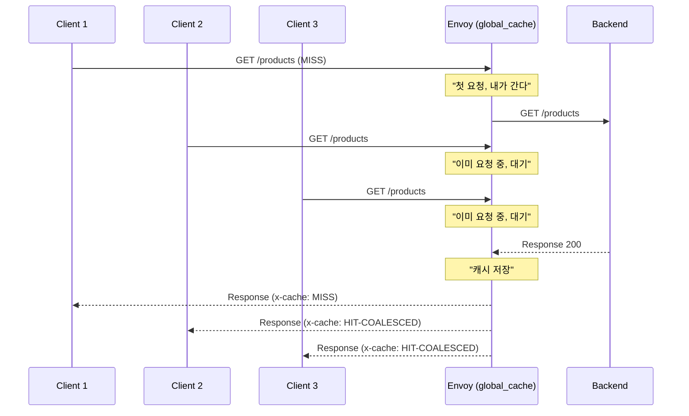
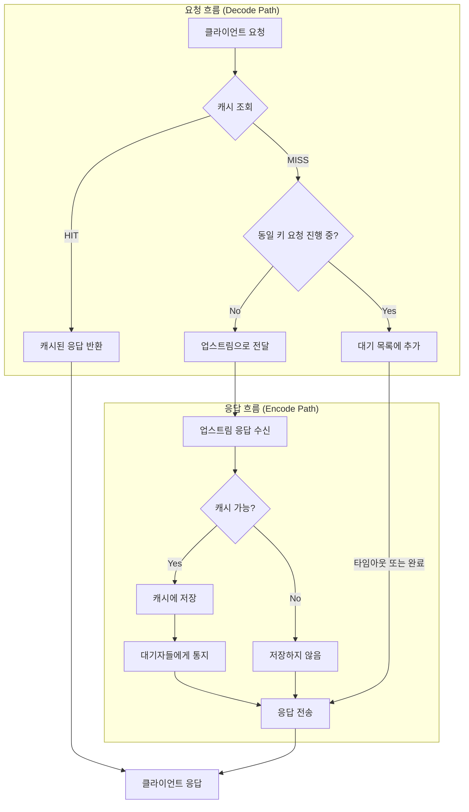
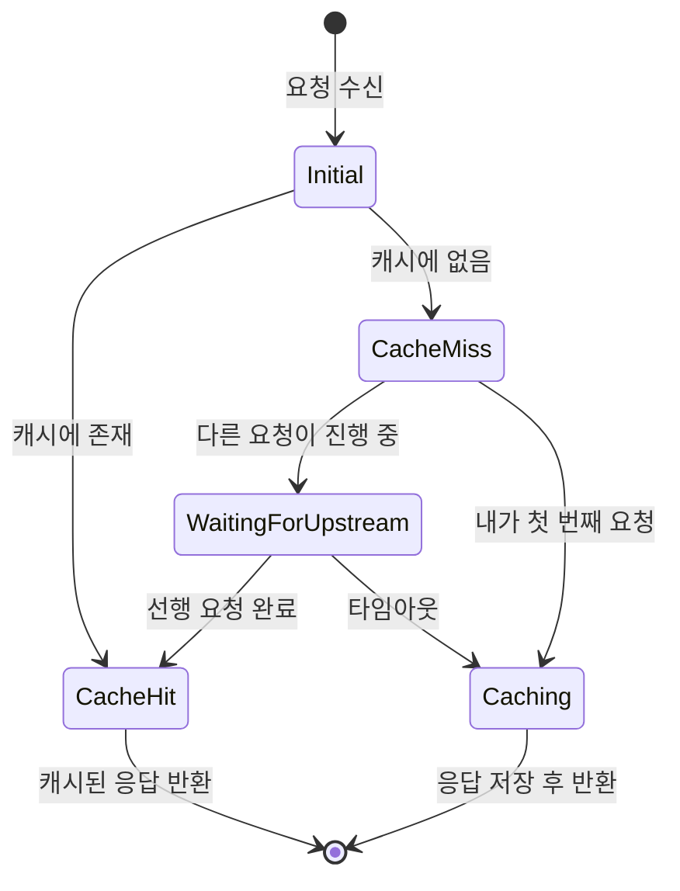

# Chapter 1. Envoy와 Global Cache: 큰 그림

> **이 장의 목표**: Envoy가 무엇인지, `global_cache` 필터가 왜 필요한지, 그리고 전체 데이터 흐름을 조감도 수준에서 이해합니다.

---

## 1.1 왜 프록시에 캐시를 넣는가?

마이크로서비스 아키텍처에서 가장 흔한 병목은 **반복적인 동일 요청**입니다. 예를 들어:

- 상품 목록 API: 초당 수천 명이 같은 `/api/products?category=electronics`를 호출
- 사용자 프로필 API: 인기 유저의 프로필을 수백 번 중복 조회
- 설정 API: 모든 서비스가 부팅할 때 동일한 설정을 요청

이런 요청들이 매번 백엔드까지 가면 어떻게 될까요?

```
[클라이언트 1] ─┐
[클라이언트 2] ─┼─→ [백엔드 DB] ← 부하 집중!
[클라이언트 3] ─┘
```

**해결책: 프록시 레벨 캐싱**

```
[클라이언트 1] ─┐                    ┌─→ [캐시 HIT] → 즉시 응답
[클라이언트 2] ─┼─→ [Envoy Proxy] ──┤
[클라이언트 3] ─┘                    └─→ [캐시 MISS] → 백엔드 → 저장 → 응답
```

프록시 레벨에서 캐싱하면:
1. **백엔드 부하 감소**: 동일 요청이 백엔드에 도달하지 않음
2. **응답 지연 감소**: 메모리/Redis에서 바로 응답 (수 밀리초)
3. **장애 격리**: 백엔드가 잠시 죽어도 캐시된 응답 제공 가능

---

## 1.2 Global Cache 필터의 정체

`envoy.filters.http.global_cache`는 이름 그대로 **전역 캐싱**을 담당하는 Envoy HTTP 필터입니다.

### 핵심 기능 두 가지

#### 1) 응답 캐싱 (Response Caching)
업스트림(백엔드)에서 받은 응답을 저장하고, 이후 동일한 요청에 대해 저장된 응답을 반환합니다.

```yaml
# 설정 예시
- name: envoy.filters.http.global_cache
  typed_config:
    "@type": type.googleapis.com/envoy.extensions.filters.http.global_cache.v3.GlobalCache
    default_ttl: { seconds: 300 }  # 5분간 캐시
    cache_backend:
      local:
        max_entries: 10000
```

#### 2) Single-Flight (요청 합류)
**더 중요한 기능**입니다. 동일한 URL로 동시에 100개의 요청이 오면:

- **Without Single-Flight**: 100개 모두 백엔드로 전달 → 백엔드 과부하
- **With Single-Flight**: 1개만 백엔드로, 나머지 99개는 대기 → 결과 공유



Go 개발자라면 `golang.org/x/sync/singleflight` 패키지를 떠올리면 됩니다. 개념적으로 **완전히 동일**합니다.

---

## 1.3 Go 코드로 보는 동등한 로직

C++ 코드를 보기 전에, 여러분이 익숙한 Go로 같은 로직을 구현해봅시다:

```go
package main

import (
    "net/http"
    "sync"
    "time"

    "golang.org/x/sync/singleflight"
)

// 캐시 엔트리
type CacheEntry struct {
    Headers    http.Header
    Body       []byte
    Expiration time.Time
}

// 전역 캐시와 singleflight 그룹
var (
    cache        = make(map[string]*CacheEntry)
    cacheMutex   sync.RWMutex
    group        singleflight.Group
    defaultTTL   = 5 * time.Minute
)

// 미들웨어
func CacheMiddleware(next http.Handler) http.Handler {
    return http.HandlerFunc(func(w http.ResponseWriter, r *http.Request) {
        // 1. 캐시 키 생성
        key := r.Method + ":" + r.Host + ":" + r.URL.Path
        
        // 2. 캐시 조회
        cacheMutex.RLock()
        entry, exists := cache[key]
        cacheMutex.RUnlock()
        
        if exists && time.Now().Before(entry.Expiration) {
            // 캐시 HIT
            w.Header().Set("X-Cache", "HIT")
            for k, v := range entry.Headers {
                w.Header()[k] = v
            }
            w.Write(entry.Body)
            return
        }
        
        // 3. Single-flight: 중복 요청 방지
        result, _, shared := group.Do(key, func() (interface{}, error) {
            // 실제 백엔드 호출 (여기서는 next 핸들러)
            recorder := &ResponseRecorder{...}
            next.ServeHTTP(recorder, r)
            
            // 캐시에 저장
            newEntry := &CacheEntry{
                Headers:    recorder.Header(),
                Body:       recorder.Body.Bytes(),
                Expiration: time.Now().Add(defaultTTL),
            }
            cacheMutex.Lock()
            cache[key] = newEntry
            cacheMutex.Unlock()
            
            return newEntry, nil
        })
        
        // 4. 응답 전송
        entry = result.(*CacheEntry)
        if shared {
            w.Header().Set("X-Cache", "HIT-COALESCED")
        } else {
            w.Header().Set("X-Cache", "MISS")
        }
        for k, v := range entry.Headers {
            w.Header()[k] = v
        }
        w.Write(entry.Body)
    })
}
```

**핵심 포인트:**
- `singleflight.Group.Do()`: 동일 키에 대해 하나의 요청만 실행
- `shared` 플래그: 다른 요청과 결과를 공유했는지 여부
- `X-Cache` 헤더: HIT / MISS / HIT-COALESCED 상태 표시

Envoy의 `GlobalCacheFilter`는 이 Go 코드와 **논리적으로 동일**합니다. 다만 **비동기 C++**로 구현되어 있고, **이벤트 루프** 기반으로 동작합니다.

---

## 1.4 전체 데이터 흐름 개요

`global_cache` 필터를 통과하는 요청의 생애주기를 살펴봅시다:



### 상태 머신 관점

필터는 내부적으로 다음 상태들을 관리합니다:



---

## 1.5 파일 구조 미리보기

이 책에서 분석할 소스 파일들입니다:

```
source/extensions/filters/http/global_cache/
├── global_cache_filter.h   # 필터 클래스 선언
├── global_cache_filter.cc  # 필터 핵심 로직 (~600줄)
├── cache_backend.h         # 캐시 인터페이스 정의
├── local_cache.h/cc        # 로컬 LRU 캐시 구현
├── redis_cache.h/cc        # Redis 비동기 캐시 구현
├── tiered_cache.h/cc       # L1+L2 계층형 캐시
├── cache_serialization.h/cc # Redis용 직렬화 포맷
├── config.h/cc             # 팩토리 및 설정 로딩
└── BUILD                   # Bazel 빌드 파일
```

| 파일 | 역할 | 해당 챕터 |
|------|------|----------|
| `global_cache_filter.*` | 요청/응답 처리, Single-flight | 5, 6, 7장 |
| `cache_backend.h` | 추상 인터페이스 정의 | 8장 |
| `local_cache.*` | 메모리 LRU 캐시 | 9장 |
| `redis_cache.*` | Redis 비동기 클라이언트 | 10장 |
| `tiered_cache.*` | L1+L2 조율 | 11장 |
| `cache_serialization.*` | 바이너리 직렬화 | 12장 |
| `config.*` | 설정 파싱, 팩토리 | 13장 |

---

## 1.6 왜 C++인가?

Go나 Java로 같은 기능을 구현할 수 있는데, 왜 Envoy는 C++을 선택했을까요?

### 성능 특성 비교

| 특성 | Go/Java | C++ (Envoy) |
|------|---------|-------------|
| GC 지연 | 수~수십 ms | 없음 |
| 메모리 오버헤드 | 객체당 헤더 존재 | 최소화 가능 |
| Tail Latency (p99) | 불안정 | 예측 가능 |
| 메모리 사용량 제어 | 제한적 | 바이트 단위 제어 |

### 프록시에서 중요한 이유

- **일관된 지연시간**: p99 latency가 중요한 환경에서 GC pause는 치명적
- **리소스 효율**: 수만 개의 동시 연결을 적은 메모리로 처리
- **Zero-copy**: 데이터를 복사하지 않고 그대로 전달 가능

### 트레이드오프

물론 대가가 있습니다:
- 개발 시간 증가 (Go 대비 3~5배)
- 메모리 관련 버그 가능성 (Use-after-free, 메모리 누수)
- 빌드 시간 증가

이 책을 통해 **현대적인 C++**가 이런 위험을 어떻게 완화하는지 배우게 됩니다.

---

## 1.7 이 책의 구성

총 16개 장과 부록으로 구성됩니다:

**Part I. 기반 다지기 (1-3장)**
- C++과 Envoy의 기본 개념

**Part II. 필터 코어 로직 (4-7장)**
- 요청 처리 흐름을 코드 레벨로 분석

**Part III. 백엔드와 저장소 (8-12장)**
- 캐시 추상화와 각 구현체 상세

**Part IV. 설정, 운영, 검증 (13-16장)**
- 실제 프로덕션 적용을 위한 가이드

**부록**
- C++/Go/Python/Java 문법 비교표

각 장은 **최소 A4 2페이지 분량**으로, 코드 예제와 다이어그램을 충분히 포함합니다.

---

## 1.8 요약 및 다음 장 예고

**이 장에서 배운 것:**
- `global_cache`는 응답 캐싱 + Single-flight를 제공하는 Envoy HTTP 필터
- Go의 `singleflight` + Redis 클라이언트 조합과 논리적으로 동일
- Envoy가 C++을 선택한 이유: 예측 가능한 성능, 리소스 효율

**다음 장 미리보기:**
2장에서는 **Modern C++ 생존 키트**를 다룹니다. 스마트 포인터, RAII, 람다 캡처 등 이후 코드를 읽기 위해 반드시 알아야 할 C++ 개념들을 Go/Python/Java와 비교하며 설명합니다.

---

> **체크리스트 ✓**
> - [ ] `global_cache`의 두 가지 핵심 기능(캐싱, Single-flight)을 설명할 수 있다
> - [ ] Go 코드로 동등한 로직을 작성할 수 있다
> - [ ] 필터의 상태 머신(Initial → CacheHit/CacheMiss → ...)을 그릴 수 있다
> - [ ] Envoy가 C++을 사용하는 이유를 설명할 수 있다
