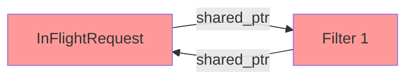
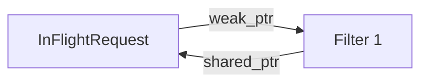

# Chapter 2. Modern C++ 생존 키트

> **이 장의 목표**: 이후 장에서 등장하는 C++ 코드를 읽기 위해 필수적인 문법과 개념을 Go/Python/Java와 비교하며 익힙니다.

---

## 2.1 첫 번째 장벽: 헤더와 소스 분리

Java, Go, Python에서는 클래스/구조체 정의와 구현이 한 파일에 있습니다. C++은 다릅니다.

### 헤더 파일 (.h)
**선언(Declaration)**을 담습니다. "이런 클래스/함수가 있다"고 알려줍니다.

```cpp
// cache_backend.h
#pragma once  // 중복 include 방지 (Go의 import와 유사)

class CacheBackend {
public:
    virtual void lookup(const std::string& key) = 0;  // 순수 가상 함수
    virtual ~CacheBackend() = default;
};
```

### 소스 파일 (.cc 또는 .cpp)
**정의(Definition)**를 담습니다. 실제 구현 코드입니다.

```cpp
// local_cache.cc
#include "local_cache.h"

void LocalCache::lookup(const std::string& key) {
    // 실제 구현...
}
```

### 다른 언어와 비교

| 언어 | 선언과 구현 |
|------|-------------|
| Go | 같은 `.go` 파일에 함께 |
| Java | 같은 `.java` 파일에 함께 |
| Python | 같은 `.py` 파일에 함께 |
| C++ | `.h`(선언) + `.cc`(구현) 분리 |

**왜 분리하는가?**
- 컴파일 속도: 구현이 바뀌어도 헤더만 include한 파일은 재컴파일 불필요
- 인터페이스 명확화: 헤더만 보면 API를 알 수 있음
- 바이너리 배포: 헤더 + 컴파일된 라이브러리(.so, .a)만 배포 가능

---

## 2.2 스마트 포인터: GC 없이 메모리 관리하기

C++에는 가비지 컬렉터(GC)가 없습니다. 대신 **스마트 포인터**가 메모리를 자동으로 관리합니다.

### std::unique_ptr - 단독 소유

한 객체를 **오직 하나의 포인터만** 가리킬 수 있습니다.

```cpp
// 생성
auto node = std::make_unique<LruNode>("key", entry, size);

// 소유권 이전 (복사 불가, 이동만 가능)
auto node2 = std::move(node);  // node는 이제 nullptr

// 스코프를 벗어나면 자동 삭제
{
    auto temp = std::make_unique<MyClass>();
}  // 여기서 temp가 가리키는 객체 자동 삭제
```

**Go 비유**: `*T`를 반환하는 팩토리 함수인데, 그 포인터를 다른 곳에 넘기면 원래 변수는 nil이 됨

### std::shared_ptr - 공유 소유

여러 포인터가 **같은 객체를 공유**합니다. 마지막 포인터가 사라지면 객체가 삭제됩니다.

```cpp
// 생성
auto entry = std::make_shared<CacheEntry>(body, headers, expiration);

// 복사 가능 (참조 카운트 증가)
auto entry2 = entry;  // 둘 다 같은 객체를 가리킴

// 참조 카운트 확인
entry.use_count();  // 2

// entry2가 스코프를 벗어나면 카운트 감소, 0이 되면 삭제
```

**Go 비유**: Go의 일반 포인터(`*T`)와 GC가 하는 일을 명시적으로 수행

### std::weak_ptr - 약한 참조

`shared_ptr`를 가리키지만 **참조 카운트를 증가시키지 않습니다**. 순환 참조(Cycle) 방지용입니다.

```cpp
struct InFlightRequest {
    std::vector<std::weak_ptr<GlobalCacheFilter>> waiters;  // 약한 참조
};

// 사용할 때는 lock()으로 shared_ptr로 변환
if (auto filter = waiter.lock()) {  // 아직 살아있으면
    filter->onComplete();
} else {
    // 이미 파괴됨, 무시
}
```

**왜 필요한가?**



위처럼 서로 `shared_ptr`로 가리키면 **영원히 삭제되지 않습니다** (참조 카운트가 0이 안 됨).

`weak_ptr`를 사용하면:



Filter가 사라지면 InFlightRequest의 `waiter.lock()`이 실패하고, 자연스럽게 정리됩니다.

---

## 2.3 참조(Reference)와 포인터의 차이

### 포인터 (*T)

```cpp
void modify(int* ptr) {
    if (ptr != nullptr) {  // null 체크 필요
        *ptr = 42;
    }
}

int x = 10;
modify(&x);  // 주소 전달
```

### 참조 (T&)

```cpp
void modify(int& ref) {
    ref = 42;  // null일 수 없음
}

int x = 10;
modify(x);  // 그냥 변수 전달
```

**핵심 차이:**
- 참조는 **null일 수 없음** (더 안전)
- 참조는 **재할당 불가** (항상 같은 대상을 가리킴)
- 참조는 **자동 역참조** (`*`를 안 써도 됨)

### Envoy 코드에서의 활용

```cpp
Http::FilterHeadersStatus decodeHeaders(
    Http::RequestHeaderMap& headers,  // 참조: null 아님을 보장
    bool end_stream
) {
    // headers.Path()처럼 바로 사용
}
```

Go 비교:
```go
func decodeHeaders(headers *http.Header, endStream bool) {
    // headers가 nil인지 체크해야 할 수도...
}
```

---

## 2.4 const의 세계

C++에서 `const`는 **"변경 불가"**를 컴파일 타임에 강제합니다.

### const 변수

```cpp
const int max_size = 1000;
max_size = 2000;  // 컴파일 에러!
```

### const 참조 (읽기 전용 빌려주기)

```cpp
void printKey(const std::string& key) {
    // key를 수정할 수 없음
    key = "new";  // 컴파일 에러!
    std::cout << key;  // 읽기는 가능
}
```

**왜 쓰는가?**
- 복사 비용 없이 큰 객체 전달 (`const std::string&`)
- 실수로 수정하는 버그 방지
- 컴파일러 최적화 힌트

### const 메서드

```cpp
class CacheEntry {
    std::string key_;
public:
    // 이 메서드는 객체를 수정하지 않음을 보장
    std::string getKey() const {
        return key_;
    }
};
```

---

## 2.5 람다와 캡처 (Lambda & Capture)

C++의 람다는 Go의 익명 함수, Python의 lambda와 유사하지만 **캡처(Capture)** 개념이 있습니다.

### 기본 문법

```cpp
// Go: func(x int) int { return x * 2 }
// Python: lambda x: x * 2
// C++:
auto doubler = [](int x) { return x * 2; };

int result = doubler(5);  // 10
```

### 캡처 (Capture)

외부 변수를 람다 내부에서 사용하려면 **캡처**해야 합니다.

```cpp
int multiplier = 3;

// 값으로 캡처 (복사)
auto by_value = [multiplier](int x) { return x * multiplier; };

// 참조로 캡처
auto by_ref = [&multiplier](int x) { return x * multiplier; };

// 모든 변수를 값으로 캡처
auto all_by_value = [=](int x) { return x * multiplier; };

// 모든 변수를 참조로 캡처
auto all_by_ref = [&](int x) { return x * multiplier; };
```

### Envoy에서의 실제 사용

```cpp
// global_cache_filter.cc에서 발췌
cache_backend_->lookup(cache_key_, [this, lookup_ctx](CacheLookupResult&& result) {
    // this: 현재 Filter 객체를 캡처
    // lookup_ctx: 조회 컨텍스트를 캡처
    
    if (result.status == CacheLookupStatus::Hit) {
        this->serveCachedResponse(result.entry, "HIT");
    }
});
```

**위험한 패턴**: 참조 캡처와 비동기

```cpp
void dangerous() {
    std::string key = "test";
    
    asyncCall([&key]() {  // key를 참조로 캡처
        std::cout << key;  // 💥 dangerous() 함수가 끝나면 key는 파괴됨!
    });
}  // key 파괴
```

**안전한 패턴**: 값 캡처 또는 shared_ptr

```cpp
void safe() {
    auto key = std::make_shared<std::string>("test");
    
    asyncCall([key]() {  // shared_ptr을 값으로 캡처 (참조 카운트 증가)
        std::cout << *key;  // ✅ key는 람다가 살아있는 동안 유효
    });
}
```

---

## 2.6 std::move와 이동 의미론

### 복사 vs 이동

```cpp
std::string original = "Hello, World!";

// 복사: 메모리 할당 + 내용 복사
std::string copy = original;  // original도 여전히 유효

// 이동: 내부 포인터만 옮김 (빠름)
std::string moved = std::move(original);  // original은 이제 빈 문자열
```

### 왜 중요한가?

캐시에 응답을 저장할 때:

```cpp
// 비효율적 (복사)
auto cached_entry = std::make_shared<CacheEntry>(
    buffered_body_,  // 1MB 바디를 복사!
    response_headers_,
    expiration
);

// 효율적 (이동)
auto cached_entry = std::make_shared<CacheEntry>(
    std::move(buffered_body_),  // 포인터만 이동
    std::move(response_headers_),
    expiration
);
```

### Go와 비교

Go에서는 슬라이스를 넘기면 **암묵적으로 공유**됩니다:

```go
func process(data []byte) {
    // data와 원본이 같은 배열을 공유
}
```

C++은 **명시적**입니다:
- 복사하려면 그냥 전달
- 공유하려면 `shared_ptr` 사용
- 소유권 이전하려면 `std::move` 사용

---

## 2.7 RAII: 스코프 기반 자원 관리

**RAII** (Resource Acquisition Is Initialization)는 C++의 핵심 패턴입니다.

### 원리

```cpp
{
    std::mutex mutex;
    std::lock_guard<std::mutex> lock(mutex);  // 생성자에서 잠금
    
    // 임계 영역 코드...
    
}  // 소멸자에서 자동 해제 (예외가 발생해도!)
```

Go의 `defer`와 유사하지만, **스코프 종료 시 자동 실행**됩니다.

### Go와 비교

```go
// Go
func process() {
    mu.Lock()
    defer mu.Unlock()  // 명시적으로 defer 필요
    
    // 작업...
}
```

```cpp
// C++
void process() {
    std::lock_guard<std::mutex> lock(mutex_);
    // defer가 필요 없음, 스코프 끝에서 자동 해제
    
    // 작업...
}
```

### Envoy에서의 활용

```cpp
// local_cache.cc
void LocalCache::lookup(const std::string& key, LookupCallback callback) {
    {
        absl::MutexLock lock(&mutex_);  // RAII 패턴
        // 캐시 조회...
    }  // 여기서 자동으로 unlock
    
    callback(result);  // mutex 해제된 후 콜백 호출 (데드락 방지)
}
```

---

## 2.8 std::chrono: 시간 다루기

C++에서 시간은 `std::chrono` 네임스페이스를 사용합니다.

```cpp
#include <chrono>

// 기간 (Duration)
std::chrono::seconds sec(5);
std::chrono::milliseconds ms(100);

// 시점 (Time Point)
auto now = std::chrono::steady_clock::now();
auto expiration = now + std::chrono::seconds(300);

// 비교
if (std::chrono::steady_clock::now() >= expiration) {
    // 만료됨
}
```

### 다른 언어와 비교

| 언어 | 시간 타입 |
|------|----------|
| Go | `time.Duration`, `time.Time` |
| Python | `datetime.timedelta`, `datetime.datetime` |
| Java | `Duration`, `Instant` |
| C++ | `std::chrono::duration`, `std::chrono::time_point` |

---

## 2.9 템플릿 기초

C++의 템플릿은 Go의 제네릭, Java의 제네릭과 유사합니다.

```cpp
// 템플릿 함수
template<typename T>
T max(T a, T b) {
    return (a > b) ? a : b;
}

// 사용
int x = max(3, 5);          // T = int
double y = max(3.14, 2.71);  // T = double
```

### STL 컨테이너

```cpp
std::vector<int> numbers;           // Go: []int
std::map<std::string, int> ages;    // Go: map[string]int
std::unordered_map<std::string, int> cache;  // 해시맵 (Go의 map과 동등)
```

---

## 2.10 요약: C++ ↔ Go/Python/Java 매핑표

| 개념 | C++ | Go | Python | Java |
|------|-----|-----|--------|------|
| 널 포인터 | `nullptr` | `nil` | `None` | `null` |
| 스마트 포인터 | `shared_ptr<T>` | 일반 포인터 + GC | 일반 참조 + GC | 일반 참조 + GC |
| 단독 소유 | `unique_ptr<T>` | - | - | - |
| 참조 전달 | `T&` | 포인터 `*T` | 기본 동작 | 기본 동작 |
| 불변 참조 | `const T&` | - | - | `final` (부분적) |
| 람다 | `[capture](params){}` | `func(params){}` | `lambda params:` | `(params) -> {}` |
| 리소스 정리 | RAII (자동) | `defer` | `with` | try-with-resources |
| 제네릭 | `template<T>` | `[T any]` | 타입 힌트 | `<T>` |
| 열거형 | `enum class` | `const` + `iota` | `Enum` | `enum` |
| 타입 추론 | `auto` | `:=` | 자동 | `var` |

---

## 2.11 다음 장 예고

이제 C++ 코드를 읽을 기본기가 갖춰졌습니다. 다음 장에서는 **Envoy의 실행 모델**을 다룹니다:
- 워커 스레드와 이벤트 루프
- 필터 체인의 호출 규약
- "절대 블로킹 금지" 원칙

---

> **체크리스트 ✓**
> - [ ] `unique_ptr`, `shared_ptr`, `weak_ptr`의 차이를 설명할 수 있다
> - [ ] 참조(`&`)와 포인터(`*`)의 차이를 알고 있다
> - [ ] 람다 캡처 `[=]`, `[&]`, `[this]`의 의미를 안다
> - [ ] `std::move`가 왜 필요한지 설명할 수 있다
> - [ ] RAII 패턴이 무엇인지 안다
