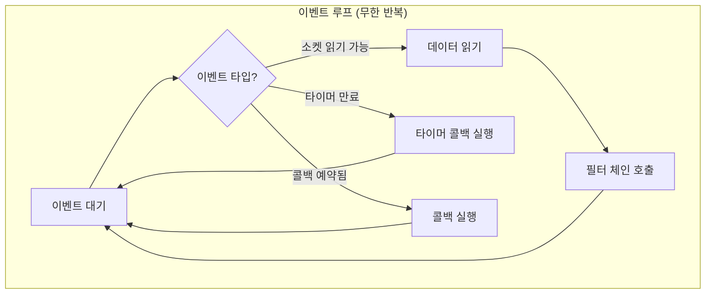
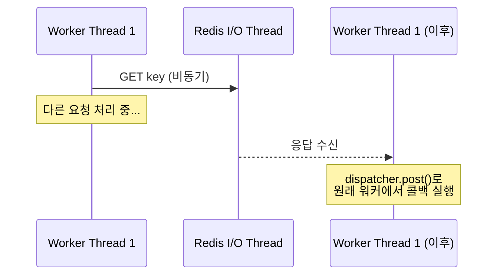
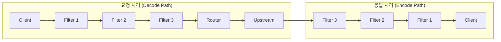
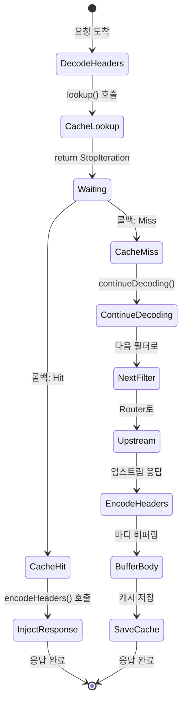
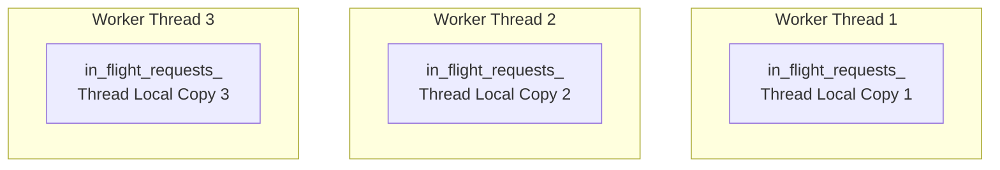

# Chapter 3. Envoy 실행 모델: 워커, 디스패처, 필터 계약

> **이 장의 목표**: Envoy의 스레딩 모델과 이벤트 루프를 이해하고, 필터가 어떤 규약을 따라야 하는지 배웁니다.

---

## 3.1 스레딩 모델: Java/Go와 완전히 다르다

가장 먼저 깨야 할 고정관념: **"요청 하나당 스레드 하나"**가 아닙니다.

### Java Spring의 모델

```
[요청 1] → [Thread Pool] → Thread-1 처리 → DB 쿼리 (블로킹) → 응답
[요청 2] → [Thread Pool] → Thread-2 처리 → ...
```

- 요청마다 스레드 할당
- DB 쿼리 중 스레드는 **대기(Block)**
- 수천 요청 = 수천 스레드 필요

### Go의 고루틴 모델

```
[요청 1] → [고루틴 1] → DB 쿼리 (스케줄러가 다른 고루틴 실행) → 응답
[요청 2] → [고루틴 2] → ...
```

- 요청마다 고루틴 할당
- I/O 중 스케줄러가 다른 고루틴으로 전환
- 메모리 효율적이지만 여전히 **동기적 코드 스타일**

### Envoy의 모델 (Node.js와 유사)

```
Worker Thread 1: [이벤트 루프]
    └─ 요청 1 도착 → 처리 시작 → Redis 요청 (콜백 등록) → 다음 이벤트로
    └─ 요청 2 도착 → 처리 시작 → ...
    └─ Redis 응답 도착 → 요청 1 콜백 실행 → ...
    
Worker Thread 2: [이벤트 루프]
    └─ 요청 3 도착 → ...
```

**핵심 특징:**
- 스레드 수 = CPU 코어 수 (보통 4~16개)
- 각 스레드는 **독립적인 이벤트 루프** 실행
- I/O는 **논블로킹 + 콜백**

---

## 3.2 이벤트 루프: 절대 멈추면 안 된다

Envoy 워커 스레드의 생명 주기:



### 왜 블로킹이 금지인가?

워커 스레드가 하나의 요청에서 **1초간 블로킹**되면:

```
[10:00:00.000] 요청 A 처리 시작
[10:00:00.001] 동기 DB 호출 (블로킹)
... 1초 대기 ...
[10:00:01.001] 요청 A 처리 완료

[10:00:00.100] 요청 B 도착 → 대기
[10:00:00.200] 요청 C 도착 → 대기
[10:00:00.300] 요청 D 도착 → 대기
... 이 1초 동안 모든 요청이 큐에 쌓임 ...
```

Node.js를 써봤다면 익숙한 문제입니다. **"Don't block the event loop!"**

### 금지된 코드 패턴

```cpp
// ❌ 절대 금지!
void badFilter() {
    std::this_thread::sleep_for(std::chrono::seconds(1));  // 스레드 멈춤
    
    // 동기 소켓 읽기
    char buffer[1024];
    read(socket_fd, buffer, sizeof(buffer));  // 블로킹!
    
    // 무거운 CPU 작업
    for (int i = 0; i < 1000000000; i++) { /* ... */ }  // 스레드 독점
}
```

### 올바른 비동기 패턴

```cpp
// ✅ 올바른 방법
void goodFilter() {
    // 비동기 타이머
    auto timer = dispatcher_.createTimer([this]() {
        this->onTimeout();
    });
    timer->enableTimer(std::chrono::seconds(1));
    
    // 비동기 Redis 요청
    redis_client_->asyncGet(key, [this](Response&& response) {
        this->onRedisResponse(std::move(response));
    });
}
```

---

## 3.3 디스패처(Dispatcher): 이벤트 루프의 심장

`Event::Dispatcher`는 각 워커 스레드의 이벤트 루프를 관리합니다.

### 주요 기능

```cpp
// 타이머 생성
Event::TimerPtr timer = dispatcher_.createTimer([this]() {
    this->onTimeout();
});
timer->enableTimer(std::chrono::milliseconds(5000));

// 즉시 실행될 콜백 예약 (현재 이벤트 처리 완료 후)
dispatcher_.post([this]() {
    this->doSomething();
});

// 지연 삭제 (현재 스택에서 안전하게 객체 삭제)
dispatcher_.deferredDelete(std::move(some_object));
```

### dispatcher().post()가 필요한 이유

Redis 응답이 **다른 스레드**에서 올 수 있습니다:



```cpp
// redis_cache.cc에서 발췌
void RedisCache::LookupRequest::onResponse(RespValuePtr&& value) {
    auto self = shared_from_this();
    
    // 응답 처리를 원래 워커 스레드에서 실행
    dispatcher_.post([self, value = std::move(value)]() mutable {
        self->callback_(/* 결과 */);
    });
}
```

---

## 3.4 필터 체인 아키텍처

Envoy HTTP 처리는 **파이프라인**입니다.



### 필터 인터페이스

```cpp
class StreamDecoderFilter {
    // 요청 헤더 도착
    virtual FilterHeadersStatus decodeHeaders(RequestHeaderMap& headers, bool end_stream) = 0;
    // 요청 바디 도착
    virtual FilterDataStatus decodeData(Buffer::Instance& data, bool end_stream) = 0;
    // 요청 트레일러 도착
    virtual FilterTrailersStatus decodeTrailers(RequestTrailerMap& trailers) = 0;
};

class StreamEncoderFilter {
    // 응답 헤더 도착
    virtual FilterHeadersStatus encodeHeaders(ResponseHeaderMap& headers, bool end_stream) = 0;
    // 응답 바디 도착
    virtual FilterDataStatus encodeData(Buffer::Instance& data, bool end_stream) = 0;
};
```

`GlobalCacheFilter`는 **둘 다** 구현합니다 (PassThroughFilter 상속).

---

## 3.5 필터 반환 값: 흐름 제어의 핵심

필터는 반환 값으로 **필터 체인의 흐름을 제어**합니다.

### FilterHeadersStatus

```cpp
enum class FilterHeadersStatus {
    Continue,                    // 다음 필터로 진행
    StopIteration,               // 현재 필터에서 중단 (이후 콜백에서 재개)
    StopAllIterationAndBuffer,   // 중단 + 데이터 버퍼링
    StopAllIterationAndWatermark // 중단 + 워터마크 기반 버퍼링
};
```

### 실제 사용 예시

```cpp
FilterHeadersStatus GlobalCacheFilter::decodeHeaders(...) {
    // 캐시 조회 시작 (비동기)
    cache_backend_->lookup(key, [this](CacheLookupResult&& result) {
        if (result.status == CacheLookupStatus::Hit) {
            // 캐시 히트: 응답 주입
            serveCachedResponse(result.entry, "HIT");
        } else {
            // 캐시 미스: 다음 필터로 진행
            decoder_callbacks_->continueDecoding();
        }
    });
    
    // 비동기 작업 중이므로 중단
    return FilterHeadersStatus::StopAllIterationAndWatermark;
}
```

### 흐름 다이어그램



---

## 3.6 콜백과 스트림 생명주기

### decoder_callbacks_ vs encoder_callbacks_

```cpp
class GlobalCacheFilter : public Http::PassThroughFilter {
    // 상속으로 자동 제공
    Http::StreamDecoderFilterCallbacks* decoder_callbacks_;
    Http::StreamEncoderFilterCallbacks* encoder_callbacks_;
};
```

**decoder_callbacks_**: 요청 처리 중 사용
- `continueDecoding()`: 중단된 요청 처리 재개
- `encodeHeaders()`: 응답 주입 (캐시 히트 시)
- `dispatcher()`: 이벤트 루프 접근

**encoder_callbacks_**: 응답 처리 중 사용
- `continueEncoding()`: 중단된 응답 처리 재개
- `addEncodedData()`: 응답 바디 추가

### 스트림 생명주기와 onDestroy()

```cpp
void GlobalCacheFilter::onDestroy() {
    // 스트림이 종료됨 (정상 완료, 타임아웃, 리셋 등)
    
    // 1. 타이머 정리
    if (single_flight_timer_) {
        single_flight_timer_->disableTimer();
    }
    
    // 2. 대기 상태 정리
    waiting_for_in_flight_ = false;
    
    // 3. 내가 소유한 in-flight 정리
    if (owns_in_flight_) {
        notifyInFlightWaiters(in_flight_key_, nullptr);
        owns_in_flight_ = false;
    }
}
```

**중요**: `onDestroy()`는 **반드시 호출**됩니다. 리소스 정리는 여기서!

---

## 3.7 Thread Local Storage (TLS)

Envoy에서 **워커 간 데이터 공유**는 위험합니다. 대신 **Thread Local Storage**를 사용합니다.

### 문제: 전역 변수의 위험

```cpp
// ❌ 위험! 모든 워커가 접근하면 경쟁 조건 발생
static std::map<std::string, Entry> global_cache;
```

### 해결: thread_local

```cpp
// ✅ 각 워커가 독립적인 복사본을 가짐
thread_local std::unordered_map<std::string, std::shared_ptr<InFlightRequest>>
    GlobalCacheFilter::in_flight_requests_;
```

### 의미



**결과**: 동일 URL 요청이 다른 워커에 도착하면 **각각 독립적으로 in-flight 추적**
- 장점: Lock-free, 간단
- 단점: 워커 수만큼 중복 upstream 요청 가능 (보통 2~8개)

---

## 3.8 비동기 패턴 정리

### 패턴 1: 콜백 체인

```cpp
void step1() {
    asyncOperation1([this](Result1&& r1) {
        step2(std::move(r1));
    });
}

void step2(Result1&& r1) {
    asyncOperation2([this](Result2&& r2) {
        step3(std::move(r2));
    });
}
```

### 패턴 2: shared_from_this()로 수명 보장

```cpp
class MyFilter : public std::enable_shared_from_this<MyFilter> {
    void startAsync() {
        auto self = shared_from_this();  // 참조 카운트 증가
        
        asyncCall([self]() {
            // self가 살아있는 동안 MyFilter도 살아있음
            self->onComplete();
        });
    }
};
```

### 패턴 3: weak_ptr로 안전한 콜백

```cpp
void registerCallback() {
    std::weak_ptr<MyFilter> weak_self = shared_from_this();
    
    asyncCall([weak_self]() {
        if (auto self = weak_self.lock()) {
            // 아직 살아있으면 실행
            self->onComplete();
        }
        // 파괴되었으면 조용히 무시
    });
}
```

---

## 3.9 실전: decodeHeaders의 동기/비동기 분기

`GlobalCacheFilter`에서 가장 복잡한 부분입니다:

```cpp
Http::FilterHeadersStatus GlobalCacheFilter::decodeHeaders(...) {
    // ...
    
    struct LookupContext {
        std::atomic<bool> sync{true};     // 동기 호출 여부
        std::atomic<bool> invoked{false}; // 콜백 호출 여부
    };
    auto lookup_ctx = std::make_shared<LookupContext>();
    
    // 비동기 캐시 조회
    cache_backend_->lookup(cache_key_, [this, lookup_ctx](CacheLookupResult&& result) {
        lookup_ctx->invoked.store(true);
        const bool is_sync = lookup_ctx->sync.load();
        
        // ... 결과 처리 ...
        
        if (!is_sync && state_ == FilterState::CacheMiss) {
            decoder_callbacks_->continueDecoding();  // 비동기면 재개 필요
        }
    });
    
    lookup_ctx->sync.store(false);  // 이제 비동기
    
    // 콜백이 이미 실행되었는가? (LocalCache는 동기)
    if (lookup_ctx->invoked.load()) {
        // 동기적으로 완료됨
        if (state_ == FilterState::CacheHit) {
            return FilterHeadersStatus::StopAllIterationAndWatermark;
        }
        return FilterHeadersStatus::Continue;  // 캐시 미스, 바로 진행
    } else {
        // 비동기 (RedisCache)
        return FilterHeadersStatus::StopAllIterationAndWatermark;
    }
}
```

**왜 이렇게 복잡한가?**
- LocalCache: 콜백이 **즉시** 실행됨 (동기)
- RedisCache: 콜백이 **나중에** 실행됨 (비동기)
- 두 경우를 **동일한 코드**로 처리해야 함

---

## 3.10 요약

| 개념 | 설명 | 주의사항 |
|------|------|----------|
| 워커 스레드 | 각각 독립적인 이벤트 루프 | 블로킹 금지! |
| 디스패처 | 타이머, 콜백 예약 | `post()`로 스레드 간 전환 |
| 필터 반환 값 | `Continue` vs `StopIteration` | 비동기 시 `continueDecoding()` 필요 |
| TLS | 워커별 독립 데이터 | `thread_local` 키워드 |
| 수명 관리 | `shared_from_this()`, `weak_ptr` | 콜백 전에 객체 파괴 방지 |

---

## 3.11 다음 장 예고

이제 Envoy 필터의 기본 규약을 알았습니다. 다음 장부터는 **실제 코드**를 분석합니다:
- 4장: 캐시 가능성 정책과 키 설계
- 5장: `decodeHeaders` 상세 분석
- 6장: Single-flight 구현의 모든 것

---

> **체크리스트 ✓**
> - [ ] Envoy의 스레딩 모델(이벤트 루프 기반)을 설명할 수 있다
> - [ ] 왜 블로킹이 금지인지 이해한다
> - [ ] `FilterHeadersStatus`의 각 값이 무엇을 의미하는지 안다
> - [ ] `continueDecoding()`이 언제 필요한지 안다
> - [ ] `thread_local`이 왜 사용되는지 설명할 수 있다
> - [ ] `shared_from_this()`가 필요한 이유를 안다
