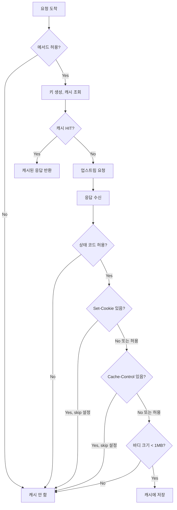

# Chapter 4. 캐시 키 설계: 정확성의 출발점

> **이 장의 목표**: 캐시 키가 어떻게 생성되는지, 캐시 가능 여부를 어떻게 판단하는지 이해합니다. 잘못된 키 설계가 일으키는 운영 사고도 함께 살펴봅니다.

---

## 4.1 캐시 키의 중요성

캐시의 **정확성(Correctness)**은 키 설계에서 시작됩니다.

### 키가 너무 좁으면?
```
요청 A: GET /api/users?id=1&lang=ko → 키: "/api/users?id=1&lang=ko"
요청 B: GET /api/users?id=1&lang=en → 키: "/api/users?id=1&lang=en"
```
→ **문제 없음**: 다른 응답에 다른 키

### 키가 너무 넓으면?
```
요청 A: GET /api/users?id=1 (User-Agent: Chrome) → 키: "/api/users?id=1"
요청 B: GET /api/users?id=1 (User-Agent: Safari) → 키: "/api/users?id=1"
```
→ **문제 발생**: User-Agent별로 다른 응답인데 같은 키!

### 키가 불안정하면?
```
요청 A: GET /api?a=1&b=2 → 키: "/api?a=1&b=2"
요청 B: GET /api?b=2&a=1 → 키: "/api?b=2&a=1"  (쿼리 순서만 다름)
```
→ **캐시 미스**: 같은 요청인데 다른 키!

---

## 4.2 캐시 키 구성 옵션

`GlobalCacheFilter`의 키는 다음 요소들로 구성됩니다:

```yaml
cache_key:
  include_scheme: false        # http vs https
  include_host: true           # 호스트명
  include_path: true           # 경로
  include_query_params: true   # 쿼리 스트링
  query_params_included: []    # 포함할 쿼리 (allowlist)
  query_params_excluded: []    # 제외할 쿼리 (blocklist)
  headers_included: []         # 포함할 헤더
```

### 키 생성 코드

```cpp
// global_cache_filter.cc
std::string GlobalCacheFilter::generateCacheKey(const Http::RequestHeaderMap& headers) {
    std::string key;
    
    // 1. 메서드 (항상 포함)
    if (headers.Method()) {
        appendKeyPart(key, "m", headers.Method()->value().getStringView());
    }
    
    // 2. 스킴 (옵션)
    if (effective_cache_key_config_.include_scheme && headers.Scheme()) {
        appendKeyPart(key, "s", headers.Scheme()->value().getStringView());
    }
    
    // 3. 호스트 (옵션, 기본 true)
    if (effective_cache_key_config_.include_host && headers.Host()) {
        appendKeyPart(key, "h", headers.Host()->value().getStringView());
    }
    
    // 4. 경로 (옵션, 기본 true)
    if (effective_cache_key_config_.include_path) {
        appendKeyPart(key, "p", buildPathForCacheKey(headers));
    }
    
    // 5. 헤더 (옵션)
    if (!effective_cache_key_config_.headers_included.empty()) {
        key += buildHeaderKeyFragment(headers);
    }
    
    return key;
}
```

### 키 포맷 설명

```
|m:3:GET|h:11:example.com|p:19:/api/v1/users?id=1

구조: |태그:길이:값|태그:길이:값|...

- m: method
- s: scheme  
- h: host
- p: path (쿼리 포함)
- hn: header name
- hv: header value
```

**왜 길이를 포함하는가?**

파싱 없이 빠른 비교를 위해서입니다:
```
키 A: |p:10:/api?a=1&b
키 B: |p:10:/api?a=1|b

길이 정보 없이는 "|p:/api?a=1&b" vs "|p:/api?a=1|b" 구분 어려움
```

---

## 4.3 쿼리 파라미터 필터링

실무에서 가장 많이 사용하는 기능입니다.

### Allowlist 방식

```yaml
cache_key:
  query_params_included: ["user_id", "region"]
```

```
요청: GET /search?q=envoy&user_id=kim&debug=1
키: /search?user_id=kim  (q, debug 제외)
```

### Blocklist 방식

```yaml
cache_key:
  query_params_excluded: ["utm_source", "debug", "_t"]
```

```
요청: GET /search?q=envoy&utm_source=google&_t=1234567890
키: /search?q=envoy  (utm_source, _t 제외)
```

### 구현 코드

```cpp
std::string GlobalCacheFilter::buildPathForCacheKey(
    const Http::RequestHeaderMap& headers) const {
    
    const auto& path = headers.Path()->value();
    
    // 쿼리 파라미터를 포함하지 않는 경우
    if (!effective_cache_key_config_.include_query_params) {
        return Http::Utility::stripQueryString(path);
    }
    
    // 필터가 없으면 원본 그대로
    if (effective_cache_key_config_.query_params_included.empty() &&
        effective_cache_key_config_.query_params_excluded.empty()) {
        return std::string(path.getStringView());
    }
    
    // 필터링 적용
    const auto query_params = Http::Utility::QueryParamsMulti::parseQueryString(
        path.getStringView());
    Http::Utility::QueryParamsMulti filtered_params;
    
    const bool include_by_default = 
        effective_cache_key_config_.query_params_included.empty();
    
    for (const auto& entry : query_params.data()) {
        const auto& name = entry.first;
        const auto& values = entry.second;
        
        for (const auto& value : values) {
            // Allowlist 또는 기본 포함
            bool include = include_by_default ||
                effective_cache_key_config_.query_params_included.contains(name);
            
            // Blocklist가 우선
            if (include && 
                effective_cache_key_config_.query_params_excluded.contains(name)) {
                include = false;
            }
            
            if (include) {
                filtered_params.add(name, value);
            }
        }
    }
    
    return filtered_params.replaceQueryString(path);
}
```

---

## 4.4 헤더 기반 키 분리

`Vary` 헤더처럼, 특정 요청 헤더에 따라 캐시를 분리해야 할 때:

```yaml
cache_key:
  headers_included:
    - "x-user-tier"    # 무료/프리미엄 사용자
    - "accept-language"  # 언어별 응답
```

### 결과

```
요청 A: GET /api (x-user-tier: premium)
키: |m:3:GET|h:11:example.com|p:4:/api|hn:11:x-user-tier|hv:7:premium

요청 B: GET /api (x-user-tier: free)
키: |m:3:GET|h:11:example.com|p:4:/api|hn:11:x-user-tier|hv:4:free
```

### 구현 코드

```cpp
std::string GlobalCacheFilter::buildHeaderKeyFragment(
    const Http::RequestHeaderMap& headers) const {
    
    std::string fragment;
    
    for (const auto& header_name : effective_cache_key_config_.headers_included) {
        appendKeyPart(fragment, "hn", header_name.get());
        
        const auto values = headers.get(header_name);
        for (size_t i = 0; i < values.size(); ++i) {
            const auto* entry = values[i];
            appendKeyPart(fragment, "hv", entry->value().getStringView());
        }
    }
    
    return fragment;
}
```

---

## 4.5 캐시 가능 여부 판단

### 요청 캐시 가능성

```cpp
bool GlobalCacheFilter::isCacheableRequest(
    const Http::RequestHeaderMap& headers) const {
    
    if (!headers.Method()) {
        return false;
    }
    
    const auto method = headers.Method()->value().getStringView();
    std::string normalized_method(method);
    absl::AsciiStrToUpper(&normalized_method);
    
    // 기본: GET, HEAD만 허용
    return config_->allowedMethods().contains(normalized_method);
}
```

**기본 허용 메서드**: `GET`, `HEAD`

POST, PUT, DELETE 등은 기본적으로 캐시하지 않습니다 (부작용이 있으므로).

### 응답 캐시 가능성

```cpp
bool GlobalCacheFilter::isCacheableResponse(
    const Http::ResponseHeaderMap& headers) const {
    
    // 1. 상태 코드 확인 (기본: 200-299)
    const auto status = Http::Utility::getResponseStatus(headers);
    if (!config_->allowedStatusCodes().contains(status)) {
        return false;
    }
    
    // 2. Set-Cookie 헤더 확인
    if (config_->skipIfResponseHasSetCookie() &&
        !headers.get(Http::Headers::get().SetCookie).empty()) {
        return false;
    }
    
    // 3. Cache-Control 헤더 확인
    if (config_->skipIfResponseHasCacheControl() &&
        !headers.get(Http::CustomHeaders::get().CacheControl).empty()) {
        return false;
    }
    
    return true;
}
```

### 캐시 가능성 체크리스트



---

## 4.6 라우트별 Override

전역 설정을 라우트별로 덮어쓸 수 있습니다:

```yaml
route_config:
  virtual_hosts:
  - name: local_service
    domains: ["*"]
    routes:
    # 캐시 비활성화
    - match: { prefix: "/api/auth" }
      typed_per_filter_config:
        envoy.filters.http.global_cache:
          "@type": type.googleapis.com/.../GlobalCachePerRoute
          disabled: true
          
    # TTL 변경 + 쿼리 무시
    - match: { prefix: "/api/static" }
      typed_per_filter_config:
        envoy.filters.http.global_cache:
          "@type": type.googleapis.com/.../GlobalCachePerRoute
          overrides:
            default_ttl: { seconds: 3600 }  # 1시간
            cache_key:
              include_query_params: false
```

### 구현 코드

```cpp
Http::FilterHeadersStatus GlobalCacheFilter::decodeHeaders(...) {
    // 라우트별 설정 확인
    if (const auto* per_route_config =
            Http::Utility::resolveMostSpecificPerFilterConfig<GlobalCachePerRouteConfig>(
                decoder_callbacks_)) {
        
        // 캐시 비활성화?
        cache_enabled_ = !per_route_config->disabled();
        
        // TTL override?
        if (auto ttl_override = per_route_config->defaultTtlOverride()) {
            effective_default_ttl_ = ttl_override.value();
        }
        
        // 캐시 키 override?
        if (auto cache_key_override = per_route_config->cacheKeyOverride()) {
            effective_cache_key_config_ = cache_key_override.value();
        } else {
            effective_cache_key_config_ = config_->cacheKeyConfig();
        }
    }
    
    if (!cache_enabled_) {
        return FilterHeadersStatus::Continue;  // 캐시 패스스루
    }
    // ...
}
```

---

## 4.7 키 설계의 함정과 운영 사고

### 함정 1: 쿼리 순서 의존성

```
/api?a=1&b=2  vs  /api?b=2&a=1
```

**현재 구현**: 쿼리 순서에 의존함 (정규화 없음)

**운영 영향**: 클라이언트가 쿼리 순서를 바꾸면 캐시 미스

**완화책**: 
- 클라이언트 표준화
- 또는 쿼리 파라미터 정규화 추가 구현 필요

### 함정 2: 대소문자 구분

```
GET /API/Users  vs  GET /api/users
```

**현재 구현**: 대소문자 구분함

**운영 영향**: 같은 리소스인데 다른 키

**완화책**: 경로 정규화(lowercase) 구현 필요

### 함정 3: Accept-Encoding 미반영

```
GET /api (Accept-Encoding: gzip)  → gzip 응답 캐시됨
GET /api (Accept-Encoding: br)    → 같은 키! gzip 응답 반환됨!
```

**현재 구현**: `Accept-Encoding`을 키에 포함하지 않음

**운영 영향**: 압축 형식 불일치

**완화책**: 
```yaml
cache_key:
  headers_included: ["accept-encoding"]
```

### 함정 4: 민감정보 키 포함

```
GET /api?session=abc123&user=kim
```

세션 ID가 키에 포함되면:
- 캐시 효율 급감 (거의 모든 요청이 MISS)
- Redis에 민감 데이터 저장

**완화책**:
```yaml
cache_key:
  query_params_excluded: ["session", "token", "api_key"]
```

---

## 4.8 실전 설정 예시

### 정적 자산 캐싱

```yaml
# /static/* 경로: 쿼리 무시, 긴 TTL
- match: { prefix: "/static" }
  typed_per_filter_config:
    envoy.filters.http.global_cache:
      "@type": type.googleapis.com/.../GlobalCachePerRoute
      overrides:
        default_ttl: { seconds: 86400 }  # 24시간
        cache_key:
          include_query_params: false
```

### API 캐싱 (사용자별 분리)

```yaml
# /api/* 경로: 사용자 tier별 캐시 분리
- match: { prefix: "/api" }
  typed_per_filter_config:
    envoy.filters.http.global_cache:
      "@type": type.googleapis.com/.../GlobalCachePerRoute
      overrides:
        default_ttl: { seconds: 60 }
        cache_key:
          headers_included: ["x-user-tier"]
          query_params_excluded: ["_t", "utm_source"]
```

### 인증 경로 제외

```yaml
# /auth/* 경로: 캐시 완전 비활성화
- match: { prefix: "/auth" }
  typed_per_filter_config:
    envoy.filters.http.global_cache:
      "@type": type.googleapis.com/.../GlobalCachePerRoute
      disabled: true
```

---

## 4.9 요약

| 설정 | 기본값 | 용도 |
|------|--------|------|
| `include_scheme` | false | http/https 분리 |
| `include_host` | true | 멀티 도메인 분리 |
| `include_path` | true | 경로별 캐시 |
| `include_query_params` | true | 쿼리 포함 여부 |
| `query_params_included` | [] | Allowlist |
| `query_params_excluded` | [] | Blocklist |
| `headers_included` | [] | 헤더 기반 분리 |

**캐시 가능 조건 (기본값)**:
- 메서드: GET, HEAD
- 상태 코드: 200-299
- Set-Cookie 없음
- Cache-Control 없음
- 바디 크기 < 1MB

---

## 4.10 다음 장 예고

키 설계를 이해했으니, 다음 장에서는 **`decodeHeaders` 메서드**를 깊이 분석합니다:
- 캐시 조회의 동기/비동기 분기
- `StopIteration`과 `continueDecoding()` 흐름
- 캐시 히트 시 응답 주입

---

> **체크리스트 ✓**
> - [ ] 캐시 키의 구성 요소를 설명할 수 있다
> - [ ] `query_params_included`와 `query_params_excluded`의 동작을 이해한다
> - [ ] 라우트별 override가 어떻게 적용되는지 안다
> - [ ] 키 설계의 흔한 함정(쿼리 순서, 대소문자, Accept-Encoding)을 인지한다
> - [ ] 실무에서 캐시 키를 어떻게 설계해야 하는지 감을 잡았다
