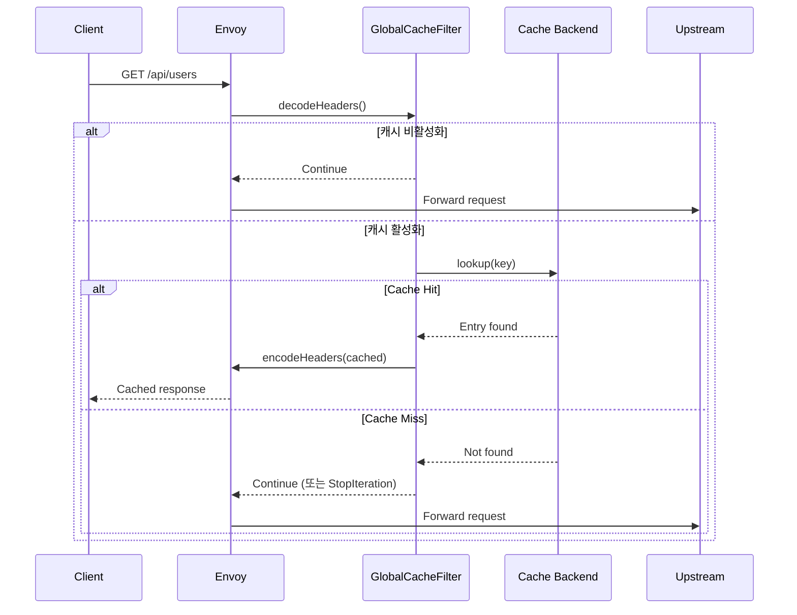
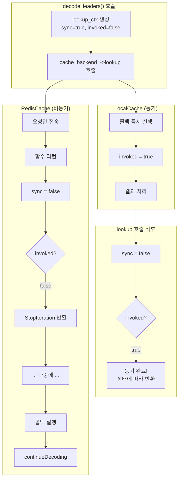
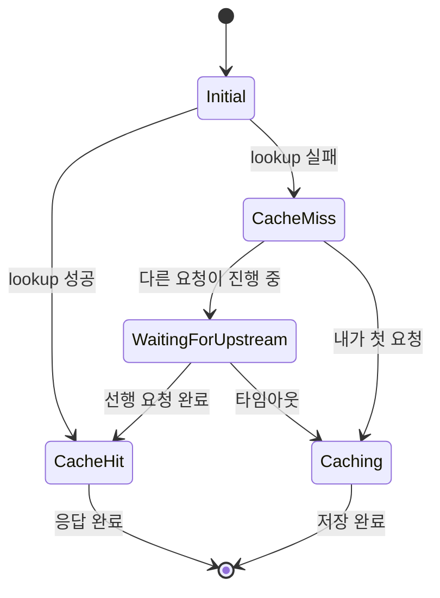

# Chapter 5. decodeHeaders: 요청 처리의 시작점

> **이 장의 목표**: 필터의 핵심 진입점인 `decodeHeaders`를 완벽히 이해합니다. 특히 LocalCache(동기)와 RedisCache(비동기)를 동일한 코드로 처리하는 기법을 배웁니다.

---

## 5.1 decodeHeaders가 하는 일

HTTP 요청이 도착하면 가장 먼저 `decodeHeaders`가 호출됩니다.



---

## 5.2 전체 코드 흐름

```cpp
Http::FilterHeadersStatus GlobalCacheFilter::decodeHeaders(
    Http::RequestHeaderMap& headers, bool end_stream) {
    
    // ========== Phase 1: 설정 적용 ==========
    // 라우트별 override 확인 및 적용
    if (const auto* per_route_config = ...) {
        cache_enabled_ = !per_route_config->disabled();
        // TTL, 캐시 키 override 적용
    }
    
    if (!cache_enabled_) {
        return Http::FilterHeadersStatus::Continue;
    }
    
    // ========== Phase 2: 캐시 가능성 검사 ==========
    cacheable_request_ = isCacheableRequest(headers);
    if (!cacheable_request_) {
        return Http::FilterHeadersStatus::Continue;
    }
    
    // ========== Phase 3: 캐시 키 생성 ==========
    cache_key_ = generateCacheKey(headers);
    
    // ========== Phase 4: 비동기 캐시 조회 ==========
    // (다음 섹션에서 상세 설명)
    
    // ========== Phase 5: 반환 값 결정 ==========
    // (동기/비동기 분기 처리)
}
```

---

## 5.3 동기/비동기 통합 처리의 도전

가장 까다로운 부분입니다. `CacheBackend`는 비동기 인터페이스지만:

| 백엔드 | 콜백 실행 시점 |
|--------|---------------|
| LocalCache | **즉시** (동기) |
| RedisCache | **나중에** (비동기) |

같은 코드로 두 경우를 모두 처리해야 합니다!

### 문제 상황

```cpp
// 잘못된 접근 (동기만 가정)
void decodeHeaders() {
    CacheLookupResult result;
    
    cache_backend_->lookup(key, [&result](CacheLookupResult&& r) {
        result = std::move(r);  // LocalCache: 여기서 즉시 실행
    });
    
    // LocalCache: result가 채워져 있음 ✓
    // RedisCache: result가 비어있음! ✗
    if (result.status == CacheLookupStatus::Hit) { ... }
}
```

### 해결책: 콜백 실행 여부 추적

```cpp
struct LookupContext {
    std::atomic<bool> sync{true};      // 동기 호출 중인가?
    std::atomic<bool> invoked{false};  // 콜백이 실행되었는가?
};
```

---

## 5.4 핵심 코드 분석

```cpp
Http::FilterHeadersStatus GlobalCacheFilter::decodeHeaders(...) {
    // ... 캐시 키 생성까지 완료 ...
    
    // 콜백 실행 추적을 위한 컨텍스트
    struct LookupContext {
        std::atomic<bool> sync{true};
        std::atomic<bool> invoked{false};
    };
    auto lookup_ctx = std::make_shared<LookupContext>();
    
    // ===== 비동기 캐시 조회 =====
    cache_backend_->lookup(cache_key_, [this, lookup_ctx](CacheLookupResult&& result) {
        
        // 콜백이 실행되었음을 기록
        lookup_ctx->invoked.store(true);
        
        // 동기 호출 중인지 확인
        const bool is_sync = lookup_ctx->sync.load();
        
        if (result.status == CacheLookupStatus::Hit) {
            // 캐시 HIT
            state_ = FilterState::CacheHit;
            serveCachedResponse(result.entry, "HIT");
            return;
        }
        
        // 캐시 MISS - Single-flight 처리
        // (다음 장에서 상세 설명)
        
        // 비동기인 경우 요청 처리 재개
        if (!is_sync && state_ == FilterState::CacheMiss) {
            decoder_callbacks_->continueDecoding();
        }
    });
    
    // ===== 이제 비동기 =====
    lookup_ctx->sync.store(false);
    
    // ===== 반환 값 결정 =====
    if (lookup_ctx->invoked.load()) {
        // 콜백이 이미 실행됨 (LocalCache - 동기)
        if (state_ == FilterState::CacheHit || 
            state_ == FilterState::WaitingForUpstream) {
            return Http::FilterHeadersStatus::StopAllIterationAndWatermark;
        }
        // CacheMiss - 다음 필터로
        return Http::FilterHeadersStatus::Continue;
        
    } else {
        // 콜백이 아직 실행 안 됨 (RedisCache - 비동기)
        // 콜백에서 continueDecoding()이 호출될 것임
        return Http::FilterHeadersStatus::StopAllIterationAndWatermark;
    }
}
```

### 실행 흐름 다이어그램



---

## 5.5 캐시 히트: 응답 주입

캐시에서 응답을 찾으면 `serveCachedResponse`로 클라이언트에게 직접 응답합니다.

```cpp
void GlobalCacheFilter::serveCachedResponse(
    const std::shared_ptr<CacheEntry>& cached_entry,
    const std::string& cache_status) {
    
    // 1. 헤더 복사
    auto response_headers = Http::ResponseHeaderMapImpl::create();
    cached_entry->headers->iterate(
        [&response_headers](const Http::HeaderEntry& header) -> Http::HeaderMap::Iterate {
            response_headers->addCopy(
                Http::LowerCaseString(std::string(header.key().getStringView())),
                std::string(header.value().getStringView()));
            return Http::HeaderMap::Iterate::Continue;
        });
    
    // 2. 캐시 상태 헤더 추가
    response_headers->addCopy(Http::LowerCaseString("x-cache"), cache_status);
    
    // 3. 바디 존재 여부 확인
    bool has_body = cached_entry->body.length() > 0;
    
    // 4. 응답 헤더 주입 (end_stream = !has_body)
    decoder_callbacks_->encodeHeaders(
        std::move(response_headers), 
        !has_body,           // 바디 없으면 스트림 종료
        "global_cache_hit"   // 통계/로깅용 태그
    );
    
    // 5. 바디 주입 (있는 경우)
    if (has_body) {
        Buffer::OwnedImpl body_copy;
        body_copy.add(cached_entry->body);
        decoder_callbacks_->encodeData(body_copy, true);  // end_stream = true
    }
}
```

### 핵심 포인트

**`decoder_callbacks_->encodeHeaders`**: 
- 응답 경로로 점프
- 업스트림으로 가지 않고 바로 클라이언트에게 응답

**헤더 복사가 필요한 이유**:
- 캐시된 헤더는 여러 요청에서 공유됨
- 원본을 수정하면 다른 요청에 영향

---

## 5.6 shared_from_this()가 필요한 이유

콜백에서 `this`를 사용할 때 주의해야 합니다.

### 위험한 패턴

```cpp
cache_backend_->lookup(key, [this](CacheLookupResult&& result) {
    // ❌ 위험! 
    // 콜백이 실행될 때 Filter 객체가 이미 파괴되었을 수 있음
    this->serveCachedResponse(result.entry, "HIT");
});
```

### 안전한 패턴

```cpp
cache_backend_->lookup(key, [this, lookup_ctx](CacheLookupResult&& result) {
    // ✅ lookup_ctx가 shared_ptr이므로 콜백이 실행될 때까지 살아있음
    // 하지만 'this'는 여전히 raw pointer...
});
```

### 더 안전한 패턴 (Single-flight에서 사용)

```cpp
std::weak_ptr<GlobalCacheFilter> weak_self = shared_from_this();

timer->enableTimer([weak_self]() {
    if (auto self = weak_self.lock()) {
        // ✅ 객체가 살아있으면 실행
        self->onSingleFlightTimeout();
    }
    // 객체가 파괴되었으면 조용히 무시
});
```

### GlobalCacheFilter의 상속 구조

```cpp
class GlobalCacheFilter : public Http::PassThroughFilter,
                          public std::enable_shared_from_this<GlobalCacheFilter>,
                          public Logger::Loggable<Logger::Id::filter> {
```

`enable_shared_from_this`를 상속받아야 `shared_from_this()`를 사용할 수 있습니다.

---

## 5.7 Go로 이해하는 동기/비동기 분기

Go에서 같은 패턴을 구현한다면:

```go
type LookupContext struct {
    sync    atomic.Bool
    invoked atomic.Bool
    result  CacheLookupResult
    done    chan struct{}
}

func (f *Filter) decodeHeaders() FilterStatus {
    ctx := &LookupContext{done: make(chan struct{})}
    ctx.sync.Store(true)
    
    // 비동기 조회 시작
    go func() {
        result := f.cacheBackend.Lookup(f.cacheKey)
        ctx.result = result
        ctx.invoked.Store(true)
        
        // 비동기인 경우에만 채널로 통지
        if !ctx.sync.Load() {
            close(ctx.done)
        }
    }()
    
    ctx.sync.Store(false)
    
    if ctx.invoked.Load() {
        // 동기 완료 (로컬 캐시)
        return f.handleResult(ctx.result)
    }
    
    // 비동기 - 고루틴 완료 대기 (실제로는 논블로킹 처리 필요)
    <-ctx.done
    return f.handleResult(ctx.result)
}
```

하지만 Go에서는 보통 이렇게 하지 않고, 채널을 사용하거나 `context.Context`로 처리합니다.

---

## 5.8 상태 관리

필터는 상태 머신으로 동작합니다:

```cpp
enum class FilterState {
    Initial,            // 초기 상태
    CacheHit,           // 캐시 히트, 응답 제공 중
    CacheMiss,          // 캐시 미스, 업스트림으로 진행
    WaitingForUpstream, // Single-flight 대기 중
    Caching             // 업스트림 응답 캐싱 중
};
```

### 상태 전이도



---

## 5.9 decodeData: 요청 바디 처리

`decodeData`는 요청 바디가 도착할 때 호출됩니다.

```cpp
Http::FilterDataStatus GlobalCacheFilter::decodeData(Buffer::Instance&, bool) {
    // 캐시 비활성화 - 패스스루
    if (!cache_enabled_) {
        return Http::FilterDataStatus::Continue;
    }
    
    // 캐시 히트 또는 대기 중 - 요청 바디 무시
    if (state_ == FilterState::CacheHit || 
        state_ == FilterState::WaitingForUpstream) {
        return Http::FilterDataStatus::StopIterationNoBuffer;
    }
    
    // 캐시 미스 - 바디도 업스트림으로
    return Http::FilterDataStatus::Continue;
}
```

**핵심**: 캐시 히트 시 요청 바디는 필요 없으므로 버퍼링하지 않음

---

## 5.10 에러 처리

### 캐시 백엔드 실패 시

```cpp
// CacheLookupStatus::Error 처리
if (result.status == CacheLookupStatus::Error) {
    // 에러는 미스로 처리하고 업스트림으로 진행
    // (캐시가 죽어도 서비스는 계속)
    state_ = FilterState::CacheMiss;
    if (!is_sync) {
        decoder_callbacks_->continueDecoding();
    }
}
```

**철학**: 캐시 실패가 서비스 실패를 일으키면 안 됨

---

## 5.11 요약

| 단계 | 설명 | 결과 |
|------|------|------|
| 1. 설정 적용 | 라우트별 override 확인 | cache_enabled, TTL, 키 설정 |
| 2. 캐시 가능성 | 메서드 확인 (GET/HEAD) | cacheable_request |
| 3. 키 생성 | 설정에 따라 키 조합 | cache_key |
| 4. 캐시 조회 | 비동기 lookup | 콜백으로 결과 |
| 5. 결과 처리 | 히트/미스 분기 | 응답 주입 또는 진행 |

**동기/비동기 통합 패턴**:
```cpp
LookupContext ctx;
ctx.sync = true;

backend->lookup([&ctx]() {
    ctx.invoked = true;
    // 결과 처리
    if (!ctx.sync) continueDecoding();
});

ctx.sync = false;

if (ctx.invoked) {
    // 동기 완료
} else {
    return StopIteration;  // 비동기 대기
}
```

---

## 5.12 다음 장 예고

캐시 미스 후 **Single-flight** 패턴이 어떻게 동작하는지 상세히 분석합니다:
- `InFlightRequest` 구조
- `waiters` 목록과 `weak_ptr`
- 타임아웃 처리
- 완료 통지 메커니즘

---

> **체크리스트 ✓**
> - [ ] `decodeHeaders`의 5단계를 설명할 수 있다
> - [ ] 동기/비동기 콜백을 통합 처리하는 패턴을 이해한다
> - [ ] `StopAllIterationAndWatermark`와 `continueDecoding()`의 관계를 안다
> - [ ] `shared_from_this()`가 왜 필요한지 설명할 수 있다
> - [ ] 캐시 히트 시 응답이 어떻게 주입되는지 안다
