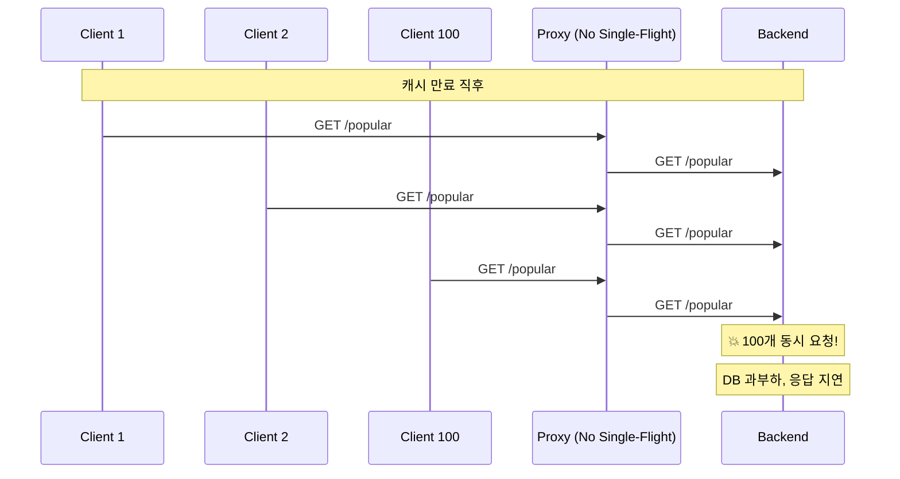
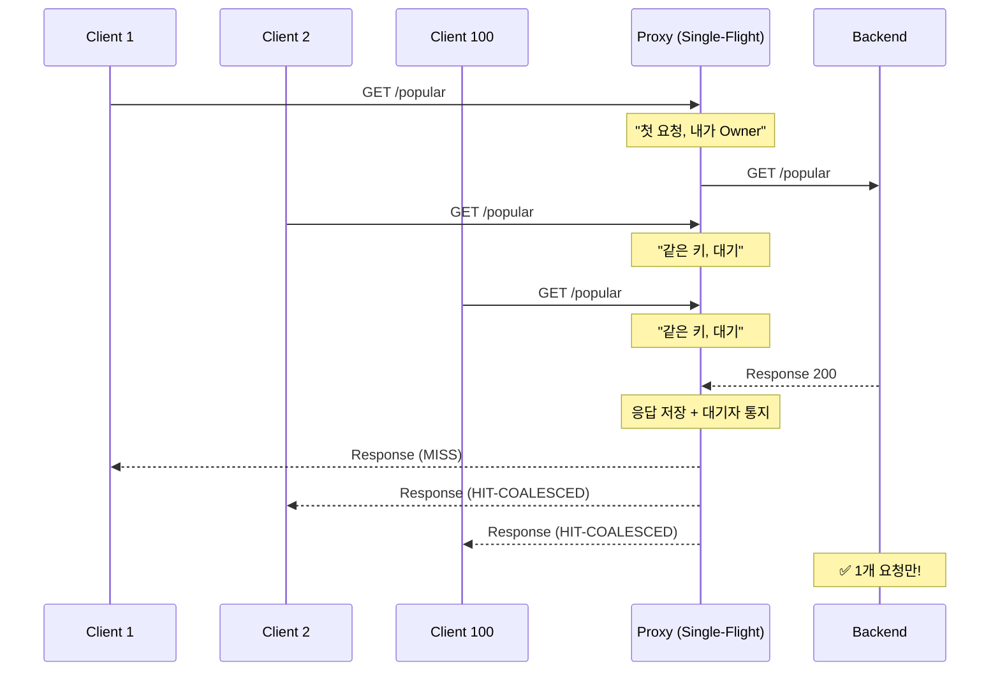
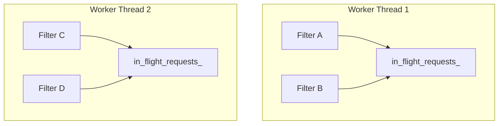
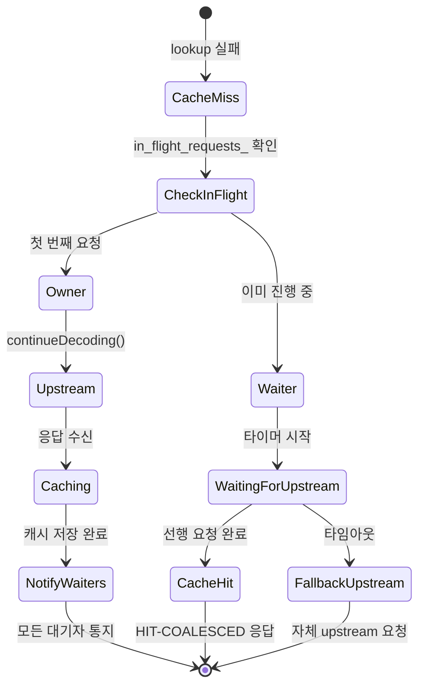
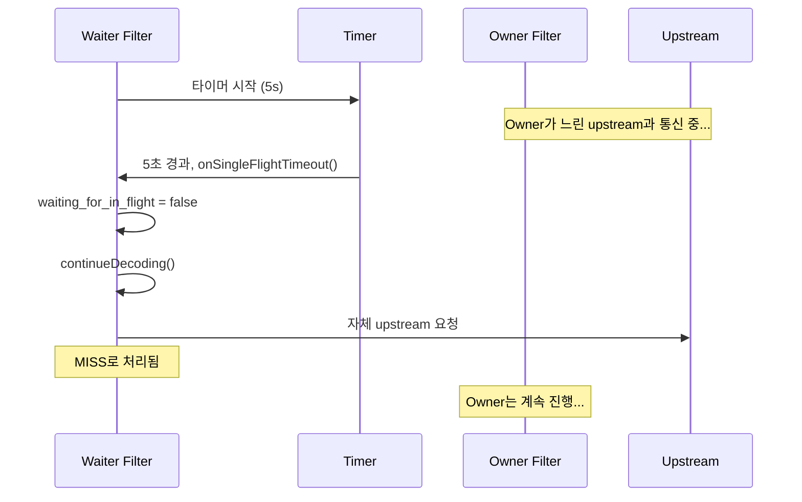

# Chapter 6. Single-Flight: 요청 합류의 모든 것

> **이 장의 목표**: Thundering Herd 문제를 해결하는 Single-Flight 패턴의 구현을 완벽히 이해합니다. C++에서의 수명 관리와 동기화 기법을 배웁니다.

---

## 6.1 Thundering Herd 문제

캐시가 만료되거나 cold start 상황에서 발생합니다:



### Single-Flight 적용 후



---

## 6.2 핵심 자료구조

### InFlightRequest

```cpp
struct InFlightRequest {
    bool completed{false};                              // 완료 여부
    std::shared_ptr<CacheEntry> result{nullptr};        // 결과 (있으면 히트)
    std::vector<std::weak_ptr<GlobalCacheFilter>> waiters;  // 대기자 목록
};
```

### 전역 맵 (Thread Local)

```cpp
// 워커 스레드별 독립 저장소
thread_local std::unordered_map<std::string, std::shared_ptr<InFlightRequest>>
    GlobalCacheFilter::in_flight_requests_;
```

**왜 `thread_local`인가?**



- **Lock-free**: 각 워커가 자신만의 맵 사용
- **Trade-off**: 워커 수만큼 중복 upstream 요청 가능 (2~8개)

---

## 6.3 Single-Flight 흐름

### 캐시 미스 시 분기

```cpp
// 캐시 미스 처리
if (result.status == CacheLookupStatus::Miss) {
    bool is_first_request = false;
    
    {
        auto it = in_flight_requests_.find(cache_key_);
        
        if (it != in_flight_requests_.end()) {
            // ===== 다른 요청이 이미 진행 중 =====
            std::weak_ptr<GlobalCacheFilter> weak_self = shared_from_this();
            it->second->waiters.push_back(std::move(weak_self));
            
            state_ = FilterState::WaitingForUpstream;
            waiting_for_in_flight_ = true;
            
            // 타임아웃 타이머 설정
            setupSingleFlightTimer();
        } else {
            // ===== 내가 첫 번째 요청 =====
            in_flight_requests_[cache_key_] = std::make_shared<InFlightRequest>();
            is_first_request = true;
            owns_in_flight_ = true;
            in_flight_key_ = cache_key_;
            
            state_ = FilterState::CacheMiss;
        }
    }
    
    if (!is_first_request) {
        // 대기 - 콜백에서 재개됨
        return;
    }
    
    // 첫 요청 - 업스트림으로 진행
    if (!is_sync) {
        decoder_callbacks_->continueDecoding();
    }
}
```

### 상태 다이어그램



---

## 6.4 waiters에 weak_ptr를 쓰는 이유

### 순환 참조 문제

```cpp
// ❌ 만약 shared_ptr를 사용한다면?
struct InFlightRequest {
    std::vector<std::shared_ptr<GlobalCacheFilter>> waiters;  // 강한 참조
};
```

**문제 시나리오**:
1. Filter A가 Owner, Filter B가 Waiter
2. InFlightRequest가 Filter B를 `shared_ptr`로 참조
3. Filter B의 요청이 취소됨 (클라이언트 disconnect)
4. Filter B는 파괴되어야 하는데... InFlightRequest가 참조 중!
5. **메모리 누수** 또는 **Use-after-free**

### weak_ptr 해결책

```cpp
struct InFlightRequest {
    std::vector<std::weak_ptr<GlobalCacheFilter>> waiters;  // 약한 참조
};
```

```cpp
// 대기자 등록
std::weak_ptr<GlobalCacheFilter> weak_self = shared_from_this();
it->second->waiters.push_back(std::move(weak_self));
```

```cpp
// 통지 시
for (const auto& waiter : it->second->waiters) {
    if (auto filter = waiter.lock()) {  // 아직 살아있으면
        filter->onInFlightComplete(entry);
    }
    // 파괴되었으면 조용히 무시
}
```

### 비유로 이해하기

**shared_ptr**: "친구를 내 집에 가둠" - 내가 해제할 때까지 못 나감
**weak_ptr**: "친구의 전화번호" - 전화해서 안 받으면 그냥 포기

---

## 6.5 타임아웃 처리

선행 요청이 오래 걸리면 대기자도 무한정 기다려야 할까요?

### 타이머 설정

```cpp
void setupSingleFlightTimer() {
    if (!single_flight_timer_) {
        std::weak_ptr<GlobalCacheFilter> weak_self = shared_from_this();
        
        single_flight_timer_ = decoder_callbacks_->dispatcher().createTimer(
            [weak_self]() {
                if (auto self = weak_self.lock()) {
                    self->onSingleFlightTimeout();
                }
            });
    }
    
    single_flight_timer_->enableTimer(config_->singleFlightTimeout());
}
```

### 타임아웃 콜백

```cpp
void GlobalCacheFilter::onSingleFlightTimeout() {
    // 아직 대기 중인지 확인
    if (!waiting_for_in_flight_ || state_ != FilterState::WaitingForUpstream) {
        return;
    }
    
    ENVOY_LOG(warn,
        "global_cache: timeout waiting for in-flight request for key: {} "
        "- proceeding to upstream",
        cache_key_);
    
    // 대기 포기, 직접 upstream으로
    waiting_for_in_flight_ = false;
    state_ = FilterState::CacheMiss;
    decoder_callbacks_->continueDecoding();
}
```

### 타임아웃 흐름



---

## 6.6 Owner의 완료 처리

업스트림 응답을 받고 캐시에 저장한 후, 대기자들에게 통지합니다.

### 완료 통지

```cpp
void GlobalCacheFilter::notifyInFlightWaiters(
    const std::string& key,
    const std::shared_ptr<CacheEntry>& entry) {
    
    // 1. 대기자 목록 추출
    std::vector<std::shared_ptr<GlobalCacheFilter>> waiters;
    
    auto it = in_flight_requests_.find(key);
    if (it == in_flight_requests_.end()) {
        return;
    }
    
    // 완료 표시
    it->second->completed = true;
    it->second->result = entry;
    
    // weak_ptr를 shared_ptr로 변환 (살아있는 것만)
    for (const auto& waiter : it->second->waiters) {
        if (auto filter = waiter.lock()) {
            waiters.push_back(filter);
        }
    }
    
    // 2. 맵에서 제거
    in_flight_requests_.erase(it);
    
    // 3. 대기자들에게 통지
    for (const auto& waiter : waiters) {
        waiter->onInFlightComplete(entry);
    }
}
```

### 대기자의 완료 콜백

```cpp
void GlobalCacheFilter::onInFlightComplete(
    const std::shared_ptr<CacheEntry>& entry) {
    
    // 이미 다른 방법으로 처리되었으면 무시
    if (!waiting_for_in_flight_ || state_ != FilterState::WaitingForUpstream) {
        return;
    }
    
    waiting_for_in_flight_ = false;
    
    // 타이머 정리
    if (single_flight_timer_) {
        single_flight_timer_->disableTimer();
    }
    
    if (entry) {
        // 성공 - 캐시된 응답 제공
        state_ = FilterState::CacheHit;
        serveCachedResponse(entry, "HIT-COALESCED");
    } else {
        // 실패 - 직접 upstream으로
        state_ = FilterState::CacheMiss;
        decoder_callbacks_->continueDecoding();
    }
}
```

---

## 6.7 리소스 정리: onDestroy()

필터가 파괴될 때 반드시 정리해야 합니다.

```cpp
void GlobalCacheFilter::onDestroy() {
    // 1. 타이머 정리
    if (single_flight_timer_) {
        single_flight_timer_->disableTimer();
    }
    
    // 2. 대기 상태 초기화
    waiting_for_in_flight_ = false;
    
    // 3. Owner인 경우 대기자 통지
    if (owns_in_flight_) {
        notifyInFlightWaiters(in_flight_key_, nullptr);  // nullptr = 실패
        owns_in_flight_ = false;
    }
}
```

### 왜 중요한가?

Owner 필터가 중간에 파괴되면 (클라이언트 disconnect 등):
- 대기자들은 영원히 대기하게 됨
- `onDestroy()`에서 `nullptr`로 통지하면 대기자들이 직접 upstream으로 진행

---

## 6.8 동시성 테스트 결과

```
환경: --concurrency 2 (워커 2개)
테스트: 동일 URL로 8개 동시 요청
```

### 예상 결과

```
Worker 1: 4개 요청 처리
  - 1개 MISS (Owner)
  - 3개 HIT-COALESCED (Waiters)

Worker 2: 4개 요청 처리
  - 1개 MISS (Owner)  
  - 3개 HIT-COALESCED (Waiters)

총: 2개 upstream 요청 (워커당 1개)
```

### 실제 로그

```
[info] global_cache: cache MISS for key: |m:3:GET|... - sending to upstream
[info] global_cache: WAITING for in-flight request for key: |m:3:GET|...
[info] global_cache: WAITING for in-flight request for key: |m:3:GET|...
[info] global_cache: WAITING for in-flight request for key: |m:3:GET|...
[info] global_cache: cached response (1234 bytes) for key: |m:3:GET|...
[info] global_cache: serving cached response for key: |m:3:GET|... (status: HIT-COALESCED)
[info] global_cache: serving cached response for key: |m:3:GET|... (status: HIT-COALESCED)
[info] global_cache: serving cached response for key: |m:3:GET|... (status: HIT-COALESCED)
```

---

## 6.9 Go의 singleflight와 비교

### Go 구현

```go
import "golang.org/x/sync/singleflight"

var group singleflight.Group

func fetch(key string) ([]byte, error) {
    result, err, shared := group.Do(key, func() (interface{}, error) {
        return http.Get(upstream + key)
    })
    
    if shared {
        // 다른 요청과 결과 공유됨
        log.Println("HIT-COALESCED")
    }
    
    return result.([]byte), err
}
```

### C++ 구현의 차이점

| 측면 | Go singleflight | GlobalCacheFilter |
|------|-----------------|-------------------|
| 스레드 모델 | 단일 프로세스 + 고루틴 | 멀티 워커 + TLS |
| 동기화 | `sync.Mutex` 하나 | 워커별 독립 (Lock-free) |
| 대기 메커니즘 | 채널 (`chan`) | 콜백 + 타이머 |
| 메모리 관리 | GC | `shared_ptr` + `weak_ptr` |
| 타임아웃 | `context.Context` | `Event::Timer` |

### C++ 코드의 복잡성 이유

1. **비동기 + 콜백**: 상태 머신 필요
2. **수명 관리**: `weak_ptr`로 순환 참조 방지
3. **멀티 스레드**: TLS로 Lock-free 구현
4. **리소스 정리**: `onDestroy()`에서 명시적 정리

---

## 6.10 설정 옵션

```yaml
- name: envoy.filters.http.global_cache
  typed_config:
    "@type": type.googleapis.com/.../GlobalCache
    single_flight_timeout: { seconds: 5 }  # 대기 타임아웃
```

### 권장값

| 상황 | 권장 타임아웃 |
|------|--------------|
| 빠른 백엔드 (< 100ms) | 1-2초 |
| 일반 백엔드 (100ms-1s) | 5초 (기본값) |
| 느린 백엔드 (> 1s) | 10-30초 |

**주의**: 너무 짧으면 대기자가 모두 upstream으로 가서 효과 없음

---

## 6.11 요약

| 역할 | 설명 | 상태 |
|------|------|------|
| **Owner** | 첫 번째 요청, upstream으로 감 | `owns_in_flight_ = true` |
| **Waiter** | 대기, 타이머 설정 | `waiting_for_in_flight_ = true` |
| **Notifier** | Owner가 완료 후 대기자 통지 | `notifyInFlightWaiters()` |

**핵심 메커니즘**:
- `in_flight_requests_`: `thread_local` 맵으로 Lock-free
- `weak_ptr waiters`: 순환 참조 방지
- `single_flight_timer_`: 타임아웃 시 fallback
- `onDestroy()`: Owner 중단 시 대기자 해제

---

## 6.12 다음 장 예고

다음 장에서는 **응답 처리 경로**를 분석합니다:
- `encodeHeaders`: 캐시 가능 응답 판별
- `encodeData`: 바디 버퍼링
- 캐시 저장 트리거

---

> **체크리스트 ✓**
> - [ ] Single-flight 패턴이 Thundering Herd를 어떻게 해결하는지 설명할 수 있다
> - [ ] `InFlightRequest` 구조체의 역할을 안다
> - [ ] `weak_ptr`가 왜 필요한지 설명할 수 있다
> - [ ] 타임아웃 처리 흐름을 이해한다
> - [ ] `onDestroy()`에서 왜 대기자를 통지해야 하는지 안다
> - [ ] Go의 `singleflight`와 차이점을 설명할 수 있다
