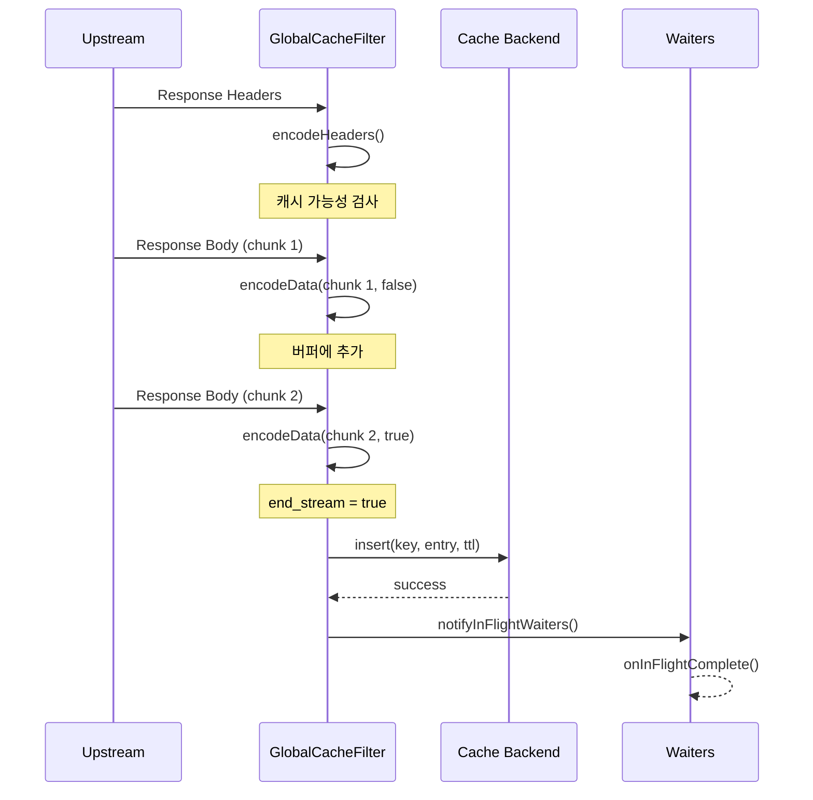
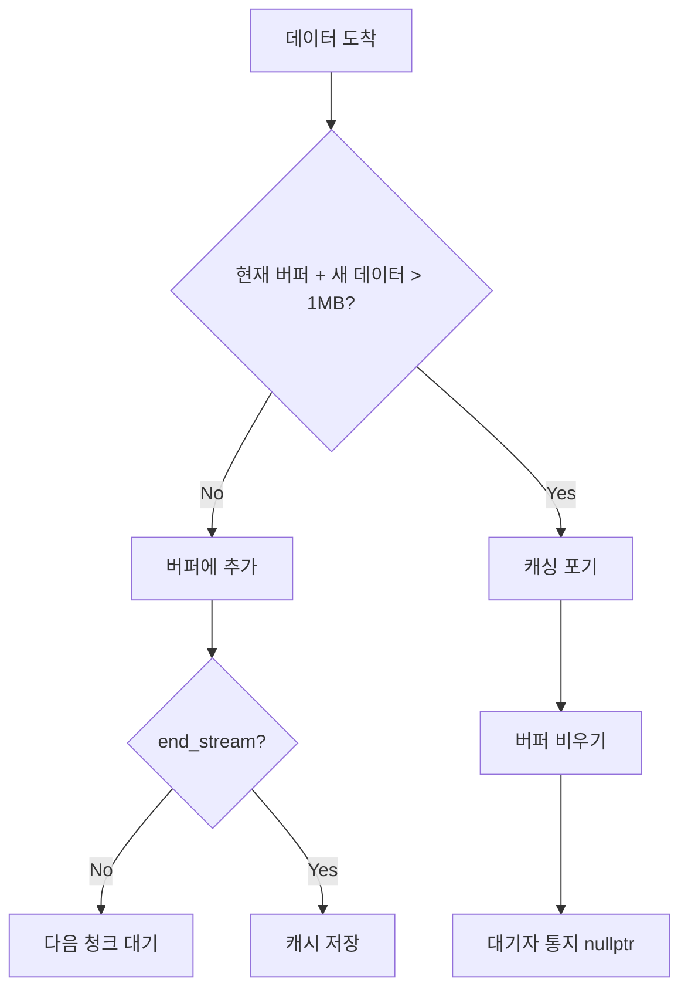
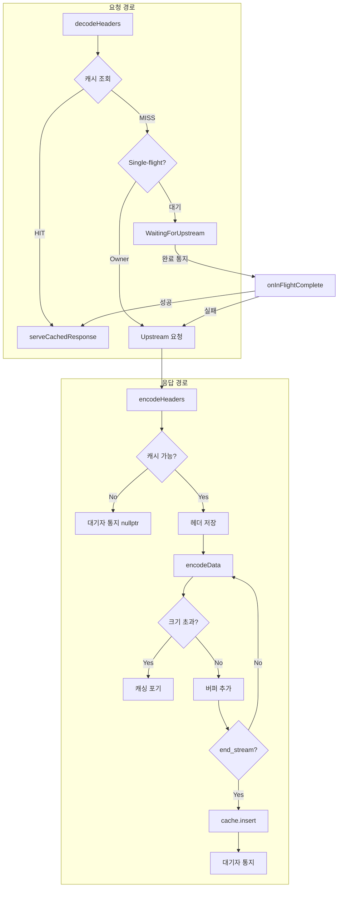

# Chapter 7. encodeHeaders/encodeData: 응답 캐싱

> **이 장의 목표**: 업스트림 응답을 버퍼링하고 캐시에 저장하는 과정을 이해합니다. 메모리 관리와 대기자 통지 메커니즘을 배웁니다.

---

## 7.1 응답 처리 흐름 개요

업스트림에서 응답이 오면 `encodeHeaders`와 `encodeData`가 순차적으로 호출됩니다.



---

## 7.2 encodeHeaders: 캐시 가능성 검사

```cpp
Http::FilterHeadersStatus GlobalCacheFilter::encodeHeaders(
    Http::ResponseHeaderMap& headers,
    bool end_stream) {
    
    // 1. 캐시 비활성화 - 패스스루
    if (!cache_enabled_) {
        return Http::FilterHeadersStatus::Continue;
    }
    
    // 2. 캐시 불가능한 요청이었으면 패스스루
    if (!cacheable_request_) {
        return Http::FilterHeadersStatus::Continue;
    }
    
    // 3. 캐시 히트/대기 상태면 패스스루
    if (state_ == FilterState::CacheHit || 
        state_ == FilterState::WaitingForUpstream) {
        return Http::FilterHeadersStatus::Continue;
    }
    
    // 4. 응답 캐시 가능성 검사
    cacheable_response_ = isCacheableResponse(headers);
    if (!cacheable_response_) {
        // Owner인 경우 대기자에게 실패 통지
        if (owns_in_flight_) {
            notifyInFlightWaiters(in_flight_key_, nullptr);
            owns_in_flight_ = false;
        }
        state_ = FilterState::CacheMiss;
        return Http::FilterHeadersStatus::Continue;
    }
    
    // 5. 캐싱 시작
    state_ = FilterState::Caching;
    
    // 6. 헤더 복사본 저장
    response_headers_ = Http::ResponseHeaderMapImpl::create();
    headers.iterate([this](const Http::HeaderEntry& header) 
        -> Http::HeaderMap::Iterate {
        response_headers_->addCopy(
            Http::LowerCaseString(std::string(header.key().getStringView())),
            std::string(header.value().getStringView()));
        return Http::HeaderMap::Iterate::Continue;
    });
    
    // 7. 바디 없이 완료되는 경우 (204 No Content 등)
    if (end_stream) {
        saveEmptyBodyResponse();
    }
    
    // 8. 캐시 미스 표시 헤더 추가
    headers.addCopy(Http::LowerCaseString("x-cache"), "MISS");
    
    return Http::FilterHeadersStatus::Continue;
}
```

### 캐시 가능성 검사 상세

```cpp
bool GlobalCacheFilter::isCacheableResponse(
    const Http::ResponseHeaderMap& headers) const {
    
    // 상태 코드 확인 (기본: 200-299)
    const auto status = Http::Utility::getResponseStatus(headers);
    if (!config_->allowedStatusCodes().contains(status)) {
        return false;
    }
    
    // Set-Cookie 헤더 확인
    if (config_->skipIfResponseHasSetCookie() &&
        !headers.get(Http::Headers::get().SetCookie).empty()) {
        return false;  // 개인화된 응답, 캐시 불가
    }
    
    // Cache-Control 헤더 확인
    if (config_->skipIfResponseHasCacheControl() &&
        !headers.get(Http::CustomHeaders::get().CacheControl).empty()) {
        return false;  // 원본이 캐시 정책 지정, 존중
    }
    
    return true;
}
```

---

## 7.3 encodeData: 바디 버퍼링

```cpp
Http::FilterDataStatus GlobalCacheFilter::encodeData(
    Buffer::Instance& data,
    bool end_stream) {
    
    // 캐시 비활성화/불가능 - 패스스루
    if (!cache_enabled_ || !cacheable_request_ || !cacheable_response_) {
        return Http::FilterDataStatus::Continue;
    }
    
    // 캐시 히트/대기 상태 - 패스스루
    if (state_ == FilterState::CacheHit || 
        state_ == FilterState::WaitingForUpstream) {
        return Http::FilterDataStatus::Continue;
    }
    
    // 바디 버퍼링
    uint64_t length = data.length();
    if (length > 0) {
        // 크기 제한 확인 (기본: 1MB)
        if (buffered_body_.length() + length > kMaxCachedResponseBytes) {
            // 너무 큼 - 캐싱 포기
            cacheable_response_ = false;
            buffered_body_.drain(buffered_body_.length());  // 버퍼 비우기
            response_headers_.reset();
            
            if (owns_in_flight_) {
                notifyInFlightWaiters(in_flight_key_, nullptr);
                owns_in_flight_ = false;
            }
            return Http::FilterDataStatus::Continue;
        }
        
        // 버퍼에 추가
        buffered_body_.add(data);
    }
    
    // 스트림 완료 시 캐시 저장
    if (end_stream && response_headers_) {
        saveCacheEntry();
    }
    
    return Http::FilterDataStatus::Continue;
}
```

---

## 7.4 메모리 관리: kMaxCachedResponseBytes

```cpp
static constexpr size_t kMaxCachedResponseBytes = 1024 * 1024;  // 1MB
```

### 왜 제한이 필요한가?

1. **메모리 고갈 방지**: 100MB 응답을 100개 캐싱하면 10GB
2. **버퍼 복사 비용**: 큰 응답은 복사 비용이 큼
3. **캐시 효율**: 큰 응답은 캐시 적중률이 낮음

### 제한 초과 시 동작



---

## 7.5 캐시 저장 트리거

```cpp
void GlobalCacheFilter::saveCacheEntry() {
    // 만료 시간 계산
    auto expiration = std::chrono::steady_clock::now() + effective_default_ttl_;
    
    // CacheEntry 생성
    auto cached_entry = std::make_shared<CacheEntry>(
        std::move(buffered_body_),      // 소유권 이전
        std::move(response_headers_),    // 소유권 이전
        expiration
    );
    
    // 캐시 백엔드에 저장
    const std::string cache_key_copy = cache_key_;  // 람다용 복사
    
    cache_backend_->insert(
        cache_key_,
        cached_entry,
        effective_default_ttl_,
        [cache_key_copy, cached_entry](bool success) {
            if (success) {
                ENVOY_LOG(info, "global_cache: cached response ({} bytes) "
                         "for key: {}", cached_entry->body.length(), cache_key_copy);
                notifyInFlightWaiters(cache_key_copy, cached_entry);
            } else {
                ENVOY_LOG(warn, "global_cache: failed to cache entry "
                         "for key: {}", cache_key_copy);
                notifyInFlightWaiters(cache_key_copy, nullptr);
            }
        }
    );
}
```

### std::move의 중요성

```cpp
// ❌ 비효율적 (복사)
auto cached_entry = std::make_shared<CacheEntry>(
    buffered_body_,      // 1MB 복사!
    response_headers_,   // 복사!
    expiration
);

// ✅ 효율적 (이동)
auto cached_entry = std::make_shared<CacheEntry>(
    std::move(buffered_body_),      // 포인터만 이동
    std::move(response_headers_),   // 포인터만 이동
    expiration
);
```

이동 후 원본 변수는 **빈 상태**가 됩니다 (더 이상 사용하면 안 됨).

---

## 7.6 바디 없는 응답 처리

HTTP 204, 304 등은 바디가 없습니다.

```cpp
void GlobalCacheFilter::saveEmptyBodyResponse() {
    auto expiration = std::chrono::steady_clock::now() + effective_default_ttl_;
    
    Buffer::OwnedImpl empty_body;  // 빈 버퍼
    
    auto cached_entry = std::make_shared<CacheEntry>(
        std::move(empty_body),
        std::move(response_headers_),
        expiration
    );
    
    cache_backend_->insert(
        cache_key_,
        cached_entry,
        effective_default_ttl_,
        [cache_key = cache_key_, cached_entry](bool success) {
            if (success) {
                ENVOY_LOG(info, "global_cache: cached empty response for key: {}",
                         cache_key);
                notifyInFlightWaiters(cache_key, cached_entry);
            } else {
                notifyInFlightWaiters(cache_key, nullptr);
            }
        }
    );
}
```

---

## 7.7 x-cache 헤더

응답에 추가되는 캐시 상태 헤더:

| 값 | 의미 |
|----|------|
| `HIT` | 캐시에서 제공됨 |
| `HIT-COALESCED` | Single-flight로 공유됨 |
| `MISS` | 업스트림에서 가져와서 캐시됨 |

### 추가 위치

```cpp
// 캐시 히트 시
void serveCachedResponse(...) {
    response_headers->addCopy(Http::LowerCaseString("x-cache"), cache_status);
    // cache_status = "HIT" 또는 "HIT-COALESCED"
}

// 캐시 미스 시 (업스트림 응답)
Http::FilterHeadersStatus encodeHeaders(...) {
    headers.addCopy(Http::LowerCaseString("x-cache"), "MISS");
}
```

---

## 7.8 전체 흐름 정리



---

## 7.9 에러 케이스 처리

### 업스트림 에러 (5xx)

```cpp
bool isCacheableResponse(...) {
    const auto status = Http::Utility::getResponseStatus(headers);
    // 기본: 200-299만 캐시
    if (!config_->allowedStatusCodes().contains(status)) {
        return false;  // 500, 502, 503 등은 캐시 안 함
    }
}
```

### 캐시 백엔드 실패

```cpp
cache_backend_->insert(..., [](bool success) {
    if (!success) {
        // 저장 실패 - 대기자에게 nullptr 통지
        notifyInFlightWaiters(cache_key, nullptr);
        // 대기자들은 직접 upstream으로 감
    }
});
```

### 요청 중단 (클라이언트 disconnect)

`onDestroy()`에서 처리:
```cpp
void onDestroy() {
    if (owns_in_flight_) {
        notifyInFlightWaiters(in_flight_key_, nullptr);
    }
}
```

---

## 7.10 성능 고려사항

### 버퍼 복사 최소화

```cpp
// 버퍼 추가 시 zero-copy (가능한 경우)
buffered_body_.add(data);  // data의 슬라이스를 참조

// 캐시 저장 시 이동
std::move(buffered_body_);  // 복사 없이 소유권 이전
```

### 헤더 반복 비용

```cpp
// 헤더는 반복 접근이 필요 (복사 불가피)
headers.iterate([this](const Http::HeaderEntry& header) {
    response_headers_->addCopy(...);  // 복사
});
```

### 콜백 컨텍스트 최소화

```cpp
// 람다에 필요한 것만 캡처
[cache_key_copy, cached_entry](bool success) { ... }
// this를 캡처하지 않음 - 콜백 시점에 Filter가 파괴되었을 수 있음
```

---

## 7.11 요약

| 메서드 | 역할 | 핵심 동작 |
|--------|------|----------|
| `encodeHeaders` | 응답 헤더 처리 | 캐시 가능성 검사, 헤더 복사 |
| `encodeData` | 응답 바디 처리 | 버퍼링, 크기 제한 |
| `saveCacheEntry` | 캐시 저장 | insert 호출, 대기자 통지 |

**메모리 관리**:
- `kMaxCachedResponseBytes` (1MB) 제한
- `std::move`로 복사 최소화
- 초과 시 버퍼 비우고 캐싱 포기

**대기자 통지**:
- 성공: `CacheEntry` 전달 → `HIT-COALESCED`
- 실패: `nullptr` 전달 → 직접 upstream

---

## 7.12 다음 장 예고

Part II가 완료되었습니다. Part III에서는 **캐시 백엔드 구현**을 상세히 분석합니다:
- 8장: `CacheBackend` 추상 인터페이스
- 9장: Local LRU 캐시 구현
- 10장: Redis 비동기 캐시 구현
- 11장: Tiered 캐시 (L1 + L2)
- 12장: 직렬화 포맷

---

> **체크리스트 ✓**
> - [ ] `encodeHeaders`의 역할을 설명할 수 있다
> - [ ] 캐시 가능 응답의 조건을 안다 (상태 코드, Set-Cookie, Cache-Control)
> - [ ] `kMaxCachedResponseBytes` 제한의 이유를 안다
> - [ ] `std::move`가 왜 중요한지 설명할 수 있다
> - [ ] `x-cache` 헤더의 세 가지 값을 구분할 수 있다
> - [ ] 캐시 저장 후 대기자 통지 흐름을 이해한다
