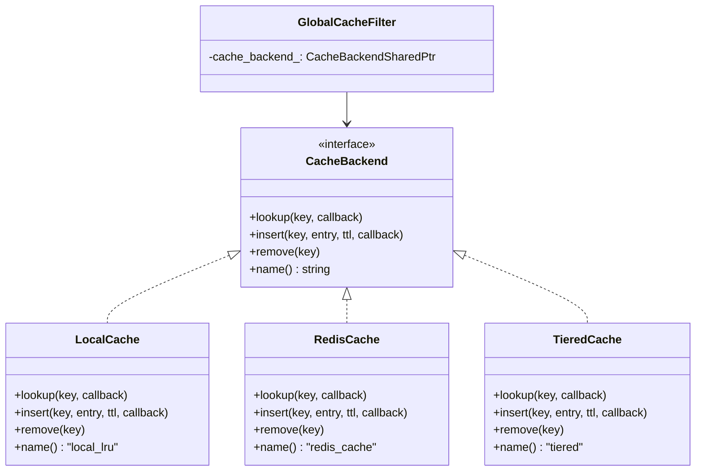
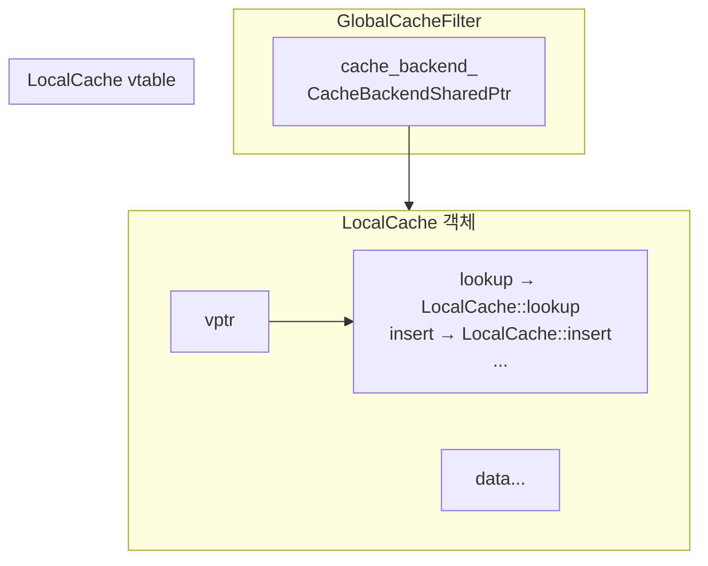

# Chapter 8. CacheBackend 인터페이스: 추상화의 힘

> **이 장의 목표**: 캐시 백엔드 추상화 인터페이스를 이해하고, C++에서 다형성(Polymorphism)이 어떻게 동작하는지 배웁니다.

---

## 8.1 왜 인터페이스가 필요한가?

`GlobalCacheFilter`는 **어떤 캐시**를 사용하는지 몰라도 됩니다:



**장점**:
- 필터 코드 수정 없이 백엔드 교체 가능
- 테스트 시 Mock 백엔드 주입 가능
- 새로운 백엔드 추가 용이

---

## 8.2 인터페이스 정의

```cpp
// cache_backend.h
class CacheBackend {
public:
    virtual ~CacheBackend() = default;
    
    // 콜백 타입 정의
    using LookupCallback = std::function<void(CacheLookupResult&& result)>;
    using InsertCallback = std::function<void(bool success)>;
    
    // 순수 가상 함수 (= 0)
    virtual void lookup(const std::string& key, LookupCallback callback) PURE;
    
    virtual void insert(const std::string& key, 
                       std::shared_ptr<CacheEntry> entry,
                       std::chrono::seconds ttl, 
                       InsertCallback callback) PURE;
    
    virtual void remove(const std::string& key) PURE;
    
    virtual std::string name() const PURE;
};
```

### 핵심 포인트

**1. `virtual` 키워드**
```cpp
virtual void lookup(...) PURE;
```
- 자식 클래스가 **재정의(override)** 가능
- `PURE` = `= 0` = 반드시 구현해야 함

**2. 가상 소멸자**
```cpp
virtual ~CacheBackend() = default;
```
- 부모 포인터로 삭제할 때 자식 소멸자 호출 보장
- 없으면 **메모리 누수** 발생

**3. 콜백 기반 비동기 API**
```cpp
using LookupCallback = std::function<void(CacheLookupResult&& result)>;
```
- 모든 백엔드가 비동기 인터페이스 제공
- LocalCache는 동기지만 콜백을 즉시 호출

---

## 8.3 Go 인터페이스와 비교

### Go 인터페이스 (암시적)

```go
type CacheBackend interface {
    Lookup(key string) (*CacheEntry, error)
    Insert(key string, entry *CacheEntry, ttl time.Duration) error
    Remove(key string)
    Name() string
}

// LocalCache는 자동으로 CacheBackend 구현
type LocalCache struct { ... }

func (c *LocalCache) Lookup(key string) (*CacheEntry, error) { ... }
// ...
```

### C++ 인터페이스 (명시적)

```cpp
class CacheBackend {
    virtual void lookup(...) = 0;
    // ...
};

// 명시적으로 상속 선언 필요
class LocalCache : public CacheBackend {
    void lookup(...) override { ... }
    // ...
};
```

| 측면 | Go | C++ |
|------|-----|-----|
| 상속 선언 | 불필요 | `class A : public B` 필요 |
| 인터페이스 만족 | 메서드만 맞으면 됨 | 명시적 상속 필요 |
| vtable 비용 | 없음 (fat pointer) | 있음 (간접 호출) |
| 컴파일 타임 검사 | 느슨 | 엄격 |

---

## 8.4 CacheEntry와 결과 타입

### CacheEntry 구조체

```cpp
struct CacheEntry {
    Buffer::OwnedImpl body;                           // 응답 바디
    Http::ResponseHeaderMapPtr headers;               // 응답 헤더
    std::chrono::steady_clock::time_point expiration_time;  // 만료 시간
    
    CacheEntry(Buffer::OwnedImpl body_data, 
               Http::ResponseHeaderMapPtr header_map,
               std::chrono::steady_clock::time_point exp_time)
        : body(std::move(body_data)), 
          headers(std::move(header_map)), 
          expiration_time(exp_time) {}
};
```

### 조회 결과 타입

```cpp
enum class CacheLookupStatus {
    Hit,   // 캐시 히트
    Miss,  // 캐시 미스
    Error  // 백엔드 에러
};

struct CacheLookupResult {
    CacheLookupStatus status;
    std::shared_ptr<CacheEntry> entry;  // Hit일 때만 유효
    
    CacheLookupResult(CacheLookupStatus s, 
                      std::shared_ptr<CacheEntry> e = nullptr)
        : status(s), entry(std::move(e)) {}
};
```

---

## 8.5 콜백 계약

백엔드 구현자가 지켜야 할 규칙:

### 1. 콜백은 반드시 호출

```cpp
// ✅ 올바름
void LocalCache::lookup(..., LookupCallback callback) {
    // ... 조회 ...
    callback(CacheLookupResult{status, entry});  // 항상 호출
}

// ❌ 틀림
void BadCache::lookup(..., LookupCallback callback) {
    if (error) {
        return;  // 콜백 미호출! Filter가 영원히 대기
    }
    callback(...);
}
```

### 2. 콜백은 한 번만 호출

```cpp
// ✅ 올바름
void LocalCache::lookup(..., LookupCallback callback) {
    callback(result);
}

// ❌ 틀림
void BadCache::lookup(..., LookupCallback callback) {
    callback(result1);
    callback(result2);  // 두 번 호출! 정의되지 않은 동작
}
```

### 3. 에러는 콜백으로 전달

```cpp
// ✅ 올바름
void RedisCache::lookup(..., LookupCallback callback) {
    try {
        // ...
    } catch (...) {
        callback(CacheLookupResult{CacheLookupStatus::Error});
    }
}

// ❌ 틀림 (예외 던지기)
void BadCache::lookup(...) {
    throw std::runtime_error("Redis error");  // Envoy 크래시!
}
```

---

## 8.6 타입 별칭과 스마트 포인터

```cpp
using CacheBackendPtr = std::unique_ptr<CacheBackend>;
using CacheBackendSharedPtr = std::shared_ptr<CacheBackend>;
```

### 사용 패턴

```cpp
// 필터 설정에서 백엔드 공유
class GlobalCacheFilterConfig {
    CacheBackendSharedPtr cache_backend_;  // 여러 필터가 공유
};

// 필터 인스턴스에서 참조
class GlobalCacheFilter {
    CacheBackendSharedPtr cache_backend_;  // 설정에서 복사
};
```

**왜 `shared_ptr`인가?**

- 설정 객체는 여러 워커 스레드에서 공유
- 각 필터 인스턴스도 백엔드 참조 필요
- `unique_ptr`로는 공유 불가

---

## 8.7 PURE 매크로

Envoy 코드에서 `= 0` 대신 `PURE`를 사용합니다:

```cpp
// envoy/common/pure.h
#define PURE = 0
```

가독성을 위한 것으로, 의미는 동일합니다:
```cpp
virtual void lookup(...) PURE;      // Envoy 스타일
virtual void lookup(...) = 0;       // 표준 C++ 스타일
```

---

## 8.8 override 키워드

자식 클래스에서 부모의 가상 함수를 재정의할 때:

```cpp
class LocalCache : public CacheBackend {
    // override: 부모의 가상 함수를 재정의함을 명시
    void lookup(const std::string& key, LookupCallback callback) override;
};
```

**장점**:
- 오타 방지 (부모에 없는 함수면 컴파일 에러)
- 가독성 향상

```cpp
// ❌ 오타 - override 없으면 컴파일됨 (새 함수로 취급)
void lockup(...) { ... }

// ✅ override 있으면 컴파일 에러
void lockup(...) override { ... }  // 에러: 부모에 lockup() 없음
```

---

## 8.9 백엔드 구현 비교

| 특성 | LocalCache | RedisCache | TieredCache |
|------|------------|------------|-------------|
| 저장 위치 | 메모리 (워커별) | Redis 서버 | L1: 메모리, L2: Redis |
| 동기/비동기 | 동기 | 비동기 | 혼합 |
| 공유 범위 | 워커 내 | 전체 클러스터 | 혼합 |
| 지연시간 | 마이크로초 | 밀리초 | L1: μs, L2: ms |
| TTL 관리 | 내부 만료 체크 | Redis SETEX | 각각 |
| 용량 제한 | max_entries, max_bytes | Redis 메모리 | 각각 |

---

## 8.10 다형성 동작 원리 (vtable)

C++에서 가상 함수 호출은 **vtable**을 통해 이루어집니다:



```cpp
// 컴파일러가 보는 것
cache_backend_->lookup(key, callback);

// 실제 실행
(*cache_backend_->vptr->lookup)(cache_backend_, key, callback);
```

**비용**:
- 간접 호출 1회 (포인터 역참조)
- 보통 무시할 수준 (~1 나노초)

---

## 8.11 요약

**인터페이스 정의 (cache_backend.h)**:
```cpp
class CacheBackend {
    virtual ~CacheBackend() = default;
    virtual void lookup(..., LookupCallback) PURE;
    virtual void insert(..., InsertCallback) PURE;
    virtual void remove(...) PURE;
    virtual std::string name() const PURE;
};
```

**핵심 개념**:
- `virtual` + `PURE`: 순수 가상 함수 (인터페이스)
- `override`: 재정의 명시
- 가상 소멸자: 메모리 누수 방지
- 콜백 계약: 반드시 한 번, 에러도 콜백으로

**Go와의 차이**:
- C++은 명시적 상속 필요
- 컴파일 타임에 인터페이스 만족 검사
- vtable을 통한 동적 디스패치

---

## 8.12 다음 장 예고

다음 장에서는 첫 번째 구현체인 **LocalCache (LRU)**를 분석합니다:
- 이중 연결 리스트 + 해시맵 조합
- 엔트리 수/바이트 제한
- TTL 만료 처리
- 스레드 안전성

---

> **체크리스트 ✓**
> - [ ] `CacheBackend` 인터페이스의 메서드들을 설명할 수 있다
> - [ ] `virtual`, `PURE`, `override`의 의미를 안다
> - [ ] 가상 소멸자가 왜 필요한지 설명할 수 있다
> - [ ] Go 인터페이스와 C++ 인터페이스의 차이를 안다
> - [ ] 콜백 계약(반드시 한 번 호출, 에러도 콜백)을 이해한다
