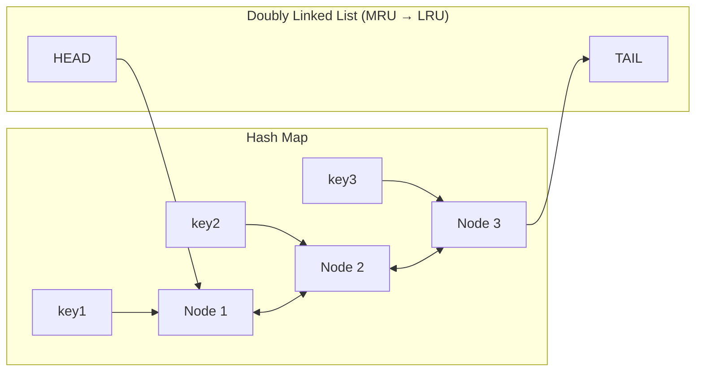

# Chapter 9. Local LRU 캐시: 메모리 자료구조의 정석

> **이 장의 목표**: O(1) LRU 캐시 구현을 이해하고, C++에서의 메모리 관리와 스레드 안전성을 배웁니다.

---

## 9.1 LRU 캐시의 요구사항

**LRU (Least Recently Used)**: 가장 오래 사용하지 않은 항목부터 제거

### 필요한 연산과 복잡도

| 연산 | 설명 | 목표 복잡도 |
|------|------|------------|
| `lookup(key)` | 키로 조회 + 최근 사용 표시 | O(1) |
| `insert(key, value)` | 삽입 + 필요시 eviction | O(1) |
| `remove(key)` | 키로 삭제 | O(1) |
| `evict()` | 가장 오래된 항목 제거 | O(1) |

### 자료구조 선택

**해시맵만 사용**: 조회 O(1), 하지만 LRU 순서 유지 불가
**리스트만 사용**: LRU 순서 유지 가능, 하지만 조회 O(n)
**해시맵 + 이중 연결 리스트**: 둘 다 O(1)!



---

## 9.2 노드 구조

```cpp
struct LruNode {
    std::string key;
    std::shared_ptr<CacheEntry> entry;
    
    LruNode* prev{nullptr};  // 이전 노드 (더 최근)
    LruNode* next{nullptr};  // 다음 노드 (더 오래됨)
    size_t size_bytes{0};    // 메모리 크기 추정치
    
    LruNode(std::string k, std::shared_ptr<CacheEntry> e, size_t size)
        : key(std::move(k)), entry(std::move(e)), size_bytes(size) {}
};
```

### raw pointer를 쓰는 이유

`prev`/`next`에 `shared_ptr`를 쓰면:
- 순환 참조 발생 (A → B → A)
- 노드 삭제 시 자동 해제 안 됨

`weak_ptr`는 오버킬 - 노드의 수명은 해시맵이 관리하므로 raw pointer로 충분

---

## 9.3 LocalCache 클래스 구조

```cpp
class LocalCache : public CacheBackend {
private:
    mutable absl::Mutex mutex_;
    
    // 해시맵: key → node (소유권)
    absl::flat_hash_map<std::string, std::unique_ptr<LruNode>> cache_
        ABSL_GUARDED_BY(mutex_);
    
    // 이중 연결 리스트 양 끝
    LruNode* head_ ABSL_GUARDED_BY(mutex_){nullptr};  // MRU
    LruNode* tail_ ABSL_GUARDED_BY(mutex_){nullptr};  // LRU
    
    // 제한 및 현재 상태
    const size_t max_entries_;
    const size_t max_bytes_;
    size_t current_entries_ ABSL_GUARDED_BY(mutex_){0};
    size_t current_bytes_ ABSL_GUARDED_BY(mutex_){0};
};
```

### ABSL_GUARDED_BY

Thread Safety Annotation - 컴파일러가 락 사용 검증:

```cpp
// ✅ 올바름 - mutex를 잠그고 접근
void foo() {
    absl::MutexLock lock(&mutex_);
    cache_[key] = ...;
}

// ❌ 컴파일 경고 - mutex 없이 접근
void bar() {
    cache_[key] = ...;  // Warning: accessing guarded variable without lock
}
```

---

## 9.4 lookup 구현

```cpp
void LocalCache::lookup(const std::string& key, LookupCallback callback) {
    std::shared_ptr<CacheEntry> entry;
    CacheLookupStatus status = CacheLookupStatus::Miss;
    
    {
        absl::MutexLock lock(&mutex_);
        
        auto it = cache_.find(key);
        if (it == cache_.end()) {
            // 캐시 미스
        } else {
            LruNode* node = it->second.get();
            
            // TTL 만료 체크
            if (isExpired(*node->entry)) {
                // 만료됨 - 제거
                removeNode(node);
                cache_.erase(it);
                current_entries_--;
                current_bytes_ -= node->size_bytes;
            } else {
                // 캐시 히트 - MRU로 이동
                moveToFront(node);
                status = CacheLookupStatus::Hit;
                entry = node->entry;
            }
        }
    }  // mutex 해제
    
    // 콜백은 mutex 밖에서 호출 (데드락 방지)
    callback(CacheLookupResult{status, entry});
}
```

### 콜백 외부 호출의 중요성

```cpp
// ❌ 위험 - 데드락 가능
void lookup(..., LookupCallback callback) {
    absl::MutexLock lock(&mutex_);
    // ...
    callback(result);  // 콜백이 다시 lookup을 호출하면?
}

// ✅ 안전
void lookup(..., LookupCallback callback) {
    {
        absl::MutexLock lock(&mutex_);
        // ...
    }
    callback(result);  // mutex 해제 후 호출
}
```

---

## 9.5 insert 구현

```cpp
void LocalCache::insert(const std::string& key, 
                        std::shared_ptr<CacheEntry> entry,
                        std::chrono::seconds ttl, 
                        InsertCallback callback) {
    bool success = true;
    
    {
        absl::MutexLock lock(&mutex_);
        
        // 크기 계산
        size_t entry_size = calculateEntrySize(*entry);
        
        // 너무 큰 항목은 거부
        if (entry_size > max_bytes_) {
            success = false;
        } else {
            auto it = cache_.find(key);
            
            if (it != cache_.end()) {
                // 기존 항목 업데이트
                LruNode* existing = it->second.get();
                current_bytes_ -= existing->size_bytes;
                
                existing->entry = entry;
                existing->size_bytes = entry_size;
                
                current_bytes_ += entry_size;
                moveToFront(existing);
            } else {
                // 새 항목 추가
                auto new_node = std::make_unique<LruNode>(key, entry, entry_size);
                LruNode* node_ptr = new_node.get();
                
                cache_.emplace(key, std::move(new_node));
                current_entries_++;
                current_bytes_ += entry_size;
                
                addToFront(node_ptr);
                
                // 용량 초과 시 eviction
                evictIfNeeded();
            }
        }
    }
    
    callback(success);
}
```

---

## 9.6 리스트 조작 함수들

### moveToFront (최근 사용 표시)

```cpp
void LocalCache::moveToFront(LruNode* node) {
    if (node == head_) {
        return;  // 이미 맨 앞
    }
    
    // 현재 위치에서 분리
    if (node->prev) node->prev->next = node->next;
    if (node->next) node->next->prev = node->prev;
    if (node == tail_) tail_ = node->prev;
    
    // 맨 앞에 삽입
    node->prev = nullptr;
    node->next = head_;
    if (head_) head_->prev = node;
    head_ = node;
    
    if (!tail_) tail_ = node;
}
```

### addToFront (새 노드 추가)

```cpp
void LocalCache::addToFront(LruNode* node) {
    node->prev = nullptr;
    node->next = head_;
    
    if (head_) head_->prev = node;
    head_ = node;
    
    if (!tail_) tail_ = node;
}
```

### removeNode (노드 분리)

```cpp
void LocalCache::removeNode(LruNode* node) {
    if (node->prev) node->prev->next = node->next;
    if (node->next) node->next->prev = node->prev;
    
    if (node == head_) head_ = node->next;
    if (node == tail_) tail_ = node->prev;
    
    node->prev = nullptr;
    node->next = nullptr;
}
```

---

## 9.7 Eviction (퇴출)

```cpp
void LocalCache::evictIfNeeded() {
    // 엔트리 수 또는 바이트 제한 초과 시 LRU부터 제거
    while ((current_entries_ > max_entries_ || 
            current_bytes_ > max_bytes_) && 
           tail_ != nullptr) {
        
        LruNode* victim = tail_;
        
        // 해시맵에서 제거
        cache_.erase(victim->key);
        current_entries_--;
        current_bytes_ -= victim->size_bytes;
        
        // 리스트에서 제거
        removeNode(victim);
        // unique_ptr가 cache_에서 erase될 때 노드 자동 삭제
    }
}
```

### 제한 종류

```yaml
cache_backend:
  local:
    max_entries: 10000       # 최대 항목 수
    max_bytes: 104857600     # 100MB
```

둘 중 하나라도 초과하면 eviction 발생.

---

## 9.8 메모리 크기 계산

```cpp
size_t LocalCache::calculateEntrySize(const CacheEntry& entry) {
    size_t size = 0;
    
    // 바디 크기
    size += entry.body.length();
    
    // 헤더 크기 (대략)
    entry.headers->iterate(
        [&size](const Http::HeaderEntry& header) -> Http::HeaderMap::Iterate {
            size += header.key().getStringView().size();
            size += header.value().getStringView().size();
            return Http::HeaderMap::Iterate::Continue;
        });
    
    // 오버헤드 추정 (포인터, 메타데이터 등)
    size += kEstimatedHeaderOverhead;  // 1024 bytes
    
    return size;
}
```

### 정확한 계산이 어려운 이유

- `std::string`의 Small String Optimization
- `shared_ptr`의 컨트롤 블록
- 메모리 할당자의 정렬 패딩
- 헤더 맵 내부 구조

→ 보수적으로 추정 (실제보다 약간 크게)

---

## 9.9 TTL 만료 처리

```cpp
bool LocalCache::isExpired(const CacheEntry& entry) const {
    return std::chrono::steady_clock::now() >= entry.expiration_time;
}
```

### 만료 체크 시점

**Lazy Expiration**: 조회할 때만 체크
- 장점: 백그라운드 스레드 불필요
- 단점: 만료된 항목이 메모리에 남아있을 수 있음

### Proactive Expiration (미구현)

```cpp
// 백그라운드 스레드에서 주기적으로
void cleanupExpired() {
    absl::MutexLock lock(&mutex_);
    for (auto it = cache_.begin(); it != cache_.end(); ) {
        if (isExpired(*it->second->entry)) {
            it = cache_.erase(it);
        } else {
            ++it;
        }
    }
}
```

---

## 9.10 스레드 안전성

### Mutex 선택: absl::Mutex vs std::mutex

| 특성 | absl::Mutex | std::mutex |
|------|-------------|------------|
| 성능 | 더 빠름 (spin + park) | 표준 |
| 디버깅 | Annotation 지원 | 제한적 |
| Read/Write Lock | 지원 | std::shared_mutex 필요 |

### 현재 구현의 한계

**전체 캐시에 하나의 Mutex**:
- 장점: 구현 단순
- 단점: 높은 경합 시 병목

### 개선 방안 (미구현)

**Sharded Lock**:
```cpp
class ShardedCache {
    static constexpr int kShards = 16;
    struct Shard {
        absl::Mutex mutex;
        absl::flat_hash_map<...> cache;
        // ...
    };
    Shard shards_[kShards];
    
    int shardIndex(const std::string& key) {
        return std::hash<std::string>{}(key) % kShards;
    }
};
```

---

## 9.11 Go의 groupcache와 비교

```go
// Go groupcache의 LRU
type Cache struct {
    MaxBytes int64
    ll       *list.List
    cache    map[string]*list.Element
    mu       sync.Mutex
}

func (c *Cache) Get(key string) (value interface{}, ok bool) {
    c.mu.Lock()
    defer c.mu.Unlock()
    if ele, ok := c.cache[key]; ok {
        c.ll.MoveToFront(ele)
        return ele.Value, true
    }
    return nil, false
}
```

**차이점**:
- Go: `list.List` 표준 라이브러리 사용
- C++: 직접 이중 연결 리스트 구현 (성능 최적화)
- Go: `defer`로 unlock
- C++: RAII (`MutexLock`)로 unlock

---

## 9.12 요약

**자료구조**:
```
HashMap<key, unique_ptr<Node>>  +  DoublyLinkedList<Node>
          ↓                              ↓
       O(1) lookup                  O(1) LRU eviction
```

**핵심 연산**:
- `lookup`: 해시맵 조회 + TTL 체크 + moveToFront
- `insert`: 해시맵 삽입 + addToFront + evictIfNeeded
- `evictIfNeeded`: tail부터 제거

**스레드 안전성**:
- `absl::Mutex`로 전체 캐시 보호
- 콜백은 mutex 외부에서 호출

**메모리 관리**:
- `max_entries` + `max_bytes` 이중 제한
- 크기 추정은 보수적으로

---

## 9.13 다음 장 예고

다음 장에서는 **Redis 캐시**를 분석합니다:
- Envoy Redis 클라이언트 사용
- 비동기 GET/SETEX/DEL
- `dispatcher.post()`로 스레드 안전 콜백
- 직렬화/역직렬화

---

> **체크리스트 ✓**
> - [ ] LRU 캐시가 해시맵 + 이중 연결 리스트로 구현되는 이유를 안다
> - [ ] `moveToFront`, `addToFront`, `removeNode`의 동작을 이해한다
> - [ ] `evictIfNeeded`가 언제 호출되는지 안다
> - [ ] 콜백을 mutex 외부에서 호출해야 하는 이유를 안다
> - [ ] `ABSL_GUARDED_BY`의 역할을 안다
