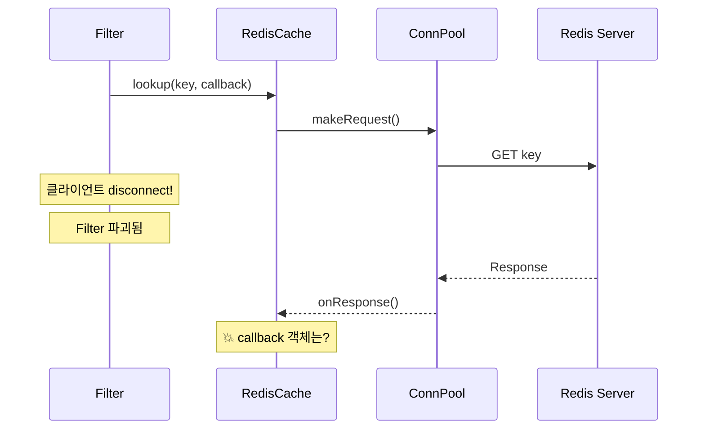
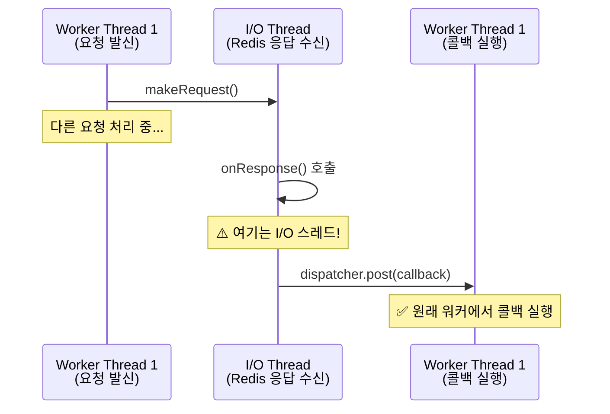

# Chapter 10. Redis 캐시: 비동기 네트워크의 세계

> **이 장의 목표**: Envoy Redis 클라이언트를 사용한 비동기 캐시 구현을 이해하고, 콜백 안전성과 요청 수명 관리를 배웁니다.

---

## 10.1 Redis 캐시의 특징

| 특성 | LocalCache | RedisCache |
|------|------------|------------|
| 저장 위치 | 프로세스 메모리 | 외부 Redis 서버 |
| 지연시간 | ~1μs | ~1ms |
| 공유 범위 | 워커 내 | 전체 클러스터 |
| 가용성 | 프로세스 종료 시 손실 | 독립적 |
| 동기/비동기 | 동기 콜백 | 비동기 콜백 |

---

## 10.2 Redis 명령어 매핑

| 연산 | Redis 명령 | 설명 |
|------|-----------|------|
| lookup | `GET key` | 키 조회 |
| insert | `SETEX key ttl value` | TTL과 함께 저장 |
| remove | `DEL key` | 키 삭제 |

---

## 10.3 RedisCache 클래스 구조

```cpp
class RedisCache : public CacheBackend {
private:
    Upstream::ClusterManager& cluster_manager_;
    ThreadLocal::Instance& tls_;
    ThreadLocal::TypedSlot<PendingList> pending_requests_;
    
    const std::string cluster_name_;      // "redis_cluster"
    const std::string key_prefix_;        // "envoy:gc:"
    const std::chrono::milliseconds op_timeout_;
    const bool enable_cluster_mode_;
    
    NetworkFilters::RedisProxy::ConnPool::InstanceSharedPtr conn_pool_;
};
```

---

## 10.4 비동기 GET 요청

```cpp
void RedisCache::lookup(const std::string& key, LookupCallback callback) {
    const std::string redis_key = buildRedisKey(key);  // prefix 추가
    
    // TLS pending list 가져오기
    auto* pending_list = getPendingList();
    if (!pending_list) {
        callback(CacheLookupResult{CacheLookupStatus::Miss});
        return;
    }
    
    // GET 명령 생성
    auto request = makeGetRequest(redis_key);
    
    // 콜백 핸들러 생성 (shared_ptr로 수명 관리)
    auto request_handler = std::make_shared<LookupRequest>(
        std::move(callback), tls_.dispatcher());
    
    // pending list에 추가 (수명 보장)
    auto request_base = std::static_pointer_cast<RequestBase>(request_handler);
    pending_list->pending_requests_.push_back(request_base);
    request_handler->setPending(pending_list, 
        std::prev(pending_list->pending_requests_.end()));
    
    // 비동기 요청 전송
    NetworkFilters::Common::Redis::Client::NoOpTransaction transaction;
    auto* pool_request = conn_pool_->makeRequest(
        redis_key, std::move(request), *request_handler, transaction);
    
    if (!pool_request) {
        request_handler->onFailure();
    }
}
```

---

## 10.5 요청 수명 관리

### 문제: 콜백 시점에 객체가 파괴되어 있으면?



### 해결: PendingList로 수명 보장

```cpp
struct PendingList : public ThreadLocal::ThreadLocalObject {
    std::list<std::shared_ptr<RequestBase>> pending_requests_;
};
```

- TLS에 저장 → 워커 스레드가 살아있는 동안 유지
- `shared_ptr`로 요청 객체 유지
- 응답 처리 후 리스트에서 제거

---

## 10.6 응답 처리와 dispatcher.post()

```cpp
void RedisCache::LookupRequest::onResponse(RespValuePtr&& value) {
    // shared_ptr로 this 유지
    auto self = shared_from_this();
    clearPending();  // pending list에서 제거
    
    // 응답 파싱
    if (value->type() == RespType::BulkString) {
        const std::string& serialized = value->asString();
        if (!serialized.empty()) {
            try {
                auto entry = CacheSerializer::deserialize(serialized);
                
                // dispatcher.post(): 원래 워커 스레드에서 콜백 실행
                dispatcher_.post([self, entry]() mutable {
                    self->callback_(CacheLookupResult{
                        CacheLookupStatus::Hit, entry});
                });
                return;
            } catch (...) {
                // 역직렬화 실패 → Miss로 처리
            }
        }
    }
    
    // Miss 또는 Error
    dispatcher_.post([self]() mutable {
        self->callback_(CacheLookupResult{CacheLookupStatus::Miss});
    });
}
```

### dispatcher.post()가 필요한 이유



**왜 중요한가?**
- Filter 객체는 특정 워커 스레드에 바인딩
- 다른 스레드에서 Filter 메서드 호출 → 경쟁 조건!
- `dispatcher.post()`로 올바른 스레드에서 실행 보장

---

## 10.7 SETEX 요청

```cpp
void RedisCache::insert(const std::string& key, 
                        std::shared_ptr<CacheEntry> entry,
                        std::chrono::seconds ttl, 
                        InsertCallback callback) {
    
    const std::string redis_key = buildRedisKey(key);
    
    // 직렬화
    std::string serialized_value;
    try {
        serialized_value = CacheSerializer::serialize(*entry);
    } catch (...) {
        tls_.dispatcher().post([callback = std::move(callback)]() mutable {
            callback(false);
        });
        return;
    }
    
    // SETEX 명령 생성
    auto request = makeSetexRequest(redis_key, serialized_value, ttl);
    
    // ... (lookup과 유사한 패턴) ...
}
```

### SETEX vs SET + EXPIRE

```
SETEX key 300 value    # 원자적 (권장)
SET key value
EXPIRE key 300         # 두 명령 사이에 실패 가능
```

---

## 10.8 Redis 명령 구성

```cpp
NetworkFilters::Common::Redis::RespValue
RedisCache::makeGetRequest(const std::string& redis_key) const {
    using RespType = NetworkFilters::Common::Redis::RespType;
    using RespValue = NetworkFilters::Common::Redis::RespValue;
    
    std::vector<RespValue> values(2);
    values[0].type(RespType::BulkString);
    values[0].asString() = "GET";
    values[1].type(RespType::BulkString);
    values[1].asString() = redis_key;
    
    RespValue request;
    request.type(RespType::Array);
    request.asArray().swap(values);
    return request;
}
```

### RESP 프로토콜

```
*2\r\n          # Array of 2 elements
$3\r\n          # Bulk string, 3 bytes
GET\r\n
$17\r\n         # Bulk string, 17 bytes
envoy:gc:mykey\r\n
```

---

## 10.9 Redis Cluster 지원

```yaml
cache_backend:
  redis:
    cluster_name: redis_cluster
    enable_cluster_mode: true
```

### Cluster Mode 동작

```cpp
// 연결 풀 설정
settings.set_enable_redirection(enable_cluster_mode_);  // MOVED/ASK 처리

// 키 기반 라우팅
pool_->makeRequest(redis_key, ...);  // 키의 해시로 노드 결정
```

**MOVED 리다이렉션**:
1. 클라이언트가 잘못된 노드에 요청
2. 노드가 `MOVED slot target` 응답
3. Envoy가 올바른 노드로 재시도

---

## 10.10 에러 처리

### onFailure 콜백

```cpp
void RedisCache::LookupRequest::onFailure() {
    ENVOY_LOG_MISC(warn, "RedisCache: GET request failed");
    
    auto self = shared_from_this();
    clearPending();
    
    dispatcher_.post([self]() mutable {
        self->callback_(CacheLookupResult{CacheLookupStatus::Miss});
    });
}
```

**철학**: Redis 실패 → Miss로 처리 → 업스트림으로 진행

### 타임아웃

```yaml
cache_backend:
  redis:
    op_timeout: { milliseconds: 100 }
```

---

## 10.11 Go redis-go와 비교

```go
// Go redis 클라이언트 (동기)
func (c *RedisCache) Lookup(key string) (*CacheEntry, error) {
    result, err := c.client.Get(ctx, key).Result()
    if err == redis.Nil {
        return nil, ErrCacheMiss
    }
    if err != nil {
        return nil, err
    }
    return deserialize(result)
}
```

**C++ Envoy의 차이**:
- 모든 연산이 비동기 + 콜백
- `dispatcher.post()`로 스레드 전환
- `shared_ptr`로 수명 관리
- TLS pending list로 요청 추적

---

## 10.12 요약

**핵심 패턴**:
```cpp
// 1. 요청 객체 생성 (shared_ptr)
auto handler = std::make_shared<Request>(callback, dispatcher);

// 2. pending list에 추가 (수명 보장)
pending_list->push_back(handler);

// 3. 비동기 요청
pool->makeRequest(key, request, *handler);

// 4. 응답 처리 (다른 스레드에서 호출될 수 있음)
void onResponse() {
    clearPending();  // pending list에서 제거
    dispatcher_.post([...]() {
        callback_(...);  // 원래 워커에서 콜백
    });
}
```

**안전성 보장**:
- `shared_from_this()`: 콜백 동안 객체 유지
- `dispatcher.post()`: 올바른 스레드에서 실행
- PendingList: TLS로 워커 수명과 연결

---

## 10.13 다음 장 예고

다음 장에서는 **TieredCache (L1 + L2)**를 분석합니다:
- L1 miss → L2 lookup → L1 populate
- Write-through vs Write-back 전략
- 동시 완료 추적 패턴

---

> **체크리스트 ✓**
> - [ ] Redis GET/SETEX 요청이 어떻게 구성되는지 안다
> - [ ] `dispatcher.post()`가 왜 필요한지 설명할 수 있다
> - [ ] PendingList의 역할을 이해한다
> - [ ] `shared_from_this()`가 왜 필요한지 안다
> - [ ] Redis 실패 시 어떻게 처리되는지 안다
