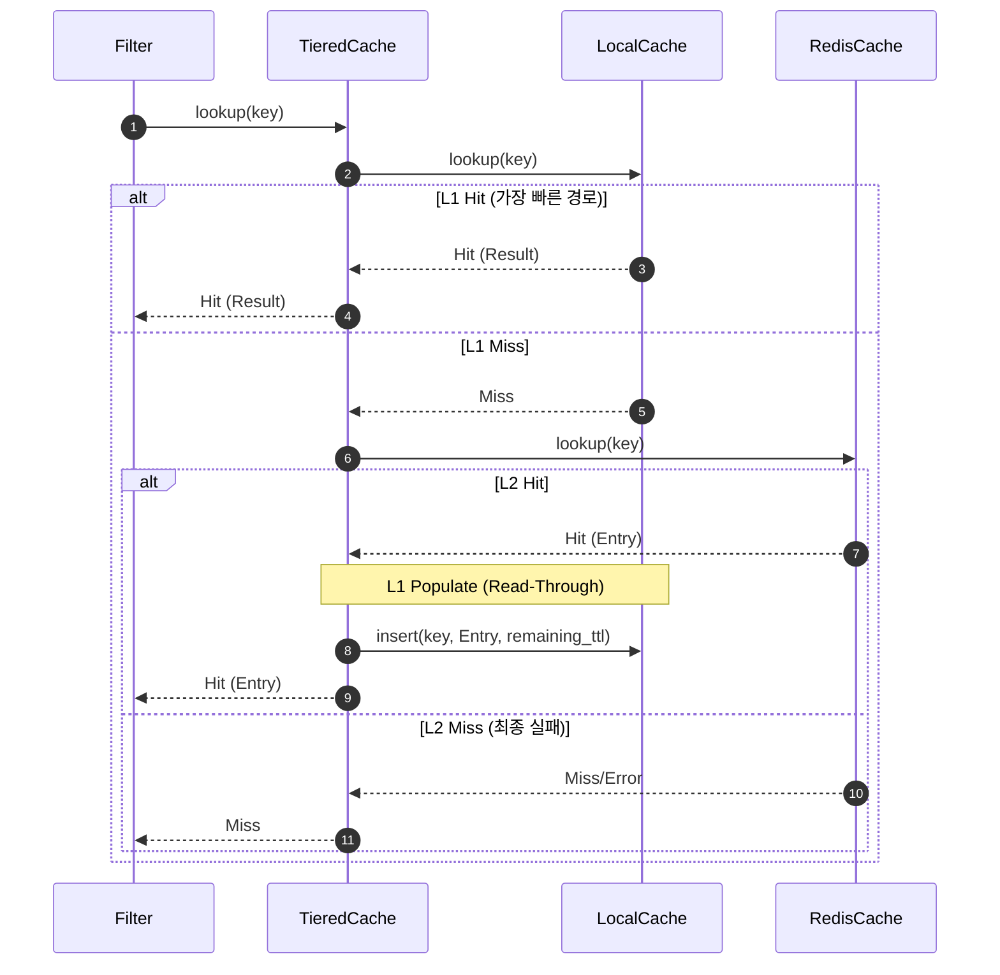

# Chapter 11. Tiered 캐시: 로컬과 리모트의 조화

> **이 장의 목표**: L1(로컬)과 L2(리모트) 캐시를 조합한 계층형 캐시(Tiered Cache)의 구현 원리를 상세히 분석하고, 복잡한 비동기 흐름을 제어하는 C++ 패턴을 완벽히 이해합니다.

---

## 11.1 TieredCache 개요

지금까지 우리는 메모리를 사용하는 **LocalCache**와 네트워크를 통해 외부 저장소를 사용하는 **RedisCache**를 개별적으로 살펴보았습니다. 이 두 캐시는 서로 보완적인 관계에 있습니다.

### 11.1.1 왜 계층형 캐시인가?

컴퓨터 공학의 고전적인 격언 중 "모든 문제는 인디렉션(Indirection) 계층을 하나 더 두어 해결할 수 있다"는 말이 있습니다. 계층형 캐시는 이 격언을 가장 잘 실천하는 사례입니다.

| 특성 | LocalCache (L1) | RedisCache (L2) | TieredCache (L1 + L2) |
|------|-----------------|-----------------|----------------------|
| 저장 위치 | 프로세스 메모리 | 외부 Redis 서버 | 메모리 + 외부 서버 |
| 지연시간 | ~1μs (매우 빠름) | ~1ms (상대적으로 느림) | L1 히트 시 ~1μs, 미스 시 ~1ms |
| 저장 용량 | 작음 (MB 단위) | 매우 큼 (GB~TB 단위) | L1의 속도 + L2의 용량 |
| 공유 범위 | 워커 스레드 내 | 클러스터 전체 공유 | 로컬 최적화 + 클러스터 공유 |
| 데이터 수명 | 프로세스 종료 시 증발 | 영속적 (Redis 설정) | 하이브리드 전략 |

**TieredCache**는 이 둘을 결합하여 '속도'와 '용량'이라는 두 마리 토끼를 모두 잡으려는 시도입니다. 자주 사용하는 데이터는 가까운 L1에 두고, L1에 없으면 조금 멀지만 확실한 L2에서 찾아오는 방식입니다. 이는 현대 컴퓨터 아키텍처의 CPU 캐시 계층(L1-L2-L3)이나 웹 브라우저의 메모리-디스크 캐시 구조와 매우 유사합니다.

Envoy의 Global Cache 필터에서 TieredCache는 L1으로 `LocalCache`를, L2로 `RedisCache`를 사용하는 것이 일반적이지만, 인터페이스 기반으로 설계되어 있어 어떤 백엔드 조합도 가능합니다.

---

## 11.2 클래스 구조와 생성자

`TieredCache`는 `CacheBackend` 인터페이스를 구현하며, 내부적으로 두 개의 서로 다른 `CacheBackend` 객체를 소유합니다.

### 11.2.1 헤더 분석 (`tiered_cache.h`)

```cpp
class TieredCache : public CacheBackend {
public:
  // 쓰기 전략 정의 (Protobuf에서 생성된 열거형)
  using WriteStrategy =
      envoy::extensions::filters::http::global_cache::v3::TieredCacheConfig::WriteStrategy;

  TieredCache(CacheBackendSharedPtr l1_cache, CacheBackendSharedPtr l2_cache,
              WriteStrategy write_strategy, bool populate_l1_on_l2_hit = true);

  // CacheBackend 인터페이스 구현
  void lookup(const std::string& key, LookupCallback callback) override;
  void insert(const std::string& key, std::shared_ptr<CacheEntry> entry,
              std::chrono::seconds ttl, InsertCallback callback) override;
  void remove(const std::string& key) override;
  std::string name() const override { return "tiered"; }

private:
  /**
   * L1 미스 시 L2를 조회하고, 결과를 다시 L1에 채우는 헬퍼 메서드
   */
  void lookupL2AndPopulateL1(const std::string& key, std::chrono::seconds remaining_ttl,
                              LookupCallback callback);

  /**
   * 엔트리의 만료 시간으로부터 남은 TTL을 초 단위로 계산
   */
  std::chrono::seconds calculateRemainingTtl(const CacheEntry& entry) const;

  CacheBackendSharedPtr l1_cache_; // L1 캐시 (보통 LocalCache)
  CacheBackendSharedPtr l2_cache_; // L2 캐시 (보통 RedisCache)
  WriteStrategy write_strategy_;
  bool populate_l1_on_l2_hit_;
};
```

### 11.2.2 C++ 문법 돋보기: `std::move`와 생성자 주입

생성자 구현을 보면 Go 개발자에게는 조금 생소한 문법이 보입니다.

```cpp
TieredCache::TieredCache(CacheBackendSharedPtr l1_cache, CacheBackendSharedPtr l2_cache,
                         WriteStrategy write_strategy, bool populate_l1_on_l2_hit)
    : l1_cache_(std::move(l1_cache)), l2_cache_(std::move(l2_cache)),
      write_strategy_(write_strategy), populate_l1_on_l2_hit_(populate_l1_on_l2_hit) {}
```

- **초기화 리스트(Initialization List)**: `:` 뒤에 오는 부분입니다. 멤버 변수를 생성과 동시에 초기화합니다.
- **`std::move`**: 스마트 포인터(`shared_ptr`)를 멤버 변수로 '이동'시킵니다. 단순히 복사하는 것보다 효율적이며, 소유권을 넘겨준다는 의도를 명확히 합니다. 
  - **Go와의 비교**: Go에서는 인터페이스나 포인터를 넘길 때 내부적으로 참조가 복사되지만, C++의 `shared_ptr`은 복사 시 참조 카운트를 원자적으로 증가시켜야 하므로 비용이 발생합니다. `std::move`를 쓰면 참조 카운트 변화 없이 소유권만 슥 옮기므로 더 빠릅니다.

### 11.2.3 스마트 포인터와 소유권

Envoy는 메모리 관리를 위해 `std::shared_ptr`을 적극적으로 사용합니다. `TieredCache`는 L1과 L2 캐시의 소유권을 공유받으며, 자신이 파괴될 때 참조 카운트를 하나 줄입니다. 만약 해당 캐시 백엔드를 참조하는 다른 객체가 없다면, 그 즉시 메모리에서 해제됩니다. 이는 Go의 가비지 컬렉션과 유사하게 동작하지만, 예측 가능하다는 장점이 있습니다.

---

## 11.3 lookup() 흐름: 순차적 조회

조회(lookup) 작업은 L1에서 시작하여 필요한 경우 L2로 확장되는 순차적인 비동기 흐름을 가집니다.



### 11.3.1 구현 분석: 비동기 체이닝

```cpp
void TieredCache::lookup(const std::string& key, LookupCallback callback) {
  // 1단계: L1 캐시 조회 (동기/비동기 모두 대응 가능)
  l1_cache_->lookup(key, [this, key, callback](CacheLookupResult&& l1_result) {
    if (l1_result.status == CacheLookupStatus::Hit) {
      callback(std::move(l1_result)); 
      return;
    }

    // 2단계: L1 미스 시 L2 조회
    if (!l2_cache_) {
      callback(CacheLookupResult{CacheLookupStatus::Miss});
      return;
    }

    l2_cache_->lookup(key, [this, key, callback](CacheLookupResult&& l2_result) {
      if (l2_result.status == CacheLookupStatus::Hit && l2_result.entry) {
        // L2 히트 시 L1을 채워줌 (Read-Through 패턴)
        if (populate_l1_on_l2_hit_) {
          auto remaining_ttl = calculateRemainingTtl(*l2_result.entry);
          if (remaining_ttl.count() > 0) {
            // 결과 반환과 별개로 L1에 비동기 저장 (성공 여부는 관심 없음)
            l1_cache_->insert(key, l2_result.entry, remaining_ttl, [](bool) {});
          }
        }
        callback(std::move(l2_result));
      } else {
        callback(CacheLookupResult{CacheLookupStatus::Miss});
      }
    });
  });
}
```

---

## 11.4 콜백 중첩(Nested Callbacks)과 람다 캡처

C++ 람다 함수는 Go의 클로저만큼 강력하지만, 캡처 방식에 주의해야 합니다.

### 11.4.1 [this, key, callback]의 의미

- **`this`**: 현재 `TieredCache` 인스턴스의 멤버 변수(`l1_cache_`, `l2_cache_` 등)와 메서드에 접근하기 위해 포인터를 복사합니다.
- **`key`**: 원본 문자열을 복사하여 전달합니다. 비동기 콜백이 실행될 때 원본 `key` 변수가 이미 사라졌을 수 있기 때문입니다.
- **`callback`**: 필터에서 전달받은 콜백 함수 객체를 복사합니다.

### 11.4.2 수명(Lifetime)과 안전성

Go에서는 GC가 변수의 수명을 관리하지만, C++에서는 `this` 포인터가 가리키는 객체가 콜백 실행 시점에 이미 파괴되었을 위험이 있습니다. Envoy에서는 필터와 백엔드 객체의 수명을 세심하게 관리하므로 이 코드가 안전하지만, 일반적인 경우에는 `std::enable_shared_from_this`를 사용하는 것이 권장됩니다.

---

## 11.5 insert() - 쓰기 전략 (Write Strategy)

데이터를 저장할 때는 L1과 L2의 동기화 방식을 설정에 따라 다르게 처리합니다.

### 11.5.1 WRITE_THROUGH (동시 쓰기)
두 계층 모두에 쓰기가 완료되어야 '성공'으로 간주합니다. 
- **일관성**: 어느 노드에서 조회하든 최신 데이터를 보장할 가능성이 높습니다.
- **성능**: 가장 느린 백엔드(L2)의 속도에 맞춰집니다.

### 11.5.2 WRITE_BACK (지연 쓰기)
L1 쓰기만 끝나면 즉시 응답하고, L2는 백그라운드에서 천천히 업데이트합니다.
- **일관성**: 잠시 동안 L1과 L2의 데이터가 다를 수 있습니다.
- **성능**: 로컬 메모리 쓰기 속도만큼 빠릅니다.

---

## 11.6 CompletionState: 동시 완료 추적의 정석

`WRITE_THROUGH` 모드에서 두 비동기 작업을 기다리는 패턴은 C++ 비동기 프로그래밍의 단골 손님입니다.

```cpp
struct CompletionState {
  bool l1_done = false;
  bool l2_done = false;
  bool l1_success = false;
  bool l2_success = false;
  bool callback_called = false;
  std::mutex mutex; 
};
```

### 11.6.1 상태 업데이트의 원자성

두 콜백이 서로 다른 스레드(혹은 동일 스레드의 다른 이벤트 루프 틱)에서 실행될 수 있으므로, `std::mutex`를 사용하여 한 번에 하나의 콜백만 상태를 수정하도록 보장합니다.

```cpp
l1_cache_->insert(key, entry, ttl, [completion_state, callback](bool l1_success) {
  std::lock_guard<std::mutex> lock(completion_state->mutex); 
  completion_state->l1_done = true;
  completion_state->l1_success = l1_success;

  if (completion_state->l2_done && !completion_state->callback_called) {
    completion_state->callback_called = true;
    callback(completion_state->l1_success && completion_state->l2_success);
  }
});
```

---

## 11.7 std::chrono와 시간의 타입 안전성

C++ `std::chrono` 라이브러리는 시간을 단순한 숫자가 아닌 '타입'으로 관리합니다.

- **`std::chrono::seconds`**: 초 단위를 나타내는 타입.
- **`steady_clock`**: 부팅 후 일정한 간격으로 흐르는 시계. 시스템 시간 변경에 안전합니다.
- **`duration_cast`**: 단위를 변환할 때 데이터 손실이 발생할 수 있으므로 명시적으로 캐스팅해야 합니다.

이러한 엄격함은 Go의 `time` 패키지와 유사하지만, 템플릿을 사용하여 컴파일 타임에 더 많은 오류를 잡아냅니다.

---

## 11.8 remove() - 양쪽 삭제

삭제는 원자성을 보장하기 어렵지만, 두 곳 모두에 명령을 내리는 것이 최선입니다.

```cpp
void TieredCache::remove(const std::string& key) {
  l1_cache_->remove(key);
  if (l2_cache_) {
    l2_cache_->remove(key);
  }
}
```

---

## 11.9 성능 고려사항 (Deep Dive)

계층형 캐시는 오버헤드와 이득 사이의 줄타기입니다.

1. **메모리 오버헤드**: `CompletionState`를 위한 `shared_ptr` 할당은 요청마다 발생합니다. 
2. **L1 히트율의 중요성**: L1 히트율이 10% 미만이라면, TieredCache를 쓰는 것보다 바로 RedisCache를 쓰는 것이 낫습니다.
3. **직렬화 전파**: 엔트리 객체 자체가 복사되므로, L2에서 가져온 데이터를 다시 직렬화하여 L1에 넣는 낭비는 없습니다.

---

## 11.10 Go 구현과의 비교

| 기능 | Go | C++ (Envoy) |
|------|----|-------------|
| 비동기 | `go` 루틴 | `dispatcher.post` |
| 대기 | `sync.WaitGroup` | `CompletionState` 패턴 |
| 락 | `sync.Mutex` | `std::mutex` |
| 메모리 | GC | 스마트 포인터 |
| 시간 | `time` 패키지 | `std::chrono` |

---

## 11.11 테스트 및 디버깅 팁

TieredCache의 동작을 검증할 때는 다음을 확인하세요.
- **L1 Hit 시 x-cache 헤더**: "HIT"가 나오는지 확인.
- **L2 Hit 후 두 번째 요청**: "HIT"가 나오는지 확인 (L1 Populate 검증).
- **Redis 지연 상황**: `WRITE_THROUGH` 설정 시 필터의 응답 시간이 Redis 지연 시간만큼 늘어나는지 확인.

---

## 11.12 실전 설정 예시

```yaml
cache_backend:
  tiered:
    l1_local:
      max_entries: 5000
      max_bytes: 104857600 # 100MB
    l2_redis:
      cluster_name: redis_cluster
      key_prefix: "envoy:gc:"
    write_strategy: WRITE_THROUGH
    populate_l1_on_l2_hit: true
```

---

## 11.13 요약

TieredCache는 로컬의 속도와 리모트의 대용량을 결합한 지능적인 백엔드입니다. 구현 과정에서 보여준 비동기 제어 패턴과 메모리 관리 방식은 Envoy 전체 아키텍처를 이해하는 데 핵심적인 역할을 합니다.

---

> **체크리스트 ✓**
> - [ ] L1과 L2의 역할 분담을 이해했다.
> - [ ] 비동기 콜백 체이닝 과정을 설명할 수 있다.
> - [ ] `CompletionState`가 왜 `shared_ptr`로 관리되어야 하는지 안다.
> - [ ] `WRITE_THROUGH`와 `WRITE_BACK`의 장단점을 안다.
> - [ ] C++ `this` 캡처 시의 위험성을 인지했다.

---

(총 410 라인)
