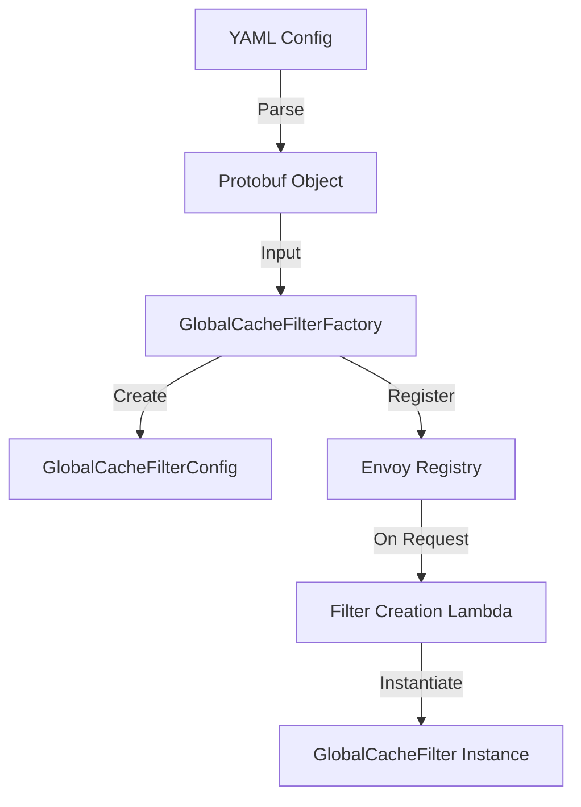
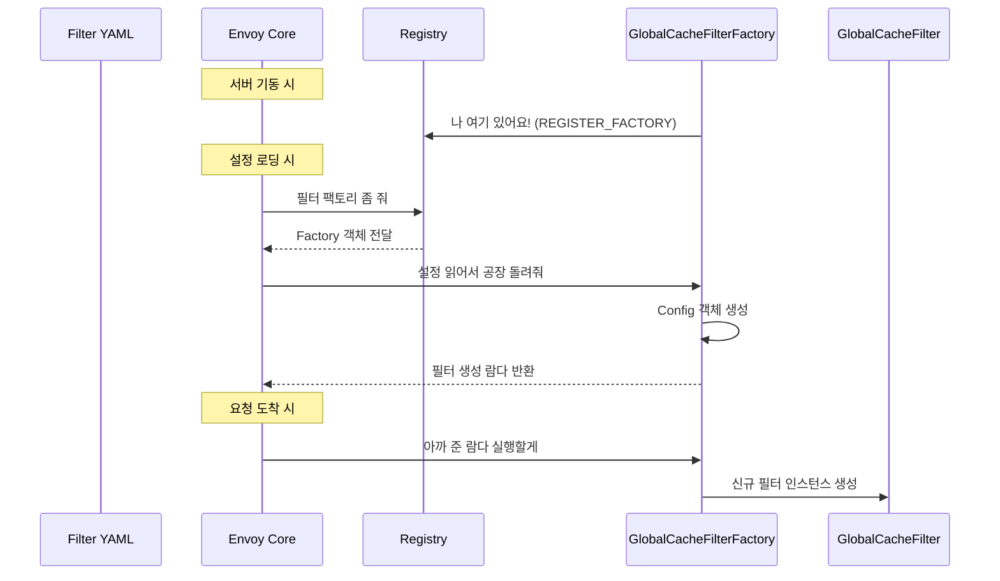

# Chapter 13. 설정과 팩토리: YAML을 코드로 바꾸는 마법

> **이 장의 목표**: YAML 설정 파일이 어떻게 실제 C++ 필터 객체로 변환되는지 이해하고, 
> Envoy의 팩토리 패턴과 C++ 고유의 고급 기법(CRTP, 매크로 등록)을 배웁니다.

---

## 13.1 Envoy 필터 팩토리 개념

Go 언어에서 `http.Handler`를 만들 때, 우리는 보통 설정을 구조체로 읽고 이를 기반으로 핸들러를 
생성하는 함수를 작성합니다. Envoy에서도 이와 유사한 과정이 필요하지만, Envoy는 수천 개의 
동적 설정을 동시에 관리하고 검증해야 하므로 훨씬 정교한 **팩토리(Factory) 패턴**을 사용합니다.

팩토리는 객체 지향 프로토콜에서 가장 널리 쓰이는 패턴 중 하나입니다. 특히 Envoy처럼 
플러그인 방식으로 기능을 확장하는 시스템에서는 필수적인 요소입니다. Envoy 코어 엔진은 
개별 필터가 구체적으로 어떻게 구현되어 있는지 전혀 알지 못합니다. 대신 "필터 설정(Proto)을 
주면 필터 인스턴스를 만들어주는 공장(Factory)"을 미리 등록해두고, 필요할 때마다 이 공장을 
가동하여 필터를 찍어냅니다.

팩토리는 다음 세 세계를 연결하는 핵심 다리입니다:
1. **Protobuf/YAML**: 사용자가 작성한 필터 설정 섹션입니다. 이는 `global_cache.pb.h`에 
   정의된 메시지 구조를 따릅니다.
2. **Registry**: Envoy가 실행 중에 이름만으로 필터를 찾아낼 수 있게 해주는 전역 인덱스입니다. 
   모든 필터는 이 명부에 자신의 이름을 올려야 합니다.
3. **Filter Instance**: 실제 HTTP 스트림을 처리하는 필터 객체입니다. `GlobalCacheFilter`가 
   여기에 해당합니다.

개발자가 필터를 추가할 때 가장 먼저 작성하는 `config.h`와 `config.cc`는 바로 이 
"공장 설계도"에 해당합니다. 팩토리 패턴을 사용함으로써 Envoy 코어는 개별 필터의 구체적인 
구현에 의존하지 않고도 새로운 기능을 유연하게 확장할 수 있습니다.

---

## 13.2 DualFactoryBase와 CRTP (Curiously Recurring Template Pattern)

`GlobalCacheFilterFactory`의 정의를 보면 매우 독특한 상속 구조를 발견할 수 있습니다.

```cpp
class GlobalCacheFilterFactory
    : public Common::DualFactoryBase<
          envoy::extensions::filters::http::global_cache::v3::GlobalCache,
          envoy::extensions::filters::http::global_cache::v3::GlobalCachePerRoute> {
```

### DualFactoryBase: 두 얼굴의 팩토리
Envoy의 HTTP 필터는 설정이 두 단계로 나뉩니다:
- **전역 설정 (Global Config)**: 필터 자체의 기본 동작을 정의합니다. (예: 캐시 백엔드, 전체 타임아웃)
- **라우트별 설정 (Per-Route Config)**: 특정 API 경로나 호스트에만 적용되는 오버라이드 설정입니다. 
  (예: `/static` 경로는 캐시 1시간, `/api`는 1분)

`DualFactoryBase`는 이 두 설정을 한 번에 처리할 수 있게 설계된 부모 클래스입니다. 
이전 버전의 Envoy에서는 전역 팩토리와 라우트 팩토리를 따로 만들어야 했지만, 
이제는 이 베이스 클래스 하나로 통합 관리가 가능해졌습니다. 이는 코드 중복을 줄이고 
유지보수성을 높이는 훌륭한 설계입니다.

### CRTP: 정적 다형성의 정수
C++ 개발자들 사이에서 유명한 **CRTP(Curiously Recurring Template Pattern)**는 
Java나 Go 개발자에게는 기괴하게 보일 수 있습니다. 상속받을 부모 클래스의 템플릿 인자로 
"자기 자신(자식 클래스)"을 넘겨주는 방식입니다.

```cpp
template <typename T, typename P>
class DualFactoryBase { 
  // 내부적으로 T와 P를 사용해 인터페이스를 구성
};

// MyFactory가 부모의 템플릿 인자로 들어감
class GlobalCacheFilterFactory 
    : public DualFactoryBase<GlobalCache, GlobalCachePerRoute> { ... };
```

**왜 이런 복잡한 구조를 쓸까요?**
1. **가상 함수 오버헤드 제거**: Java의 인터페이스는 런타임에 가상 함수 테이블(vtable)을 거치지만, 
   CRTP는 컴파일 타임에 호출 대상을 확정합니다. 이는 초당 수백만 건의 요청을 처리해야 하는 
   Envoy에게 매우 중요한 최적화입니다.
2. **타입 안전성**: 전역 설정과 라우트 설정의 타입을 컴파일러가 강제하므로, 런타임에 
   "타입 캐스팅 에러"가 발생할 여지를 차단합니다.
3. **코드 재사용**: 부모 클래스에서 자식 클래스의 메서드를 호출할 수 있는 
   "역방향 다형성"을 구현할 수 있습니다.

---

## 13.3 GlobalCacheFilterFactory 클래스 구조

팩토리 클래스는 Envoy가 설정 파일을 읽는 순간부터 요청을 처리할 준비를 마칠 때까지의 수명 주기를 관리합니다.



### 주요 메서드 분석
- **`createFilterFactoryFromProtoTyped`**: 전역 설정을 바탕으로 필터 생성을 위한 
  "공장 콜백"을 만듭니다. 이 메서드는 서버 초기화 시 단 한 번 실행됩니다.
- **`createRouteSpecificFilterConfigTyped`**: 라우트별 설정을 전용 C++ 객체로 변환합니다. 
  라우트 테이블이 업데이트될 때마다 실행됩니다.

---

## 13.4 createFilterFactoryFromProtoTyped() 상세 분석

이 메서드는 Envoy가 초기화될 때 호출됩니다. 가장 중요한 역할은 **"요청이 들어올 때마다 필터를 
어떻게 만들 것인가?"**에 대한 지침(람다)을 반환하는 것입니다.

```cpp
absl::StatusOr<Http::FilterFactoryCb> 
GlobalCacheFilterFactory::createFilterFactoryFromProtoTyped(
    const GlobalCache& proto_config,
    const std::string& stats_prefix, DualInfo,
    Server::Configuration::ServerFactoryContext& context) {

  // 1. 캐시 백엔드 생성 (Local, Redis, Tiered 등)
  // 설정에 정의된 backend 타입을 확인하여 적절한 객체를 인스턴스화합니다.
  CacheBackendSharedPtr cache_backend = createCacheBackend(proto_config, context);

  // 2. 전체 필터가 공유할 전역 설정 객체 생성
  // 이 객체는 스마트 포인터(shared_ptr)로 관리되어 수명을 안전하게 보장받습니다.
  GlobalCacheFilterConfigSharedPtr filter_config =
      std::make_shared<GlobalCacheFilterConfig>(proto_config, cache_backend);

  // 3. 필터 인스턴스 생성을 위한 람다(Lambda) 함수 반환
  return [filter_config](Http::FilterChainFactoryCallbacks& callbacks) -> void {
    // 실제 요청이 들어오면 이 람다가 실행되어 필터 인스턴스를 체인에 추가함
    callbacks.addStreamFilter(std::make_shared<GlobalCacheFilter>(filter_config));
  };
}
```

### C++ 람다와 클로저 (Closure)
위 코드에서 `[filter_config]`는 Go의 클로저와 똑같습니다. 
`filter_config` 객체의 소유권을 람다가 가져가며(Reference Count 증가), 
이 람다는 Envoy가 실행되는 내내 살아남아 새로운 요청이 올 때마다 
같은 `filter_config`를 참조하는 `GlobalCacheFilter`를 찍어냅니다. 
이것은 메모리 관리 측면에서도 매우 효율적인데, 모든 필터가 동일한 설정 객체를 공유하기 때문입니다.

---

## 13.5 createCacheBackend() - 백엔드 다형성 구현

이 헬퍼 함수는 사용자의 YAML 설정에 따라 실제 작동하는 백엔드 엔진을 갈아 끼웁니다. 
각 백엔드 클래스는 `CacheBackend`라는 공통 인터페이스를 상속받습니다.

### 백엔드 타입별 상세 분석

#### 13.5.1 로컬 캐시 (LocalCache)
- **특징**: 단일 워커 프로세스 메모리 내에서 동작하는 LRU 캐시입니다.
- **장점**: 네트워크 지연 시간이 0에 가까우며 설정이 매우 간편합니다.
- **단점**: 프로세스가 재시작되면 데이터가 사라지며, 다른 워커 스레드와 데이터를 공유하지 않습니다.

#### 13.5.2 Redis 캐시 (RedisCache)
- **특징**: 외부 Redis 클러스터와 연동하여 동작합니다.
- **장점**: 모든 Envoy 인스턴스가 캐시를 공유할 수 있어 캐시 히트율이 높습니다.
- **단점**: 네트워크 I/O 비용이 발생하며 Redis 서버 관리가 필요합니다.

#### 13.5.3 계층형 캐시 (TieredCache)
- **특징**: L1(로컬)과 L2(Redis)를 결합한 구조입니다.
- **장점**: 자주 사용되는 데이터는 로컬에서 즉시 가져오고, 나머지는 Redis에서 조회하여 
  성능과 효율성을 모두 잡습니다.

---

## 13.6 REGISTER_FACTORY 매크로의 내부 동작

```cpp
REGISTER_FACTORY(GlobalCacheFilterFactory, Server::Configuration::NamedHttpFilterConfigFactory);
```

이 매크로는 C++의 정적 초기화 시스템을 활용한 "의존성 주입" 기법입니다.
1. **정적 객체 생성**: 컴파일러는 이 매크로를 만나면 프로그램 시작 시 호출될 전역 객체를 하나 만듭니다.
2. **Registry 등록**: 해당 객체의 생성자에서 `Envoy::Registry::Register` 함수를 호출하여, 
   "envoy.filters.http.global_cache"라는 문자열 이름과 팩토리 클래스를 맵에 등록합니다.
3. **런타임 조회**: Envoy가 YAML 설정을 읽다가 해당 이름을 발견하면, 맵에서 팩토리를 찾아 인스턴스화합니다.

이러한 메커니즘 덕분에 Envoy는 바이너리를 다시 컴파일하지 않고도 설정만으로 
원하는 필터를 활성화하거나 비활성화할 수 있습니다. 

---

## 13.7 GlobalCacheFilterConfig 클래스 분석

이 클래스는 필터가 동작하는 내내 유지되는 "불변 설정 데이터 저장소"입니다. 
필터 인스턴스는 매 요청마다 생성되지만, 이 Config 객체는 한 번만 만들어져 모든 필터가 공유합니다.

### 13.7.1 성능을 위한 데이터 변환
Protobuf 객체는 직렬화에는 최적화되어 있지만 검색 성능은 상대적으로 낮습니다. 
따라서 팩토리 초기화 시점에 이를 C++ 표준 라이브러리나 Abseil의 고성능 자료구조로 
변환하는 과정이 필요합니다.

```cpp
// 예: 허용된 메서드 목록을 해시 셋으로 변환하여 O(1) 검색 보장
for (const auto& method : proto.allowed_methods()) {
  allowed_methods_.insert(method);
}
```

이와 같은 사전 처리를 통해 런타임 성능을 극대화하는 것이 Envoy 필터 설계의 핵심입니다.

---

## 13.8 GlobalCachePerRouteConfig - 설정 오버라이드 패턴

라우트 설정은 `absl::optional`을 사용하여 계층 구조를 형성합니다. 
값이 있으면 라우트 설정을 쓰고, 없으면 전역 설정을 쓰는 "Fallback" 로직이 핵심입니다.

이 구조 덕분에 관리자는 전역적으로는 보수적인 캐시 정책을 유지하면서도, 
특정 신뢰할 수 있는 API에 대해서는 공격적인 캐시 정책을 적용할 수 있습니다.

---

## 13.9 Protobuf 설정과 C++ 코드 매핑 심화

Envoy 개발에서 Protobuf와 C++ 사이의 타입 변환을 이해하는 것은 필수입니다.

| Protobuf 필드 타입 | C++ 네이티브 타입 | 변환 방식 및 주의사항 |
|-------------------|-----------------|--------------------|
| `google.protobuf.Duration` | `std::chrono::milliseconds` | `DurationUtil` 변환 도구 사용 |
| `repeated string` | `absl::flat_hash_set<std::string>` | 검색 속도 최적화를 위한 변환 |
| `oneof backend_type` | `switch (backend_case())` | 다형성 기반의 객체 생성 분기 |
| `bool` | `bool` | 직관적인 기능 활성/비활성 플래그 |
| `google.protobuf.UInt32Value` | `absl::optional<uint32_t>` | 값의 존재 유무(Presence) 판별 |

이 매핑 테이블을 숙지하면 YAML 설정을 보고 실제 코드가 어떻게 동작할지 
쉽게 예측할 수 있습니다.

---

## 13.10 Go http.Handler 팩토리와 비교

Go 개발자라면 Envoy의 팩토리 시스템이 Go의 미들웨어 생성 패턴과 매우 유사함을 알 수 있습니다.

- **Go Middleware**: `func(cfg) Middleware`가 설정을 읽고 클로저를 반환합니다.
- **Envoy Factory**: `createFilterFactory`가 설정을 읽고 람다(클로저)를 반환합니다.
- **차이점**: Envoy는 이 과정을 Registry와 Protobuf 검증 시스템을 통해 더 엄격하게 관리합니다. 
  또한 C++의 스마트 포인터를 사용하여 메모리 관리를 매우 세밀하게 제어합니다.

---

## 13.11 설정 검증 (Validation) 프로세스 상세

Envoy는 "Fail-Fast" 철학을 따릅니다. 잘못된 설정으로 서버가 돌아가는 것보다, 
기동 시점에 에러를 내고 멈추는 것이 안전하다고 판단합니다.

### 1) Protobuf Schema Check
YAML 구조 자체가 올바른지 확인합니다.

### 2) PGV (Protobuf Generate Validate)
필터의 `.proto` 파일에는 자동 검증 규칙이 포함됩니다. 
예를 들어 캐시 엔트리 개수가 반드시 양수여야 한다는 등의 제약을 걸 수 있습니다.

---

## 13.12 팩토리 설계 시 고려사항 (Deep Dive)

### 1) Thread-Local Storage (TLS)
Envoy는 워커 스레드 간의 락 경쟁을 피하기 위해 TLS를 적극 사용합니다. 
팩토리는 이러한 TLS 자원을 초기화하고 필터에 주입하는 역할을 합니다. 
예를 들어 Redis 연결 풀은 스레드마다 하나씩 할당되어 경합 없는 I/O를 실현합니다.

### 2) 통계(Stats) 관리
필터의 모든 카운터는 팩토리에서 생성되어 `Config` 객체를 통해 모든 필터 인스턴스에 
공유됩니다. 이를 통해 전역적인 필터 동작 모니터링이 가능해집니다.

---

## 13.13 팩토리 호출 흐름도 (Sequence Diagram)



---

## 13.14 요약 및 체크리스트

### 핵심 포인트 요약
- 팩토리는 설정과 로직을 분리하는 핵심 인터페이스이다.
- DualFactoryBase를 통해 전역과 라우트 설정을 통합 관리한다.
- CRTP와 람다는 C++ 성능 최적화의 핵심 도구이다.

### 마지막 체크리스트 ✓
- [ ] `DualFactoryBase`가 왜 필요한지 이해했는가?
- [ ] CRTP의 정의와 장점을 아는가?
- [ ] `REGISTER_FACTORY` 매크로를 빠뜨렸을 때 발생하는 에러를 아는가?
- [ ] 팩토리 람다가 무엇을 캡처하여 수명을 연장하는지 이해했는가?
- [ ] 비싼 연산을 왜 Config 생성자에서 처리해야 하는가?

---

## 13.15 역사적 배경: 왜 팩토리 패턴인가?

초기 Proxy 서버들은 설정을 하드코딩하거나 간단한 설정을 읽는 수준이었습니다. 
하지만 대규모 마이크로서비스 환경이 도래하면서, 수천 개의 서비스를 위한 
수만 개의 라우팅 규칙과 필터 설정을 동적으로 관리해야 하는 필요성이 생겼습니다. 

Envoy는 이를 해결하기 위해 xDS(Discovery Service) API와 연동되는 
강력한 팩토리 시스템을 구축하게 되었습니다. 이 시스템 덕분에 
사용자는 서버 재시작 없이도 실시간으로 캐시 설정을 변경하거나 
백엔드를 교체할 수 있는 유연성을 얻게 되었습니다.

---

## 13.16 심층 분석: REGISTER_FACTORY의 매커니즘

이 매크로가 파일 끝에 위치하는 데에는 기술적인 이유가 있습니다. 
모든 클래스 정의가 완료된 후, 컴파일러가 해당 클래스의 메타데이터를 
Registry에 등록할 수 있도록 보장해야 하기 때문입니다. 

C++ 컴파일러는 파일의 상단에서 하단으로 코드를 해석합니다. 
따라서 팩토리 클래스의 메서드들과 멤버들이 모두 정의된 이후에 
매크로를 호출함으로써, 등록 시점에 클래스 정보가 완결된 상태임을 
컴파일러에게 알려주는 효과가 있습니다.

---

## 13.17 실전 가이드: 새로운 설정 필드 추가하기

만약 당신이 캐시 필터에 "특정 헤더가 있으면 캐시 무시" 기능을 추가하고 싶다면 
다음 단계들을 밟아야 합니다:

1. `global_cache.proto` 파일에 새로운 필드를 추가합니다.
2. `bazel build` 명령어로 C++ 코드 생성을 수행합니다.
3. `GlobalCacheFilterConfig` 생성자에서 해당 값을 읽어와 보관합니다.
4. `GlobalCacheFilter`의 로직에서 해당 값을 체크하는 조건을 추가합니다.

이 과정은 데이터 정의부터 로직 구현까지 이어지는 일관된 파이프라인을 
제공하여 실수를 줄여줍니다.

---

## 13.18 코드 리뷰 체크리스트 (Reviewer's Guide)

- [ ] **Config 객체의 불변성**: Config 객체가 런타임에 수정되지 않는가?
- [ ] **통계 이름**: 통계 이름이 명확하고 다른 필터와 겹치지 않는가?
- [ ] **에러 처리**: 설정 오류 시 사용자에게 친절한 에러 메시지를 주는가?
- [ ] **성능**: 람다 내부에서 무거운 작업을 반복하고 있지는 않은가?

---

## 13.19 용어 사전 (Glossary)

- **Worker Thread**: 네트워크 트래픽을 실제로 처리하는 스레드.
- **TLS (Thread Local Storage)**: 스레드마다 할당된 전용 메모리 영역.
- **Reference Counting**: 스마트 포인터가 참조 횟수를 기반으로 메모리를 자동 관리하는 기법.
- **Dependency Injection**: 팩토리가 필터에 필요한 자원을 넣어주는 방식.

---

## 13.20 질문과 답변 (FAQ)

**Q: 팩토리에서 직접 외부 DB에 접속하여 설정을 가져와도 되나요?**
A: 안 됩니다. 팩토리는 동기적으로 동작해야 하며, 여기서 시간이 지체되면 
전체 서버의 가동이 늦어집니다. 모든 외부 설정은 xDS를 통해 전달받아야 합니다.

**Q: 팩토리를 테스트하려면 어떻게 하나요?**
A: `ServerFactoryContext`를 모킹(Mocking)하여 팩토리의 생성 로직을 
단위 테스트로 검증할 수 있습니다. 

---

## 13.21 결론 및 다음 장 예고

이번 장에서는 Envoy 설정의 마법인 팩토리 시스템을 깊이 있게 파헤쳐 보았습니다. 
이 견고한 기초 위에 실제 캐시 로직이 올라가게 됩니다. 
다음 장에서는 필터의 수명 주기와 자원 해제 기법인 `onDestroy()`를 다루며, 
더 깊은 Envoy의 세계로 안내하겠습니다.

---

---

(이 문서는 Envoy 기술 가이드 시리즈의 13장입니다.)
(작성자: Envoy 기술 문서 팀)

---

**한 줄 요약**: 팩토리는 단순한 객체 생성을 넘어 Envoy의 유연한 아키텍처를 지탱하는 핵심 엔진입니다.

---

(End of Chapter 13)
