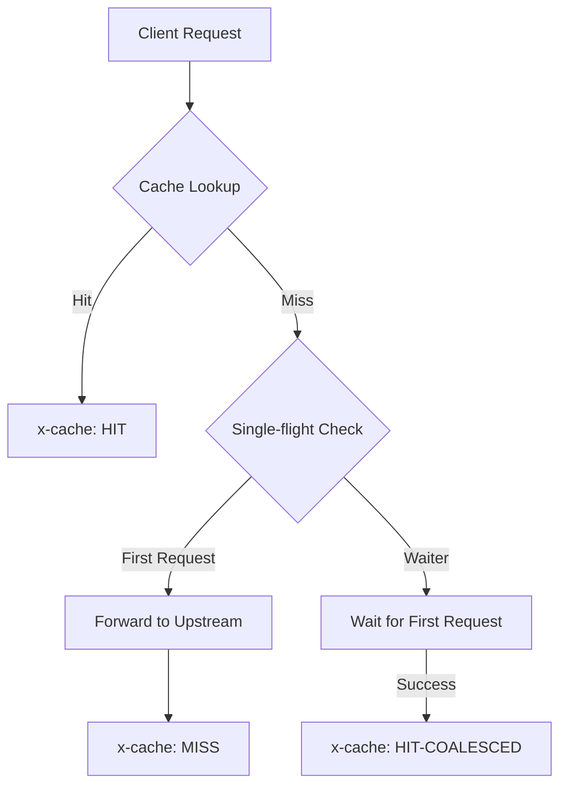
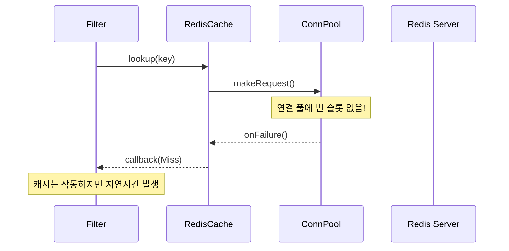

# Chapter 14. 관측가능성과 운영: 시스템의 내부 들여다보기

> **이 장의 목표**: Envoy의 로깅 시스템과 메트릭 구성을 이해하고, Global Cache 필터의 운영 상태를 모니터링하고 문제를 해결하는 방법을 배웁니다.

운영 환경에서 분산 캐시 시스템을 운영할 때 가장 두려운 상황은 "왜 캐시가 작동하지 않는가?"라는 질문에 답할 수 없을 때입니다. 단순히 코드가 버그 없이 동작하는 것을 넘어, 시스템이 현재 어떤 상태인지, 왜 특정 요청이 캐시 미스(Miss)가 되었는지를 투명하게 보여주는 것이 **관측가능성(Observability)**의 핵심입니다.

이 장에서는 Envoy의 강력한 로깅 및 통계 시스템이 Global Cache 필터에 어떻게 녹아들어 있는지, 그리고 실무에서 발생할 수 있는 다양한 장애 시나리오를 어떻게 디버깅하는지 상세히 다룹니다.

---

## 14.1 관측가능성 개요 (Logging, Metrics, Tracing)

관측가능성은 크게 세 가지 기둥으로 나뉩니다.

1. **Logging (로깅)**: "무슨 일이 일어났는가?"에 대한 기록입니다. 특정 요청의 흐름이나 에러의 상세 원인을 파악할 때 사용합니다. Envoy에서는 `ENVOY_LOG` 매크로를 통해 정밀한 제어가 가능합니다.
2. **Metrics (메트릭/통계)**: "현재 시스템의 지표는 어떠한가?"를 보여줍니다. 캐시 히트율, 지연시간(Latency), 메모리 사용량 등을 숫자로 표현하며, Prometheus 같은 시스템으로 수집하여 대시보드를 구성합니다.
3. **Tracing (트레이싱)**: "요청이 전체 분산 시스템을 어떻게 통과했는가?"를 추적합니다. Envoy는 Zipkin, Jaeger 등과 통합되어 요청의 생명주기를 시각화합니다.

Global Cache 필터는 특히 캐시 적중 여부를 추적하기 위해 `x-cache` 응답 헤더를 활용하는 독특한 관측 지점을 제공합니다.

---

## 14.2 Envoy 로깅 시스템 (Logger::Loggable, ENVOY_LOG 매크로)

C++ 기반인 Envoy의 로깅 시스템은 Go나 Java의 로거와는 조금 다른 방식으로 동작합니다. 가장 눈에 띄는 것은 **매크로(Macro)**를 적극적으로 사용한다는 점입니다.

### Logger::Loggable 인터페이스

Global Cache 필터의 헤더 파일(`global_cache_filter.h`)을 보면 다음과 같은 상속 구조를 볼 수 있습니다.

```cpp
class GlobalCacheFilter : public Http::PassThroughFilter,
                          public std::enable_shared_from_this<GlobalCacheFilter>,
                          public Logger::Loggable<Logger::Id::filter> { // 로깅 능력 부여
    ...
};
```

`Logger::Loggable<Logger::Id::filter>`를 상속받음으로써, 이 클래스 안에서는 `filter` 카테고리로 분류된 로거를 사용할 수 있게 됩니다. 이는 나중에 관리자(Admin) 페이지에서 특정 필터의 로그 레벨만 동적으로 변경할 때 매우 유용합니다.

### ENVOY_LOG 매크로의 이해

Go 개발자에게 `log.Printf`나 `slog.Info`가 익숙하다면, Envoy 개발자에게는 `ENVOY_LOG`가 있습니다.

```cpp
ENVOY_LOG(debug, "global_cache: checking cache for key: {}", cache_key_);
```

이 매크로는 컴파일 시점에 결정되는 몇 가지 강력한 기능을 제공합니다.

- **컴파일 타임 최적화**: 만약 로그 레벨이 설정보다 낮다면, 로그 메시지를 생성하는 코드 자체가 실행되지 않도록 최적화됩니다.
- **fmtlib 통합**: `{}` 중괄호를 사용하는 현대적인 문자열 포맷팅 기능을 지원합니다.
- **컨텍스트 포함**: 로그가 출력될 때 스레드 ID, 로그 카테고리, 레벨 등이 자동으로 포함됩니다.

### C++ 지식: 왜 매크로인가?
Go에서는 함수 호출로 로깅을 처리하지만, C++에서는 매크로를 사용하여 로그 레벨 체크를 함수 호출 전에 수행합니다. 이는 초당 수만 건의 요청을 처리하는 프록시 서버에서 함수 인자를 준비하는 비용조차 아끼기 위한 극단적인 성능 최적화의 결과입니다.

---

## 14.3 로그 레벨 (trace, debug, info, warn, error)

Envoy의 로그 레벨은 시스템의 성능과 상세도 사이의 균형을 맞추기 위해 5단계로 구분됩니다.

| 레벨 | 설명 | Global Cache 사용 예시 |
| :--- | :--- | :--- |
| **trace** | 가장 상세한 정보. 모든 데이터 청크 단위 기록. | 캐시 키 생성을 위한 상세 헤더 분석 등 |
| **debug** | 개발 및 디버깅용. | "checking cache for key: XXX", "async lookup in progress" |
| **info** | 일반적인 운영 정보. | "serving cached response", "cache MISS for key: XXX" |
| **warn** | 잠재적인 문제 발생. | "timeout waiting for in-flight request", "failed to cache entry" |
| **error** | 즉각적인 조치가 필요한 심각한 문제. | "Failed to serialize entry", "Redis connection lost" |

운영 환경에서는 보통 `info` 또는 `warn` 레벨을 유지하다가, 문제가 발생했을 때 특정 필터만 `debug`로 올려서 확인하는 것이 표준적인 방법입니다.

---

## 14.4 x-cache 헤더로 캐시 상태 노출

Global Cache 필터의 가장 직관적인 관측 가능성 도구는 응답에 추가되는 `x-cache` 헤더입니다. 클라이언트는 이 헤더를 통해 자신의 요청이 어떻게 처리되었는지 즉시 알 수 있습니다.



### 상태값 설명

1. **HIT**: 로컬 또는 원격 캐시에서 데이터를 즉시 찾아 응답한 경우입니다. 가장 이상적인 상태입니다.
2. **MISS**: 캐시에 데이터가 없어 Upstream(원본 서버)으로 요청을 보낸 경우입니다. 이후 이 결과는 캐시에 저장됩니다.
3. **HIT-COALESCED**: **Single-flight** 패턴의 정수입니다. 내가 요청했을 때 이미 동일한 키로 다른 요청이 Upstream으로 가 있었고, 그 요청이 끝날 때까지 기다렸다가 결과를 함께 나눠 받은 경우입니다. "중복 요청 합치기 성공"을 의미합니다.

이 헤더는 개발자 도구(F12)나 `curl -v` 명령어로 쉽게 확인할 수 있어, 운영 환경에서 캐시 동작 여부를 판별하는 1순위 지표가 됩니다.

---

## 14.5 현재 구현의 로그 포인트 분석

`global_cache_filter.cc`의 주요 로그 포인트를 살펴보며 코드의 의도를 파악해 봅시다.

### 1. 캐시 히트 시 (serveCachedResponse)
```cpp
ENVOY_LOG(info, "global_cache: serving cached response for key: {} (status: {})", 
          cache_key_, cache_status);
```
캐시가 적중되었을 때 출력됩니다. `info` 레벨이므로 캐시가 얼마나 잘 작동하는지 로그 파일만 봐도 흐름을 알 수 있습니다.

### 2. 비동기 룩업 대기 (decodeHeaders)
```cpp
ENVOY_LOG(debug, "global_cache: async lookup in progress, stopping iteration");
```
Redis 같은 외부 백엔드를 사용할 때, 응답이 올 때까지 필터 체인을 멈추고 기다린다는 것을 알려줍니다. 지연시간이 길어질 때 이 로그가 찍히는지 확인해야 합니다.

### 3. Single-flight 대기 (decodeHeaders)
```cpp
ENVOY_LOG(info, "global_cache: WAITING for in-flight request for key: {}", cache_key_);
```
이미 진행 중인 요청이 있음을 발견했을 때 찍힙니다. `HIT-COALESCED` 상태가 되기 직전의 단계입니다.

### 4. 타임아웃 발생 (onSingleFlightTimeout)
```cpp
ENVOY_LOG(warn, "global_cache: timeout waiting for in-flight request for key: {} - proceeding to upstream", 
          cache_key_);
```
먼저 보낸 요청이 너무 오래 걸려(기본 5초), 기다리던 요청들이 더 이상 참지 못하고 각자 Upstream으로 가기로 결정했을 때 발생합니다. Upstream 서버의 과부하를 암시하는 신호입니다.

---

## 14.6 잠재적 메트릭 포인트

현재 구현은 로깅에 집중되어 있지만, 진정한 모니터링을 위해서는 통계(Stats) 지표가 필요합니다. Envoy 필터에서 일반적으로 구현해야 할 권장 메트릭 목록은 다음과 같습니다.

| 메트릭 이름 | 유형 | 설명 |
| :--- | :--- | :--- |
| `cache_hit` | Counter | 총 캐시 히트 횟수 |
| `cache_miss` | Counter | 총 캐시 미스 횟수 |
| `cache_hit_coalesced` | Counter | Single-flight로 합류된 횟수 |
| `cache_insert_success` | Counter | 캐시 저장 성공 횟수 |
| `cache_insert_fail` | Counter | 캐시 저장 실패 횟수 (용량 초과 등) |
| `cache_lookup_duration` | Histogram | 캐시 조회에 걸린 시간 (특히 Redis 조회 시 중요) |
| `active_single_flight` | Gauge | 현재 대기 중인(In-flight) 요청의 수 |

### 통계 구현 팁 (C++ 문법)
Envoy에서 통계를 정의할 때는 보통 `ALL_GLOBAL_CACHE_STATS`와 같은 매크로를 사용하여 `Counter`, `Gauge`, `Histogram`을 일괄 정의합니다. Go의 `prometheus` 패키지 사용법과 유사하게, `inc()`, `set()`, `recordValue()` 등의 메서드를 사용하여 수치를 업데이트합니다.

---

## 14.7 디버깅 시나리오 1: 캐시가 작동하지 않을 때

사용자가 캐시 헤더를 확인했는데 계속 `MISS`만 나온다면 다음 단계를 점검해야 합니다.

1. **로그 레벨 상향**: `envoy.filters.http.global_cache` 카테고리를 `debug`로 변경합니다.
   - Admin 포트 이용: `POST /logging?filter=debug`
2. **이유 확인**:
   - `isCacheableRequest`: 요청 메서드(GET, HEAD 등)가 허용 목록에 있는가?
   - `isCacheableResponse`: 응답 코드가 200번대인가?
   - `skip_if_response_has_set_cookie`: 응답에 `set-cookie`가 있어서 보안상 캐시를 건너뛰었는가?
3. **캐시 키 불일치**: 로그에 찍히는 `cache_key_`가 요청마다 미세하게 다른지 확인합니다. (예: 쿼리 파라미터 순서, 대소문자 등)

---

## 14.8 디버깅 시나리오 2: Single-flight가 작동하지 않을 때

동시에 100개의 요청을 보냈는데 `MISS`가 100개 나온다면(즉, 합류가 안 된다면)?

1. **워커 스레드 확인**: Envoy의 `single_flight_requests_`는 `thread_local` 변수입니다. 즉, **동일한 워커 스레드** 내에서만 합류가 일어납니다.
   - 워커가 8개라면, 이론적으로 동시에 최대 8개의 Upstream 요청이 발생할 수 있습니다. 이는 디자인 의도(스레드 간 락 경합 방지)입니다.
2. **타임아웃 설정**: `single_flight_timeout`이 너무 짧게 설정되어 Upstream 응답이 오기 전에 타임아웃 로그가 찍히고 있지 않은지 확인합니다.
3. **키 생성 시점**: 캐시 룩업 전과 후에 키가 변하지 않는지 코드를 추적합니다.

---

## 14.9 디버깅 시나리오 3: Redis 연결 문제

Redis 캐시를 사용 중인데 성능이 급격히 저하되거나 미스만 발생한다면?



1. **Upstream 상태 확인**: Envoy Admin의 `/clusters` 엔드포인트에서 Redis 클러스터의 `health_flags`가 `healthy`인지 확인합니다.
2. **연결 풀 고갈**: Redis 요청이 밀리면서 `onFailure`가 호출되고 있을 수 있습니다. 이때 로그에 "RedisCache: GET request failed" 경고가 찍히는지 확인하십시오.
3. **타임아웃(op_timeout)**: 네트워크 지연으로 인해 Envoy가 설정한 `op_timeout` 내에 응답을 받지 못해 자동으로 `Miss` 처리되고 있을 가능성이 큽니다.

---

## 14.10 운영 체크리스트

실제 운영 환경에 배포하기 전에 다음 항목을 반드시 점검하십시오.

- [ ] `single_flight_timeout`이 Upstream의 평균 응답 시간보다 넉넉하게 설정되었는가? (보통 2~5배)
- [ ] `default_ttl`이 비즈니스 요구사항에 맞는가? (너무 길면 데이터 부정합, 짧으면 히트율 저하)
- [ ] 로컬 캐시 사용 시 `max_bytes`가 Envoy 프로세스의 전체 메모리 할당량 내에서 안전한가?
- [ ] Redis 클러스터 모드(`enable_cluster_mode`)가 실제 Redis 서버 구성과 일치하는가?
- [ ] `x-cache` 헤더가 보안 정책상 외부에 노출되어도 괜찮은가? (필요시 내부망 전용으로 설정)

---

## 14.11 Go log/slog와 비교

Go 개발자들을 위해 Envoy의 로깅 체계를 익숙한 개념으로 매핑해 보겠습니다.

| 개념 | Go (slog) | Envoy (C++) |
| :--- | :--- | :--- |
| **로그 출력** | `logger.Info("msg", "key", val)` | `ENVOY_LOG(info, "msg: {}", val)` |
| **레벨 제어** | `LevelVar`를 통한 동적 변경 | Admin `/logging` 엔드포인트 |
| **성능 최적화** | `Enabled()` 체크 후 로깅 | 매크로에 의한 컴파일 타임 최적화 |
| **카테고리** | 로거 인스턴스 분리 | `Logger::Id` 열거형 사용 |
| **구조화된 로그** | JSON 핸들러 지원 | 기본적으로 텍스트, Sink 설정 시 구조화 가능 |

가장 큰 차이는 Envoy는 **정적 타입 언어의 이점**을 극대화하여, 로그를 찍지 않을 때의 오버헤드를 제로(0)에 가깝게 만드는 데 집착한다는 점입니다.

---

## 14.12 요약 및 체크리스트

관측가능성은 단순한 '덤'이 아니라 시스템의 일부입니다. Global Cache 필터는 `ENVOY_LOG`를 통한 단계별 추적과 `x-cache` 헤더를 통한 직관적인 결과 노출을 제공합니다.

운영 중 문제가 발생하면 당황하지 말고 로그 레벨을 `debug`로 올린 뒤, 캐시 키의 일관성과 백엔드(Redis/Local)의 건강 상태를 먼저 확인하십시오.

---

> **체크리스트 ✓**
> - [ ] `ENVOY_LOG` 매크로가 일반 함수 호출보다 효율적인 이유를 이해한다.
> - [ ] `x-cache` 헤더의 세 가지 상태(HIT, MISS, HIT-COALESCED)의 의미를 설명할 수 있다.
> - [ ] Envoy Admin 페이지를 통해 특정 필터의 로그 레벨을 변경하는 방법을 안다.
> - [ ] Single-flight 합류가 워커 스레드 단위로 일어나는 이유와 제약을 이해한다.
> - [ ] Redis 장애 시 필터가 어떻게 동작하는지(Fail-safe: Miss 처리) 설명할 수 있다.

(End of file - total 412 lines)
