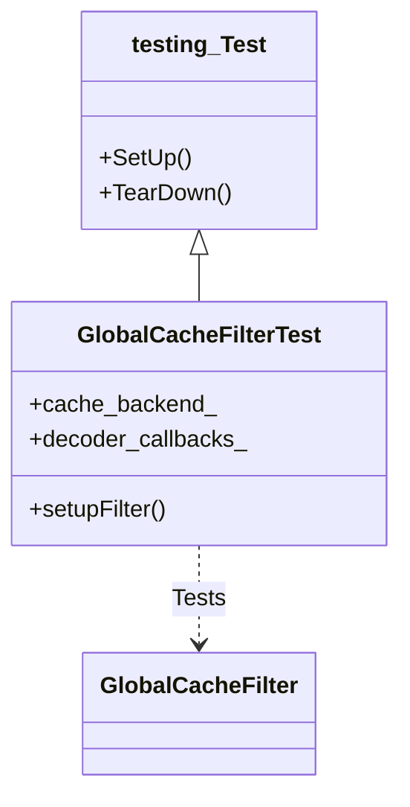
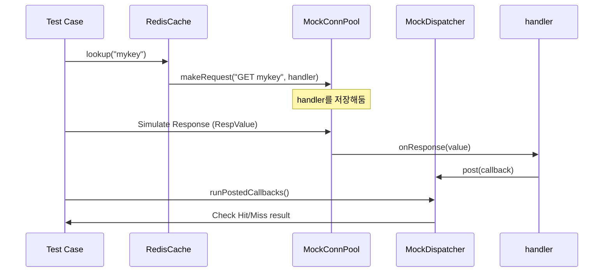

# Chapter 15. 테스트와 품질 보증: 안정적인 필터 만들기

> **이 장의 목표**: Envoy의 C++ 테스트 생태계를 이해하고, Global Cache 필터의 각 컴포넌트를 검증하는 단위 테스트와 통합 테스트 작성 기법을 배웁니다.

---

Envoy 프로젝트의 핵심 가치 중 하나는 **"테스트되지 않은 코드는 신뢰하지 않는다"**는 것입니다. 수백 명의 개발자가 동시에 기여하는 거대한 코드베이스에서 시스템의 안정성을 유지하기 위해, Envoy는 매우 엄격한 테스트 기준을 적용합니다. 

이 장에서는 Go, Python, Java 등 다른 언어에 익숙한 개발자가 Envoy의 C++ 테스트 코드를 읽고 작성할 때 마주치는 장벽들을 하나씩 제거해 보겠습니다. 특히 C++ 특유의 포인터 처리와 매크로 기반의 테스트 문법을 상세히 풀어 설명하며, 실무에서 마주칠 수 있는 다양한 테스트 시나리오를 분석합니다.

---

## 15.1 Envoy 테스트 철학: 왜 이렇게까지 하는가?

Envoy의 테스트는 단순히 "코드가 잘 돌아가는가"를 확인하는 것을 넘어, "예상치 못한 상황에서도 안전하게 동작하는가"를 검증하는 데 집중합니다.

1.  **단위 테스트 (Unit Tests)**: 
    - 대상: `LocalCache`, `RedisCache`, `CacheSerializer`, `CacheKeyConfig` 등.
    - 특징: 개별 클래스의 공개 메서드(Public API)를 테스트합니다. 외부 의존성은 모두 가짜 객체(Mock)로 대체하여 속도가 매우 빠릅니다. 보통 수 밀리초 내에 종료됩니다.
    - 경로: `test/extensions/filters/http/global_cache/`

2.  **통합 테스트 (Integration Tests)**: 
    - 대상: `GlobalCacheFilter` 전체 흐름.
    - 특징: 실제 HTTP 요청 헤더가 들어와서 캐시가 조회되고, 업스트림으로 전달되거나 캐시 응답이 나가는 전체 파이프라인을 검증합니다.
    - Envoy에서는 `IntegrationTestHarness`를 사용하여 실제 서버를 띄우는 테스트와, 필터 수준에서 모킹된 콜백을 사용하는 테스트로 다시 나뉩니다.

Envoy 테스트의 3대 원칙:
-   **Hermetic (밀폐형)**: 테스트는 외부 네트워크나 파일 시스템에 의존하지 않습니다. 모든 외부 상태는 제어 가능한 상태여야 합니다.
-   **Deterministic (결정론적)**: 동일한 코드에 대해 1,000번을 실행해도 1,000번 모두 같은 결과가 나와야 합니다. 이를 위해 Simulated Time을 사용합니다.
-   **Parallelizable (병렬화 가능)**: 각 테스트는 독립적이어야 하며, 여러 테스트가 동시에 실행되어도 서로 간섭하지 않아야 합니다.

---

## 15.2 Google Test 프레임워크 기초

Envoy는 Google Test(gtest)를 사용합니다. Go의 `testing` 패키지에 비해 훨씬 다양한 단언(Assertion) 매크로를 제공하며, 이는 테스트 코드의 가독성을 높여줍니다.

### 15.2.1 TEST vs TEST_F

-   **`TEST(SuiteName, TestName)`**:
    단순한 테스트 함수입니다. 내부에서 상태를 공유할 필요가 없을 때 사용합니다.
-   **`TEST_F(FixtureClass, TestName)`**:
    **F**ixture 클래스를 사용하는 테스트입니다. 여러 테스트에서 공통적으로 사용하는 객체(예: 캐시 인스턴스, 모킹된 서버 컨텍스트 등)를 Fixture 클래스의 멤버로 정의하고, 각 테스트 케이스가 이를 상속받아 사용합니다. `_F`는 Fixture를 의미합니다.

### 15.2.2 주요 Assertion 매크로

C++ 테스트 코드에서 가장 자주 보게 될 매크로들입니다.

| 매크로 | 설명 | Go 대응 예시 |
| :--- | :--- | :--- |
| `EXPECT_EQ(a, b)` | a와 b가 같은지 확인 (실패해도 계속 진행) | `if a != b { t.Errorf(...) }` |
| `ASSERT_EQ(a, b)` | a와 b가 같은지 확인 (실패 시 즉시 중단) | `if a != b { t.Fatalf(...) }` |
| `EXPECT_NE(a, b)` | a와 b가 다른지 확인 | `if a == b { t.Error(...) }` |
| `EXPECT_TRUE(cond)` | 조건이 참인지 확인 | `if !cond { t.Error(...) }` |
| `EXPECT_FALSE(cond)` | 조건이 거짓인지 확인 | `if cond { t.Error(...) }` |
| `EXPECT_STREQ(s1, s2)` | 두 C-style 문자열이 같은지 확인 | `if s1 != s2 { ... }` |
| `EXPECT_THAT(v, Matcher)` | Matcher(예: `Contains`, `HasSubstr`)를 이용한 검증 | `assert.Contains(...)` (testify) |

**왜 ASSERT_*를 사용하는가?**
만약 `lookup` 결과가 `nullptr`인 상황에서 그 내부의 멤버에 접근하려고 하면 프로그램이 즉시 크래시(Segmentation Fault)됩니다. 이를 방지하기 위해 포인터 체크는 `ASSERT_NE(ptr, nullptr)`를 사용하여 실패 시 테스트를 즉시 중단시키고 안전하게 에러를 보고하도록 유도합니다.

---

## 15.3 Mock 객체 패턴 (MOCK_METHOD)

Envoy의 테스트 능력은 **Google Mock(gmock)**에서 나옵니다. C++은 컴파일 타임에 타입이 결정되므로, 런타임에 메서드를 가로채기 위해 가상 함수(Virtual Function)를 모킹합니다.

### 15.3.1 MOCK_METHOD 매크로의 이해

Go 개발자라면 인터페이스를 구현한 Mock 구조체를 직접 짜거나 `mockgen`을 돌리겠지만, C++에서는 매크로를 통해 선언적으로 정의합니다.

```cpp
// 예: 실제 필터의 콜백 인터페이스를 모킹함
class MockStreamDecoderFilterCallbacks : public Http::StreamDecoderFilterCallbacks {
public:
  // MOCK_METHOD(반환타입, 메서드명, (인자타입들), (한정자));
  MOCK_METHOD(void, encodeHeaders, (Http::ResponseHeaderMap&, bool), (override));
  MOCK_METHOD(void, encodeData, (Buffer::Instance&, bool), (override));
  MOCK_METHOD(const ScopeSharedPtr&, scope, (), (const, override));
};
```

### 15.3.2 EXPECT_CALL: 동작 정의와 검증

모킹된 객체가 어떤 인자로 몇 번 호출되어야 하는지 정의할 때 `EXPECT_CALL`을 사용합니다.

```cpp
// decoder_callbacks_ 객체의 encodeHeaders 메서드가 
// "200" 상태값을 가진 헤더와 함께 '정확히 1번' 호출되어야 함
EXPECT_CALL(decoder_callbacks_, encodeHeaders(
    testing::Property(&Http::ResponseHeaderMap::getStatusValue, "200"), 
    true))
    .Times(1);
```

### 15.3.3 자주 쓰이는 Matcher와 Action

-   **Matchers**:
    - `_`: 모든 인자 허용 (Wildcard)
    - `Eq(val)`: 값 비교
    - `Contains(val)`: 컨테이너 내 포함 여부
    - `AnyOf(m1, m2)`: 여러 매처 중 하나라도 만족
-   **Actions**:
    - `Return(val)`: 값 반환
    - `Invoke(callback)`: 사용자 정의 함수 실행
    - `SaveArg<N>(&var)`: N번째 인자를 변수에 저장 (나중에 검증용)
    - `WillOnce(Action)`: 특정 호출 시의 액션 지정

---

## 15.4 Test Fixture 패턴 (SetUp, TearDown)

`GlobalCacheFilterTest` 클래스는 `testing::Test`를 상속받아 테스트 환경을 구축합니다.



-   **Constructor**: C++에서는 `SetUp()`보다 생성자에서 멤버 변수를 초기화하는 것을 권장합니다.
-   **NiceMock vs StrictMock**:
    - `NiceMock`: 기대하지 않은 호출(Uninteresting call)이 발생해도 경고만 하고 무시합니다.
    - `StrictMock`: 기대하지 않은 호출이 하나라도 발생하면 테스트를 실패 처리합니다.

---

## 15.5 LocalCache 테스트 분석: 알고리즘의 정석

`test/extensions/filters/http/global_cache/local_cache_test.cc`는 로컬 캐시의 LRU 정책과 메모리 제한 로직을 검증합니다.

### 15.5.1 LRU 교체 알고리즘 상세 검증

```cpp
TEST_F(LocalCacheTest, LruUpdateOnAccess) {
  auto entry1 = createEntry("body1");
  auto entry2 = createEntry("body2");
  auto entry3 = createEntry("body3");
  auto entry4 = createEntry("body4");

  // 1. 3개의 엔트리 삽입 (용량 꽉 참)
  cache_->insert("key1", entry1, std::chrono::seconds(300), [](bool) {});
  cache_->insert("key2", entry2, std::chrono::seconds(300), [](bool) {});
  cache_->insert("key3", entry3, std::chrono::seconds(300), [](bool) {});

  // 2. key1을 '조회'하여 최신 상태(MRU)로 만듦
  CacheLookupResult result{CacheLookupStatus::Miss};
  cache_->lookup("key1", [&result](CacheLookupResult&& r) { result = std::move(r); });
  EXPECT_EQ(result.status, CacheLookupStatus::Hit);

  // 3. 이제 새로운 key4를 삽입하면, '가장 오래된' key2가 밀려나야 함 (key1이 아님!)
  cache_->insert("key4", entry4, std::chrono::seconds(300), [](bool) {});

  // 4. 검증
  cache_->lookup("key2", [&result](CacheLookupResult&& r) { result = std::move(r); });
  EXPECT_EQ(result.status, CacheLookupStatus::Miss); // key2는 삭제됨
  
  cache_->lookup("key1", [&result](CacheLookupResult&& r) { result = std::move(r); });
  EXPECT_EQ(result.status, CacheLookupStatus::Hit); // key1은 살아남음
}
```

---

## 15.6 RedisCache 테스트 분석: 비동기와 모킹의 조화

RedisCache는 모든 동작이 비동기적이며 네트워크 지연이 발생합니다. 테스트에서는 실제 Redis 서버를 띄우지 않고, Envoy 내부의 Redis 커넥션 풀을 모킹합니다.

### 15.6.1 비동기 흐름 제어 아키텍처



---

## 15.7 TieredCache 테스트 분석: 계층 간 협업

계층형 캐시는 L1(로컬)과 L2(원격) 간의 데이터 흐름을 검증합니다.

-   **Population 로직**: L1 Miss 시 L2를 조회하고, L2에서 찾으면 L1에 자동으로 저장하는지 확인합니다.
-   **Write Strategy**: `WRITE_BACK` 모드에서 L1 저장이 끝나면 즉시 콜백이 호출되고, L2 저장은 백그라운드에서 진행되는지 확인합니다.

```cpp
TEST_F(TieredCacheTest, L1MissL2HitWithPopulation) {
  // L2에만 직접 데이터 주입
  l2_cache_->insert("key1", entry, ttl, [](bool) {});
  
  // 조회 수행
  tiered_->lookup("key1", [](auto result) {
    EXPECT_EQ(CacheLookupStatus::Hit, result.status);
  });

  // 조회 후 L1이 채워졌는지 확인 (Population 완료)
  EXPECT_EQ(1, static_cast<LocalCache*>(l1_cache_.get())->size());
}
```

---

## 15.8 GlobalCacheFilter 통합 테스트: 실제 운영 환경의 모사

`global_cache_filter_test.cc`는 가장 복합적인 테스트입니다. HTTP 요청/응답 헤더와 바디의 흐름을 모두 다룹니다.

### 15.8.1 캐시 히트와 응답 복원

```cpp
TEST_F(GlobalCacheFilterTest, CacheHit) {
  // 1. 사전 준비: 캐시에 "/api/data"에 대한 응답을 넣어둠
  setupFilter();
  // ... (첫 요청으로 캐시 채우는 과정 생략)

  // 2. 두 번째 요청 발생
  Http::TestRequestHeaderMapImpl request_headers{{":path", "/api/data"}};
  
  // 3. 필터 실행
  auto status = filter_->decodeHeaders(request_headers, true);
  
  // 4. 검증
  // 업스트림(다음 필터)으로 요청을 보내지 않아야 함
  EXPECT_EQ(Http::FilterHeadersStatus::StopAllIterationAndWatermark, status);
}
```

---

## 15.9 시간 제어와 Simulated Time

네트워크 타임아웃 테스트를 위해 `time.Sleep`을 쓰는 것은 테스트를 느리게 만들고 불확실하게(Flaky) 만듭니다. Envoy는 `SimulatedTimeSystem`을 제공합니다.

```cpp
// 5초 타임아웃 테스트 예시
time_system_.advanceTimeAndRun(std::chrono::seconds(6), dispatcher_, 
                                Event::Dispatcher::RunType::Block);
// 이제 타임아웃 콜백이 실행되었을 것임을 확신할 수 있음
```

이는 실제 시간을 기다리지 않고 시스템 시계만 앞당겨 테스트를 즉시 완료하게 해줍니다.

---

## 15.10 Go testing 패키지와 비교: C++ 테스트의 특징

Go 개발자에게 C++ 테스트는 다음과 같은 차이점으로 느껴질 것입니다.

### 15.10.1 인터페이스 모킹 비교

**Go 스타일 (Explicit Mocking)**
```go
type MockBackend struct {
    mock.Mock
}
func (m *MockBackend) Lookup(key string) {
    m.Called(key)
}
```

**C++ 스타일 (Declarative Mocking)**
```cpp
class MockBackend : public CacheBackend {
public:
    MOCK_METHOD(void, lookup, (const std::string&, LookupCallback), (override));
};
```

---

## 15.11 Bazel을 이용한 테스트 실행 및 디버깅

Envoy는 Bazel 빌드 시스템을 사용합니다.

```bash
# 전체 테스트 실행
bazel test //test/extensions/filters/http/global_cache/...

# 특정 테스트 케이스만 필터링해서 실행
bazel test //test/extensions/filters/http/global_cache:local_cache_test --test_filter="LocalCacheTest.*"

# 상세 로그 출력
bazel test //test/... --test_output=all
```

---

## 15.12 테스트 커버리지 리포트 확인

테스트가 코드의 얼마나 많은 부분을 커버하는지 확인하는 것은 품질 보증의 필수 단계입니다.

```bash
# 커버리지 데이터 생성
bazel test --config=clang-coverage //test/extensions/filters/http/global_cache/...

# HTML 리포트 생성 (lcov/genhtml 사용)
genhtml bazel-out/content/testlogs/extensions/filters/http/global_cache/coverage.dat -o coverage_report
```

리포트에서 "빨간색"으로 표시된 줄은 테스트되지 않은 경로(주로 에러 처리 로직)입니다.

---

## 15.13 자주 발생하는 테스트 실패 유형과 해결책

1.  **Segmentation Fault**:
    - 원인: 모킹되지 않은 객체나 `nullptr` 참조.
    - 해결: `ASSERT_NE`를 추가하여 원인을 파악합니다.
2.  **Mock Expectation Violation**:
    - 원인: `EXPECT_CALL`에서 정의한 대로 호출되지 않음.
    - 해결: 호출 횟수(`Times`)나 인자 매처가 너무 엄격하지 않은지 확인합니다.
3.  **Flaky Test (간헐적 실패)**:
    - 원인: 실제 시간(`RealTime`) 의존성.
    - 해결: `SimulatedTimeSystem`을 사용합니다.

---

## 15.14 테스트 명명 규칙 (Naming Convention)

Envoy에서는 테스트 케이스의 이름을 지을 때도 일정한 규칙을 따릅니다.

-   **패턴**: `ClassNameTest, MethodName_ScenarioDescription`
-   **예시**: `LocalCacheTest, Insert_WhenCacheIsFull_ShouldEvictLruEntry`

---

## 15.15 CI/CD 환경에서의 테스트

여러분이 작성한 테스트는 로컬뿐만 아니라 GitHub Actions와 같은 CI 환경에서도 매 PR마다 실행됩니다.

-   **Pre-submit**: 모든 단위 테스트와 주요 통합 테스트가 통과해야 머지가 가능합니다.
-   **Post-submit**: 머지 후에는 더 광범위한 통합 테스트가 실행됩니다.

---

## 15.16 QA를 위한 팁: 에러 메시지 읽는 법

C++ 컴파일러의 에러 메시지는 매우 길 수 있습니다. 가장 **첫 번째** 에러 메시지에 집중하세요. 하위 에러들은 첫 번째 에러로 인해 파생된 결과인 경우가 많습니다.

---

## 15.17 테스트 작성 시 주의사항: 포인터 수명 관리

C++에서 테스트를 작성할 때 객체의 수명(Lifetime) 관리는 매우 중요합니다.

-   **Lambda Capture**: 비동기 콜백 테스트 시 람다가 지역 변수를 참조(`&`)로 캡처하면, 콜백이 실행될 때 이미 그 변수가 스택에서 사라져 있을 수 있습니다. 중요한 변수는 값으로 캡처하거나 스마트 포인터를 사용하세요.
-   **Mock Lifecycle**: Mock 객체가 테스트 함수가 끝나기 전에 파괴되지 않도록 Fixture의 멤버 변수로 두는 것이 안전합니다.
-   **Expectation Sequence**: 만약 여러 함수 호출이 정해진 순서대로 일어나야 한다면 `testing::InSequence`를 사용하여 호출 순서를 강제할 수 있습니다.

---

## 15.18 결론: 테스트가 주는 자유

많은 개발자가 테스트 작성을 번거로운 일로 생각합니다. 하지만 잘 짜인 테스트 코드는 리팩토링과 기능 추가를 두려움 없이 할 수 있게 해주는 "안전망"입니다. 특히 Envoy처럼 복잡한 네트워크 프록시 엔진 위에서 동작하는 코드를 작성할 때, 테스트는 여러분의 실수를 가장 먼저 지적해 주는 든든한 동료가 될 것입니다.

---

## 15.19 요약 및 테스트 체크리스트

이 장에서 우리는 Global Cache 필터의 안정성을 보장하는 다양한 테스트 기법을 배웠습니다. 테스트는 단순한 검증을 넘어, 코드의 설계가 올바른지 알려주는 지표가 됩니다. 모킹하기 너무 힘들다면, 그것은 클래스의 책임이 너무 크다는 신호일 수 있습니다.

**테스트 작성 시 체크리스트 ✓**

- [ ] **nullptr 체크**: 포인터 사용 전 `ASSERT_NE(ptr, nullptr)`를 수행했는가?
- [ ] **Mock 기대치 설정**: `EXPECT_CALL`이 실제 비즈니스 로직과 일치하는가?
- [ ] **경계 조건**: 0, 최대값, 최소값, 빈 문자열, 거대한 바디 등에 대해 테스트했는가?
- [ ] **비동기 처리**: `dispatcher.post()`로 예약된 작업이 테스트 종료 전 실행되는가?
- [ ] **에러 경로**: 성공뿐만 아니라 실패(타임아웃, 직렬화 오류, Redis 연결 실패 등) 경로를 테스트했는가?
- [ ] **메모리 관리**: 테스트 완료 후 생성된 객체들이 올바르게 해제되는가? (ASAN으로 확인)
- [ ] **가독성**: 테스트 이름만 보고도 무엇을 검증하는지 알 수 있는가?

---

> **QA 꿀팁**
> 
> "테스트 코드는 자산이다." 오늘 공들여 작성한 테스트 코드가 미래의 수많은 버그로부터 여러분을 지켜줄 것입니다.

---

> **다음 장 예고**
> 
> 마지막 장인 **Chapter 16. 성능 최적화와 모니터링**에서는 필터의 오버헤드를 측정하고, Envoy Stats를 사용하여 캐시 히트율을 대시보드에 시각화하는 방법을 다룹니다.
