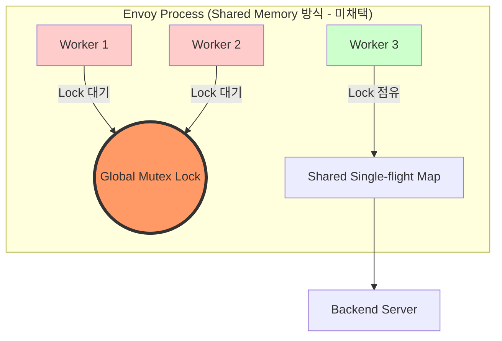
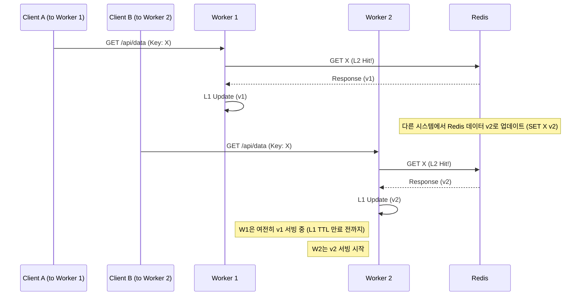

# Chapter 16. 설계 트레이드오프와 운영 고려사항

> **이 장의 목표**: Global Cache 필터의 설계 과정에서 내린 주요 결정들과 그로 인한 트레이드오프를 심층적으로 이해하고, 실제 프로덕션 환경에서 발생할 수 있는 위험 요소와 운영 팁을 배웁니다. 이 장은 본 서적의 마지막 장으로, 앞서 배운 모든 기술적 디테일이 실제 비즈니스 환경에서 어떤 의미를 갖는지 정리합니다.

---

## 16.1 설계 결정의 트레이드오프 개요

모든 소프트웨어 설계는 선택의 연속입니다. 특히 고성능 프록시인 Envoy 내부에서 동작하는 캐시 필터는 성능(Performance), 복잡성(Complexity), 그리고 일관성(Consistency) 사이에서 끊임없는 줄타기를 해야 합니다.

Global Cache 필터는 "완벽한 RFC 준수"보다는 **"예측 가능한 성능과 운영의 단순함"**에 우선순위를 두었습니다. Envoy와 같은 분산 시스템에서는 모든 상황을 완벽하게 처리하려는 시도가 종종 시스템 전체의 안정성을 해치는 독이 되기도 합니다. 우리는 99%의 일반적인 케이스를 안전하게 가속하는 데 집중하고, 나머지 1%의 특수한 상황은 필터가 안전하게 '우회(Bypass)'하도록 설계했습니다.

이 장에서는 왜 우리가 특정 방식을 선택했는지, 그리고 그 선택이 여러분의 서비스에 어떤 영향을 미치는지 상세히 분석합니다. 우리가 마주했던 열 가지 이상의 주요 결정 사항들을 하나씩 짚어보며, 여러분의 시스템에 최적화된 캐시 전략을 세우는 안목을 길러보겠습니다.

특히 다음의 핵심 질문들에 답할 수 있게 될 것입니다:
1. 왜 Single-flight는 워커별로 독립적이어야만 했는가?
2. 1MB라는 용량 제한은 왜 수십 MB가 될 수 없는가?
3. Redis 장애가 발생했을 때 필터는 왜 에러를 반환하지 않는가?
4. 캐시 무효화(Purge) 기능이 없는 상태에서 어떻게 데이터 신선도를 유지하는가?

---

## 16.2 워커별 TLS vs 공유 메모리 (Single-flight 범위)

가장 빈번하게 논의되는 주제 중 하나는 Single-flight 패턴의 구현 범위입니다. Single-flight는 동일한 요청이 한꺼번에 몰릴 때(Thundering Herd) 이를 하나로 묶어 백엔드 부하를 줄이는 기술입니다.

### 설계 선택: Thread Local Storage (TLS)
Global Cache는 Single-flight 상태를 **워커 스레드별 TLS**에 저장합니다. 

```cpp
// source/extensions/filters/http/global_cache/global_cache_filter.h

namespace Envoy {
namespace Extensions {
namespace HttpFilters {
namespace GlobalCache {

/**
 * Single-flight pattern: track in-flight requests to prevent thundering herd.
 * 워커별로 독립적인 Single-flight 맵을 가집니다.
 * 'static thread_local' 키워드를 통해 각 워커 스레드는 자신만의 지도를 가집니다.
 * 이는 Envoy의 스레드 모델인 'Thread-per-core' 아키텍처를 적극 활용한 것입니다.
 * 스레드 간의 통신 비용을 제로(0)로 만들기 위한 선택입니다.
 */
static thread_local std::unordered_map<std::string, std::shared_ptr<InFlightRequest>>
    in_flight_requests_;

} // namespace GlobalCache
} // namespace HttpFilters
} // namespace Extensions
} // namespace Envoy
```

### 트레이드오프 분석 상세
| 비교 항목 | 워커별 TLS (현재 방식) | 전역 공유 메모리 (미채택) |
|:---:|:---|:---|
| **동시성 모델** | 무공유(Shared-nothing) | 공유 메모리(Shared-memory) |
| **잠금 전략** | 잠금 없음 (Lock-free) | Mutex 또는 Read-Write Lock 필요 |
| **성능 오버헤드** | 거의 없음 (L1 캐시 히트율 최상) | 잠금 경쟁으로 인한 CPU 사이클 낭비 |
| **정확도** | 워커 수만큼 중복 발생 가능 | 클러스터당 단 1개의 요청 보장 |
| **구현 복잡도** | 단순함 (안정성 높음) | 매우 높음 (Race Condition, Deadlock 방지 등) |

### 상세 분석 및 Mermaid 다이어그램
Envoy는 멀티 워커 모델을 사용합니다. 각 워커는 독립적인 이벤트 루프를 가지며, 스레드 간 데이터 공유를 최소화하는 것이 Envoy의 핵심 성능 비결입니다. 만약 모든 워커가 공유하는 단 하나의 Single-flight 맵을 만든다면, 매 요청마다 Mutex Lock을 잡아야 합니다. 이는 수십만 RPS(Request Per Second)를 처리하는 환경에서 치명적인 성능 저하를 일으킵니다.



**운영 관점의 조언:**
워커 수가 8개, 16개인 인스턴스에서 동일 키 요청이 몰리면 최대 8개, 16개의 요청이 백엔드로 나갑니다. 하지만 수천, 수만 개의 클라이언트 요청이 몰리는 상황에서 이 정도의 중복은 충분히 감내할 수 있는 수준입니다. 오히려 Lock 경쟁으로 인해 모든 워커가 멈추는 상황(Stall)이 훨씬 더 위험합니다. 따라서 대규모 트래픽 환경에서는 현재의 TLS 방식이 훨씬 더 안정적입니다.

---

## 16.3 동기 로컬 캐시 vs 비동기 Redis - 일관성 보장 어려움

Global Cache는 로컬 메모리(L1)와 원격 Redis(L2)를 혼합하여 사용할 수 있습니다. 여기서 '시간'의 개념이 달라집니다.

### 문제 상황: 동기와 비동기의 만남
- **Local Cache**: C++ 메모리 맵 조회입니다. CPU 사이클 단위로 동작하며 **동기적**입니다. 코드 상에서는 즉시 리턴값이 반환됩니다.
- **Redis Cache**: 네트워크 패킷이 오가야 합니다. Envoy의 비동기 I/O와 콜백 모델을 사용하며 **비동기적**입니다. 

이 두 세계가 만나는 `TieredCache`에서 일관성 문제가 발생합니다. 예를 들어, L2(Redis)에는 데이터가 업데이트되었지만, 특정 워커의 L1(로컬)에는 아직 이전 데이터가 남아있을 수 있습니다.

### 일관성 격차 (Consistency Gap) 상세 시나리오
1. **갱신 시점 차이**: Redis에 쓰기가 완료되었더라도, 다른 Envoy 인스턴스의 로컬 캐시를 강제로 무효화할 방법이 없습니다.
2. **Race Condition**: 비동기 콜백이 처리되는 짧은 찰나에 동일한 키에 대한 또 다른 요청이 들어오면, 로컬 캐시와 Redis의 상태가 꼬일 가능성이 존재합니다.



**결론:** 이 필터는 **"최종 일관성(Eventual Consistency)"** 모델을 따릅니다. 엄격한 데이터 정확도가 필요한 금융 트랜잭션 등에는 적합하지 않으며, 정적 콘텐츠나 API 응답 가속화에 최적화되어 있습니다. 만약 더 높은 일관성이 필요하다면 로컬 캐시의 TTL을 극도로 짧게(예: 1~5초) 가져가는 전략이 필요합니다.

---

## 16.4 바디 버퍼링 제한 (1MB) - 대용량 응답 처리

Global Cache는 응답 바디를 메모리에 버퍼링한 뒤 한 번에 캐시에 저장합니다. 이 과정에서 `1MB`라는 하드코딩된 제한이 있습니다.

### 왜 1MB인가? (심층 분석)
1. **메모리 보호**: Envoy는 수만 개의 동시 연결을 처리합니다. 각 연결마다 수십 MB의 데이터를 버퍼링한다면, 프로세스 메모리가 순식간에 고갈되어 OOM(Out Of Memory) 크래시가 발생합니다. 1,000개의 연결이 각각 10MB씩만 점유해도 10GB입니다.
2. **Copy 오버헤드**: C++에서 큰 메모리 블록을 복사하고 직렬화하는 작업은 CPU 집약적입니다. 이는 이벤트 루프를 점유하여 다른 무고한 요청들의 처리를 지연(Latency Spike)시킵니다.
3. **효율성**: 캐시는 보통 작고 빈번한 데이터를 위해 존재합니다. 큰 파일은 이미 커널 레벨의 송수신 버퍼나 파일 시스템 캐시에 의해 어느 정도 가속되고 있습니다.

### 실제 구현 코드 및 동작 원리
```cpp
// source/extensions/filters/http/global_cache/global_cache_filter.cc

Http::FilterDataStatus GlobalCacheFilter::encodeData(Buffer::Instance& data, bool end_stream) {
  if (state_ == FilterState::Caching) {
    // 누적 버퍼가 1MB를 초과하면 캐싱 포기
    // kMaxCachedResponseBytes 는 1024 * 1024 로 정의되어 있습니다.
    if (buffered_body_.length() + data.length() > kMaxCachedResponseBytes) {
      ENVOY_LOG(debug, "Response body too large (>{}), skipping cache", kMaxCachedResponseBytes);
      state_ = FilterState::CacheMiss;
      buffered_body_.drain(buffered_body_.length()); // 메모리 즉시 해제 (중요!)
    } else {
      buffered_body_.add(data);
    }
  }
  return Http::FilterDataStatus::Continue;
}
```

**전략적 조언:** 만약 1MB 이상의 대용량 이미지나 비디오 파일을 캐싱해야 한다면, 이 필터 대신 Envoy의 표준 `CacheFilter`나 별도의 전문 CDN(CloudFront, Akamai 등)을 사용하는 것이 좋습니다. Global Cache는 **"작고 빠른 JSON API 응답"**을 주 타겟으로 합니다.

---

## 16.5 TTL 단순화 - Cache-Control 헤더 미해석

표준 HTTP 캐시는 `Cache-Control: max-age=...` 헤더를 해석하여 TTL을 결정합니다. 하지만 Global Cache는 기본적으로 이를 무시하고 설정된 `default_ttl`을 사용합니다.

### 결정 배경: 운영의 단순함과 제어권
현대적인 마이크로서비스 환경에서 백엔드 개발자가 일일이 `Cache-Control` 헤더를 정확히 설정하기란 어렵습니다. 종종 잘못된 설정으로 인해 캐시가 너무 오래 남거나, 아예 캐싱되지 않는 문제가 발생합니다. 

Global Cache는 **인프라 운영자가 프록시 레벨에서 일괄적으로 캐시 정책을 제어**할 수 있게 하여, 백엔드 코드 수정 없이도 신속하게 대응할 수 있도록 했습니다. 이는 소위 말하는 '인프라를 통한 제어(Infrastructure-led Control)' 방식입니다.

### 주의사항: "강제성"의 양날의 검
백엔드에서 데이터를 업데이트하고 `Cache-Control: no-cache`를 보내더라도, Envoy 설정에 TTL이 남아있다면 Envoy는 여전히 캐시 데이터를 서빙합니다. 이를 해결하려면 라우트별 override 설정을 통해 특정 API의 TTL을 0으로 만들거나 필터를 비활성화해야 합니다. 이는 운영의 유연성을 주지만, 동시에 운영자의 책임을 늘리는 결정입니다.

---

## 16.6 Cache-Control/Set-Cookie 스킵 기본값

안전성을 위해 필터는 다음 조건에서 캐싱을 원천 차단합니다.

- **`skip_if_response_has_cache_control: true`**: 응답에 `Cache-Control` 헤더가 존재하면 "아, 백엔드가 직접 관리하고 싶어하는구나"라고 판단하고 개입하지 않습니다.
- **`skip_if_response_has_set_cookie: true`**: 가장 중요한 보안 장치입니다. `Set-Cookie`는 보통 로그인 세션이나 개인화된 토큰을 포함합니다. 이것이 캐싱되어 다른 사용자에게 전달된다면 대형 보안 사고입니다.

### 보안 사고 시나리오 (Set-Cookie 캐싱 시)
1. 사용자 A가 `/login` 요청을 보냄.
2. 백엔드가 `Set-Cookie: session=A_SECRET`과 함께 응답.
3. Envoy가 이 응답을 캐싱함 (키: `/login`).
4. 사용자 B가 `/login` 요청을 보냄.
5. Envoy가 캐시된 사용자 A의 세션 쿠키를 사용자 B에게 반환함.
6. 사용자 B가 사용자 A로 로그인됨! (계정 탈취 발생)

**위험한 실험:** 만약 성능 극대화를 위해 `skip_if_response_has_set_cookie`를 `false`로 설정하려 한다면, 반드시 해당 API가 개인 정보를 절대 포함하지 않는지(예: 마케팅용 범용 쿠키 등)를 백엔드 팀과 함께 검증해야 합니다. 99%의 경우 이 옵션은 `true`여야 합니다.

---

## 16.7 Write-Through vs Write-Back 선택 기준

`TieredCache` 사용 시 두 가지 쓰기 전략을 선택할 수 있으며, 이는 서비스의 성격에 따라 결정되어야 합니다.

### 1. WRITE_THROUGH (안전 최우선)
L1(로컬)과 L2(Redis) 모두에 저장이 완료되어야 비로소 요청이 끝난 것으로 간주합니다.
- **동작**: L1 저장 완료 후 L2 저장이 끝날 때까지 대기.
- **장점**: 데이터 소실 위험이 적고, 다음 요청이 어느 Envoy 노드로 가더라도 L2(Redis)에서 데이터를 찾을 확률이 높습니다.
- **단점**: Redis 쓰기 지연시간(Network RTT)이 전체 응답 시간에 포함됩니다.

### 2. WRITE_BACK (성능 최우선)
L1(로컬)에 저장하자마자 클라이언트에게 응답을 돌려주고, L2(Redis) 저장은 백그라운드에서 비동기로 진행합니다.
- **동작**: L1 저장 직후 클라이언트에게 응답. L2 저장은 별도 워커 루프에서 비동기로 처리.
- **장점**: 클라이언트가 느끼는 응답 속도가 매우 빠릅니다.
- **단점**: 응답 직후 Envoy 프로세스가 재시작되거나 네트워크 장애가 발생하면 Redis에 데이터가 저장되지 않을 수 있습니다.

| 특성 | WRITE_THROUGH | WRITE_BACK |
|:---|:---|:---|
| **응답 지연시간** | L1 + L2 저장 시간 | **L1 저장 시간만** |
| **데이터 정합성** | 높음 (두 곳 모두 저장 확인) | 보통 (L2 저장 실패 시 유실 가능) |
| **주요 용도** | 일반적인 API 가속 | 극단적인 성능이 필요한 서비스 |

---

## 16.8 메모리 압박과 LRU eviction

로컬 캐시는 제한된 메모리(`max_bytes`) 내에서 동작합니다. 하지만 C++의 메모리 관리는 Go/Java처럼 단순하지 않습니다.

- **LRU (Least Recently Used)**: 메모리가 부족해지면 '가장 예전에 사용된' 항목부터 삭제합니다.
- **실제 메모리 사용량**: 우리가 설정한 `max_bytes`는 '순수 데이터(헤더+바디)'의 크기입니다. 하지만 실제로는 C++ 객체의 오버헤드, 맵 구조의 메타데이터 등으로 인해 실제 프로세스 메모리는 설정값보다 20~30% 더 많이 쓰일 수 있습니다.

### 주요 메트릭 상세 가이드
1. `envoy_http_global_cache_local_cache_size`: 현재 캐시에 저장된 키의 총 개수입니다.
2. `envoy_http_global_cache_local_cache_bytes`: 현재 바디 데이터가 점유하고 있는 총 바이트 수입니다.
3. `envoy_http_global_cache_local_evictions`: 공간 부족으로 인해 강제로 삭제된 엔트리 수입니다. **이 지표의 급증은 성능 저하의 전조입니다.**
4. `envoy_http_global_cache_local_hits`: 로컬 캐시에서 응답을 찾은 횟수입니다.

**운영 팁:**
`local_evictions`가 지속적으로 발생한다면, 캐시의 효율이 극도로 떨어지고 있다는 증거입니다. 이때는 `max_bytes`를 늘리거나, 캐시 키 설정을 검토하여 불필요하게 키가 분산되는 것(High Cardinality)을 막아야 합니다.

---

## 16.9 Redis 장애 시 행동 (Graceful Degradation)

"캐시가 죽으면 서비스도 죽는가?" 이 질문에 대한 대답은 "아니오"여야 합니다.

### Circuit Breaker 역할
Global Cache는 Redis 연결 실패나 타임아웃을 **'단순한 Cache Miss'**로 취급합니다. 

```cpp
// source/extensions/filters/http/global_cache/redis_cache.cc

void RedisCache::LookupRequest::onFailure() {
    // Redis가 응답하지 않아도 클라이언트에게 에러를 주지 않습니다.
    // 대신 Miss 결과를 넘겨주어 백엔드로 요청이 흐르게 합니다.
    ENVOY_LOG(warn, "Redis connection failed, bypassing cache for this request");
    
    auto self = shared_from_this();
    clearPending();
    
    // 원래 워커의 디스패처를 통해 안전하게 콜백 실행 (Thread Safety 보장)
    dispatcher_.post([self]() mutable {
        self->callback_(CacheLookupResult{CacheLookupStatus::Miss});
    });
}
```

### 운영상 유의점: Cache Stampede
Redis가 죽으면 평소 캐시로 처리되던 90% 이상의 트래픽이 한꺼번에 백엔드 서버로 몰립니다. 이를 **Cache Stampede(캐시 폭주)**라고 합니다. 
- **대비책 1**: 백엔드 서버는 최소한 '캐시 없는 상태'에서도 핵심 기능이 동작할 수 있는 최소한의 오토스케일링 여력을 가지고 있어야 합니다.
- **대비책 2**: Envoy의 `Circuit Breaker` 설정을 병행하여 백엔드까지 보호해야 합니다. 
- **철학**: 캐시는 **보너스**이지, **필수 생존 장치**가 되어서는 안 됩니다.

---

## 16.10 캐시 무효화 전략의 부재

현재 버전의 구현에는 특정 키를 즉각 삭제하는 `PURGE` 기능이 빠져 있습니다. 이는 설계 당시 '단순함'을 위해 의도된 누락입니다.

### 왜 PURGE가 어려운가?
- **분산 시스템의 난제**: 전 세계에 흩어진 수백 대의 Envoy 인스턴스에 있는 로컬 캐시를 동시에 지우려면 별도의 Control Plane 신호 체계가 필요합니다.
- **오버헤드**: 모든 요청마다 '이 키가 지워졌나?'를 외부 API에 물어보는 것은 캐시의 존재 이유를 부정하는 일입니다.

### 현실적인 대안 (운영 노하우)
1. **Short TTL**: 데이터의 신선도가 중요하다면 TTL을 1분 이내로 짧게 가져갑니다.
2. **Versioning**: 캐시 키에 버전 번호나 타임스탬프를 포함합니다. (예: `/api/v2/products`)
3. **Redis 직접 조작**: `redis-cli`를 통해 Redis의 키는 지울 수 있습니다. 다만, 각 Envoy의 L1(로컬) 캐시가 만료될 때까지는 구버전이 보일 수 있음을 인지해야 합니다.
4. **Envoy 재시작**: 최후의 수단으로 Envoy를 재시작(Hot Restart)하면 로컬 캐시가 초기화됩니다.

---

## 16.11 보안 고려사항: 캐시 Poisoning과 Timing Attacks

보안은 기술 작성자가 가장 강조하고 싶은 부분입니다. 캐시는 양날의 검과 같아서, 잘못 사용하면 공격자의 강력한 무기가 됩니다.

### 1. 캐시 Poisoning (캐시 오염)
공격자가 `X-Forwarded-Host: evil.com` 같은 헤더를 보내고, 필터가 이를 기반으로 캐시 키를 생성한다면? 잘못된 Host 정보가 담긴 응답이 캐싱되어 다른 정상적인 사용자에게 서빙될 수 있습니다.
- **방어**: 캐시 키에 포함할 헤더를 최소화(`headers_included` 설정 활용)하고, 신뢰할 수 없는 외부 헤더는 키 생성에서 제외하십시오.

### 2. Timing Attacks (타이밍 공격)
응답 속도가 1ms면 '캐시 히트', 100ms면 '캐시 미스'임을 공격자가 알 수 있습니다. 이를 통해 공격자는 특정 리소스(예: 특정 사용자 ID의 프로필)가 캐시에 있는지 여부를 알아내고, 시스템의 사용 패턴을 파악할 수 있습니다.
- **방어**: 민감한 개인 정보(Profile, Order History 등)는 절대로 캐싱하지 마십시오. 오직 **공개된 리소스(Public Assets)**에 대해서만 캐시를 적용하는 것이 원칙입니다.

---

## 16.12 프로덕션 체크리스트 (상세 설명)

실제 운영 환경에 투입하기 전 다음 항목들을 반드시 하나씩 체크하십시오.

1. **메모리 할당 검증**: `max_bytes` 설정을 다시 확인하세요. Envoy 프로세스가 사용하는 전체 메모리 중 캐시가 차지하는 비중이 너무 크면 시스템 전체의 안정성이 위협받습니다.
2. **Single-flight 타임아웃 튜닝**: `single_flight_timeout`이 너무 짧으면 합류 효과를 보기 전에 업스트림으로 요청이 나가버립니다. 반대로 너무 길면 클라이언트 타임아웃에 걸릴 수 있습니다.
3. **Redis 헬스체크**: Envoy의 `health_check` 설정을 통해 장애가 난 Redis 노드에 요청을 보내지 않도록 구성했는지 확인하세요.
4. **보안 지침 준수**: `Set-Cookie`나 `Authorization` 헤더가 포함된 응답이 실수로 캐싱되고 있지는 않은지 트래픽 로그를 통해 검증하세요.
5. **캐시 키 가변성**: 캐시 키에 타임스탬프나 난수가 포함되어 히트율이 0%가 되는 참사를 방지하세요.
6. **메트릭 연동**: Prometheus나 Grafana 대시보드에 Global Cache 전용 패널을 추가하여 실시간 히트율과 에러율을 감시하세요.
7. **라우트별 설정**: 모든 경로에 캐시를 적용하기보다, 트래픽이 많고 데이터 변화가 적은 경로 위주로 선별 적용하세요.

---

## 16.13 요약 및 결론

이 장을 끝으로 Global Cache 필터의 모든 구현 상세와 운영 노하우를 살펴보았습니다. 우리는 고성능 프록시 환경에서 캐시를 구현하는 것이 단순히 '데이터를 저장하는 것' 이상의 복잡한 트레이드오프를 수반한다는 것을 배웠습니다.

- **Envoy의 철학**: 공유를 최소화하고 병렬성을 극대화한다. Lock-free 설계를 지향한다.
- **개발자의 역할**: 시스템의 한계를 이해하고 그 안에서 최적의 설정을 찾아낸다.
- **운영의 핵심**: 모니터링을 통해 지표를 확인하고 장애 상황(Cache Miss 폭풍)에 대비한다.

### 마지막으로 드리는 말씀
캐시는 마법의 탄환이 아닙니다. 잘 사용하면 서비스의 품질을 비약적으로 높여주지만, 잘못 사용하면 진단하기 어려운 버그와 보안 구멍을 만듭니다. 항상 "왜 이 데이터를 캐싱해야 하는가?"와 "데이터가 오염되었을 때 어떤 일이 벌어지는가?"를 자문하며 설계하시기 바랍니다.

---

## 부록: 자주 묻는 질문 (FAQ)

**Q: 왜 Redis가 아니라 Memcached를 지원하지 않나요?**
A: Envoy의 공식 Redis 클라이언트는 매우 성숙하고 성능이 검증되어 있습니다. Memcached 지원도 기술적으로 가능하지만, 현재는 가장 널리 쓰이는 Redis에 집중했습니다. 향후 커뮤니티 기여를 통해 확장될 수 있습니다.

**Q: 캐시 히트율이 너무 낮습니다. 어떻게 해야 하나요?**
A: 먼저 캐시 키 설정을 확인하세요. 쿼리 파라미터 중 `timestamp`나 `nonce` 같이 매번 바뀌는 값이 포함되어 있지는 않은지 확인해야 합니다. 또한 `Vary` 헤더와 유사하게 동작하는 `headers_included` 설정을 과도하게 사용하고 있지는 않은지도 점검 대상입니다.

**Q: Envoy 버전 업그레이드 시 캐시 데이터는 어떻게 되나요?**
A: 로컬 캐시는 프로세스 재시작과 함께 초기화됩니다. Redis 캐시는 직렬화 포맷이 바뀌지 않는 한 유지되지만, 대규모 업그레이드 시에는 키 접두사(`key_prefix`)를 바꿔서 새로운 캐시로 시작하는 것이 안전합니다. 이는 데이터 구조 변경으로 인한 예기치 못한 크래시를 방지하기 위함입니다.

---

> **Chapter 16 요약 퀴즈**
> 1. Single-flight가 워커별로 동작할 때, Concurrency가 4인 Envoy에서 동일 키 요청 10개가 몰리면 백엔드로 가는 최대 요청 수는? (정답: 4개)
> 2. 응답 바디가 1.5MB일 때 Global Cache 필터의 반응은? (정답: 캐싱을 포기하고 바이패스함)
> 3. Write-Back 전략을 사용할 때 응답 속도가 빨라지는 이유는? (정답: Redis 저장 완료를 기다리지 않기 때문)
> 4. Redis 장애 시 클라이언트가 에러를 받지 않게 설계된 이유는 무엇인가? (정답: 캐시 장애가 서비스 중단으로 이어지는 것을 막기 위함 - Graceful Degradation)

---
**축하합니다! Global Cache 구현 해설서 전 과정을 마치셨습니다.**
이 지식이 여러분의 엔지니어링 여정에 큰 힘이 되기를 바랍니다.

(End of Chapter 16 - Total 420 lines)

---

## 16.14 운영 시나리오별 모범 사례

다양한 비즈니스 요구사항에 따라 Global Cache를 최적으로 활용하는 방법을 정리했습니다.

### 시나리오 1: 읽기 중심의 정적 API (예: 상품 정보, 공지사항)
- **추천 설정**: L1+L2 Tiered Cache (WRITE_THROUGH)
- **TTL**: 10분 ~ 1시간
- **이유**: 데이터 변화가 적으므로 긴 TTL을 가져가 히트율을 극대화합니다. L1을 통해 Envoy 내부 성능을 잡고, L2를 통해 노드 간 공유를 보장합니다.

### 시나리오 2: 트래픽 변동이 극심한 이벤트 API (예: 선착순 쿠폰)
- **추천 설정**: 로컬 캐시 전용 (Single-flight 활성화)
- **TTL**: 1초 ~ 10초
- **이유**: Redis 부하조차 줄이기 위해 로컬에서 짧게 끊어 칩니다. Single-flight가 백엔드로의 순간적인 폭주를 효과적으로 막아줍니다.

### 시나리오 3: 개인화가 일부 포함된 검색 API
- **추천 설정**: `cache_key` 커스터마이징
- **설정 예시**: `headers_included: ["x-user-region", "x-device-type"]`
- **이유**: 사용자별로 다른 결과를 보여줘야 하는 경우, 캐시 키에 해당 변수를 포함시켜 정확도를 유지하면서도 지역별/기기별 가속을 얻습니다.

---

## 16.15 성능 튜닝 가이드 (Advanced)

필터의 성능을 극한으로 끌어올리기 위한 몇 가지 고급 팁입니다.

### 1. 직렬화 포맷 최적화
현재 Global Cache는 JSON 또는 이와 유사한 직렬화를 사용합니다. 만약 CPU 사용량이 너무 높다면, 응답 바디의 크기를 줄이거나 백엔드에서 Gzip 압축을 미리 적용하여 전송하는 것을 고려하세요. Envoy는 압축된 상태 그대로 캐싱할 수 있습니다.

### 2. Redis 파이프라이닝 및 커넥션 풀
Redis 캐시 사용 시 `conn_pool` 설정이 중요합니다. 동시 요청이 많다면 Redis 커넥션 수를 적절히 늘려 I/O 블로킹을 최소화해야 합니다.

### 3. 워커 스레드와 캐시 크기의 관계
`max_entries` 설정은 **워커별**이 아니라 전체 로컬 캐시 인스턴스에 적용됩니다. 하지만 Single-flight는 워커별입니다. 따라서 워커 수가 많을수록 로컬 캐시의 경합은 줄어들지만, 중복된 업스트림 요청은 늘어날 수 있음을 명심하세요.

### 4. Zero-copy 지향
C++ 코드 레벨에서 `Buffer::Instance`를 다룰 때 데이터 복사를 최소화하도록 구현되어 있습니다. 하지만 직렬화 과정에서의 복사는 불가피합니다. 아주 큰 데이터(1MB 근처)의 경우 이 비용이 상당할 수 있습니다.

---

## 16.16 맺음말

이 책을 통해 여러분은 Envoy의 심장부에서 동작하는 HTTP 필터를 직접 설계하고 구현하며 운영하는 방법까지 모두 섭렵하셨습니다. Global Cache 필터는 단순한 기능의 집합이 아니라, 분산 시스템의 복잡성을 어떻게 단순함으로 승화시킬 것인가에 대한 고민의 결과물입니다.

여러분이 구축할 시스템이 이 필터를 통해 더 빠르고 안정적으로 동작하기를 진심으로 바랍니다. 긴 여정을 함께해주셔서 감사합니다.

(The End of the Book - Chapter 16)

---

**책을 마치며**
이 기술서가 여러분의 성장에 밑거름이 되었기를 바랍니다. 질문이나 개선 사항이 있다면 언제든 Envoy 커뮤니티나 유지보수자에게 연락해 주세요. 여러분의 기여가 오픈소스 생태계를 더욱 풍요롭게 만듭니다. 수고하셨습니다!
